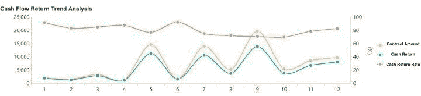
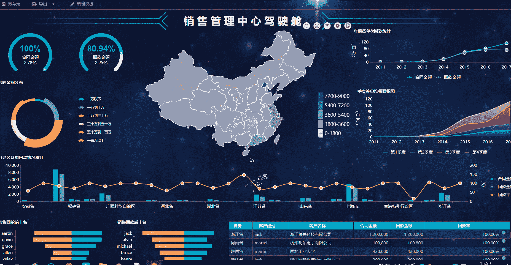
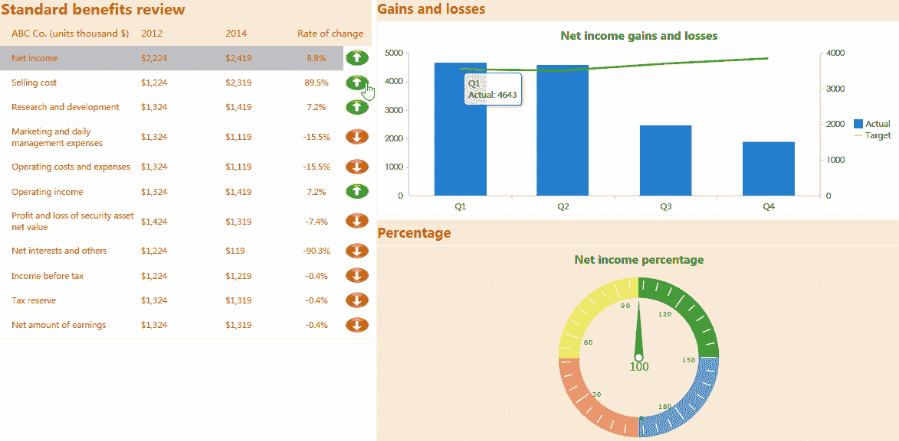
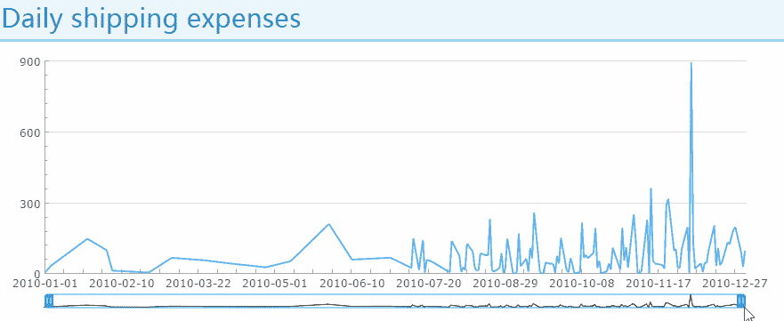
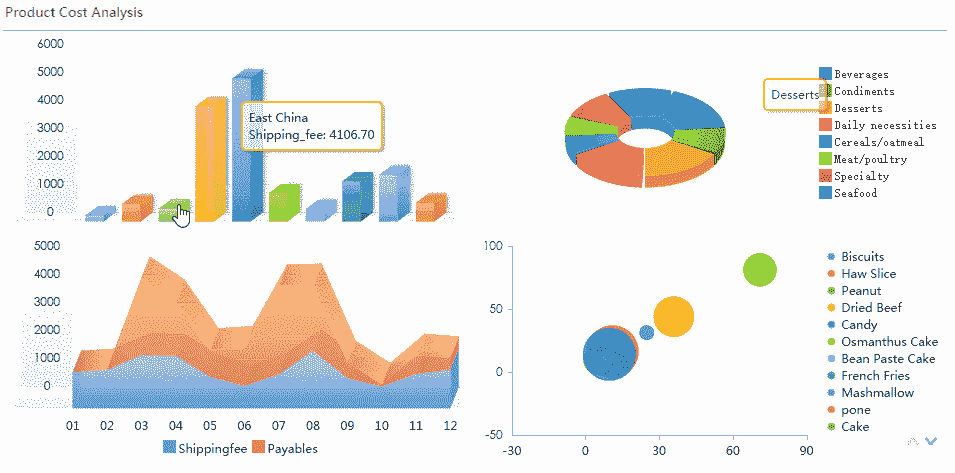

# 初学者财务报表分析指南

> 原文：<https://towardsdatascience.com/guide-to-financial-statement-analysis-for-beginners-835d551b8e29?source=collection_archive---------3----------------------->

很多刚入门财务的人，经常会觉得处理财务报表是一件很头疼的事情。其实做财务报表分析，只需要掌握“思路+内容+工具”这个公式就可以了。明确报表分析的思路，知道分析什么，确定指标，最后选择好的报表工具，达到最终的分析结果。

# 1.财务报表分析的目的

不同的人出于不同的目的进行财务分析，但共同的目的是从财务报表中获取对其经济决策有用的信息。因此，财务报表分析的对象有三个:**财务状况**、**经营成果**、**现金流量**。基于此，我们需要做的**偿债能力分析**、**盈利能力分析**和**营运能力分析**构成了财务报表分析的总体框架。

比如企业主管部门、母公司、财务部门重点分析检查企业相关资源的配置情况、对财经政策和财务制度的遵守情况、资本保值增值情况等。

投资者重点分析盈利能力、运营能力和资金使用情况，了解投资收益和投资风险。

债权人重点分析企业的偿债能力，评价企业的财务安全或风险程度，等等。

考虑到内部管理的不同要求，财务报表分析的内容非常广泛。它有助于报表使用者总结和评价企业的财务状况和经营成果，为经济预测和决策提供可靠的依据。

# 2.财务报表分析的思路

## 2.1 基本思想

*   捕获

报表每一项的具体数据只是表面，结构(各种比率或指标)是骨架，趋势才是核心。结构比价值更重要，趋势比结构更重要。

*   比较

财务报表只有通过比较阅读才有意义。

*   掌握

各种会计原则都有天然的局限性。不能局限于报告分析就妄下结论。

# 2.2 分析方法

*   结构分析

理清报表的各种核对关系，这是基本功。

对报表结构进行横向比较，找出与同业公司的主要指标差异并分析原因。重要的指标有毛利率、净利润率、∑经营活动现金流量/∑销售收入、销售收入/固定资产、流动资产/非流动资产、存货/固定资产、负债/总资产等等。不必拘泥于课本上的经典指标。根据行业特点创建自己的比率。

结构差异罗列出来之后，就需要从竞争力、产品细分、商业模式、规模、地域等方面进行推理。如果没有正确的理由，我们可能会怀疑报告的真实性。

*   趋势分析

趋势分析的重要内容是**资产**、**收入**、**利润**。

分析资产的增加是来自债务还是权益(利润还是股东投入)。此外，关注每个资产账户比例的变化，这往往反映了企业模式的变化。

弄清楚收入的增加是因为合并范围的扩大还是自身业务的扩大。并关注毛利率和市场份额的变化。总的来说，在毛利率小幅度波动的前提下，市场份额的逐步提升是最可靠、最可持续的情况。

利润的增加应该是综合资产和收入增长的逻辑推理，但利润经过多次加减后在报表末尾，客观性最弱。要辩证地认识权责发生制的缺陷和漏洞。

你要考虑资产和收入的增加来分析利润的增加。但是经过一系列的数据操作，利润是最不客观的。你应该深入了解权责发生制的缺陷和弱点，然后辩证地分析利润。

# 3.三大财务报表的内容

## 3.1 资产负债表

资产负债表主要告诉我们公司的资产和负债在那种现状下是怎样的。所以，报告的关键是看到的时间。而且时间对报告影响很大。最重要的检验关系是负债加权益等于资产。在会计上，我目前拥有的叫资产，借来的钱叫负债，自己的钱叫股权。

## 3.2 利润表

损益表或利润表主要告诉我们公司在一段时间内的利润和亏损。利润表的重点是看这个周期有多长，一般是一个月，一个季度或者一年。在损益表中，最重要的核对关系是收入减去成本等于利润。

## 3.3 现金流量表

现金流量表主要告诉我们公司在一段时间内收到了多少现金，付出了多少现金，银行里还剩多少现金。这个报表的关键也是看这个周期有多长，和利润表一样。现金流量表最重要的核对关系是现金流入减去现金流出等于剩余现金。这个关系也很简单，就不多解释了。

Cash Flow Analysis Made with [FineReport](http://www.finereport.com/en/?utm_source=medium&utm_medium=media&utm_campaign=blog&utm_term=01)

# 4.财务报表分析工具

如果数据量不够大，不能用数据库，可以用 excel 做财务报表。当然，如果你写的是 VB 语言，excel 也可以连接数据库。专业统计软件如 [SPSS](https://www.ibm.com/analytics/spss-statistics-software) 、 [SAS](https://www.sas.com/en_us/home.html) 、 [Stata](https://www.stata.com/) 适用于线性回归、f 统计、抽样、假设检验等。

但是，如果财务分析涉及到数据库，就要选择专业的软件。首先，Excel 对数据的处理性能有限，很难实现数据的实时更新。在具体报表工具的选择上， [PowerBI](https://powerbi.microsoft.com/en-us/) 、 [Tableau](https://www.tableau.com/) 、 [Crystal Repor](https://www.crystalreports.com/) t、 [Qlikview](https://www.qlik.com/us) 和 [FineReport](http://www.finereport.com/en/?utm_source=medium&utm_medium=media&utm_campaign=blog&utm_term=01) 都是不错的选择。下面我使用零编码工具 FineReport 来演示各种财务报告风格。FineReport 采用的是拖拽操作，类似 excel 的界面，财务新手很容易上手。比如我们可以用 [FineReport](http://www.finereport.com/en/?utm_source=medium&utm_medium=media&utm_campaign=blog&utm_term=01) 做一个仪表盘，形成一个财务管理驾驶舱。操作是拖拽数据字段生成分析图表，合并成一个主题分析。

**财务管理仪表板**

**标准福利审查**

**杜邦分析**

**每日运费**

**产品成本分析**

