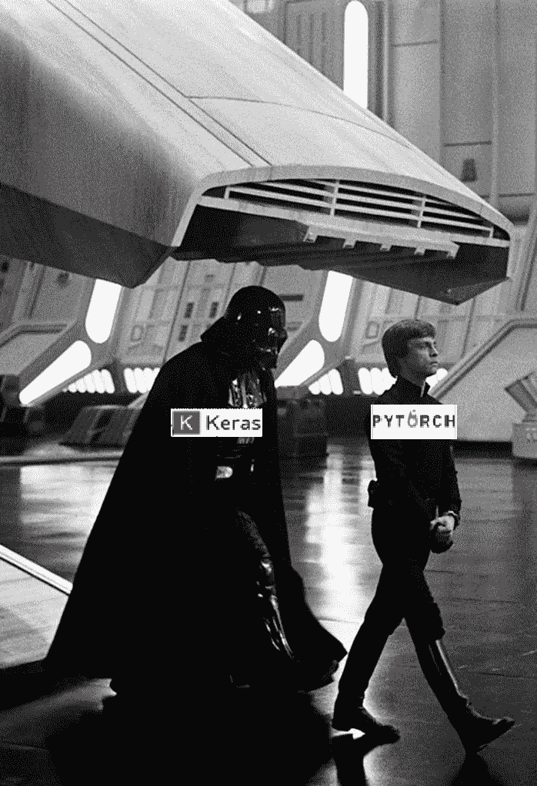
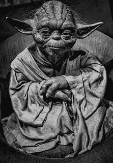

# 2020 年指导如何学习和掌握计算机视觉

> 原文：<https://towardsdatascience.com/guide-to-learn-computer-vision-in-2020-36f19d92c934?source=collection_archive---------5----------------------->

## 这篇文章将关注资源，我相信这将最大程度地提高你在计算机视觉方面的知识，并且主要基于我自己的经验。

在开始学习计算机视觉之前，了解机器学习和 python 的基础知识将会很有帮助。

> 看看我的机器和深度学习博客[https://diyago.github.io/](https://diyago.github.io/)

# 结构

Star Wars: Luke Skywalker & Darth Vader

你不必一开始就选择它，但应用新获得的知识是必要的。

没有太多可选项: [**pytorch**](https://pytorch.org/tutorials/) 或者[**keras**](https://www.tensorflow.org/guide/keras)(tensor flow)。Pytorch 可能需要编写更多的代码，但是它提供了很大的灵活性，所以请使用它。除此之外，大部分深度学习的研究者开始使用 pytoch。

**albumination**(图像增强)和 **catalyst** (框架，pytorch 上面的高级 API)可能也有用，用它们吧，尤其是第一个。

# 五金器具

*   Nvidia GPU 10xx+会绰绰有余(300 美元以上)
*   [Kaggle 内核](https://www.kaggle.com/kernels) —每周仅 30 小时(免费)
*   [Google Colab](https://colab.research.google.com/) — 12 小时会话限制，未知周限制(免费)

# **理论&实践**

## 在线课程

*   [CS231n](http://cs231n.stanford.edu/) 是顶级在线，涵盖了计算机视觉中所有必要的基础知识。Youtube 在线视频。他们甚至有练习，但我不能建议解决它们。(免费)
*   Fast.ai 是你应该注意的下一道菜。还有，fast.ai 是 pytorch 上面的高层框架，但是他们改变自己的 API 太频繁，文档的缺乏让它用起来不靠谱。然而，理论和有用的技巧只是花时间观看本课程的幻想。(免费)

在学习这些课程的时候，我鼓励你将理论付诸实践，将它应用到一个框架中。

## **商品和编码**

*   ArXiv.org——所有最近的信息都会在这里。(免费)
*   [https://paperswithcode.com/sota](https://paperswithcode.com/sota)——最常见的深度学习任务的最新水平，不仅仅是计算机视觉。(免费)
*   Github —如果有什么东西被实现了，你可以在这里找到它。(免费)

## 书

没什么可读的，但我相信这两本书会有用，不管你选择用 pytorch 还是 keras

*   [用 Python 进行深度学习](https://www.amazon.com/Deep-Learning-Python-Francois-Chollet/dp/1617294438)Keras 创造者、谷歌人工智能研究员弗朗索瓦·乔莱(Franç ois Chollet)。易于使用，并可能获得一些你以前不知道的洞察力。(不免费)
*   [py torch 深度学习](https://pytorch.org/deep-learning-with-pytorch-thank-you)py torch 团队 Eli Stevens & Luca Antiga(免费)

## 卡格尔

[竞赛](https://www.kaggle.com/competitions) — kaggle 是一个知名的在线平台，提供各种机器学习竞赛，其中许多都是关于计算机视觉的。您甚至可以在没有完成课程的情况下开始参与，因为从比赛开始，将会有许多开放的内核(端到端代码)，您可以直接从浏览器运行这些内核。(免费)

# 强硬(绝地)方式

Star Wars`s Jedi: Yoda

另一条路可能会很艰难，但你将获得所需的知识，不仅可以进行拟合预测，还可以进行自己的研究。谢尔盖·别洛乌索夫又名贝斯。

**你只需要阅读并实现下面所有的文章(免费)。光是阅读它们也会很棒。**

## 结构

* Alex net:[https://papers . nips . cc/paper/4824-imagenet-class ification-with-deep-convolutional-neural-networks](https://papers.nips.cc/paper/4824-imagenet-classification-with-deep-convolutional-neural-networks)
* ZF net:[https://arxiv.org/abs/1311.2901](https://arxiv.org/abs/1311.2901)
* vgg 16:[https://arxiv.org/abs/1505.06798](https://arxiv.org/abs/1505.06798)
* ResNet:[https://arxiv.org/abs/1704.06904](https://arxiv.org/abs/1704.06904)
* Google net:[https://arxiv.org/abs/1409.4842](https://arxiv.org/abs/1409.4842)
* Inception:[https://arxiv.org/abs/1512.00567](https://arxiv.org/abs/1512.00567)

## 语义分割

* FCN: [https://arxiv.org/abs/1411.4038](https://arxiv.org/abs/1411.4038)
* SegNet: [https://arxiv.org/abs/1511.00561](https://arxiv.org/abs/1511.00561)
* UNET: [https://arxiv.org/abs/1505.04597](https://arxiv.org/abs/1505.04597)
* PSPNet: [https://arxiv.org/abs/1612.01105](https://arxiv.org/abs/1612.01105)
* DeepLab: [https://arxiv.org/abs/1606.00915](https://arxiv.org/abs/1606.00915)
* ICNet: [https://arxiv.org/abs/1704.08545](https://arxiv.org/abs/1704.08545) * ENT: [https://arxiv.org/abs/1](https://arxiv.org/abs/1606.02147)

## 生成对抗网络 Generative adversarial Networks

* GAN: [https://arxiv.org/abs/1406.2661](https://arxiv.org/abs/1406.2661)
* DCGAN: [https://arxiv.org/abs/1511.06434](https://arxiv.org/abs/1511.06434)
* WGAN: [https://arxiv.org/abs/1701.07875](https://arxiv.org/abs/1701.07875)
* Pix2Pix: [https://arxiv.org/abs/1611.07004](https://arxiv.org/abs/1611.07004)
* CycleGAN: [https://arxiv.org/abs/1703.10593](https://arxiv.org/abs/1703.10593)

## 对象检测 Object Detection

* RCNN: [https://arxiv.org/abs/1311.2524](https://arxiv.org/abs/1311.2524)
* Fast-RCNN: [https://arxiv.org/abs/1504.08083](https://arxiv.org/abs/1504.08083)
* Faster-RCNN: [https://arxiv.org/abs/1506.01497](https://arxiv.org/abs/1506.01497)
* SSD: [https://arxiv.org/abs/1512.02325](https://arxiv.org/abs/1512.02325)
* YOLO: [https://arxiv.org/abs/1506.02640](https://arxiv.org/abs/1506.02640) * YOLO9000: [https://arxiv.org/abs/1612.08242](https://arxiv.org/abs/1612.08242)

## 实例 Segmentation

* Mask-RCNN: [https://arxiv.org/abs/1703.06870](https://arxiv.org/abs/1703.06870)
* YOLACT: [https://arxiv.org/abs/1904.02689](https://arxiv.org/abs/1904.02689)

## 姿势估计

* PoseNet: [https://arxiv.org/abs/1505.07427](https://arxiv.org/abs/1505.07427)
*DensePose:[https://arxiv.org/abs/1802.00434](https://arxiv.org/abs/1802.00434)