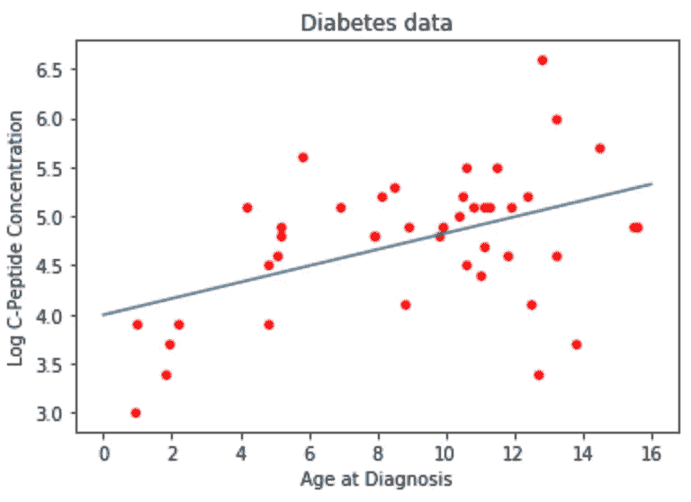

# 一本 Jupyter 笔记本中的 R 和 Python 指南

> 原文：<https://towardsdatascience.com/guide-to-r-and-python-in-a-single-jupyter-notebook-ff12532eb3ba?source=collection_archive---------4----------------------->

当你可以同时使用两者时，为什么要选择一个？

> r 主要用于统计分析，而 Python 为数据科学提供了更通用的方法。r 和 Python 是面向对象面向数据科学的编程语言。学习这两者是一个理想的解决方案。Python 是一种具有可读语法的通用语言。***——***[](https://www.calltutors.com/blog/r-vs-python-why-python-preferred-over-r-for-data-analysis/)

**

*[Image Source](https://webhose.io/blog/machine-learning/machine-learning-showdown-python-vs-r/)*

*本文基于哈佛大学 AC209b 讲座，大部分内容由 IACS 大学的威尔·克莱博撰写和教授。*

*R 和 Python 用户之间的战争已经肆虐了好几年。由于大多数老派的统计学家都是在 R 上接受培训的，而且大多数大学的计算机科学和数据科学系都更喜欢 Python，所以两者都有利有弊。我在实践中注意到的主要缺点是每种语言都有可用的软件包。*

*截至 2019 年，聚类分析和样条的 R 包优于同类型的 Python 包。在本文中，我将通过编码示例向您展示如何获取 R 函数和数据集，然后在基于 Python 的 Jupyter 笔记本中导入和利用它们。*

*本文的主题是:*

*   ***导入(基本)R 函数***
*   ***导入 R 库函数***
*   ***填充向量 R 理解***
*   ***填充数据帧 R 理解***
*   ***填充公式 R 理解***
*   ***R 中的运行模式***
*   ***将结果返回给 Python***
*   ***获取 R 中的模型预测***
*   ***在 R 中绘图***
*   ***阅读 R 的文档***

*在我的 GitHub 页面上可以找到这篇文章的附带笔记本。*

*[](https://github.com/mrdragonbear/Articles) [## 龙熊先生/文章

### 这个存储库包含与我的媒体文章相关的代码相关内容。此存储库是主存储库…

github.com](https://github.com/mrdragonbear/Articles)* 

# *线性/多项式回归*

*首先，我们将看看使用导入的 R 函数执行基本的线性和多项式回归。我们将研究一个关于糖尿病的数据集，其中包含 C 肽浓度和酸度变量的信息。不要担心模型的内容，这是广义可加模型领域中一个常用的例子，我们将在本文的后面讨论。*

```
*diab = pd.read_csv("data/diabetes.csv")print("""
# Variables are:
#   subject:   subject ID number
#   age:       age diagnosed with diabetes
#   acidity:   a measure of acidity called base deficit
#   y:         natural log of serum C-peptide concentration
#
# Original source is Sockett et al. (1987)
# mentioned in Hastie and Tibshirani's book 
# "Generalized Additive Models".
""")display(diab.head())
display(diab.dtypes)
display(diab.describe())*
```

*然后我们可以绘制数据:*

```
*ax0 = diab.plot.scatter(x='age',y='y',c='Red',title="Diabetes data") #plotting direclty from pandas!
ax0.set_xlabel("Age at Diagnosis")
ax0.set_ylabel("Log C-Peptide Concentration");*
```

**

*用`statsmodel`进行线性回归。你可能需要安装这个包来遵循代码，你可以用`pip install statsmodel`来完成。*

*   *在 Python 中，我们从目标值的向量和我们自己构建的设计矩阵(例如，从多项式特征)开始工作。*
*   *现在，`statsmodel`的公式界面可以帮助您构建目标值和设计矩阵。*

```
*#Using statsmodels
import statsmodels.formula.api as sm

model1 = sm.ols('y ~ age',data=diab)
fit1_lm = model1.fit()*
```

*现在，我们构建一个数据框架来预测值(有时这只是测试或验证集)*

*   *对于制作模型预测的漂亮图表非常有用-预测大量值，而不仅仅是训练集中的任何值*

```
*x_pred = np.linspace(0,16,100)

predict_df = pd.DataFrame(data={"age":x_pred})
predict_df.head()*
```

*使用`get_prediction(<data>).summary_frame()`获得模型的预测(和误差线！)*

```
*prediction_output = fit1_lm.get_prediction(predict_df).summary_frame()
prediction_output.head()*
```

*绘制模型和误差线*

```
*ax1 = diab.plot.scatter(x='age',y='y',c='Red',title="Diabetes data with least-squares linear fit")
ax1.set_xlabel("Age at Diagnosis")
ax1.set_ylabel("Log C-Peptide Concentration")

ax1.plot(predict_df.age, prediction_output['mean'],color="green")
ax1.plot(predict_df.age, prediction_output['mean_ci_lower'], color="blue",linestyle="dashed")
ax1.plot(predict_df.age, prediction_output['mean_ci_upper'], color="blue",linestyle="dashed");

ax1.plot(predict_df.age, prediction_output['obs_ci_lower'], color="skyblue",linestyle="dashed")
ax1.plot(predict_df.age, prediction_output['obs_ci_upper'], color="skyblue",linestyle="dashed");*
```

**

*我们还可以拟合三次多项式模型，并以两种方式绘制模型误差线:*

*   *Route1:为`age`、`age**2`、`age**3`各建一个设计 df*

```
*fit2_lm = sm.ols(formula="y ~ age + np.power(age, 2) + np.power(age, 3)",data=diab).fit()

poly_predictions = fit2_lm.get_prediction(predict_df).summary_frame()
poly_predictions.head()*
```

**

*   *方法 2:编辑公式*

```
*ax2 = diab.plot.scatter(x='age',y='y',c='Red',title="Diabetes data with least-squares cubic fit")
ax2.set_xlabel("Age at Diagnosis")
ax2.set_ylabel("Log C-Peptide Concentration")

ax2.plot(predict_df.age, poly_predictions['mean'],color="green")
ax2.plot(predict_df.age, poly_predictions['mean_ci_lower'], color="blue",linestyle="dashed")
ax2.plot(predict_df.age, poly_predictions['mean_ci_upper'], color="blue",linestyle="dashed");

ax2.plot(predict_df.age, poly_predictions['obs_ci_lower'], color="skyblue",linestyle="dashed")
ax2.plot(predict_df.age, poly_predictions['obs_ci_upper'], color="skyblue",linestyle="dashed");*
```

**

*这没有使用 R 编程语言的任何特性。现在，我们可以使用 r 中的函数重复分析。*

# *线性/多项式回归，但使其为 R*

*在这一节之后，我们将了解使用 R 模型所需的一切。实验室的其余部分只是应用这些概念来运行特定的模型。因此，这一节是你在 r 中工作的“备忘单”。*

*我们需要知道的是:*

*   *导入(基本)R 函数*
*   *导入 R 库函数*
*   *填充向量 R 理解*
*   *填充 R 理解的数据帧*
*   *填充 R 理解的公式*
*   *在 R 中运行模型*
*   *将结果返回给 Python*
*   *在 R 中获取模型预测*
*   *在 R 中绘图*
*   *阅读 R 的文档*

***导入 R 函数***

*为了导入 R 函数，我们需要`rpy2`包。根据您的环境，您可能还需要指定 R 主目录的路径。下面我举了一个例子来说明如何指定这一点。*

```
*# if you're on JupyterHub you may need to specify the path to R

#import os
#os.environ['R_HOME'] = "/usr/share/anaconda3/lib/R"

import rpy2.robjects as robjects*
```

*要指定一个 R 函数，只需使用`robjects.r`后跟方括号中的包名作为字符串。为了防止混淆，我喜欢对从 r 导入的函数、库和其他对象使用`r_`。*

```
*r_lm = robjects.r["lm"]
r_predict = robjects.r["predict"]
#r_plot = robjects.r["plot"] # more on plotting later

#lm() and predict() are two of the most common functions we'll use*
```

***导入 R 库***

*我们可以导入单个函数，但也可以导入整个库。要导入整个库，您可以从`rpy2.robjects.packages`中提取`importr`包。*

```
*from rpy2.robjects.packages import importr
#r_cluster = importr('cluster')
#r_cluster.pam;*
```

***填充向量 R 理解***

*要指定一个可以与 Python 包接口的浮点向量，我们可以使用`robjects.FloatVector`函数。这个函数的参数引用了您希望转换成 R 对象的数据数组，在我们的例子中，是来自糖尿病数据集中的`age`和`y`变量。*

```
*r_y = robjects.FloatVector(diab['y'])
r_age = robjects.FloatVector(diab['age'])
# What happens if we pass the wrong type?
# How does r_age display?
# How does r_age print?*
```

***填充数据帧 R 理解***

*我们可以指定单独的向量，也可以指定整个数据帧。这是通过使用`robjects.DataFrame`功能完成的。这个函数的参数是一个字典，它指定了名称和与名称相关的向量(从`robjects.FloatVector`获得)。*

```
*diab_r = robjects.DataFrame({"y":r_y, "age":r_age})
# How does diab_r display?
# How does diab_r print?*
```

***填充公式 R 理解***

*例如，要指定一个回归公式，我们可以使用`robjects.Formula`函数。这遵循 R 语法`dependent variable ~ independent variables`。在我们的例子中，输出`y`被建模为`age`变量的函数。*

```
*simple_formula = robjects.Formula("y~age")
simple_formula.environment["y"] = r_y #populate the formula's .environment, so it knows what 'y' and 'age' refer to
simple_formula.environment["age"] = r_age*
```

*注意，在上面的公式中，我们必须指定与公式中每个变量相关的 FloatVector。我们必须这样做，因为公式不会自动将我们的变量名与我们之前指定的变量相关联——它们还没有与`robjects.Formula`对象相关联。*

***R 中的运行模式***

*要指定一个模型，在本例中是一个使用我们之前导入的`r_lm`函数的线性回归模型，我们需要将我们的公式变量作为参数传递(除非我们传递一个 R 公式对象，否则这将不起作用)。*

```
*diab_lm = r_lm(formula=simple_formula) # the formula object is storing all the needed variables*
```

*我们可以在公式本身中引用数据集，而不是指定与`robjects.Formula`对象相关的每个单独的浮点向量(只要它已经成为 R 对象本身)。*

```
*simple_formula = robjects.Formula("y~age") # reset the formula
diab_lm = r_lm(formula=simple_formula, data=diab_r) #can also use a 'dumb' formula and pass a dataframe*
```

***将结果返回给 Python***

*使用 R 函数和库是很棒的，但是我们也可以分析我们的结果，并将它们返回给 Python 进行进一步的处理。要查看输出:*

```
*diab_lm #the result is already 'in' python, but it's a special object*
```

*我们还可以检查输出中的名称:*

```
*print(diab_lm.names) # view all names*
```

*以我们输出的第一个元素为例:*

```
*diab_lm[0] #grab the first element*
```

*要计算系数:*

```
*diab_lm.rx2("coefficients") #use rx2 to get elements by name!*
```

*要将系数放入 Numpy 数组中:*

```
*np.array(diab_lm.rx2("coefficients")) #r vectors can be converted to numpy (but rarely needed)*
```

***得到预测***

*为了使用我们的 R 模型获得预测，我们可以创建一个预测数据帧并使用`r_predict`函数，类似于使用 Python 的方式。*

```
*# make a df to predict on (might just be the validation or test dataframe)
predict_df = robjects.DataFrame({"age": robjects.FloatVector(np.linspace(0,16,100))})# call R's predict() function, passing the model and the data 
predictions = r_predict(diab_lm, predict_df)*
```

*我们可以使用`rx2`函数提取“年龄”值:*

```
*x_vals = predict_df.rx2("age")*
```

*我们还可以使用 Python 绘制数据:*

```
*ax = diab.plot.scatter(x='age',y='y',c='Red',title="Diabetes data")
ax.set_xlabel("Age at Diagnosis")
ax.set_ylabel("Log C-Peptide Concentration");ax.plot(x_vals,predictions); #plt still works with r vectors as input!*
```

**

*我们也可以使用 R 来绘图，尽管这稍微复杂一些。*

***在 R 中绘图***

*要在 R 中绘图，我们需要使用以下命令打开%R magic 函数:*

```
*%load_ext rpy2.ipython*
```

*   *以上开启了%R“魔法”。*
*   *r 的 plot()命令根据您传递给它的内容做出不同的响应；不同的模式得到不同的剧情！*
*   *对于任何特定的模型，搜索 plot.modelname。例如，对于 GAM 模型，搜索`plot.gam`以获得绘制 GAM 模型的任何细节。*
*   *`%R`“magic”在“笔记本”模式下运行 R 代码，所以数字显示得很好*
*   *在`plot(<model>)`代码之前，我们传入 R 需要了解的变量(`-i`代表“输入”)*

```
*%R -i diab_lm plot(diab_lm);*
```

***阅读 R 的文档***

*`lm()`功能的文档在这里是，一个更漂亮的版本(相同内容)在这里是。谷歌搜索时，尽可能选择 rdocumentation.org。部分:*

*   ***用法**:给出函数签名，包括所有可选参数*
*   ***参数**:每个功能输入控制什么*
*   ***细节**:关于函数*做什么*以及参数如何交互的附加信息。**经常从正确的地方开始阅读***
*   ***值**:函数返回的对象的结构*
*   ***参考文献**:相关学术论文*
*   ***参见**:其他感兴趣的功能*

***示例***

*作为测试我们新获得的知识的例子，我们将尝试以下内容:*

*   *将 R 中计算的置信区间添加到上面的线性回归图中。使用`interval=`参数到`r_predict()`(文档[此处](https://stat.ethz.ch/R-manual/R-devel/library/stats/html/predict.lm.html))。你必须处理一个由 r 返回的矩阵。*
*   *用一个 5 次多项式拟合 r 中的糖尿病数据。在网上搜索一个比用所有 5 个多项式项写出一个公式更简单的方法。*

*置信区间:*

```
*CI_matrix = np.array(r_predict(diab_lm, predict_df, interval="confidence"))

ax = diab.plot.scatter(x='age',y='y',c='Red',title="Diabetes data")
ax.set_xlabel("Age at Diagnosis")
ax.set_ylabel("Log C-Peptide Concentration");

ax.plot(x_vals,CI_matrix[:,0], label="prediction")
ax.plot(x_vals,CI_matrix[:,1], label="95% CI", c='g')
ax.plot(x_vals,CI_matrix[:,2], label="95% CI", c='g')
plt.legend();*
```

**

*五次多项式:*

```
*ploy5_formula = robjects.Formula("y~poly(age,5)") # reset the formula
diab5_lm = r_lm(formula=ploy5_formula, data=diab_r) #can also use a 'dumb' formula and pass a dataframe

predictions = r_predict(diab5_lm, predict_df, interval="confidence")

ax = diab.plot.scatter(x='age',y='y',c='Red',title="Diabetes data")
ax.set_xlabel("Age at Diagnosis")
ax.set_ylabel("Log C-Peptide Concentration");

ax.plot(x_vals,predictions);*
```

**

# *洛斯平滑*

*现在我们知道了如何在 Python 中使用 R 对象和函数，我们可以看看我们可能想要这样做的情况。第一个例子是 Lowess 平滑。*

*Lowess smoothing 在 Python 和 r 中都实现了。我们将在转换语言时使用它作为另一个例子。*

***Python***

*在 Python 中，我们使用`statsmodel.nonparametric.smoothers_lowess`来执行 lowess 平滑。*

```
*from statsmodels.nonparametric.smoothers_lowess import lowess as lowessss1 = lowess(diab['y'],diab['age'],frac=0.15)
ss2 = lowess(diab['y'],diab['age'],frac=0.25)
ss3 = lowess(diab['y'],diab['age'],frac=0.7)
ss4 = lowess(diab['y'],diab['age'],frac=1)ss1[:10,:] # we get back simple a smoothed y value for each x value in the data*
```

*请注意绘制不同模型的清晰代码。一会儿我们会看到更干净的代码。*

```
*for cur_model, cur_frac in zip([ss1,ss2,ss3,ss4],[0.15,0.25,0.7,1]): ax = diab.plot.scatter(x='age',y='y',c='Red',title="Lowess Fit, Fraction = {}".format(cur_frac))
    ax.set_xlabel("Age at Diagnosis")
    ax.set_ylabel("Log C-Peptide Concentration")
    ax.plot(cur_model[:,0],cur_model[:,1],color="blue")

    plt.show()*
```

**

***R***

*要在 R 中实现 Lowess 平滑，我们需要:*

*   *导入黄土功能。*
*   *把数据发给 r。*
*   *调用函数并获得结果。*

```
*r_loess = robjects.r['loess.smooth'] #extract R function
r_y = robjects.FloatVector(diab['y'])
r_age = robjects.FloatVector(diab['age'])ss1_r = r_loess(r_age,r_y, span=0.15, degree=1)ss1_r #again, a smoothed y value for each x value in the data*
```

***可变跨度**
接下来，一些非常干净的代码，以适应和绘制具有各种参数设置的模型。(尽管之前看到的`zip()`方法在标签和参数不同时非常有用)*

```
*for cur_frac in [0.15,0.25,0.7,1]:

    cur_smooth = r_loess(r_age,r_y, span=cur_frac) ax = diab.plot.scatter(x='age',y='y',c='Red',title="Lowess Fit, Fraction = {}".format(cur_frac))
    ax.set_xlabel("Age at Diagnosis")
    ax.set_ylabel("Log C-Peptide Concentration")
    ax.plot(cur_smooth[0], cur_smooth[1], color="blue")

    plt.show()*
```

**

*我们要看的下一个例子是平滑样条，Python 不太支持这些模型，所以最好使用 R 函数。*

# *平滑样条*

*从现在开始，我们将使用 R 函数；Python 不(很好地)支持这些模型。*

*为了清楚起见:这是一个奇特的样条模型*

**

*跨越所有可能的功能 *f* 。获胜者将始终是一个连续的三次多项式，在每个数据点都有一个结。*

*需要考虑的一些事情是:*

*   *知道为什么赢家是立方吗？*
*   *这个模型的可解释性如何？*
*   *有哪些可调参数？*

*为了实现平滑样条，我们只需要两条线。*

```
*r_smooth_spline = robjects.r['smooth.spline'] #extract R function# run smoothing function
spline1 = r_smooth_spline(r_age, r_y, spar=0)*
```

## *平滑样条交叉验证*

*r 的`smooth_spline`函数有一个内置的交叉验证来为 lambda 找到一个好的值。参见包[文档](https://www.rdocumentation.org/packages/stats/versions/3.5.2/topics/smooth.spline)。*

```
*spline_cv = r_smooth_spline(r_age, r_y, cv=True) lambda_cv = spline_cv.rx2("lambda")[0]ax19 = diab.plot.scatter(x='age',y='y',c='Red',title="smoothing spline with $\lambda=$"+str(np.round(lambda_cv,4))+", chosen by cross-validation")
ax19.set_xlabel("Age at Diagnosis")
ax19.set_ylabel("Log C-Peptide Concentration")
ax19.plot(spline_cv.rx2("x"),spline_cv.rx2("y"),color="darkgreen")*
```

**

# *自然样条和基本样条*

*这里，我们在模型复杂性上后退了一步，但在编码复杂性上前进了一步。我们将再次使用 R 的公式接口，所以我们需要填充公式和数据框架。*

*更多值得思考的问题:*

*   *自然样条和基本样条在哪些方面不如我们刚刚使用的样条复杂？*
*   *是什么让样条曲线变得“自然”？*
*   *什么使样条成为“基础”？*
*   *调优参数是什么？*

```
*#We will now work with a new dataset, called GAGurine.
#The dataset description (from the R package MASS) is below:
#Data were collected on the concentration of a chemical GAG 
# in the urine of 314 children aged from zero to seventeen years. 
# The aim of the study was to produce a chart to help a paediatrican
# to assess if a child's GAG concentration is ‘normal’.#The variables are:
# Age: age of child in years.
# GAG: concentration of GAG (the units have been lost).*
```

*首先，我们导入并绘制数据集:*

```
*GAGurine = pd.read_csv("data/GAGurine.csv")
display(GAGurine.head())

ax31 = GAGurine.plot.scatter(x='Age',y='GAG',c='black',title="GAG in urine of children")
ax31.set_xlabel("Age");
ax31.set_ylabel("GAG");*
```

**

*标准的东西:导入函数，将变量转换成 R 格式，调用函数*

```
*from rpy2.robjects.packages import importr
r_splines = importr('splines')# populate R variables
r_gag = robjects.FloatVector(GAGurine['GAG'].values)
r_age = robjects.FloatVector(GAGurine['Age'].values)
r_quarts = robjects.FloatVector(np.quantile(r_age,[.25,.5,.75])) #woah, numpy functions run on R objects*
```

*当我们从 r_splines 调用 ns 或 bs 函数时会发生什么？*

```
*ns_design = r_splines.ns(r_age, knots=r_quarts)
bs_design = r_splines.bs(r_age, knots=r_quarts)print(ns_design)*
```

*`ns`和`bs`返回设计矩阵，而不是模型对象！这是因为它们应该与`lm`的公式接口一起工作。为了得到一个模型对象，我们填充一个包含`ns(<var>,<knots>)`的公式，并拟合数据。*

```
*r_lm = robjects.r['lm']
r_predict = robjects.r['predict']

# populate the formula
ns_formula = robjects.Formula("Gag ~ ns(Age, knots=r_quarts)")
ns_formula.environment['Gag'] = r_gag
ns_formula.environment['Age'] = r_age
ns_formula.environment['r_quarts'] = r_quarts

# fit the model
ns_model = r_lm(ns_formula*
```

*像往常一样预测:构建一个数据框架进行预测并调用`predict()`。*

```
*# predict
predict_frame = robjects.DataFrame({"Age": robjects.FloatVector(np.linspace(0,20,100))})ns_out = r_predict(ns_model, predict_frame)ax32 = GAGurine.plot.scatter(x='Age',y='GAG',c='grey',title="GAG in urine of children")
ax32.set_xlabel("Age")
ax32.set_ylabel("GAG")
ax32.plot(predict_frame.rx2("Age"),ns_out, color='red')
ax32.legend(["Natural spline, knots at quartiles"]);*
```

**

***例题***

*让我们看两个实现基样条的例子。*

1.  *用相同的结拟合一个基本样条模型，并将其添加到上面的图中。*

```
*bs_formula = robjects.Formula("Gag ~ bs(Age, knots=r_quarts)")
bs_formula.environment['Gag'] = r_gag
bs_formula.environment['Age'] = r_age
bs_formula.environment['r_quarts'] = r_quarts

bs_model = r_lm(bs_formula)
bs_out = r_predict(bs_model, predict_frame)ax32 = GAGurine.plot.scatter(x='Age',y='GAG',c='grey',title="GAG in urine of children")
ax32.set_xlabel("Age")
ax32.set_ylabel("GAG")
ax32.plot(predict_frame.rx2("Age"),ns_out, color='red')
ax32.plot(predict_frame.rx2("Age"),bs_out, color='blue')
ax32.legend(["Natural spline, knots at quartiles","B-spline, knots at quartiles"]);*
```

**

*2.在[2，4，6…14，16]处用 8 个节点拟合一个基本样条，并将其添加到上面的图中。*

```
*overfit_formula = robjects.Formula("Gag ~ bs(Age, knots=r_quarts)")
overfit_formula.environment['Gag'] = r_gag
overfit_formula.environment['Age'] = r_age
overfit_formula.environment['r_quarts'] = robjects.FloatVector(np.array([2,4,6,8,10,12,14,16]))

overfit_model = r_lm(overfit_formula)
overfit_out = r_predict(overfit_model, predict_frame)ax32 = GAGurine.plot.scatter(x='Age',y='GAG',c='grey',title="GAG in urine of children")
ax32.set_xlabel("Age")
ax32.set_ylabel("GAG")
ax32.plot(predict_frame.rx2("Age"),ns_out, color='red')
ax32.plot(predict_frame.rx2("Age"),bs_out, color='blue')
ax32.plot(predict_frame.rx2("Age"),overfit_out, color='green')
ax32.legend(["Natural spline, knots at quartiles", "B-spline, knots at quartiles", "B-spline, lots of knots"]);*
```

**

# *GAMs*

*最后，我们来看看我们最先进的模型。这里的编码并不比我们以前做的更复杂，尽管幕后工作很棒。*

*首先，让我们得到我们的多元数据。*

```
*kyphosis = pd.read_csv("data/kyphosis.csv")print("""
# kyphosis - wherther a particular deformation was present post-operation
# age - patient's age in months
# number - the number of vertebrae involved in the operation
# start - the number of the topmost vertebrae operated on""")
display(kyphosis.head())
display(kyphosis.describe(include='all'))
display(kyphosis.dtypes)#If there are errors about missing R packages, run the code below:

#r_utils = importr('utils')
#r_utils.install_packages('codetools')
#r_utils.install_packages('gam')*
```

*为了适应游戏，我们*

*   *导入`gam`库*
*   *在我们想要平滑的变量上填充包含`s(<var>)`的公式。*
*   *调用`gam(formula, family=<string>)`,其中`family`是一个命名概率分布的字符串，根据响应变量被认为如何出现来选择。*

*粗略的`family`指导方针:*

*   *响应是二进制的或“M 次尝试中的 N 次”，例如，患疾病的实验鼠(10 只中的)数量:选择`"binomial"`*
*   *响应是没有逻辑上限的计数，例如售出的冰淇淋数量:选择`"poisson"`*
*   *响应是真实的，有正态分布的噪声，如人的身高:选择`"gaussian"`(默认)*

```
*#There is a Python library in development for using GAMs (https://github.com/dswah/pyGAM)
# but it is not yet as comprehensive as the R GAM library, which we will use here instead.

# R also has the mgcv library, which implements some more advanced/flexible fitting methods

r_gam_lib = importr('gam')
r_gam = r_gam_lib.gam

r_kyph = robjects.FactorVector(kyphosis[["Kyphosis"]].values)
r_Age = robjects.FloatVector(kyphosis[["Age"]].values)
r_Number = robjects.FloatVector(kyphosis[["Number"]].values)
r_Start = robjects.FloatVector(kyphosis[["Start"]].values)

kyph1_fmla = robjects.Formula("Kyphosis ~ s(Age) + s(Number) + s(Start)")
kyph1_fmla.environment['Kyphosis']=r_kyph
kyph1_fmla.environment['Age']=r_Age
kyph1_fmla.environment['Number']=r_Number
kyph1_fmla.environment['Start']=r_Start

kyph1_gam = r_gam(kyph1_fmla, family="binomial")*
```

*拟合的 gam 模型包含许多有趣的数据:*

```
*print(kyph1_gam.names)*
```

*还记得密谋吗？在 gam 模型上调用 R 的`plot()`是查看拟合样条的最简单方法*

*在[ ]:*

```
*%R -i kyph1_gam plot(kyph1_gam, residuals=TRUE,se=TRUE, scale=20);*
```

*预测像正常情况一样工作(建立一个数据框进行预测，如果您还没有数据框，并调用`predict()`)。但是,“预测”总是报告单个变量效果的总和。如果`family`为非默认，这可能与该点的实际预测不同。*

*例如，我们正在进行“逻辑回归”,因此原始预测是对数概率，但我们可以通过使用 in `predict(..., type="response")`获得概率*

```
*kyph_new = robjects.DataFrame({'Age': robjects.IntVector((84,85,86)), 
                               'Start': robjects.IntVector((5,3,1)), 
                               'Number': robjects.IntVector((1,6,10))})print("Raw response (so, Log odds):")
display(r_predict(kyph1_gam, kyph_new))
print("Scaled response (so, probabilty of kyphosis):")
display(r_predict(kyph1_gam, kyph_new, type="response"))*
```

# *最终意见*

*一旦您熟悉了这个过程，在 Python 中使用 R 函数就相对容易了，如果您需要使用 R 包来执行数据分析，或者您是一个已经获得了 R 代码的 Python 用户，那么它可以省去很多麻烦。*

*我希望你喜欢这篇文章，并发现它的信息和有用的。对于那些希望在 Jupyter 环境中体验 R 和 Python 函数和对象之间的接口的人来说，这本笔记本中使用的所有代码都可以在我的 GitHub 页面上找到。*

## *时事通讯*

*关于新博客文章和额外内容的更新，请注册我的时事通讯。*

*[](https://mailchi.mp/6304809e49e7/matthew-stewart) [## 时事通讯订阅

### 丰富您的学术之旅，加入一个由科学家，研究人员和行业专业人士组成的社区，以获得…

mailchi.mp](https://mailchi.mp/6304809e49e7/matthew-stewart)*