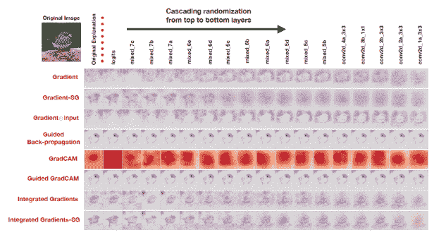

# 制导摄像头坏了。显著图的健全性检查

> 原文：<https://towardsdatascience.com/guided-grad-cam-is-broken-sanity-checks-for-saliency-maps-73a9b7a2145c?source=collection_archive---------26----------------------->

某些理解 CNN 在看什么的技术不起作用。它们与模型的权重或训练数据没有关系，可能仅仅充当边缘检测器。

在本帖中，我们将讨论 NeurIPS 2018 年的论文“显著性图的健全性检查”，该论文证明了几种流行的显著性图方法实际上并没有提供对模型正在做什么的洞察。具有随机权重的模型和基于具有随机标签的数据训练的模型仍然会对某些显著性图技术产生看起来令人信服的“解释”，包括导向梯度图和导向反向传播，这意味着这些显著性图方法与模型的参数或训练数据无关。

# **论文**

下面的文章应用了几个聪明的健全性检查来确定特定的技术是否提供了对模型的洞察:

[Adebayo J，Gilmer J，Muelly M，Goodfellow I，Hardt M，Kim B .显著图的健全性检查。神经信息处理系统进展 2018(第 9505–9515 页)。](https://arxiv.org/pdf/1810.03292.pdf)

除非另有说明，本文中的任何引用都来自本文。

# **CNN 显著图(热图)技术**

以下是本文评估的显著图技术:

*   *渐变*:在这种技术中，我们可视化每个输入像素的变化对最终预测的改变程度。梯度是分数相对于输入图像的导数，有时被称为“显著性”或“反向传播”有关更多详细信息，请参见 [CNN 热点图:显著性/反向传播](https://glassboxmedicine.com/2019/06/21/cnn-heat-maps-saliency-backpropagation/)和 [CNN 热点图:梯度与去显著性和导向反向传播](https://glassboxmedicine.com/2019/10/06/cnn-heat-maps-gradients-vs-deconvnets-vs-guided-backpropagation/)。
*   *SmoothGrad (SG):* 这是一种通过对从输入的噪声拷贝产生的显著性图进行平均来平滑显著性图的技术。
*   *渐变 x 输入*:这是输入和渐变的元素乘积。
*   *综合梯度(IG)* :这种基于梯度的技术对输入的缩放版本求和。
*   *导向反向传播(GBP):* 这种方法与梯度方法的区别仅在于 ReLU 非线性。详细解释见 [CNN 热图:梯度 vs .去配置 vs .引导反向传播](https://glassboxmedicine.com/2019/10/06/cnn-heat-maps-gradients-vs-deconvnets-vs-guided-backpropagation/)。
*   *grad cam*:“grad cam 解释对应于类得分(logit)相对于最后一个卷积单元的特征图的梯度。”GradCAM 是基于 CAM 构建的。关于 CAM 的细节见 [CNN 热图:职业激活映射](https://glassboxmedicine.com/2019/06/11/cnn-heat-maps-class-activation-mapping-cam/)。
*   *引导式 GradCAM* :这是一个带有引导式反向传播的 GradCAM 的元素级产品。

# 通过或未通过健全性检查

作者的简短总结:“在我们测试的方法中，梯度和梯度相机通过了健全性检查，而导向后投影和导向梯度相机失败了。”

这是个大新闻。制导 GradCAM 是一种特别流行的技术。第一篇介绍 GradCAM 和引导 GradCAM 的论文被引用了一千多次。

在接下来的章节中，我们将深入研究 Adebayo 等人设计的健全性检查的细节，以评估这些 CNN 显著图技术。

# **健全性检查 1:模型参数随机化测试**

如果我们要使用显著性图来了解模型如何进行预测或为什么会出错，那么我们希望显著性图与模型在训练期间学习的参数有关。因此，第一组健全性检查包括随机化模型的权重:我们破坏模型已经学习的内容，并检查这种破坏是否影响显著性图。

如果随机化权重“破坏”了显著性图，这意味着显著性图取决于模型已经学习了什么(好)。如果随机化权重对显著性图没有影响，那么这意味着显著性图与模型已经学习的内容无关(坏。)

有两个子实验:(1)随机化模型中的所有权重，(2)一次随机化一层。

健全性检查 1 结果:

*   通过:渐变，GradCAM
*   失败:导向反向传播，导向梯度摄像

这是论文中的图 2:

这里，每一行对应不同的显著图方法。随着 CNN 的权重从顶层到底层逐渐随机化，我们看到了由不同方法产生的显著图解释。在最右边，已经实现了所有权重的完全随机化，我们希望显著图解释已经被破坏。

Adebayo 等人强调，显著图的定性视觉评估不足以理解显著图是否被破坏。因此，它们在图 3 和图 4 中提供了定量评估(未示出)，报告了原始显著性图和随机化模型显著性图之间的等级相关性、HOGs 相似性和 SSIM。详见论文。

# **健全性检查 2:数据随机化测试**

在数据随机化测试中，模型根据随机化的训练数据进行训练，对于这些数据，所有训练标签都已被置换，即，模型根据数据内容和数据标签之间没有关系的数据进行训练。也许一个狗的图像被标记为“鸟”，另一个狗的图像被标记为“飞机”，而一个飞机的图像被标记为“人”。

Adebayo 等人解释了这项测试的动机:

> 我们的数据随机化测试评估了解释方法对实例和标签之间关系的敏感性。对随机化标签不敏感的解释方法不可能解释依赖于数据生成过程中存在的实例和标签之间的关系的机制。

神经网络能够在标签已经被随机化的任务上做得很好的唯一方法是，如果网络记忆了训练数据集。在这种健全性检查中，模型被训练，直到它们已经记住足够的训练数据，以获得大于 95%的训练准确度。然而，他们的测试准确性永远不会比随机猜测更好，因为他们没有学到任何可概括的原则(在标签被随机化的数据集中没有可概括的原则可学。)

最后，使用刚刚描述的模型(在随机置换标签上训练的模型)和在真实标签上训练的不同模型，为测试集中的所有示例计算显著图解释。如果显著性图解释完全依赖于神经网络学习的可概括原则来解决任务，那么它应该看起来不同，这取决于模型是在真实标签上训练的还是在随机标签上训练的。

健全性检查 2 结果:

*   通过/正常:渐变、渐变-SG、渐变-CAM
*   失败:导向反向传播、导向梯度凸轮、集成梯度、梯度 x 输入

下面是图 5 所示的显著性图的定性比较:

在该图中，我们可以看到 CNN 在真实标签(顶行)和随机标签(底行)上对 MNIST 训练的数字 0 的显著性图解释。)对于有效的显著性方法，我们希望顶行(“真实标签”)看起来不错，底行(“随机标签”)看起来很糟糕。

和以前一样，重要的是不要仅仅依赖主观视觉评估。因此，作者也提供了定量的比较。在图 5 的另一部分中，我们可以看到在真实标签上训练的模型的显著性图与在随机标签上训练的模型的显著性图之间的等级相关性:

在这种情况下，我们希望等级相关性尽可能接近 0。等级相关的高值是不好的，因为它们意味着在真实标签上训练的模型和在随机标签上训练的模型之间的显著图是相似的。请注意，“Abs”意味着我们采用了显著性图解释的绝对值，而“无 Abs”意味着我们保持显著性图解释不变。我们可以看到，梯度在两种情况下都具有低相关性(好)，而积分梯度在 Abs 情况下具有极高的相关性(差)。

# 边缘检测

在讨论中，Adebayo 等人提供了一个单层和池 CNN 模型的案例研究。这个案例研究表明，一些显著性方法可能像边缘检测器一样工作，因为图像中对应于边缘的区域具有与周围像素不同的激活模式，因此将在视觉上“突出”他们注意到，

> 当将突出显示的边缘解释为类别预测的解释时，人类观察者有确认偏差的风险。[……]根据我们的发现，将一些显著性方法解释为隐式实现无监督图像处理技术(类似于边缘检测)并非不合理。

# **总结**

如果你在工作中使用显著图解释，请坚持使用梯度或普通梯度图，因为这些方法似乎依赖于训练模型的权重以及训练示例和它们的标签之间的关系。可能最好避免引导反向传播和引导梯度摄像，因为这些方法可能仅仅起到边缘检测器的作用，而不是可靠的解释。

## 特色图像

特色图片结合了[罗丹的这幅《思想者》维基百科图片](https://commons.wikimedia.org/wiki/File:The_Thinker,_Rodin.jpg)和[该知识库](https://github.com/utkuozbulak/pytorch-cnn-visualizations)中的显著图。

*原载于 2019 年 10 月 12 日*[*http://glassboxmedicine.com*](https://glassboxmedicine.com/2019/10/12/guided-grad-cam-is-broken-sanity-checks-for-saliency-maps/)*。*