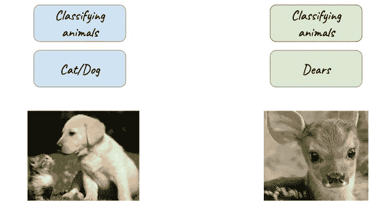

# 引导健忘的机器

> 原文：<https://towardsdatascience.com/guiding-forgetful-machines-72d1b8949138?source=collection_archive---------17----------------------->

在说机器之前，先说人类。更像是孩子。

还记得学校里的乘法表吗？老实说，我很害怕。每天数学老师都会出现，开始背诵数字和它们的倍数。每天一张新桌子！几个星期后，我开始忘记基础知识。即使我能说出 12 * 5 是多少，我也没记住 5 * 2！然后，老师介绍了“躲避桌子”的概念——更可怕，但它帮助我比以前更好地记住了桌子。

为什么会这样？我现在意识到她确保了旧桌子的记忆不会离开我的小脑袋，即使我正在学习新的更复杂的东西。最终目标是让一个人能够“不断学习”。

持续学习是从一系列数据中连续学习的能力，建立在以前所学的基础上，并且能够记住那些所学的任务。这是人类能够做到的，也是人工智能机器的最终目标。在我们的大脑中，新皮层依赖于突触巩固&突触中编码的先前任务的知识，这些知识是不可改变的，因此在很长一段时间内是稳定的。

所以我想让我们来谈谈如何引导智能机器不要忘记！

我们可以从数据入手，假设有一个我们搭建的猫狗图像识别器(分类器)。现在，如果我们想给它添加一个‘dear’类(我们已经有了这个类的支持数据集图像)，我们该如何着手呢？

We let the Task A (cat&dog) train, and weights are updated as inferred by the machine.

Now we put in the set 2 — Dear images to train & as the machine learns, it updates the weights

太好了，现在我们的机器可以识别三种东西了！一只猫/狗/亲爱的

希望一切正常，我们测试我们的模型…

And as expected the model predicts a fine result

正如预期的那样，模型预测了一个很好的结果！

现在让我们测试一些猫的图像🤞

但是这个失败了！怎么会？为什么？

原因:当添加新任务时，典型的深度神经网络容易出现**灾难性遗忘。**

我们需要的是能够随着时间的推移吸收新记忆的网络，我们需要努力克服这种限制，训练网络能够*在他们很长时间没有经历过的任务上保持*专业知识。我们基本上是在努力实现*一般的智能* &它需要特工们*记住*许多不同的任务。持续学习是一项挑战，因为随着新任务/当前任务相关信息的临近，先前学习任务的*知识*有突然丢失的趋势。当一个网络在多项任务上按顺序*训练*时，会发生这种情况，导致网络中对任务 A 重要的权重发生变化，以满足最近任务 b 的目标。简单的方法是，我们可以-

*   让所有数据在培训期间同时可用。
*   交错数据又名多任务学习

为什么我们不能继续培训和再培训模特？—因为一个合适的算法将比每次需要学习新任务时从头重新训练模型更有效，而这是非常昂贵的＄＄＄!！！也不是可扩展的解决方案。

哺乳动物的新大脑皮层依赖于*特定任务* **突触整合**和先前任务的知识。它被编码在可塑性较小的突触中，因此长期稳定。科学家和研究人员做了大量的实验来了解我们大脑的内部运作。

oooh Brainnyy stuffz!

所以从聪明人那里得到了帮助，我指的是神经学家&把他们的知识与酷孩子、ML 的人结合起来

-生->神经网络突触巩固！

突触巩固(在人工神经网络中)意味着，随着机器学习更多的任务，对先前任务至关重要的突触的可塑性(或修改能力)会降低。这就引出了我们将要讨论的第一个解决方案！

> 弹性重量合并[EWC]

这种算法(用外行的话来说)*减缓了*对某些权重的学习，这些权重是基于它们对之前看到的任务的重要性。它使用贝叶斯网络和寻找局部最小值的概念。像 EWC 这样的许多方法使用类似的方法，如无遗忘学习、增量矩匹配等。

对 EWC 来说,*的诀窍*就是在为下一个任务训练时 ***锁定*** 用于解决第一个任务的权重。通过锁定，神经网络能够学习新的任务，而不会忘记以前的任务。

[https://deepmind.com/blog/enabling-continual-learning-in-neural-networks/](https://deepmind.com/blog/enabling-continual-learning-in-neural-networks/)

嗯，不是字面上锁定权重，而是收敛到一个点，在这个点上，两个任务的 A & B 都有一个低误差，使用下面的损失函数—

cool looking loss function

EWC 确实有一个很大的缺点。如前所述，它是基于贝叶斯学习的，因此这些方法*将任务 B 的*参数限制在任务 A 的最优值周围的局部区域，以便最小程度地干扰任务 A 已经学习的内容。这可能会阻止神经网络在参数空间的偏远区域找到其他区域， 这可能包含任务 A & B 的联合问题分配的损失函数的更好的最小值。我们可以采取一种变通办法，例如存储大部分工作存储器，并在训练新任务时在训练期间重放它，但是这样会占用大量存储器以及大量训练时间。 考虑到图像处理大部分是在 GPU 上完成的，这是不会省钱的！

现在在神经生物学中，我们知道我们的大脑制造记忆——短期的(就像你脑中的声音为你朗读的),储存在一个地方。现在，当我们睡觉时，对你影响最大的事件的重要记忆将存储在大脑的其他部分*，这些神经元以这种方式保持无弹性(不可修改)，因此帮助我们记住学到的知识，并在必要时应用它们。*

brain stuff for cool kids

让我们混合 EWC 和记忆细胞的牵连吧！(耶？！)

> 对抗性记忆网络

这是代表长期记忆的对立子空间的交集，网络中的长期记忆是为每个任务独立存储在记忆单元中的*。*

> 任务相关记忆单元(浮点张量)。

[https://www.ijcai.org/proceedings/2017/0311.pdf](https://www.ijcai.org/proceedings/2017/0311.pdf)

记忆单元

*   扮演类似于对抗性输入图像的角色
*   抓住每堂课的精髓
*   跨越网络参数空间中高级空间的交集

使用这些记忆单元，我们就有了一个针对每个任务的*的*不同*类的联合抽象长期记忆。*

结论将是看不到最容易做到的解决方案，因为它可能有主要围绕 GPU 使用和内存和成本的缺点！而且，这对环境也不好。看[这个](https://interestingengineering.com/training-ai-is-shockingly-costly-to-the-environment)！

**原来如此！你很好地理解了避免灾难性遗忘的重要性和方法。**

**如果您有任何问题，请随时向我发送** [**推文。**](https://twitter.com/aananya_27)

[**关注我**](https://medium.com/@aananya_27) **随时更新我的帖子。祝您愉快！🎉**