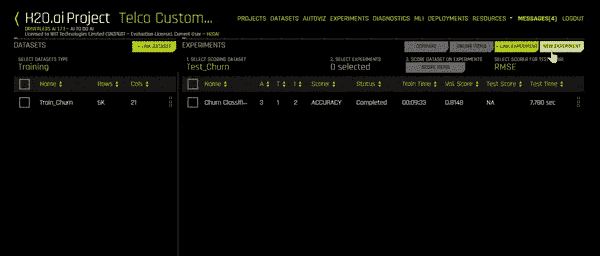

# H2O 无人驾驶人工智能:端到端的机器学习(对任何人！)

> 原文：<https://towardsdatascience.com/h2o-driverless-ai-data-science-without-coding-43c0b43d9d20?source=collection_archive---------11----------------------->


Photo by [Markus Spiske](https://unsplash.com/@markusspiske?utm_source=medium&utm_medium=referral) on [Unsplash](https://unsplash.com?utm_source=medium&utm_medium=referral)

## 做人工智能的人工智能——今天就开发你的第一个模型。

## 任何人都可以成为数据科学。不需要编码。

# 一. ||简介||


Photo by [Frank Albrecht](https://unsplash.com/@shotaspot?utm_source=medium&utm_medium=referral) on [Unsplash](https://unsplash.com?utm_source=medium&utm_medium=referral)

当今世界，成为数据科学家并不局限于没有技术知识的人。虽然了解一点代码是推荐的，有时也是很重要的，但是你可以只凭直觉就能搞定。尤其是如果你在 H2O 的无人驾驶人工智能平台上。

如果你没有听说过 H2O.ai，它是创建开源机器学习平台 H2O 的公司，该平台被许多财富 500 强使用。H2O 旨在通过利用其用户友好的界面和模块化功能来创建效率驱动的机器学习环境。

**注意** : *不要把* [*开源的 H2O AI 平台*](https://www.h2o.ai/products/h2o/) *和* [*无人驾驶 AI 混为一谈。*](https://www.h2o.ai/products/h2o-driverless-ai/) *他们是两个独立的东西。我建议通读每一项的文档以了解更多信息。*


H2O Open Source vs H2O DAI

H2O 3(开源)是 python/R 上的一个免费库，包含许多 ML 算法、模型和调优功能，使机器学习更加高效。
另一方面，无人驾驶人工智能是一种企业产品，拥有自己的平台、UI 和 UX。它就像一个 web 应用程序，可以使用旋钮和其他调整参数的可视化设备来创建和配置模型，本质上取代了实际编码模型的繁琐过程。

H2O 戴可以从头开始建立和验证人工智能模型，唯一需要的就是你的数据集。数据甚至不必进行清理或特征工程，因为 H2O DAI 可以处理这些任务，并允许您配置重要步骤的自动化，如*特征缩放*或对变量应用*分类编码*。
事不宜迟，我将开始 H2O 无人驾驶人工智能教程。

# 二。||安装||

H2O 无人驾驶 AI 是一款企业产品，因此不建议个人购买。相反，您的公司应该在本地部署 H2O，并允许员工利用其强大的界面。然而，你和我都是独立的个体，出于本教程的目的，我使用 H2O 的 21 天免费试用版。如果你想跟进，但还没有准备好购买产品，你也可以这样做。

**注意:** *在你的机器上运行 h2o 有一些要求。建议您在 Linux 或 Windows 上运行 h2o，但是，您可以使用 docker 在 Mac 上运行它。你可以在这里学习如何使用*[](http://docs.h2o.ai/driverless-ai/latest-stable/docs/userguide/install/mac-osx.html)**。我将详细介绍 Windows 的要求，因为这是我在本教程中使用的。如果你在 Linux (prod。环境推荐)，遵循* [*这些指令*](http://docs.h2o.ai/driverless-ai/latest-stable/docs/userguide/install/x86-64.html) *。**

*从访问 [h2o.ai](http://h2o.ai) 开始。寻找无人驾驶 AI 产品，填写表格，下载最新稳定版**无人驾驶 AI DEB** 。*

**

*visit the website and install H2O driverless AI*

***在 Windows 上，有 2 个附加要求:***

*   *必须按照[https://docs.microsoft.com/en-us/Windows/wsl/install-win10](https://docs.microsoft.com/en-us/windows/wsl/install-win10)的规定启用 Linux 的 windows 子系统(WSL)*
*   *来自 [Windows 商店](https://www.microsoft.com/en-us/p/ubuntu-1804-lts/9n9tngvndl3q)的 Ubuntu 18.04。(注意，不再支持用于 WSL 的 Ubuntu 16.04。)*

*所以，你需要首先安装 Ubuntu 18.04 for WSL(如果你“以管理员身份运行”(第一个链接中的说明)就可以激活)。完成后，在 Ubuntu 18.04 LTS 中运行以下命令来安装和运行 H2O-戴:*

```
*# Install Driverless AI.  Expect installation of the .deb file to take several minutes on WSL.sudo dpkg -i dai_VERSION.deb

# Run Driverless AI.sudo -H -u dai /opt/h2oai/dai/run-dai.sh*
```

*在 windows 上安装 H2O 戴的另一种方法是通过 Docker。你可以在这里找到那个[的具体说明](http://docs.h2o.ai/driverless-ai/latest-stable/docs/userguide/install/windows.html)。*

# *三。||推出 H2O 无人驾驶 AI ||*

**

*在你的浏览器上，在 URL 框中输入下面的
**localhost:12345***

*如果您在本地机器上安装了 H2O，这应该可以工作。运行实例的一般语法是
**<服务器> :12345***

*在本地服务器上使用“localhost”。然后，它应该会自动启动登录页面，如下所示。*

*对于试用用户，登录 ID 和密码都是“h2oai”。登录详细信息，然后单击登录。您现在应该看到数据集页面，其中 H2O 将向您显示任何过去上传的数据或存储在系统上的其他文件。*

# *四。||上传数据||*

**

*H2O 无人驾驶人工智能在获取数据集方面非常灵活。由于其大多数应用程序都基于实时/系列数据，H2O 有能力从许多来源提取信息，如亚马逊 S3 服务器、Hadoop 文件系统(通过本地上传)或 H2O 文件系统。*

*我从我的电脑上传了一个文件，这是电信客户流失数据库(来自 Kaggle)。该文件包含客户数据，每一列(除了客户 ID)都考虑了客户流失预测。*

# *动词 （verb 的缩写）|| Autoviz ||*

*我的数据集一上传，我就可以访问 Autoviz 选项卡。当你通过 Autoviz 可视化一个数据集时，它会给你不同种类的可能的图表来总结你的数据。你所要做的就是上传你的数据，Autoviz 就可以使用了。*

**

*有些图形也是交互式的，可以像在 Plotly 中一样移动。所有的视频都是可以下载的，所以你可以把它们保存在你的服务器或者文件系统中。*

**

*Interactive graphs on Autoviz*

# *不及物动词||项目||*

*要开始任何实验或活动，你需要有一个项目。因此，转到“项目”选项卡，它应该是这样的:*

**

*现在，您需要创建一个新项目，只需选择一个名称和描述即可。一旦完成，你将会有一个像下面这样的屏幕。这是您管理项目、数据和实验的地方。*

**

*使用**链接数据集**按钮将您的文件链接到该项目。我已经附上了我的客户流失数据集，它显示在左侧的培训下。如果右键单击数据集，我可以选择分割它。我需要分割数据集以进行训练和测试，因此我单击“分割”并获得以下选项:*

**

*我选择两个不同数据集的名称，选择一个目标列(我们想要预测的列)，折叠和时间列(如果需要的话)，并选择拆分比率。我选择 0.75，因为这将使我的测试集中有 2500 个值，这足以测试模型。*

# *七。||实验||*

*每次你在一个数据集上运行一个特定的模型，就叫做实验。有了这个功能，H2O 使型号选择过程变得更加容易。你可以通过多次实验来选择合适的模型。转到您项目的仪表板，然后单击“新建实验”。*

**

*实验设置助手应该会打开。你现在可以开始填写这个实验的细节了。从名称开始，然后选择训练集。更多的细节将会显示出来(正如你在上面的 GIF 中看到的)。现在，您可以选择您的目标列、测试数据集，并且可以根据您的需要更改培训设置。根据您选择的设置，该型号的个性化描述将显示在屏幕的左侧。你甚至可以点击专家设置来更深入地改变其他参数。*

**

*Experiments on H2O Driverless AI*

*一旦你点击启动实验，一个新的屏幕将出现。你会看到类似这样的东西，如果你看到了，那就意味着 H2O 正在运行你的实验——直播！*

**

*随着实验的进行，它将开始显示模型的迭代数据，以及最重要的变量(可能会随着模型的进展而改变)。在右下角，您还可以在屏幕之间切换，以查看:*

*~ ROC 曲线
~ Precision-Recall
~ Gain/Lift 图表
~ K-S 测试图(Kolmogorov-Smirnov)
~ CPU 使用率。*

*一旦您的实验完成，您应该能够看到这样的屏幕，您的 CPU 使用选项卡将更改为摘要:*

**

*在变量重要性的正上方，有一个可供选择的操作菜单。屏幕上唯一不可用的选项是部署。这是有原因的。这是因为我们还没有下载我们的 MOJO/POJO 文件。我们将在最后做那件事。首先，我们来解读一下这个模型。*

# *八。||解释模型||*

*导航回实验选项卡并找到您的实验。再次打开它，点击按钮**解释这个模型。** 翻译窗口将开始加载，可能需要一些时间。它应该是这样的:*

**

*一旦解释页面被加载到 100%，您将会得到一个解释模型的菜单。也可以通过 MLI 选项卡访问该页面。正如你在下面的 gif 图中看到的，页面左侧有许多标签。*

*   ***摘要:**向我们概述了 MLI(机器学习解释器)以及模型的一些参数，例如其最重要的变量及其定义、所使用的石灰聚类的数量、代理模型的摘要。下面的 GIF 显示了一个示例摘要页面:*

**

*Summary of MLI*

*   ***戴模型:**这里可以看到无人驾驶 AI 开发的模型。在 DAI 模型中，您可以看到该模型中功能重要性的全貌，当您将鼠标悬停在变量上时，每个变量都会弹出解释。它还可以向您显示合同变量的部分依赖关系图，此外，您可以从我们的实验中看到带有完整混淆矩阵的不同影响分析。*

**

*   ***代理模型:**除了 DAI 模型分析，我们还可以获得关于代理模型的信息。这些位于代理选项卡中，允许我们查看来自其他模型的参数和数据，如 K-Lime 聚类、决策树模型和随机森林模型。
    在随机森林中，我们还可以看到特征重要性、部分相关性和局部相关性。*

**

*   ***仪表盘:**下面是 MLI 仪表盘的样子。它在一个页面上包含了我们所有重要的图表和参数，因此我们可以快速导航到我们想要的位置。*

**

# *九。||诊断||*

*Diagnostics 选项卡包含一个页面，其中包含某些准确性指标和图形，可用于在运行实验后诊断模型。它包含了 ROC 曲线、精确回忆曲线、收益/提升、K-S 图和真/假阳性/阴性混淆矩阵的所有内容。
诊断页面如下所示:*

**

# *X.||部署||*

*正如我上面提到的，部署是不可能的，因为我们没有 MOJO 文件。要在本地或云服务器上部署您的模型，您首先需要创建 MOJO 文件。根据他们的网站，“ *H2O 生成的 MOJO 和 POJO 模型旨在方便地嵌入任何 Java 环境。**

**

*因此，回到实验选项卡并加载您的实验。您将再次看到带有绿色选项按钮的菜单。继续点击按钮**建立 MOJO 评分管道。**它现在会在你的左边显示屏幕，并开始建立你的 MOJO 管道。*

**

*一旦您的 MOJO Pipeline 可用，您将可以选择部署您的模型。你可以选择把它放在 Amazon Lambda 服务器上，也可以使用 REST API 服务器。一旦你选择了你的目的地，H2O 将自动部署你的模型，并给你它的位置。*

# *XI。||资源和结论||*

*“资源”选项卡有许多选项可用于。首先，它会有一个选项带你去无人驾驶人工智能文档。它还包含下载用于 R 和 Python 的 H2O 无人驾驶 AI 客户端 API 的链接。如果你想了解更多关于无人驾驶人工智能的能力，并在你的业务中使用它，这是非常有用的。*

*最后，我只想提一下，我与开发该产品的 H2O 公司没有任何关系。我是他们产品的用户，我认为发布这个教程是个好主意，因为目前还没有很多这样的产品。我花了一段时间来学习 H2O 无人驾驶人工智能，我想我会通过这个教程让其他人更容易。
欢迎对这篇文章发表评论，问我关于我的工作的任何问题，或者我打算如何在我的个人/工作项目中使用 H2O。我可能会在未来写另一篇帖子，将无人驾驶人工智能与 H2O 3(开源)进行比较，任何对此的反馈都将是巨大的。*

*感谢阅读。我希望这能以难以想象的方式帮助你。*

*更多关于 H2O 无人驾驶 AI 的信息和教程，请访问 [h2o.ai](http://h2o.ai) 。*

*Catch H2O.ai on Twitter!*

**

*Photo by [Borna Bevanda](https://unsplash.com/@bbevanda?utm_source=medium&utm_medium=referral) on [Unsplash](https://unsplash.com?utm_source=medium&utm_medium=referral)*

# *十二。||参考资料||*

*   *[https://H2O-release . S3 . Amazon AWS . com/H2O/rel-ueno/2/docs-website/H2O-docs/welcome . html](http://docs.h2o.ai/driverless-ai/latest-stable/docs/userguide/index.html)*
*   *[https://www.h2o.ai/products/h2o-driverless-ai/](https://www.h2o.ai/products/h2o-driverless-ai/)*
*   *[http://docs.h2o.ai/?_ ga = 2.1983044548-168714471](http://docs.h2o.ai/?_ga=2.198303215.1915603396.1568864548-1687149615.1566915470)56686*