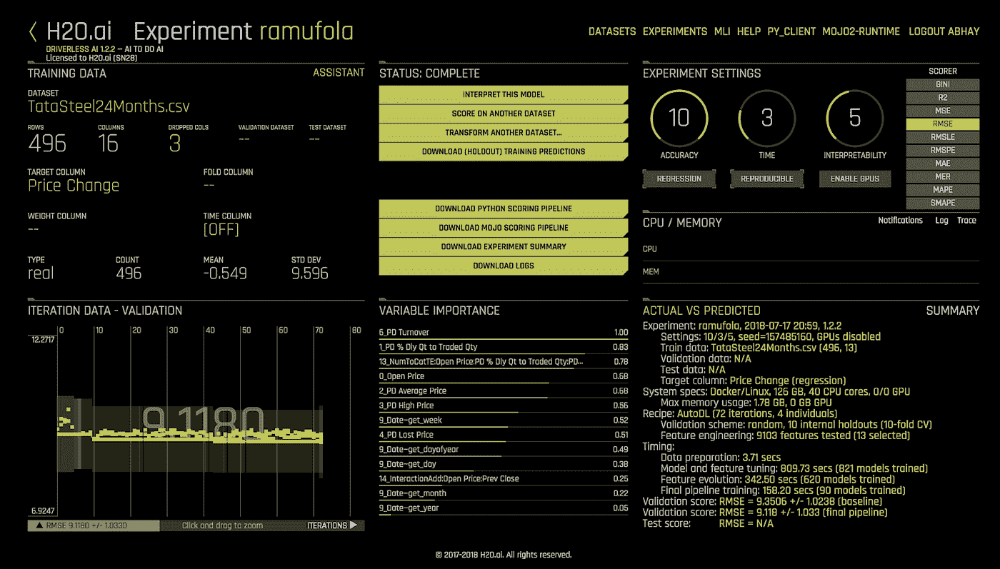
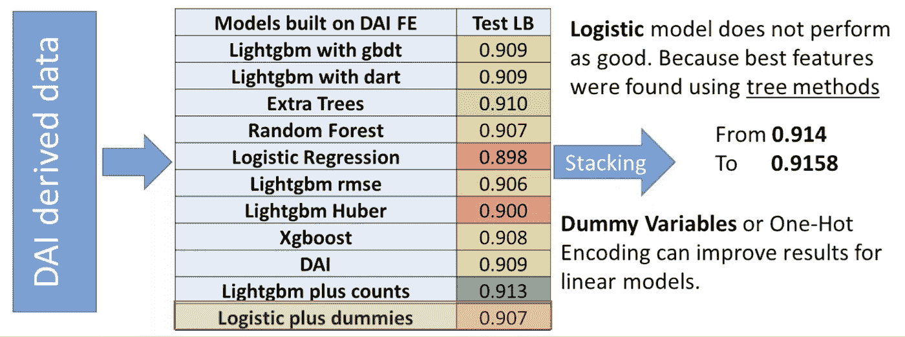
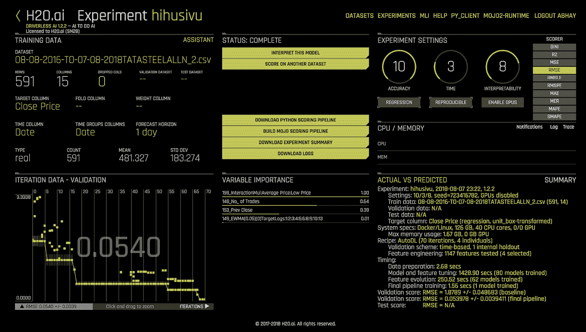
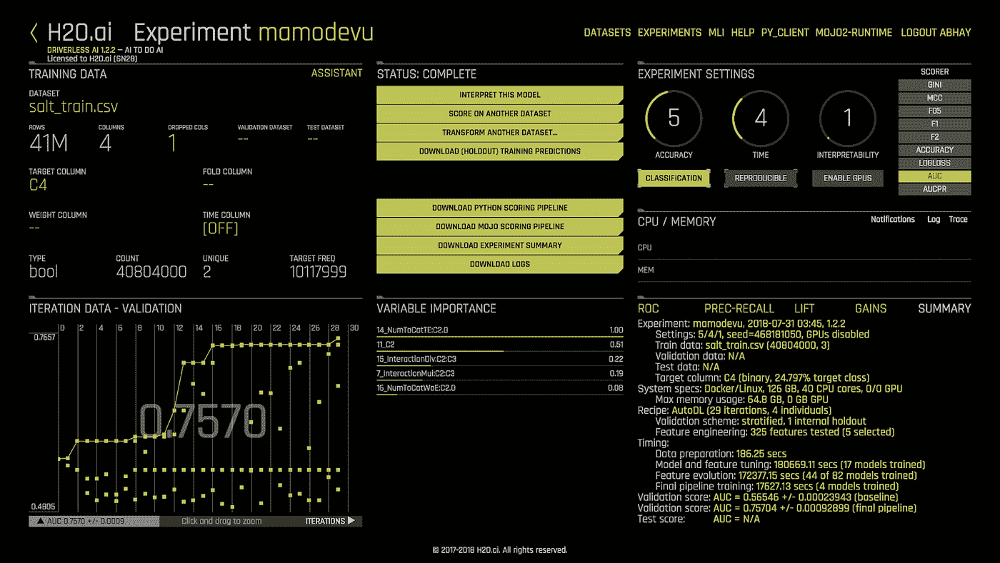

# H2O 适合没有经验的用户

> 原文：<https://towardsdatascience.com/h2o-for-inexperienced-users-7bc064124264?source=collection_archive---------10----------------------->

一些背景:我是一名高三学生，2018 年夏天，我在 H2O.ai 实习。除了吴恩达在 Coursera 上的机器学习入门课程和他的几门深度学习课程之外，我没有任何 ML 经验，最初我发现自己有点被 H2O 在其开源和企业软件中提供的各种新算法所淹没。但是通过探索各种资源，到夏天结束时，我已经能够在 Kaggle 上的 TGS 盐识别挑战中使用无人驾驶人工智能和 H2O-3 算法。在这篇博文中，我将讲述我在 H2O.ai 工作期间的经历和收获，以及为那些新手提供的学习 H2O 和数据科学的资源。

**入门**

H2O-3

为了开始使用 H2O，我首先下载了 [H2O-3](http://h2o-release.s3.amazonaws.com/h2o/latest_stable.html) 包以及 Python 客户端。尽管安装说明很简单，但在安装和使用 Python 客户端时，请确保:

1.  H2O Python 安装和下载的包版本匹配。
2.  H2O 运行的是 Java 8

如果你不希望使用 Python，H2O 3 有一个 GUI API，H2O 流，可以在浏览器上访问；python 客户端易于使用且灵活，具有直观的命令和其他 python 优势，如 numpy、pandas 和 opencv。

让 H2O 3 号运行起来后，下一个任务是熟悉它的功能。对此有用的资源包括:

*   [文档](http://docs.h2o.ai/h2o/latest-stable/h2o-docs/index.html):侧边栏中的页面绝对值得一读(随意跳过或浏览)。该文件提供了一个全面的看法，你可以做什么与 H2O-3，以及细节和解释有关的实施。在 R 和 Python 的一些页面上都可以找到示例代码。如果示例代码在某些页面上不可用——例如，在深度学习页面上——它可能在 GitHub 存储库中可用(很可能在 tutorials 文件夹中；如果不容易找到，您可以搜索整个存储库)
*   H2O-3 GitHub :浏览你心目中项目的教程。再看一些，看看你能包括的其他函数和算法。我发现教程中的示例代码对于学习如何使用每个函数非常有用。源代码读起来很有趣。如果你想了解每件事是如何实现的，读一读它；尽管要理解如何使用所有的东西，浏览文档会更容易，因为源代码阅读和解释起来相当长。
*   Coursera : H2O 在 Coursera 上有一门课程，你可以免费获取资料，但需要为作业付费。虽然我没有尝试过，但是如果您喜欢更结构化的方法，可以尝试一下。

随着我对 H2O-3 越来越熟悉，我浏览了打印到终端窗口的日志，在那里，当我运行各种算法时，H2O 实例通过 Java 启动。这也非常有助于理解它在做什么，监控进展，并在数据或模型超参数中找到潜在的改进。

从 H2O 无人驾驶 AI 开始

我开始使用无人驾驶 AI(戴)的方式与 3 相同。我按照[安装说明](https://s3.amazonaws.com/artifacts.h2o.ai/releases/ai/h2o/dai/rel-1.2.2-6/docs/userguide/installing.html)下载安装了戴。这非常简单，但是值得注意的是，如果您的机器上没有足够的 RAM(指令要求 DAI 至少运行 10 gb)，那么无论如何都要尝试运行 DAI，它仍然可以工作。我在一台内存为 8 gb 的 Mac 上分配了 4 gb，它仍然能够运行。

为了熟悉戴，首先浏览一下[文档](http://docs.h2o.ai/driverless-ai/latest-stable/docs/userguide/index.html)侧栏中的所有页面。模型解释和转换是戴所独有的。为了理解模型解释，我试图通过查看其 [GitHub 库](https://github.com/marcotcr/lime)和[本文](https://www.oreilly.com/learning/introduction-to-local-interpretable-model-agnostic-explanations-lime)来理解 LIME。[原文](https://arxiv.org/abs/1602.04938)也值得一读。

戴使用起来很直观。很容易理解如何使用它。毕竟，它是为非数据科学家打造的！

组装

H2O-3 AutoML(以及一些固有集合模型)和 DAI 集合模型来提高性能。在 Kaggle 上也经常使用集合模型。[这篇文章](https://mlwave.com/kaggle-ensembling-guide/)从概念上解释了集成，[这篇博文](http://blog.kaggle.com/2016/12/27/a-kagglers-guide-to-model-stacking-in-practice/)展示了如何实现它。相关:【mlwave.com[是一个从顶级 Kagglers 和数据科学家那里学习机器学习概念、用途和工作流的绝佳资源。强烈推荐阅读；这些文章非常有趣，可能对您的数据科学项目有所帮助。](https://mlwave.com/)

**小项目**

我从印度国家股票交易所下载了塔塔钢铁 24 个月的股票数据，开始用戴和 3 做日内交易的实验。我打算使用前一天的标记和当天的开盘价来预测当天的收盘价。

我第一次处理这个数据集是通过在某一天移动标记列中的元素，使得当天的收盘价与前一天的标记在同一行中——这不是处理时间序列的正确方法；戴的时间序列特征对数据进行了适当的自动处理。然后我在这个数据集上运行了 DAI。由于 H2O-3 算法运行得更快，当戴运行时，我也能够在这个数据集上训练多个 H2O-3 模型。使用 3 算法的训练分数约为 10，使用戴算法的训练分数约为 9.1，在小型测试数据集上的测试分数约为 213，这使得该模型对任何日内交易应用程序都没有用。

*Initial DAI model without time series*

在寻找提高模型性能的想法时，我找到了 Marios Michailidis 关于如何在 Kaggle 上使用戴的视频。他使用 DAI 和如下所示的其他算法来堆叠模型，并充分利用 DAI 的特征工程:

在试图遵循这一点，我首先饲料戴衍生数据与额外的功能(但与地面真实价格值即。来自原始数据集的接近价格列)到显示更多多样性的各种 3 模型，然后将它们的预测馈送到戴(最终模型)。这在训练阶段更有希望，RMSE 约为 3.5，但在得分约为 288 的测试数据集上表现较差。这是不正确的堆叠。翻翻前面提到的[博文](http://blog.kaggle.com/2016/12/27/a-kagglers-guide-to-model-stacking-in-practice/)，看看怎么做才正确。

后来，我在未编辑的数据集上尝试了戴的时间序列特性，其性能显著提高到约 0.05 训练和约 6 测试。然而，即使性能有所提高，模型在测试集上的显著性能下降表明它没有足够的数据来创建准确的模型。

*DAI model with time series*

**卡格尔**

在试用并熟悉了 3 和戴之后，由于我无法找到足够的数据让塔塔钢铁做出更好的模型，所以我转向了数据科学竞赛平台【】Kaggle 。TGS 盐鉴定竞赛看起来很有趣，而且是一个相当大的数据集。这场比赛涉及在给定地震数据(以图像的形式)和每个图像的深度的情况下，识别地下目标是否是盐，换句话说，就是盐在地震图像上的位置和边界。

我强烈建议你看看 Kaggle，即使你不打算参加比赛，因为它为数据科学新手提供了大量资源，包括[数据集](https://www.kaggle.com/datasets)、[讨论](https://www.kaggle.com/discussion)(初学者的[部分](https://www.kaggle.com/getting-started))、计算资源和代码([内核](https://www.kaggle.com/kernels))。

有用的 Python 模块

Python 有各种各样的模块，使得数据操作更加容易。看看 [numpy](http://www.numpy.org/) 和 [pandas](https://pandas.pydata.org/) 进行计算和数据操作， [csv](https://docs.python.org/3/library/csv.html) 进行 csv 读写，以及 [opencv](https://opencv.org/) 处理图像。

数据集生成

因为 H2O 不接受图像数据，所以我生成了以下列格式的数据集，其中每一行都对应于图像上的一个像素，使用的是[这个脚本](https://hastebin.com/upusefuzuz.py):

Id(字符串)

深度(真实)

灰度像素值(实数)

盐地真相(布尔/枚举)

将这些数据提供给戴非常简单；我刚刚用上传文件按钮上传了它。然而，对于 H2O-3，它需要被压缩，否则 Python 会抛出[Errno 22]无效参数。注意: [Python 3 似乎很难处理超过 2–4gb 的文件](https://stackoverflow.com/questions/48122798/oserror-errno-22-invalid-argument-when-reading-a-huge-file)；H2O.ai 会通过升级他们的导入库来修复这个 bug。

python 脚本创建了 3600 个图像像素的训练集、400 个图像像素的验证集和 18000 个图像像素的测试集；这些测试预测将被提交到 Kaggle 上。

戴和 3 算法

为了防止算法记住数据，在训练之前删除了 id 列。由于训练和测试数据集相当大(分别约 4100 万和 1.83 亿行)，在没有 GPU 的情况下，戴花了很长时间进行训练。这次，我尝试了 H2O-3 深度学习估计器。对于两者，我都使用 AUC 指标作为计分器，并为 DAI 最终管道启用 Tensorflow 模型和 RuleFit 支持(在专家设置菜单中)。戴获得了大约 0.75 训练 AUC，而 3 深度学习获得了大约 0.72。

预测的像素值被转换成映射到 id 的 RLE 编码，如比赛计分员使用[这个脚本](https://hastebin.com/duzobexadu.py)所要求的。在这里找到[的 numpy 数组到 rle 函数的功劳](https://www.kaggle.com/rakhlin/fast-run-length-encoding-python)[拉赫林](https://www.kaggle.com/rakhlin)。由 Kaggle 评分的深度学习和 DAI 模型在测试数据集上的[交集(IoU)](https://stackoverflow.com/questions/28723670/intersection-over-union-between-two-detections) 分数如下:

模型:H2O-3 深度学习，IoU: 0.263

型号:戴，借据:0.176

*First salt detection DAI model trained on 2 features*

缺乏特色

潜在的模型准确性的最大障碍是缺乏特征。数据集的每个像素只有两个要素(因为 id 已被删除)。通过增加更多的特征，包括像素位置、相邻像素灰度值以及图片灰度最大值、最小值和平均值，这一点得到了弥补。

然而，随着训练、验证和测试文件(尤其是测试文件)从 4 列膨胀到 13 列，这暴露了更多的硬件限制。戴运行时间长，我的笔记本电脑 RAM 用完，Python 不支持上传大文件，都拖慢进度。

资源

Kaggle 论坛对于改进模型的可能途径非常有用，无论是通过理解和扩充数据，探索更合适的模型，还是精炼模型。除此之外，每当出现问题时，谷歌搜索通常会让我找到有一些答案(或至少有趣)的研究论文、Stackoverflow 或 Kaggle 讨论。

我还从 H2O 的 Megan 那里得到了很多关于如何提高模型性能的想法和建议，包括额外的特性和自动编码(见下文)。H2O 也是您学习数据科学和改进模型的绝佳资源。

向前发展的想法

特征工程通常是 Kaggle 竞赛的关键部分(正如我从 Kaggle 论坛上了解到的那样)，因此包含更多的特征很可能会提高模型性能。这些特征可以包括到沙簇的像素距离、沙簇的一般形状，或者可能是更多邻居的盐真相。尝试找到更多功能。

自动编码器或 GLRM 也可以用于对输入图像和/或预测进行去噪。在检查初始(2 个特征)DAI 序列预测时，我注意到有很多噪声，特别是在应该是空的图像上。Kaggle 已经实现了 IoU 指标，因此如果在应该为空的图像上预测到任何 salt，则该图像将得到 0 分。通过在训练预测和训练集上训练的 H2OAutoEncoderEstimator 运行测试预测应该减少噪声并去除否则为空的图像上的杂散像素。

空图像也可以通过让输入图像通过另一个模型来捕捉，该模型首先检查它是否是空的。如果预测为空，而不是冒几个像素的风险，则在该图像上将有 0 个真实像素被预测。

更适合图像的其他模型也可能提供更好的解决方案。从论坛可以看出，UNets 在竞争中似乎相当成功。其他卷积网络也应该在性能和速度上提供超过常规深度神经网络模型的提升。正如 Sri 所建议的，GAN 方法也可以工作，因为模型需要生成掩模图像。

就速度而言， [Cython](http://cython.org/) 似乎是加速数据集处理的一个有前途的途径。更高的效率和更少的硬件限制也将使集合(堆叠/混合)成为提高模型性能的更可行的途径。

如果您有时间、愿望和计算资源，请拿起指挥棒，参加竞赛！

**杂学**

*命令行技巧*

熟悉命令行虽然不是使用 H2O 所必需的，但可以使大多数任务变得更容易。对我来说，知道如何浏览文件、启动 Java、使用 Python 和 pip、连接到远程机器并在其上运行任务就足够了。

*远程机器*

如果您在远程机器上使用 DAI 或 H2O(或其他任何东西)，这些命令可能会有所帮助:

下载到机器上

ssh:连接到机器的命令行

Byobu 可以用来保存远程会话(即使在断开连接的情况下，你也可以让 DAI 或 H2O-3 在远程机器上运行),并且非常易于使用。

*用于机器学习的机器*

如前所述，我在生存能力和速度方面遇到了许多硬件限制。为机器学习设置一台机器将使一切变得更容易和更快。[这篇文章](https://medium.com/mlreview/choosing-components-for-personal-deep-learning-machine-56bae813e34a)可能会对你有所帮助。GPU 注意:GPU 的指数级加速 H2O 性能，但 H2O 的 GPU 并行化是使用 CUDA 构建的(ML 中使用的许多其他脚本也是如此)，所以当决定使用 GPU 时，请使用 CUDA。

**前进**

在熟悉 H2O 之后，下一个好的步骤是探索和理解更多的算法，这样你就可以将合适的算法应用到用例中。这也可以改善模型集合的结果。此外，研究更多的数据科学可以更好地理解和操作数据集，这也将提高模型性能。最后，只是阅读论文、Kaggle 讨论和跟上 H2O 文档将是学习更多和产生新想法的有趣和有趣的方式。