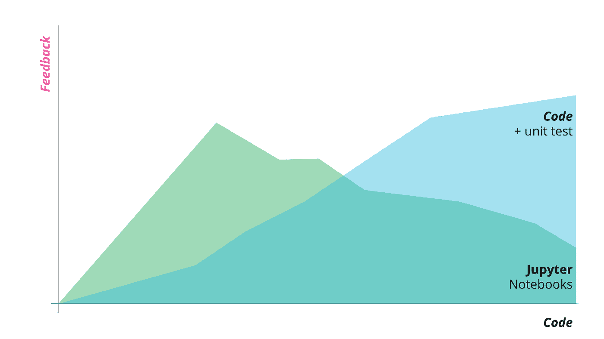
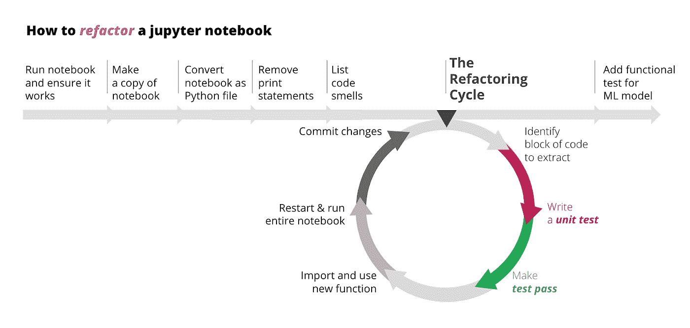
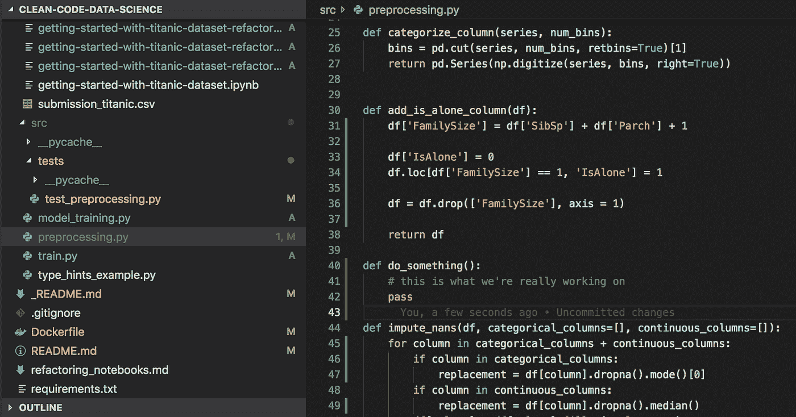
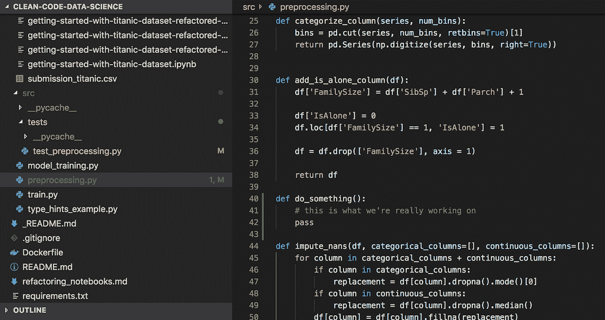

# 管理数据科学代码库中复杂性的更好习惯

> 原文：<https://towardsdatascience.com/habits-for-managing-complexity-in-data-science-codebases-5a16314c3737?source=collection_archive---------33----------------------->

## 现实世界中的 DS

## 如何通过更好的编码习惯变得更加敏捷和高效

Photo credit: [https://www.pexels.com/@fox-58267](https://www.pexels.com/@fox-58267)

如果你尝试过机器学习或数据科学，你会知道代码会很快变得混乱。

Actual footage of me writing data science code

通常，训练 ML 模型的代码是在 Jupyter 笔记本中编写的，它充满了(I)副作用(例如打印语句、漂亮打印的数据帧、数据可视化)和(ii)没有任何抽象、模块化和自动化测试的粘合代码。

虽然这对于旨在教授人们机器学习过程的笔记本电脑来说可能没什么问题，但在实际项目中，这可能会导致难以维护的混乱。缺乏良好的编码习惯使得代码难以理解，因此修改代码变得痛苦且容易出错。这使得数据科学家和开发人员越来越难以发展他们的 ML 解决方案来适应业务需求。

复杂性是不可避免的，但它是可以划分的。在我们的家中，如果我们不积极组织和合理安排物品摆放的位置、原因和方式，就会造成混乱，原本简单的任务(如找钥匙)就会变得不必要的耗时和令人沮丧。这同样适用于我们的代码库。

每当我们以添加另一个移动部分的方式编写代码时，我们就增加了复杂性，并且在我们的头脑中增加了更多的东西。虽然我们不能——也不应该试图——逃避问题的本质复杂性，但我们经常通过糟糕的编码实践增加不必要的意外复杂性和不必要的认知负荷。

如果我们可以通过应用下面列出的原则来控制复杂性，我们的大脑就可以解放出来解决我们想要解决的实际问题。以此为背景，我们将与**分享一些识别增加代码复杂性的坏习惯****以及帮助我们管理复杂性的**习惯**的技巧。**

# **管理复杂性的五个习惯**

> ***“管理软件复杂性的最重要的技术之一是设计系统，使得开发人员在任何给定的时间只需要面对整体复杂性的一小部分。”* ( [约翰·奥特](https://www.amazon.com/Philosophy-Software-Design-John-Ousterhout/dp/1732102201))**

## **1.保持代码整洁**

**不干净的代码使代码难以理解和修改，从而增加了复杂性。因此，更改代码以响应业务需求变得越来越困难，有时甚至是不可能的。**

**一个常见的坏习惯(或“代码味”)是在代码库中留下死代码。死代码是被执行的代码，但是它的结果从来没有在任何其他计算中使用过。死代码是开发人员在编码时必须记住的另一个不相关的东西。例如，比较以下两个代码示例:**

**See how much easier it is to read the second code sample?**

**干净的代码实践已经被广泛地用几种语言写成，包括 T2、Python 和 T3。我们将这些干净的代码原则用于机器学习环境，你可以在这个 [**干净代码-ml 报告**](https://github.com/davified/clean-code-ml) 中找到它们。**

## **2.使用函数来抽象复杂性**

**函数通过抽象出复杂的实现细节并用一个更简单的表示——它的名字——来代替它们，从而简化了我们的代码。**

**想象你在一家餐馆里。给你一份菜单。这份菜单不是告诉你菜名，而是详细说明每一道菜的烹饪方法。例如，这样的一道菜是:**

****

**What dinner menus look like without *abstraction***

**如果菜单隐藏了菜谱中的所有步骤(即实现细节)，而是给我们一道菜的名字(即一个接口，一道菜的抽象)，那对我们来说就容易多了。(回答:那是**扁豆汤**。**

**为了说明这一点，这里有一个代码样本，来自 Kaggle 的 Titanic competition 中的一个笔记本，在重构到一个函数之前和之后。**

**通过将复杂性抽象成函数，我们使代码可读、可测试和可重用。**

**当我们重构功能时，我们的整个笔记本都可以简化，变得更加优雅:**

**Life is happier when you read code that tells you *what they do, and not how they do it***

**我们的精神开销现在大大减少了。我们不再被迫处理许多许多行的实现细节来理解整个流程。相反，抽象(即函数)抽象掉了复杂性，告诉我们*它们做了什么* ，让我们不必花心思去弄清楚***它们是如何做的。*****

## *****3.尽快从 Jupyter 的笔记本里偷出代码*****

*****在室内设计中，有一个概念(“[平面定律](https://en.wikipedia.org/wiki/Law_of_flat_surfaces)”)，即“家庭或办公室中的任何平面都容易积聚杂物。”Jupyter 笔记本是 ML 世界的平面。*****

**********

*****当然，Jupyter 笔记本对于快速原型制作非常有用。但是我们倾向于把很多东西放在这里——粘合代码、打印语句、美化的打印语句(`df.describe()`或`df.plot()`)、未使用的导入语句甚至堆栈跟踪(🙈).尽管我们的意图是好的，但是只要笔记本还在，脏乱就会越积越多。*****

*****笔记本很有用，因为它们能给我们快速的反馈，当我们得到新的数据集和新的问题时，这通常是我们想要的。然而，**笔记本变得越长，就越难得到关于我们的改变是否奏效的反馈**。*****

*****例如，当我们更改一行代码时，确保一切正常的唯一方法是重启并重新运行整个笔记本。我们被迫承担整个代码库的复杂性，即使我们只想做其中的一小部分。*****

*****相比之下，如果我们将代码提取到函数和 Python 模块中，并且如果我们有单元测试，测试运行程序将在几秒钟内给我们反馈我们的更改，即使有数百个函数。*****

**********

*****The more code we have, the harder it is for Jupyter notebooks to give us fast feedback on whether everything is working as expected.*****

*****因此，我们的目标是尽早将代码从笔记本转移到 Python 模块和包中。这样，他们可以在单元测试和领域边界的安全范围内休息。这将有助于通过提供一个逻辑地组织代码和测试的结构来管理复杂性，并使我们更容易发展我们的 ML 解决方案。*****

*******那么，我们如何将代码从 Jupyter 笔记本中移出呢？**假设您已经在 Jupyter 笔记本中编写了代码，您可以遵循以下流程:*****

**********

*****The refactoring cycle for Jupyter notebooks*****

*****这个过程中每一步的细节可以在[**clean-code-ml repo**](https://github.com/davified/clean-code-ml/blob/master/docs/refactoring-process.md)中找到。*****

## *****4.应用测试驱动开发*****

*****到目前为止，我们已经讨论了在代码已经写在笔记本上之后编写测试。这个建议并不理想，但是它仍然比没有单元测试好得多。*****

*****有一种神话认为我们不能将测试驱动开发(TDD)应用于机器学习项目。对我们来说，这完全是不真实的。在任何机器学习项目中，大部分代码都与数据转换有关(例如，数据清理、特征工程)，一小部分代码库是实际的机器学习。这种数据转换可以写成纯函数，为相同的输入返回相同的输出，这样，我们可以应用 TDD 并获得[的好处](https://www.thoughtworks.com/insights/blog/test-driven-development-best-thing-has-happened-software-design)。例如，TDD 可以帮助我们将大而复杂的数据转换分解成较小的问题，这样我们就可以一次解决一个问题。*****

*****至于测试代码的实际机器学习部分是否如我们预期的那样工作，我们可以编写**功能测试**来断言模型的度量(例如，准确度、精确度等)高于我们预期的阈值。换句话说，这些测试断言模型按照我们的期望运行(因此得名，功能测试)。这里有一个[测试的例子](https://github.com/davified/clean-code-ml/blob/master/src/tests/test_model_metrics.py):*****

*****Example of a automated functional test for ML models*****

*****当我们写完这些单元测试和功能测试后，我们可以让它们在团队成员推送代码时在[持续集成(CI)管道](https://www.youtube.com/watch?v=K0hg6o9MWKQ)上运行。这将允许我们在错误被引入我们的代码库时就捕捉它们，而不是在几天或几周后。*****

## *****5.小而频繁地提交*****

*****当我们不进行小而频繁的 [git 提交](https://rogerdudler.github.io/git-guide/)时，我们增加了不必要的精神开销。当我们正在处理一个问题时，对早期问题的更改仍然显示为未提交。这在视觉和潜意识上分散了我们的注意力；这让我们更难专注于当前的问题。*****

*****例如，看看下面的第一个和第二个图像。你能找出我们在做哪个功能吗？哪个图像给了你更轻松的时间？*****

********************

*****当我们频繁地进行小规模提交时，我们会获得以下好处:*****

*   *****减少视觉干扰和认知负荷。*****
*   *****如果工作代码已经提交，我们就不必担心会意外破坏它。*****
*   *****除了[红绿重构](https://blog.cleancoder.com/uncle-bob/2014/12/17/TheCyclesOfTDD.html)，我们还可以[红绿红绿还原](https://www.facebook.com/notes/kent-beck/one-bite-at-a-time-partitioning-complexity/1716882961677894/)。如果我们无意中破坏了一些东西，我们可以很容易地退回到最近的提交，并再次尝试。这样我们就不用浪费时间去解决我们在试图解决本质问题时无意中制造的问题。*****

*****那么，多小的提交才算足够小呢？当有一组逻辑上相关的变更并通过测试时，尝试提交。一种技术是在我们的提交消息中寻找单词“and ”,例如“添加探索性数据分析，将句子拆分成标记，重构模型训练代码”。这三个更改中的每一个都可以分成三个逻辑提交。在这种情况下，您可以使用 [git add -p](https://nuclearsquid.com/writings/git-add/) 将代码分成小批提交。*****

# *****结论*****

*****我们希望这篇文章对你有所帮助。这些习惯帮助我们管理机器学习和数据科学项目中的复杂性，并且帮助我们在项目中保持敏捷和高效。*****

*****如果您对此有其他想法和建议，请随时发表评论:-)*****

******P.S .原贴 ThoughtWorks Insights:*[*https://www . ThoughtWorks . com/Insights/blog/coding-habits-data-scientists*](https://www.thoughtworks.com/insights/blog/coding-habits-data-scientists)*****

******P.P.S .如果你对组织如何采用连续交付实践来帮助机器学习实践者和项目变得敏捷的例子感兴趣，你可以查看我们关于* [*机器学习连续交付(CD4ML)*](https://www.thoughtworks.com/insights/articles/intelligent-enterprise-series-cd4ml) *的文章。******

******P.P.P.S .特别感谢 Aditi、Chandni、Danilo、Gareth 和 Jonathan 对本文的反馈！******