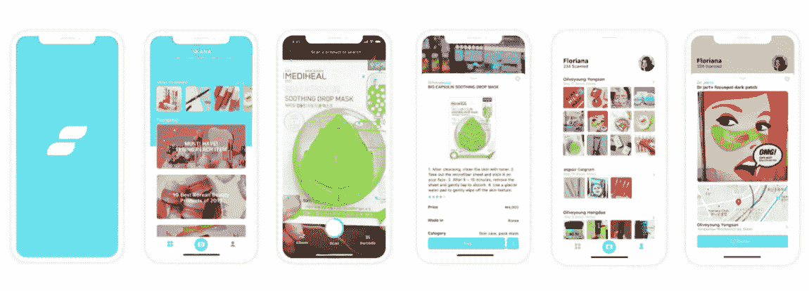
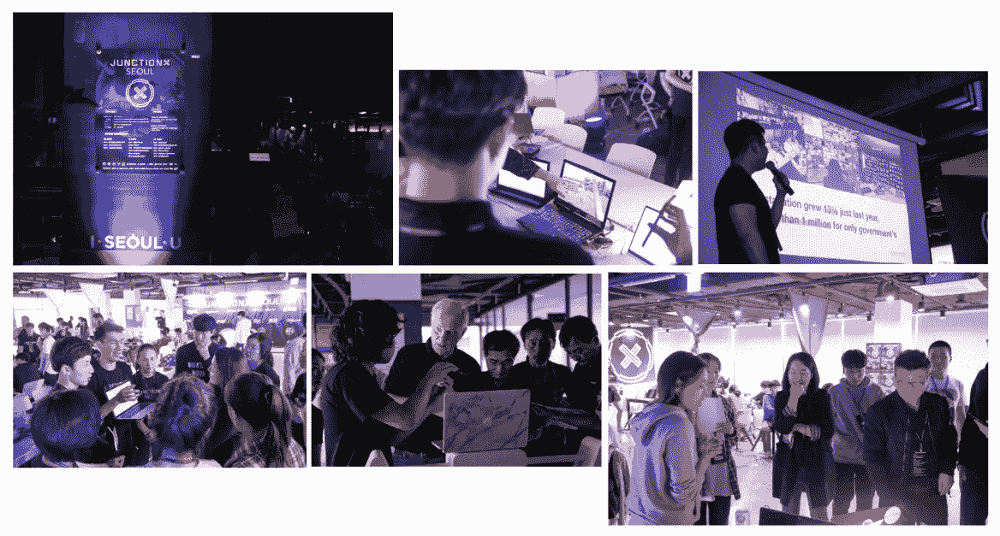
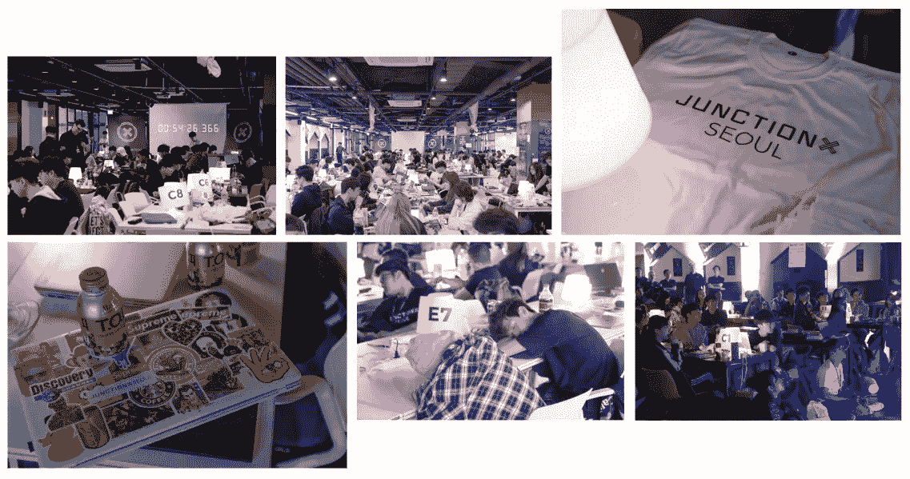

# 黑客马拉松！和我一起准备🤓😎

> 原文：<https://towardsdatascience.com/hackathon-get-ready-with-me-3192c7690cb7?source=collection_archive---------13----------------------->

## 尤其是对于一个有抱负的数据科学家来说

黑客马拉松是一项竞赛，包括程序员、开发人员和图形设计师在内的各种人在短时间内合作设计软件项目。黑客马拉松的目标是在活动结束时创造一个功能产品。

上个月，我有机会参加由 Junction Ltd .举办的 [JunctionX Seoul](https://seoul.hackjunction.com/) Hackathon。我们的团队开发了一个 iOS 应用程序，通过图像搜索引擎为韩国美容产品带来了优化的购物服务体验。该应用程序可以帮助那些想探索韩国美容产品，但由于明显的语言障碍而不知道该尝试什么的旅行者。用户只需扫描产品就能找到有用的数据，这些信息会被翻译成当地语言。还有一个搜索历史页面，可用于进一步定制服务。你可以在这里找到更多关于**的信息。**

****

**The app, [Skana](https://drive.google.com/open?id=1NZ7DESxk2QWhWprcv5n5ZWlmr8x5J4DI)**

**然而，我不想谈论我做了什么，我想分享我在这个过程中学到的东西。所以今天，我要谈谈你应该申请参加黑客马拉松的 4 个原因(尤其是如果你是一名有抱负的数据科学家)，你应该如何准备以及我的一些建议。我希望这篇文章能激励你像我一样走出自己的舒适区，获得一些深刻的启发。**

# **1.为什么是黑客马拉松**

**如果你之前没有尝试过黑客马拉松或者编程比赛，说你问我是否值得一试，我会毫不犹豫的点头。以下是你应该参加黑客马拉松的 4 个理由。**

## **超越“建模”**

**我们，数据科学学习者，倾向于单独工作或单独学习。我们倾向于将大部分时间投入到数据预处理和搜索中。而我们把大部分精力都倾注在研究机器学习或者深度学习算法上。我们的项目通常从导入数据开始(或者有时我们自己构建数据),以评估预测结束。**

**可悲的是，世界上几乎所有现实世界的项目都不是这样的。我们不是单独行动的。我们和其他团队成员一起工作。从数据库到部署和产品管理，所有的过程都应该通过协作来完成。拥有超越“建模”领域的工具包对有志之士来说是一大优势。(许多文章都指出了这一点，你也可以在这里找到一个**)现在重要的问题是，我们在哪里可以学习和体验这一点？****

****“U[*n 像比赛，没人给你两个。csv 文件称为培训和测试和一个很好的书面评估指标。几乎 80%的工作都花在了定义问题、获取和处理数据上。剩下的 20%的精力用于纯粹的建模和部署。”*](https://www.analyticsvidhya.com/blog/2019/05/exclusive-interview-sonny-laskar-kaggle-master-analytics-vidhya-hackathon-expert/?utm_source=feedburner&utm_medium=email&utm_campaign=Feed%3A+AnalyticsVidhya+%28Analytics+Vidhya%29)****

****黑客马拉松可以是一个与他人合作并进行真实项目的好机会。虽然有一些限制，但你仍然可以学习如何与他人交流(他们不像你一样有很多机器学习方面的知识)，并了解发布实际产品的整体工作流程。如果你有机会和一个在机器学习方面比你懂得更多的人在一起，我相信这也是一个挑战你极限的好时机。****

## ****商业思维比你想象的更重要****

****这个项目的第一步将是决定建造什么。而且我可以说一半的胜算都是在这里决定的。你应该有个好的开始。实施也是一个关键点，但业务价值起着重要作用。如果它被忽视了，你的工作只能是炫耀你的技术能力。****

****"L [*ikewise，数据科学家是被雇佣来创造商业价值的，而不仅仅是建立模型。问问你自己:我的工作成果将如何影响公司的决策？我要怎么做才能让这种效果最大化？凭借这种创业精神，第三次浪潮数据科学家不仅能产生可操作的见解，还能寻求带来真正的变化。”*](/the-third-wave-data-scientist-1421df7433c9)****

****你会看到很多人已经指出了商业思维的重要性。发现用户隐藏的需求，观察市场中的一个问题。用你的技术知识提出解决方案。开发一项可以盈利的服务。在黑客马拉松上，你被要求带着这个观点进行深入的思考和讨论。****

****我听说过一个家伙赢得了超过 15 次的编程比赛。在赢得谷歌的一场比赛后，他退出了自己的“猎奖”生涯。你知道他的秘密是什么吗？这只是商业意识和一点点智慧。通过制造一个聪明而有创意的产品，他让人们大喊“太棒了！”这肯定会在面板上留下印象。因此，如果你正在寻找一个额外的获胜秘诀，拥有一些机智的商业价值观会是一个很好的奖励。****

## ****处理极端压力的绝佳机会****

****黑客马拉松的目标是在短时间内(通常是 2 到 3 天)创造一个功能产品。在这些日子里，你被要求展示你的产品的原型或演示。都是时间有限，资源有限，精力有限的问题。有时，你可能会遇到事情出错的情况，你必须立即找到解决方案。有时候你必须优先考虑你的工作，这意味着什么先来，什么时候停下来。你会感受到完成所有任务和不成为团队负担的巨大压力。和久而久之，变得完全饥饿和疲惫是不可避免的！(更像是能量耗尽或耗尽，直到最终“入睡”)。****

****如果你和我一样，在极度紧张的时刻会冻僵，你甚至会被比赛大厅的空气淹没。这是我第一次参加黑客马拉松，所以我经历了几次大脑瘫痪。我不得不呼吸一些新鲜空气，放松一下来缓解紧张。但这也成为我学习如何应对压力的一个好机会。因为在工作场所不可避免地会遇到一些意想不到的问题，我们必须处理好这些棘手的问题。****

## ****“你好，世界”的实时性****

****认识新朋友也是一大乐事，尤其是如果是志同道合的人。在黑客马拉松上，你可以遇到来自不同地区、有不同专业但有相同兴趣的各种人。他们可以是网页开发人员、应用程序开发人员或设计师，但他们是愿意在周末开发一些很酷的东西的人。****

****我遇到了从俄罗斯来韩国参加这个活动的人。我还遇到了一位在韩国学习计算机科学的乌克兰女士。有来自丹麦、法国、中国和日本的人。认识新朋友本身就是一大乐事。但更重要的是，我可以听到他们有什么样的痛点，他们真正热衷的是什么。通过与其他参与者聊天，我可以在编程方面开阔眼界。这就是为什么我认为你应该尝试一个主题丰富的黑客马拉松，而不是专注于数据科学领域。****

****此外，关心别人做什么也是件好事。尽管你会忙得没有时间去额外照顾别人，但这将帮助你理解我上面提到的整个过程。不管怎样，我们是来学习新东西的！****

********

****Photos by [JunctionXSeoul](https://seoul.hackjunction.com/) and Me giving a presentation (on the right bottom)****

# ****2.如何准备****

****那么，现在黑客马拉松听起来值得一试吗？如果是这样，那么你的下一个问题可能是你应该如何准备。实际上，没什么。只管去做吧。不管你有什么技能，不要犹豫去申请。黑客马拉松不仅仅是专业人士的舞台。但是如果你想在这一天之前准备一些东西，那么我想列出一些我认为有用和适用的技巧。****

## ****后端和部署****

****这不是一个以导入数据开始，以一些评估图结束的项目。您需要根据您的团队项目收集数据并构建数据库。在您完成数据分析或建模部分后，您必须将您的模型传递给前端。或者你可能需要自己在网上发布你的作品。因此，在你的工具包中有数据库和 Flask 对于这个活动来说是一个巨大的资产。****

****如果你对数据库完全陌生，你可以从理解[*SQL 和*](https://medium.com/xplenty-blog/the-sql-vs-nosql-difference-mysql-vs-mongodb-32c9980e67b2)NoSQL 的区别开始学习。这里有一个针对初学者的简洁的 [*SQL 课程*](https://www.youtube.com/watch?v=xaWlS9HtWYw&list=PL-osiE80TeTsKOdPrKeSOp4rN3mza8VHN) 但是除此之外还有很多关于数据库的教程。所以去根据自己的口味挑选吧。****

****[Flask](http://flask.pocoo.org/) 是用 Python 编写的微框架，简单易学，对模型部署非常有用。这里有一个关于 [*如何用 Flask*](/deploying-keras-deep-learning-models-with-flask-5da4181436a2) 部署 Keras 深度学习模型的优秀教程，作者是[本·韦伯](https://medium.com/u/a80e1f69e782?source=post_page-----3192c7690cb7--------------------------------)。你也可以在这里找到烧瓶 的 [*系列视频课程。*](https://www.youtube.com/playlist?list=PL-osiE80TeTs4UjLw5MM6OjgkjFeUxCYH)****

## ****API 和云服务****

****每个黑客马拉松的条件可能不同，但我参加的那个高度依赖于 API 和云服务。有几个子轨道，参与者被要求使用特定的 API 来参与给定的轨道。但是除了这个条件之外，你还需要自己收集数据。你将从哪里获得数据？而用于训练的计算能力呢？你可能会把装有 GPU 的“超级计算机”留在家里。****

****因此，最好有从 API 获取数据并以 JSON 格式处理数据的经验。如果你是 API 新手， [*这篇文章*](/what-is-api-and-how-to-use-youtube-api-65525744f520?source=friends_link&sk=eedcecef15f918954df8ff6fbec0334a) 可以向你解释 API 是怎么一回事。****

****能够使用像 AWS 或谷歌云 GPU 的云服务也是必要的。这里是 AWS EC2 的官方指南 [*但是这里是 AI 学院的*](https://aws.amazon.com/ec2/getting-started/) *[*一个友好的视频*](https://www.notion.so/Junction-X-Seoul-9320fbe9fee94e0aac0b705bbbd7e17f) 。你还可以找到[*更详细的初学者教程*](https://www.datacamp.com/community/tutorials/aws-ec2-beginner-tutorial) 作者[迈克尔·加拉内克](https://medium.com/u/c07aac64b6e1?source=post_page-----3192c7690cb7--------------------------------)。*****

## ****充满能量的你****

****睡眠充足。控制你的状况。这不是开玩笑。比赛期间，我总共睡了 4 个小时。睡得少可能是一个好策略，但你需要在进入大厅时保持良好的状态。此外，一个颈枕和一条用来小睡的毯子可以和“烧瓶”或“AWS”一样有用。😂😂****

********

****Photos by [JunctionXSeoul](https://seoul.hackjunction.com/)****

# ****3.我最后的小建议****

****最后，这里是我的一些小技巧。****

## ****如何组建你的团队****

****如果你是一个人申请，你必须从底层建立你的团队。可以有一个像 Slack 这样的社交网络平台，你可以从其他申请人那里获得信息，并在活动开始前组建一个团队。你可能有机会加入一个有空缺的预制团队。****

****如果你有一个关于你想开发什么的想法，把它分成几个部分，然后寻找能承担每个部分的成员。你需要找到一个与我们技能不同的人(比如数据建模)。你需要具备的成员通常是后端工程师、web/app 开发者和 UI/UX 设计师。****

## ****诚实面对你能做的事情****

****你可能认为你的能力不足以做这件事。所以你可能想隐藏你的水平或者假装比你知道的更多。但是你真的不需要。黑客马拉松对所有人开放。不管你对编程了解多少，总有一部分只能由你来填补！旁边的人比你懂得多吗？厉害！你有更多的机会学习。寻求帮助是“帮助”你的团队的更好方式，而不是独自奋斗，浪费宝贵的时间。****

## ****享受，享受，享受！****

****不仅仅是赢。虽然你应该在这段时间里尽你所能，但不要失去你脸上的笑容。享受学习的时间，结识新朋友，和他们一起工作。享受创造和开发世界上不存在的新事物的时间。享受压力和超越极限的时光。要求会非常高。然而，在活动结束时，即使你没有获奖，你也会带着新的想法和教训回家。你会发现自己像我一样期待着下一次黑客马拉松。😉****

****这个故事引起你的共鸣了吗？请与我们分享您的见解。我总是乐于交谈，所以请在下面留下评论，分享你的想法。我还在 [**LinkedIn**](https://www.linkedin.com/in/jiwon-jeong/) 上分享有趣和有用的资源，所以请随时关注并联系我。下次我会带来另一个有趣的故事。一如既往，敬请期待！****