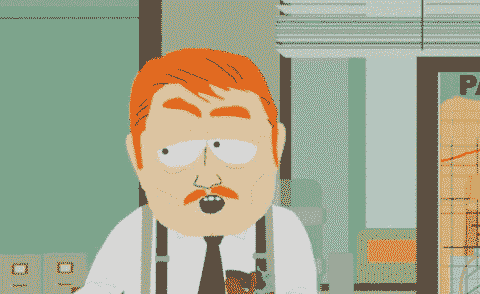
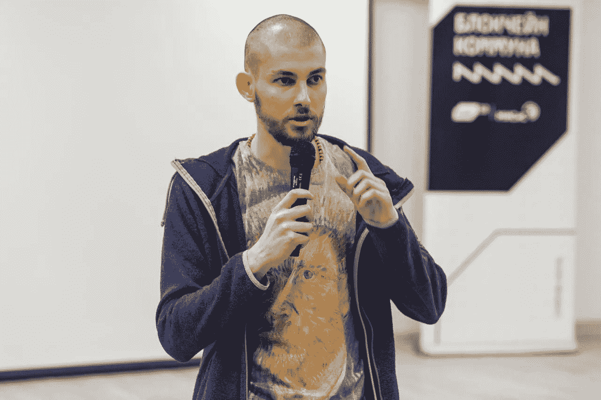
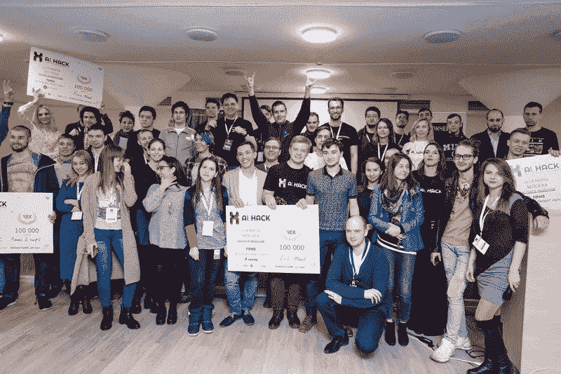

# 黑客马拉松故事

> 原文：<https://towardsdatascience.com/hackathon-story-fa2aed2cf4c2?source=collection_archive---------28----------------------->

我受邀在俄罗斯最大的数据科学和机器学习会议 [DataFest 6](https://datafest.ru/) 上讲述我在数据科学黑客马拉松中的经历。我决定讨论组织此类活动时常见的错误以及如何避免它们。我的演讲录音[最近发表了](https://youtu.be/aNBtteJFdZ8)(俄语演讲，有英语字幕)。我注意到了视频的如下评论(从俄语翻译过来):

> 这个家伙找到我们，建议我们合并解决方案，然后平分奖金。我们拒绝了，然后他赢了，我们没有\_(ツ)_/

其实这背后有一个很酷的故事。

# 故事

这次黑客马拉松是在莫斯科举行的，之前由同一组织者在圣彼得堡成功举办了几次，我是远程参与者(当时我在芬兰学习)。像往常一样，这次它被允许从另一个城市参加，但我决定下线。

它开始于周五晚上，截止日期定在周日中午。“Moscow AI Hack”的总奖金池约为 6k 美元，以下每条赛道的冠军可获得 15k 美元奖金:

*   预测俄罗斯各地区汽油价格(时序表格数据，Gazprom 的 Kaggle 竞争)；
*   用表格数据和汽车图片预测特定汽车对给定用户的“适用性”(莫斯科初创公司 True North 举办的 Kaggle 竞赛)；
*   检测 Gazprom 横幅中的错误和“异常”(计算机视觉任务；没有提供明确的指标，尽管数据集包含大量高分辨率照片)；
*   最佳商业解决方案(开放式课程，前提是必须使用数据集才有资格获奖)。

在浏览了所有数据集并仔细阅读了所有任务后，我决定专注于第二个——来自正北的轨迹。我在周五创建了一个基线解决方案，回家后花了一整天设计新功能，训练不同的模型，并在周六远程调整它们的超参数。一天下来，我完全筋疲力尽，没有主意了。不过，我在 26 支队伍中名列前三。

前三名的所有三支队伍都是单人参赛。我和第二个家伙只差几分，而第一名的参与者不知何故得到了比其他任何人都好得多的分数。鉴于“赢家通吃”的政策，我知道我没有机会独自赢得它，因为分数的差距，时间的缺乏，以及竞争的动态。策略很简单:我应该和排行榜首位的人合并；如果我们的解决方案足够多样化，这样的合并将提高我们的共同得分。

我问排在第二位的那个人，他是否愿意合作，整合我们的解决方案。他想了一会儿，然后回答说他第二天会给我答案。我去睡觉，第二天早上我看到 top1 和 top2 已经合并成一个团队。

我获胜的机会大大减少了。这有点令人沮丧，但我不想放弃，现在还不想。我不得不另找一支队伍。

我去黑客马拉松的地方找人合作。我向前十名中的几乎所有人提议合并我们的团队并分享奖金，但没有人同意。回想起来，我认为这可能有多种原因:部分原因是最后期限越来越近，他们失去了获胜的希望；部分原因是分成比例(无论团队大小，奖金的 50%归我，50%归他们团队)对他们来说似乎不公平(但实际上，这非常公平)；部分原因是我看起来不像一个有经验的数据科学家，所以也许他们认为我只是一个普通人(黑客马拉松上有很多这样的人)；也许我不够有说服力；也许他们在等待排行榜的大变动；也许原因在于“未知的未知”。不管怎样，这没关系。

That’s what I looked like at that time. It was hard to believe that such a guy could be an experienced Data Scientist (even for me, even right now)

当我意识到我没有机会获胜的时候，一位来自 True North 的高级数据科学家来到了我工作的地方。我们讨论了任务、排行榜、方法和其他东西。我们聊得很愉快，当时我问他，他们将如何通过这种模式赚钱？经过一番讨论后，发现任务的目标并不是最优的，也就是说，他们做了一个回归任务，但实际上，他们需要某种推荐。此外，预测的目标没有选对。

我提出了另一个管道，这可以提高其中一个流程的效率。我们讨论了要做的实验的设置、度量标准、成功的衡量标准以及其他一些东西。我看得出他非常喜欢我的思维方式，我喜欢他喜欢这一点。

我尽可能快地运行了我们讨论的所有实验——大约花了我一个小时。截止日期前 15 分钟，我开始准备演示文稿。我勉强在时间结束前完成了它。在做那个演讲的时候，我很紧张，因为我的演示设计并不完美。然而，我成功地克服了这一点，因为我牢记，尽管我的幻灯片并不漂亮，但它们对公司是有价值的。

最终，我没有赢得 Kaggle 比赛(我获得了第 3 名)，但我的解决方案被评为“最佳商业解决方案”，我赢得了“开放解决方案”赛道。我也收到了面试的邀请。在两周内，我作为真北的数据科学家继续这个项目。

回首过去总是很有趣。

如果那天有人同意和我合并，我们会在 Kaggle 比赛中获得第二或第三名。我不会赢，也不会得到我的第一份工作。事实上，我很幸运被每个人拒绝。接下来的事件对我来说会有所不同，但毫无疑问无论如何都会很酷。