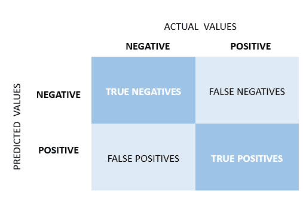
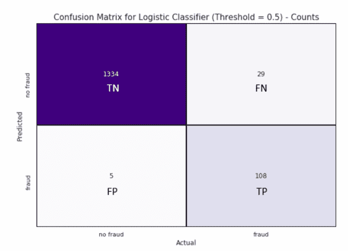
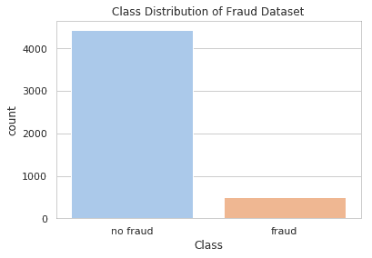
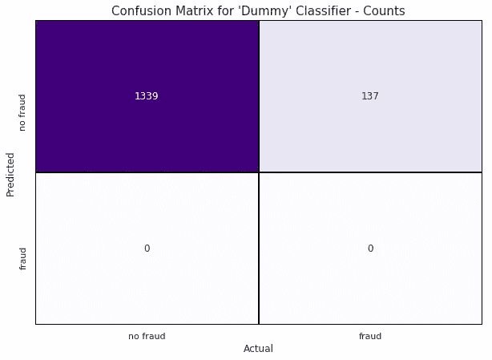
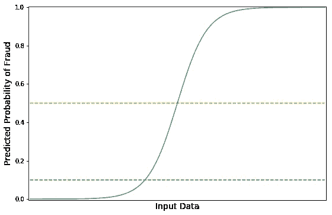
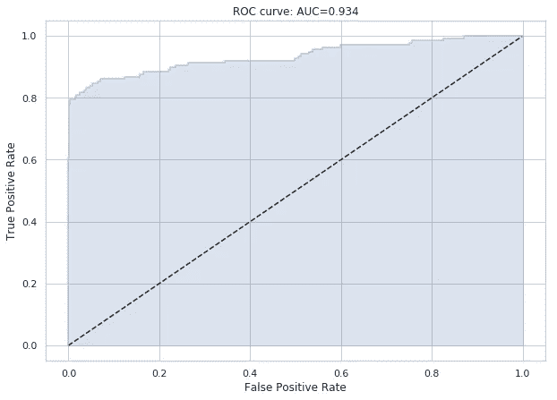
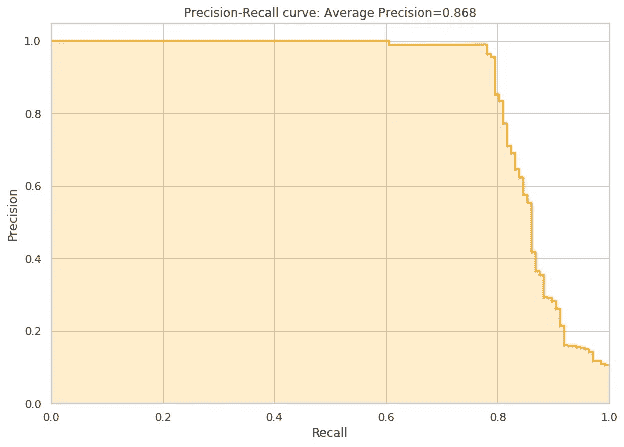
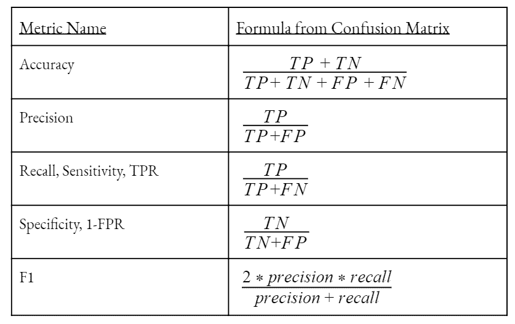

# 评估分类模型

> 原文：<https://towardsdatascience.com/hackcvilleds-4636c6c1ba53?source=collection_archive---------12----------------------->

## 在 Python 中使用 Sci-Kit Learn 的引导式演练

作者:Ishaan Dey，Evan Heitman，& Jagerynn T. Verano

# 分类介绍

医生想知道他的病人是否有病。信用卡公司有兴趣确定某项交易是否是欺诈。一个研究生院的候选人感兴趣的是她是否有可能被她的项目录取。许多应用模型对预测二元事件的结果感兴趣，二元事件是可以通过简单的是或否问题来回答的任何事件。这被称为二元分类问题，不同于多类分类，在多类分类中，我们感兴趣的是预测某个人会患哪种疾病*，或者某个顾客会从选择中购买哪种*产品*。*

**概述**

回归模型通常会报告熟悉的指标，如 R2，以显示拟合优度，或模型与数据的吻合程度。对于离散的结果，我们不能应用相同的公式，因此在这篇文章中，我们将通过分解模型可能出错的错误类型和可以总结模型按照我们的预期执行的能力的定量测量，来研究如何评估分类器模型的性能。

在本文中，我们使用信用卡交易数据集，目标是标记欺诈交易(二元结果，1 表示欺诈)。鉴于欺诈发生率较低，该数据集被欠采样，以创建一个 90:10 的非欺诈与欺诈观察值的新分布。该数据被进一步分割成 70:30 的序列以测试分割。我们拟合了一个逻辑回归模型，并使用 0.5 的阈值来预测欺诈值。您可以使用下面链接的交互式 python 笔记本来跟进。

> [https://github . com/is handey/Classification _ Evaluation _ walk through](https://github.com/ishaandey/Classification_Evaluation_Walkthrough)

# 基础知识:混淆矩阵



Confusion Matrix from a Binary Classification Model

对于任何包含二元结果的数据集，我们可以用 1(表示事件的发生)或 0(事件的不存在)来标记所有的观察值。我们可以将模型拟合到特征变量，并在给定特征变量集的情况下对每个观察值进行预测。被模型正确分类的值被标记为真(T)，而不正确的预测为假(F)。正(P)和负(N)指的是模型的预测，而不是实际的观察值。例如，一个负值被错误地归类为正值，就称为假阳性。

作为题外话，许多读者将熟悉分别作为α和β的假阳性和假阴性。假阳性用α表示，而假阴性用β表示。因此，当我们建议统计的概率小于 0.05 的α时，我们说错误地将结果标记为显著的概率是 0.05。

我们的模型，用下面的函数产生，产生了下面的混淆矩阵。



Confusion Matrix from Logistic Regression Classifier (Threshold = 0.5)

```
confusion_matrix(y_test, y_pred)
```

# 准确性有什么问题？

假设我们遇到了一种用于检测癌症的诊断工具，该工具可以以 99.8%的*准确率*正确预测结果。这真的令人印象深刻吗？据 CDC 估计，一般人群的癌症死亡率约为 0.16%。如果我们制作一个虚拟模型，并说不管我们可获得的特征信息如何，每一个结果都应被归类为负面情况，我们将以 99.84%的准确率执行，因为我们样本中 99.84%的观察结果都是负面的。我们可能会错过对每一个癌症患者的诊断，但我们仍然可以如实地报告，我们的模型具有 99.84%的准确率。显然，一个好的模型应该能够*区分*什么是阳性案例，什么不是阳性案例。

从更专业的角度来说，准确性的值可以很容易地从混淆矩阵中获得，因为真阳性和真阴性的数量除以测试的观察总数。简单来说，就是观察值被正确分类的比例。

> 准确度= (TP + TN) / (TP + TN + FP + FN)

回顾我们的欺诈检测数据，我们的逻辑回归模型预测准确率为 97.7%。但是这比虚拟分类器好多少呢？让我们看看结果的实际分布。



Target Class Distribution of Full Dataset

```
sns.countplot(x=fraud['Class'])
```

在这里，阶级不平衡，或者说结果的倾斜分布是显而易见的。使用快速检查。value_counts()函数显示，我们的数据中有 137 个欺诈案例，1339 个非欺诈案例，这意味着我们的测试案例中有 9.3%是欺诈的。如果我们要应用一个虚拟模型，盲目地预测所有的观察结果为非欺诈案例，就像可以用 sklearn.dummy 包完成的那样，我们可以看到我们报告的 90.7%的准确性与我们的频率分布(90.7:9.3)相匹配。因此，即使我们的虚拟模型毫无用处，我们仍然可以报告它的执行准确率达到 90%。下面的混淆矩阵进一步显示了这种无法区分的细节。

```
y_test.value_counts() / len(y_test)
dum = DummyClassifier(strategy='most_frequent')
```



Confusion Matrix from Dummy Classifier

# 我们可以用什么措施来代替呢？

使用混淆矩阵的最大好处是，我们可以很容易地得出各种其他值，这些值反映了我们的模型相对于我们对虚拟模型的预期运行得有多好。

**敏感度(或回忆，或真阳性率)**

正如我们在上面的例子中看到的，一个好的模型应该能够成功地检测到几乎所有的实际欺诈案件，因为没有发现欺诈案件的成本要比通过错误地暗示这是一个欺诈案件来审查一个非欺诈交易的成本高得多。敏感度，也称为回忆，量化了这种直觉，并反映了正确分类的阳性与实际阳性病例的比率。

> 灵敏度= TP / (TP + FN)

敏感性的解释相当简单。所有值的范围都在 0 到 1 之间，其中值 1 表示模型检测到了每一个欺诈案例，而值 0 表示没有检测到所有实际的欺诈案例。使用我们的逻辑回归模型，我们的灵敏度为 108 / 137 = 0.788。

**特异性**

特异性有助于我们确定在所有真正的非欺诈案例中，有多少被正确归类为非欺诈案例。假阳性率或假警报率与特异性相反。在我们的欺诈检测模型中，我们的特异性为 1334/1339 = 0.996

> 特异性= TN / (TN + FP)
> 
> 假阳性率= 1 —特异性

在这种特殊情况下，特异性是一个不太相关的指标，因为将非欺诈案件归类为欺诈案件的成本低于完全遗漏欺诈案件的成本。但是在有些情况下，错误警报同样是不可取的，例如在疾病检测中，误诊会导致不必要的后续程序。

**精度**

另一方面，我们可能想要测试我们预测的确定性，例如，我们可能对我们的模型所发现的欺诈案例中有多少是真正的欺诈案例感兴趣。Precision 就是这样做的，它提供了真实阳性相对于预测阳性的比例。直觉上，低精度意味着我们让很多客户头疼，因为我们对欺诈交易的分类多于实际欺诈交易。使用逻辑回归模型，我们的精度是 108/113 = 0.956

> 精度= TP / (TP + FP)

# 我们应该最大化特异性还是敏感性？

在我们的欺诈数据集中，更重要的是我们要最大限度地减少未被发现的欺诈案件的数量，即使这样做的代价是将非欺诈案件错误地归类为欺诈案件，因为前一个案件给公司带来的成本要高得多(潜在的数千美元的收入损失或客户验证其交易的几分钟时间)。换句话说，我们宁愿犯第一类错误，也不愿犯第二类错误。尽管我们更倾向于最大化敏感性和特异性的模型，我们更倾向于最大化敏感性的模型，因为它最小化了 II 型错误的发生。

**F1 比分**

最后但同样重要的是，F1 分数总结了精确度和召回率，并且可以被理解为这两个度量的调和平均值。f 1 值为 1 表示完美的精确度和召回率，因此 F1 值越高，模型越好。我们的逻辑模型显示 F1 值为 0.864。

> F1 = 2 *(精度*灵敏度)/(精度+灵敏度)

# 当我们改变概率截止值时会发生什么？

我们到底是如何得出我们的预测的？从我们的逻辑回归，我们计算出一个给定的观察是欺诈性的预测概率落在 0 到 1 之间。我们说，所有大于 0.5 的概率都应该表示欺诈预测，而所有小于 0.5 的值都返回合法交易的预测。

但是考虑到我们更愿意犯第一类错误，即使只有很小的可能性，把一个案例归类为欺诈不是更好吗？换句话说，如果我们降低区分欺诈和非欺诈的门槛，让我们抓住更多的欺诈，从橙色线转移到绿色线，会怎么样？



Orange = Discrimination Threshold of 0.5; Green = Discrimination Threshold of 0.1

根据我们之前讨论的定义，模型的特异性会增加，因为我们现在分类了更多的阳性，但同时，我们增加了将非欺诈案件错误地标记为欺诈的可能性，从而随着假阴性数量的增加而降低了灵敏度。这是一个不断的权衡，灵敏度从降低特异性增加的速率是每个模型特有的属性。

到目前为止，我们报告的指标来自于以 0.5 为阈值计算的混淆矩阵(橙色线)，但是如果我们将区分阈值降低到 0.1(绿线)，灵敏度将从 0.788 增加到 0.883，而特异性将从 0.996 下降到 0.823。

```
classification_report(y_test, y_pred)
```

**ROC 曲线**

我们可以使用受试者操作特征或 ROC 曲线来查看所有阈值下这些值的变化，ROC 曲线绘制了每个阈值的真阳性率对假阳性率，或灵敏度对 1 特异性。我们可以在这里看到我们的逻辑分类器的 ROC 曲线，其中不同的阈值应用于预测的概率，以产生不同的真阳性和假阳性率。

我们的虚拟模型是蓝色曲线上(0，0)处的一个点，在该点处，判别阈值使得任何小于 1.0 的概率都被预测为非欺诈案例。这表明，尽管我们正确地分类了所有非欺诈案例，但我们错误地分类了所有非欺诈案例。另一方面，一个完美的区分模型将在曲线上的(0，1)处有一个点，这将表明我们的模型完美地分类了所有欺诈案件以及非欺诈案件。这两个模型的线将作为阈值水平的函数生成。



```
fpr, tpr, thresholds = roc_curve(y_test, y_pred_prob[:,1])
```

对角线显示了真阳性率与假阳性率相同的情况，其中正确检测欺诈案件和将非欺诈案件检测为欺诈案件的机会相等。这意味着任何高于对角线的 ROC 曲线都比预测结果的随机机会更好，假设 50/50 类平衡。

因此，我们将在该领域中遇到的所有 ROC 曲线将被绘制在 y=x 线之上，垂直向上到(0，1)，然后水平穿过(1，1)的线之下。我们可以通过观察曲线下面积或 AUC ROC 来量化 ROC 曲线的表现程度。该值将采用介于 0.5(对角线)和 1.0(完美模型)之间的值。我们的欺诈检测模型的 AUC ROC 为 0.934，对于开箱即用的模型来说还不错。

```
from sklearn.metrics import auc
auc = roc_auc_score(y_test,logis_pred_prob[:,1])
```

**PRC 曲线**

回到 logit 模型，当我们将辨别阈值从橙色转移到绿色时，精确度和召回率会发生什么变化？当我们从阈值 0.5 移动到 0.1 时，召回率从 0.788 增加到 0.883，因为正确检测到的欺诈在实际欺诈数量中的比例增加，而精确度从 0.956 下降到 0.338，因为真实欺诈案例在预测欺诈案例数量中的比例下降。正如我们对 ROC 曲线所做的那样，我们可以将精确度和召回率之间的权衡绘制为阈值的函数，并获得精确度-召回率曲线，或 PRC。



```
precision, recall, thresholds = precision_recall_curve(y_test, y_pred_prob[:,1])
```

通常，PRC 更适合在高度不平衡的数据集上训练的模型，因为 ROC 曲线的假阳性率公式中使用的高真负值会“夸大”模型表现如何的感觉。PRC 曲线避免了这个值，因此可以反映模型性能的偏差较小的度量。

我们可以使用平均精度值或平均 F1 分数(每个阈值的平均值)来简洁地总结这条曲线，理想值接近 1。

```
from sklearn.metrics import f1_score
from sklearn.metrics import average_precision_scoref1 = f1_score(y_test, y_pred_prob)
ap = average_precision_score(y_test, y_pred_prob)
```

# 离别的思绪

**公式快速回顾:**



TPR = True Positive Rate; FPR = False Positive Rate

在这篇文章中，我们讨论了如何超越精度来衡量二元分类器的性能。我们讨论了灵敏度、特异性、精确度和召回率。我们研究了当我们改变决策阈值时会发生什么，以及我们如何可视化灵敏度和特异性之间的权衡，以及精确度和召回率之间的权衡。提醒一下，所有生成的可视化和模型都可以在交互式 python 笔记本上找到，链接如下。

> [https://github . com/is handey/class ification _ Evaluation _ walk through](https://github.com/ishaandey/Classification_Evaluation_Walkthrough)

这个帖子到此为止。如果您有任何问题，请告诉我们！