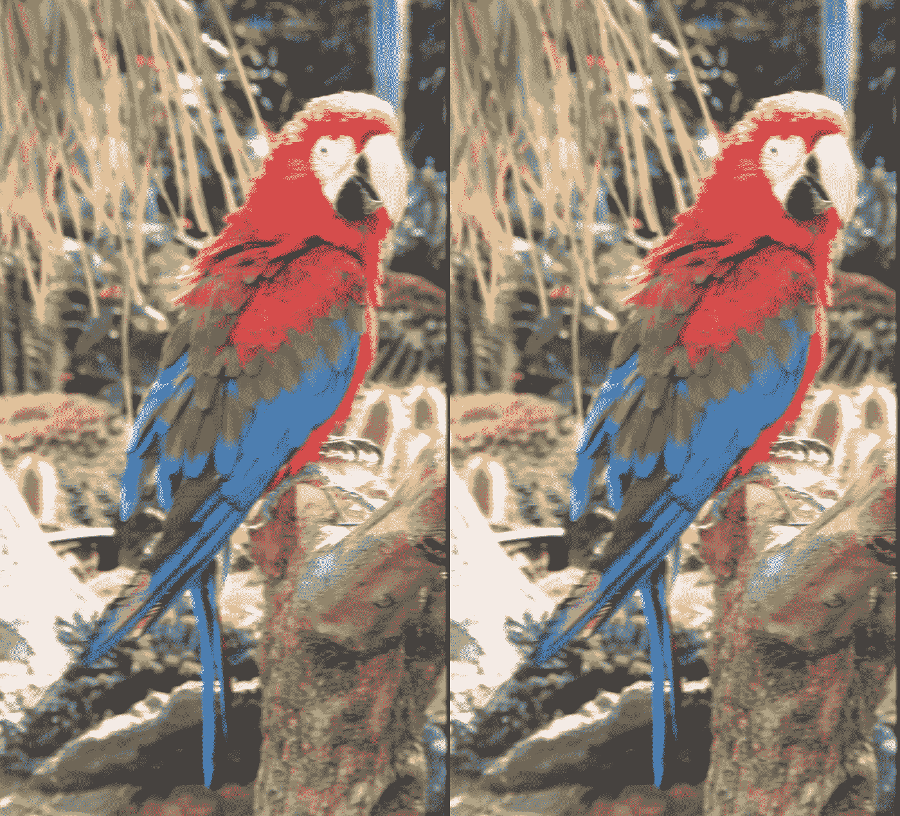

# 黑客谷歌珊瑚边缘 TPU:运动模糊和 Lanczos 调整大小

> 原文：<https://towardsdatascience.com/hacking-google-coral-edge-tpu-motion-blur-and-lanczos-resize-9b60ebfaa552?source=collection_archive---------9----------------------->

谷歌的珊瑚项目[最近已经停止测试](https://developers.googleblog.com/2019/10/coral-moves-out-of-beta.html)。根据基准测试，Coral 设备为 DIY 创客提供了出色的神经网络推理加速。这些设备基于专门的张量处理单元 ASIC (Edge TPU)，这被证明是有点棘手的工作，但强制限制和怪癖是值得的。我渴望探索 TensorFlow 和 Edge TPU 之间互操作的深层内部机制，并对两者进行破解，以做一些很酷的、非标准的、疯狂的事情。


以下期望你熟悉张量流和边缘 TPU 基础知识。官方文档很好，所以通过查看边缘 TPU 和边缘 TPU 编译器 上的 [*TensorFlow 模型应该足以继续。重复我的实验需要 Ubuntu Linux 和一个外部 Coral USB 加速器。*](https://coral.withgoogle.com/docs/edgetpu/models-intro/)

首先，Edge TPU 软件不是完全开源的。最“美味”的部分、`edgetpu_compiler`可执行文件和`libedgetpu.so`共享库是专有的。这一事实增加了潜在的黑客复杂性，但也使它更有趣！例如，查看哪些 API 被`libedgetpu.so`公开的唯一方法是用`objdump`转储导出的符号:

```
$ objdump -TCj .text /usr/lib/x86_64-linux-gnu/libedgetpu.so.1/usr/lib/x86_64-linux-gnu/libedgetpu.so.1:     file format elf64-x86-64DYNAMIC SYMBOL TABLE:
000000000006baa0 g    DF .text 000000000000000d  VER_1.0     edgetpu::RegisterCustomOp()
0000000000072b40 g    DF .text 000000000000001f  VER_1.0     edgetpu::EdgeTpuContext::~EdgeTpuContext()
0000000000072ad0 g    DF .text 0000000000000006  VER_1.0     edgetpu::EdgeTpuContext::~EdgeTpuContext()
0000000000072ad0 g    DF .text 0000000000000006  VER_1.0     edgetpu::EdgeTpuContext::~EdgeTpuContext()
000000000006dc10 g    DF .text 000000000000000a  VER_1.0     tflite_plugin_destroy_delegate
000000000006be50 g    DF .text 00000000000001dd  VER_1.0     edgetpu_list_devices
000000000006bb80 g    DF .text 0000000000000107  VER_1.0     edgetpu_version
000000000006bab0 g    DF .text 000000000000000a  VER_1.0     edgetpu::EdgeTpuManager::GetSingleton()
000000000006d090 g    DF .text 0000000000000b7c  VER_1.0     tflite_plugin_create_delegate
000000000006bb20 g    DF .text 0000000000000012  VER_1.0     edgetpu_free_devices
000000000006bac0 g    DF .text 000000000000005e  VER_1.0     edgetpu::operator<<(std::ostream&, edgetpu::DeviceType)
000000000006c030 g    DF .text 0000000000000c1a  VER_1.0     edgetpu_create_delegate
000000000006bb40 g    DF .text 000000000000000a  VER_1.0     edgetpu_free_delegate
000000000006bb50 g    DF .text 0000000000000024  VER_1.0     edgetpu_verbosity
```

该输出明确暗示 Edge TPU API 是用又长又粗的钉子钉在 TensorFlow Lite 上的。根本不可能以任何其他方式使用该设备。如果你期望看到像“将这个矩阵乘以 TPU 边缘的那个向量”这样的低级 API，那就不走运了。

让我们快速回顾一下面向 Edge TPU 的 TensorFlow Lite API 是如何工作的:

1.  使用常规张量流生成计算图。比如训练一个深度神经网络。
2.  将其转换为 TensorFlow Lite 格式，这是 [flatbuffers](https://google.github.io/flatbuffers/) 而不是 protobuf，并且具有不同的模式。新图必须是特殊的，使 TPU 边缘的朋友。值得注意的是，包含的操作(ops)必须[量化为](https://www.tensorflow.org/lite/performance/quantization_spec) `[uint8](https://www.tensorflow.org/lite/performance/quantization_spec)`，因为边缘 TPU 只能处理无符号字节。
3.  交叉手指再转换一次，这次用`edgetpu_compiler`。底层格式保持不变，但是[支持的操作](https://coral.withgoogle.com/docs/edgetpu/models-intro/#supported-operations)被融合并编译成一个神奇的 Edge TPU 块。
4.  确保 Coral 设备已连接，[使用 Edge TPU 操作代理创建一个新的 TensorFlow Lite 解释器，并调用](https://coral.withgoogle.com/docs/edgetpu/tflite-python/)。

因此，如果不调用外部程序并随时读写文件，在 Edge TPU 上运行任意计算是不可能的。

这个多步骤过程中的关键细节是可以为 Edge TPU 编译的操作列表。TensorFlow Lite 不支持它的哥哥的所有功能，Edge TPU 只支持剩下的一小部分。比如没有矩阵乘法(惊喜！我根据经验检查了*“输出张量是一维的”*完全连通)。这些限制使得除了卷积和全连接神经网络之外的边缘 TPU 推理变得非常困难。但并非不可能。这就是《邮报》变得有趣的地方。

# 边缘 TPU 上的运动模糊

运动模糊效果是图像与“半径”内核的 2D 卷积的结果。


Horizontal motion blur. Left: original photo. Right: photo after applying the effect. Source: [Wikipedia](https://commons.wikimedia.org/wiki/File:Red_Macaw_2_(3312518394).jpg).

在张量流术语中，该操作被称为 DepthwiseConv2d，它被广泛用于深度卷积神经网络中，并得到边缘 TPU 的支持。图像像素可以用 RGB 格式表示，每个通道一个字节——这正是 Edge TPU 所需要的。让我们穿越所有的坑和危险，并基准如何快速运动模糊图像过滤边缘 TPU 与 Python！

## 0 →传递函数

在本节中，忘记 TensorFlow Lite 和 Edge TPU 的存在。让我们熟悉一下主要的逻辑。以下代码创建卷积内核。`dim`是尺寸，`angle`是平面上的运动角度，单位为弧度。

当涉及到肮脏的视觉效果时，它总是很方便。


下一步是用常规的 TensorFlow 2.0 测试我们的运动模糊效果。我们利用`[tf.nn.depthwise_conv2d](https://www.tensorflow.org/api_docs/python/tf/nn/depthwise_conv2d)`来计算图像与内核的 2D 卷积。所有步幅都等于 1，因此图像尺寸不会改变。

在 Jupyter 中，人们可以使用`%timeit motion_blur(images)`快速测量运动模糊性能。在我的 4x2(HT)英特尔 i7–8565 u CPU 上，它产生了大约 5.30 秒±0.09 秒的结果。

## tf.function → tflite

既然我们已经确定了整体方法是可行的，那么是时候将其移植到 TensorFlow Lite 了。

我们必须在`create_motion_blur_func`中指定`tf.function`的输入签名，因为 TensorFlow Lite 目前不允许除第一个“批处理”维度之外的可变形状。因此，我们的运动模糊只能处理相同大小的图像。

`create_motion_blur_func_lite`是围绕`create_motion_blur_func`的包装器，将后者转换为 TensorFlow Lite。`generate_lite_model`从属于`tf.function`的计算图中初始化`tf.lite.TFLiteConverter`——我们的运动模糊算法——并将转换结果写入磁盘。`create_func_lite`加载它，设置一个新的`tf.lite.Interpreter`并返回调用闭包。

根据`%timeit`，新的实现速度更快:3.50 秒 0.24 秒对 5.3 秒。这种性能提升令人惊讶，因为根据系统监视器，执行只利用了我的八个 CPU 核心中的一个。我们可以想象结果。带`[netron](https://github.com/lutzroeder/netron)`的 tflite 型号:


TensorFlow Lite motion blur graph visualized with [**netron**](https://github.com/lutzroeder/netron).

## tflite →边缘 TPU

最后，我们需要从香草 TensorFlow Lite 过渡到边缘 TPU。这一步是迄今为止最棘手和最复杂的。我们将继续在现有代码的基础上构建，一次添加一个特性。

边缘 TPU 需要`uint8`操作数据类型(dtype)而不是`float32`。不幸的是，我们不能让`tf.nn.depthwise_conv2d`直接与`uint8`一起工作:只支持`float64`、`float32`、`bfloat16`和`float16`。因此，我们不得不求助于“训练后量化”，这意味着伪造数据类型并给所有运算增加量化属性。`gen_input_samples`模拟从 0 到 255 的像素值范围，这就是 TensorFlow Lite 中量化参数化的方式。我们进一步调用量化模型上的`edgetpu_compiler`来用边缘 TPU 的优化代码替换 2D 卷积 op。`tf.lite.Interpreter`必须增加`experimental_delegates=[load_delegate("libedgetpu.so.1.0")]`以让它知道如何处理优化的边缘 TPU 运算

在`edgetpu_compiler`支持 TensorFlow 2.0 的理想世界中，上面的代码应该可以工作。让我们运行代码看看。

```
Edge TPU Compiler version 2.0.267685300Model compiled successfully in 231 ms.Input model: motion_blur_1_1920_1058_3_25_1.57.tflite
Input size: 3.03KiB
Output model: motion_blur_1_1920_1058_3_25_1.57_edgetpu.tflite
Output size: 296.85KiB
On-chip memory available for caching model parameters: 1.73MiB
On-chip memory used for caching model parameters: 10.00KiB
Off-chip memory used for streaming uncached model parameters: 0.00B
Number of Edge TPU subgraphs: 1
Total number of operations: 3
Operation log: motion_blur_1_1920_1058_3_25_1.57_edgetpu.logModel successfully compiled but not all operations are supported by the Edge TPU. A percentage of the model will instead run on the CPU, which is slower. If possible, consider updating your model to use only operations supported by the Edge TPU. For details, visit g.co/coral/model-reqs.
Number of operations that will run on Edge TPU: 1
Number of operations that will run on CPU: 2Operator                       Count      StatusDEPTHWISE_CONV_2D              1          Mapped to Edge TPU
DEQUANTIZE                     1          Operation is working on an unsupported data type
QUANTIZE                       1          Operation is otherwise supported, but not mapped due to some unspecified limitation
```

`DEPTHWISE_CONV_2D`成功编译，但是有奇怪的`DEQUANTIZE`和`QUANTIZE`操作没有成功。它们是编译器不支持的 TensorFlow 2.0 工件，是从`motion_blur_func`签名中的强制`float32` dtype 产生的。`netron`可视化应该让一切都变得清晰。


Quantized TensorFlow Lite model (left) and compiled Edge TPU model (right) visualized with [**netron**](https://github.com/lutzroeder/netron).

因此，我们必须做四次多余的工作:

1.  将像素值从`uint8`切换到`float32`，将其传递给 TensorFlow Lite 引擎。
2.  TensorFlow Lite 执行`QUANTIZE`并切换回`uint8`
3.  计算完卷积后，我们返回到`DEQUANTIZE`中的`float32`。
4.  TensorFlow Lite 将控制权交还给调用者，我们转换到`uint8`以保存图像。

将原来的`QUANTIZE`和`DEQUANTIZE`去掉。tflite 将使模型再次变得伟大。不幸的是，要做到这一点并不容易。根本没有官方 API 来操作 TensorFlow Lite 模型。我们需要深入挖掘。

## 深入挖掘

我提到 TensorFlow Lite 模型格式是 [flatbuffers](https://google.github.io/flatbuffers) 。这是一种相对较新的通用序列化格式，我敢打赌它会在 Google 内部与 protobuf 竞争。flatbuffers 的 Python API 不允许修改现有文件，bummer。幸运的是，flatbuffers 展示了一个对象的两种不同表示:binary 和 JSON，并支持它们之间的无损转换。有`flatc -j`和`flatc -b`命令可以分别转换。tflite 到 JSON 以及向后。我们将使用它们从模型中去除冗余的操作，由[提供。模式是公共的](https://github.com/tensorflow/tensorflow/raw/master/tensorflow/lite/schema/schema.fbs)。其实这就是 [TensorFlow Lite 开发者自己用来升级的方法。tflite 型号](https://github.com/tensorflow/tensorflow/blob/r1.15/tensorflow/lite/schema/upgrade_schema.py)。

密码显示原始的。tflite 模型具有错误的 dtypes: `int8`而不是`uint8`。TensorFlow 2.0 在没有被要求的情况下尝试应用多声道量化；Edge TPU 不支持多声道量化，我们也必须解决这个问题。

第二次尝试更成功:

```
Edge TPU Compiler version 2.0.267685300Model compiled successfully in 171 ms.Input model: motion_blur_1_1920_1058_3_25_1.57.tflite
Input size: 2.71KiB
Output model: motion_blur_1_1920_1058_3_25_1.57_edgetpu.tflite
Output size: 296.56KiB
On-chip memory available for caching model parameters: 1.73MiB
On-chip memory used for caching model parameters: 10.00KiB
Off-chip memory used for streaming uncached model parameters: 0.00B
Number of Edge TPU subgraphs: 1
Total number of operations: 1
Operation log: motion_blur_1_1920_1058_3_25_1.57_edgetpu.logOperator                       Count      StatusDEPTHWISE_CONV_2D              1          Mapped to Edge TPU
```


Patched mother TensorFlow Lite model (left) and compiled Edge TPU model (right) visualized with [**netron**](https://github.com/lutzroeder/netron).

现在是承诺的基准。我安装了不限制工作频率的`libedgetpu-max`。我的结果是 5.00s 0.25 和 0.262s 0.001 的原始和边缘 TPU 版本，相应地。 **Edge TPU 比我的 CPU 上最快的`float32`实现快 10-20 倍**！当然，这种比较是不公平的，因为只有一个 CPU 内核被用来运行原来的处理器。tflite，我不能在 Python 中更改它([在 C++](https://www.tensorflow.org/lite/performance/best_practices#tweak_the_number_of_threads) 中看起来可能)。我预计**真正的性能加速在 2-4 倍之间**。此外，一个合适的矢量化`uint8` CPU 实现应该比`float32`快 4 倍——例如 [pillow-simd](https://github.com/uploadcare/pillow-simd) 。所以边缘 TPU 已经**没有公平至上**。从好的方面来看，Coral 设备的功耗至少降低了 20 倍。

边缘 TPU 上生成的图像看起来与地面真实情况相同，但由于精度损失而不是字节精确的。



Motion blur effect comparison. Left: canonical tf.function with float32\. Right: Edge TPU.

# Lanczos 在边缘 TPU 调整大小

模糊图像很有趣，但`tf.nn.depthwise_conv2d`还有更实际的应用。可以说，调整图像大小的最佳方法也是由卷积实现的。卷积在像素重采样之前充当低通滤波器。有各种各样的像素平均内核，Lanczos 可能是最著名的。我们的计划是在 TensorFlow 中定义一个新的 Lanczos 内核，并生成边缘 TPU 模型以将图像缩小 2 倍。

我们重用之前设计的函数:`create_func_edgetpu`和`generate_edgetpu_model`。代码中最有趣的地方是我们如何利用卷积核在同一操作中实现像素子采样。我们来看看结果。


Lanczos resize with TensorFlow’s `depthwise_conv2d. Left:` canonical tf.function with float32\. Right: Edge TPU.

## 展示鹦鹉

哎呀。普通白色矩形。出事了。原因隐藏在 Lanczos 内核的外观中。让我们像在运动模糊部分一样想象它。


Lanczos 2D kernel, “hot” color scheme.

你在颜色栏里看到“-0.006”了吗？没错，Lanczos 内核含有负值。如您所知，内置量化将`float32`更改为`int8`，我的“JSON 后处理”将 dtypes 设置为`uint8`。因此内核被错误地应用，我们因大量溢出而遇难。我们必须从零开始提升量化零点，并更新所有的核权重。


Lanczos resize with TensorFlow’s `depthwise_conv2d. Left:` canonical tf.function with float32\. Right: Edge TPU after the fix.

## 屏蔽溢出

我们的内核并不完美:由于舍入误差和整体不精确，一小部分像素通道看起来大于 256。这就是为什么在天气是白色的地方，蓝绿色的人工制品会出现在鹦鹉的眼睛附近。类似地，最暗的区域可能变成负值。我们需要价值剪裁。


Lanczos resize comparison`. Left:` canonical tf.function with float32\. Right: Edge TPU after all the fixes.

基准测试结果:`tf.function`/`float32`150 ms 2，TF lite/`float32`165 ms 3，TF lite/`uint8`220 ms 3，Edge TPU 47.8 ms 0.1。也就是说， **Edge TPU 快了 3 倍**。使用 pillow-simd 调整相同图像的大小需要 4.9 毫秒 0.1 秒，因此 **Edge TPU 比我的 CPU 上最快的 Lanczos resize 实现慢了大约 10 倍。我使用了以下代码:**

```
from PIL import Image
img = Image.open("parrot.jpg")
%timeit img.resize((529, 960), Image.LANCZOS)
```

我不知道 pillow-simd 中使用的确切内核大小，可能是 5x5 而不是我们的 11x11。将内核大小更改为 5x5 会在边缘 TPU 上产生 40 毫秒。如此微妙的时间变化表明，更大的内核尺寸释放了 Edge TPU 的全部能量。

所以我用不同的内核大小进行了测试。`edgetpu_compiler`内核大小大于或等于 28 时崩溃。


Lanczos resize time for different kernel sizes on Edge TPU.

显然，在张量流/Python 方面有一个巨大的常数因子，它先于边缘 TPU 的优势。25x25 内核导致 25 倍以上的计算，但运行时间仅增加两倍。这个事实与 Coral 文档中关于尽可能避免 CPU 边缘 TPU 通信的陈述一致。

# 结论

1.  只有在 TensorFlow Lite 中才能使用边缘 TPU。
2.  除了在边缘 TPU 上进行卷积神经网络推理之外，很难编写任何程序。但有可能。比如使用`tf.nn.depthwise_conv2d`的通用图像滤波。
3.  Edge TPU 不喜欢 TensorFlow 2.0。最好还是坚持文档说的，用 1.x，用 2.0 还是有可能黑掉的。
4.  TensorFlow Lite 模型可以在 JSON 表示中自由编辑和黑客攻击。
5.  边缘 TPU 上的变换将被绑定到特定的图像大小。不过，预先生成模型是可能的。
6.  运动模糊或其他卷积滤波器可以在具有微小视觉差异的边缘 TPU 上计算。性能与现代 4x2HT 英特尔 CPU 相当，或者在更大的内核尺寸上更好。
7.  Lanczos 在 Edge TPU 上调整大小的速度很快，但仍然比一个伟大的矢量化 CPU 实现慢 10 倍。
8.  演示的图像处理技巧应该作为包含在 CNN 模型中的增强管道的一部分工作得最好。
9.  当主机 io 不占优势时，边缘 TPU 显示出最大功率。

我鼓励读者在 Edge TPU 上尝试其他卷积核。各种模糊、线条检测、边缘检测、锐化等。等。搜索“图像卷积示例”