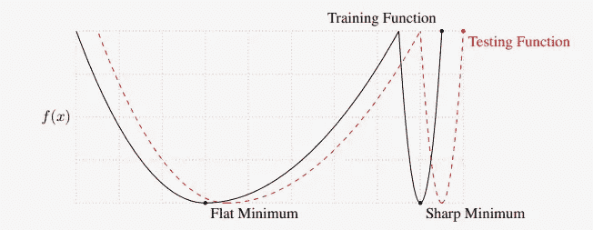
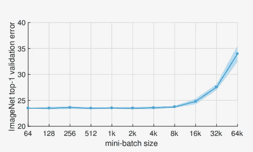

# 深度学习的黑魔法

> 原文：<https://towardsdatascience.com/hacks-for-doing-black-magic-of-deep-learning-ab5be5ff5f56?source=collection_archive---------24----------------------->

## 机器学习

## 建议，这将有助于你掌握 CNN 的培训

Photo by [Greg Rakozy](https://unsplash.com/@grakozy?utm_source=medium&utm_medium=referral) on [Unsplash](https://unsplash.com?utm_source=medium&utm_medium=referral)

## 总是超负荷

深度神经网络被称为“黑盒”，在那里很难进行调试。编写完训练脚本后，您无法确定脚本中没有任何错误，也无法预见您的模型是否有足够的参数来学习您需要的转换。

安德烈·卡帕西(Andrej Karpathy)关于过度饮食的建议就来自这里。

在训练开始时，在将所有数据输入到你的网络之前，试着在一个固定的批次上过量，没有任何增加，学习率非常小。如果它不会被过度拟合，这意味着，要么你的模型没有足够的学习能力来进行你需要的转换，要么你的代码中有一个 bug。

只有成功过拟合后，才合理的开始对整个数据进行训练。

## 选择您的标准化

归一化是一种强有力的技术，用于克服消失梯度并以更高的学习速率训练网络，而无需仔细的参数初始化。最初在 S.Ioffe 的论文中，提出了对整个批次的特征进行归一化，并且将激活转向单位高斯分布，以学习一个用于所有数据分布(包括测试数据)的通用均值和方差。当您需要预测影像的一个(或多个，如果是多标签分类)标签时，这种方法适用于所有分类任务。但是当你进行图像到图像的翻译任务时，情况就不同了。在这里，对整个数据集学习*一个*移动平均线和*一个*移动平均线可能会导致失败。在这种情况下，对于每一幅图像，作为网络的一个输出，你要获得独一无二的结果。
这就是实例规范化的由来。相反，在实例标准化中，为批中的每个图像独立计算统计数据。这种独立性有助于成功地训练网络，以完成图像超分辨率、神经风格转换、图像修复等任务。
所以要小心，不要在图像转换任务中使用迁移学习的常见做法，最著名的预训练网络有 ResNet、MobileNet、Inception。

## 越大(不总是)越好

众所周知，在训练深度神经网络的过程中，批量越大，收敛越快。而且，经验表明，在某个点之后，批量大小的增加会损害模型的最终性能。在工作中，N.S. Keskar 等人。艾尔。这与以下事实有关:在大批量的情况下，训练倾向于收敛到训练函数的尖锐极小值，而在小批量的情况下，收敛到平坦极小值。因此，在第一种情况下，来自训练函数的灵敏度很高，数据分布的微小变化将损害测试阶段的性能。

A Conceptual Sketch of Flat and Sharp Minima. The Y-axis indicates the value of the loss function and the X-axis the parameters.

但是 P. Goyal 等人。艾尔。⁴在论文《精确、大型迷你批处理 SGD:在 1 小时内训练 ImageNet》中表明，可以用高达 8K 的批处理大小训练 ImageNet，而性能不会下降。正如作者所说，*优化困难*是大型迷你批处理的主要问题，而不是泛化能力差(至少在 ImageNet 上)。作者提出了一个线性比例规则的学习率，取决于批量大小。规则如下

> 当小批量乘以 k 时，将学习率乘以 k。

ImageNet top-1 validation error vs. minibatch size.

小批量也可以被认为是正则化的形式，因为在这种情况下，您将有嘈杂的更新，这有助于避免快速收敛到局部最小值并提高泛化能力。

## 深度方向可分卷积并不总是你的救星

近年来，随着性能的提高，神经网络中的参数数量急剧增加，设计高效、低成本的神经网络成为当今的一个课题。
作为 Tensorflow⁵框架的一部分，谷歌提出的解决方案之一是深度方向可分离卷积，这是传统卷积层的一种修改，需要的参数更少。

让我们假设，我们有一层

*fi -* 输入过滤器

*fo*-输出滤波器

*KH*-内核的高度

*kw*-内核宽度

在卷积的情况下，层中的参数数量将为

> N = kh * kw * fi * fo

我们按照输出滤波器的次数对每个输入滤波器进行卷积，然后求和。

在深度方向可分离卷积的情况下，它将是

> N = kh * kw * fi + 1 * 1 * fo

我们用内核 *(kh，kw)* 对每个输入滤波器进行一次卷积，然后用内核 *(1，1)*按照输出滤波器的次数对这些中间滤波器进行卷积。

现在，让我们来看两个例子。

## 示例 1

假设该层有以下值

*fi = 128*

*fo = 256*

*kh = 3*

*kw = 3*

卷积层中的参数数量将是

*3 * 3 * 128 * 256 = 294.912*

深度方向可分离卷积中的参数数量为

*3 * 3 * 128 + 1 * 1 * 256 = 99.456*

在深度方向可分离卷积的情况下优势是明显的！！！

## 示例 2

现在让我们假设该层有其他值

*fi = 128*

*fo = 256*

*kh = 1*

*kw = 1*

卷积层中的参数数量将是

*1 * 1* 128 * 256 = 32.768*

深度方向可分离卷积中的参数数量为

*1 * 1* 128 + 1 * 1 * 256 = 32.896*

因此，我们可以看到，在第二种情况下，我们没有减少，而是增加了参数的数量。

# 参考

[1]安德烈·卡帕西博客，[http://karpathy.github.io/2019/04/25/recipe/](http://karpathy.github.io/2019/04/25/recipe/)

[2]S.Ioffe，C. Szegedy [批量归一化:通过减少内部协变量移位加速深度网络训练](https://arxiv.org/pdf/1502.03167.pdf)，2015，第 32 届机器学习国际会议论文集，

[3]N. S. Keskar，D. Mudigere，J. Nocedal，M. Smelyanskiy，和 P. T. P. Tang，[关于深度学习的大批量训练:泛化差距和尖锐极小值](https://arxiv.org/pdf/1609.04836.pdf)，2017，

[4]P. Goyal，P. Dollar，R. Girshick，P. Noordhuis，L. Wesolowski，A. Kyrola，，Y. Jia，K. He .，[精准，大迷你批量 SGD:1 小时训练 ImageNet](https://arxiv.org/pdf/1706.02677.pdf)，2017，arXiv:1706.02677

[5] [Tensorflow 官网](https://www.tensorflow.org/)