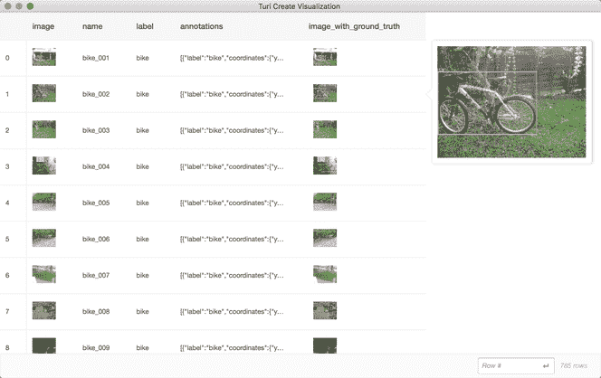
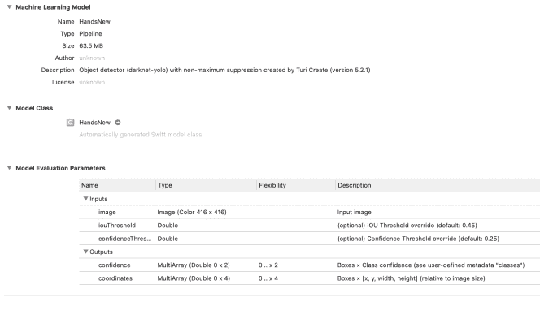

# 使用 Turi Create 和 Core ML 进行手动跟踪

> 原文：<https://towardsdatascience.com/hand-tracking-with-turi-create-and-core-ml-f3f9d3b60f7a?source=collection_archive---------14----------------------->

在移动设备上进行实时手部跟踪的任务既有趣又具有挑战性。手是身体中较难检测和跟踪的部分之一。原因是手可能看起来非常不同，无论是形状(尽管这也适用于身体的其他部位)还是手指的位置。一手牌可以在几分钟内从出拳变成击掌。这意味着很难从不同的手状态、不同的角度收集带有适当注释的数据集。在这篇文章中，我们将看到如何使用 Turi Create 实现这一点的方法，Turi Create 是苹果用于创建核心 ML 模型的框架。

[https://www.youtube.com/watch?v=q7cBgyssAg8](https://www.youtube.com/watch?v=q7cBgyssAg8)

# 目标跟踪

这里我们需要的机器学习任务是物体检测。对象检测使您不仅可以检测当前相机帧中是否存在对象，还可以检测该对象的位置。这使您能够绘制一些视觉指示(如矩形)或在检测到的地方呈现一个虚拟模型。一旦找到该对象，您就可以使用视觉的跟踪功能，在感兴趣的对象移动时更新视觉指示。

如果你只想知道物体是否在图片上，你需要图像分类。为此，您可以使用 Create ML，这是苹果公司用于创建机器学习模型的另一个框架。

# Turi 创建

Turi Create 是一个简化定制机器学习模型创建的工具，可以轻松导出为苹果的核心 ML 格式。这意味着，你不必成为机器学习专家，就可以在你的应用程序中添加一些智能。Turi Create 支持的任务有推荐、图像分类、对象检测、风格转换、活动分类等等。虽然它需要一点 Python 代码，但它仍然很容易上手，正如我们在这篇文章中看到的。

你可以在他们的 [GitHub repo](https://github.com/apple/turicreate) 上找到如何安装 Turi Create 的细节。基本上，您需要从终端执行以下操作:

```
pip install -U turicreate
```

一旦安装了 Turi Create，我们的下一个任务就是找到并准备数据。

# 准备数据

机器学习的最大挑战之一是找到足够的数据来训练机器学习模型。正如我们在开始时讨论的，检测一手牌的正确界限可能有点棘手。这就是为什么我们需要非常好的数据集。让我们看看我发现了什么。

我使用的数据集可以在找到[。我试过几种选择，这一种被证明是最好的。它相当大，大约 6 GB，对于没有 GPU 的 Mac 机器来说，训练模型是相当具有挑战性的。我发现的其他选项有](http://cvrr.ucsd.edu/vivachallenge/index.php/hands/hand-detection/) [EgoHands](http://vision.soic.indiana.edu/projects/egohands/) 和 [Oxford Hand](http://www.robots.ox.ac.uk/~vgg/data/hands/) 数据集。我在考虑将这三者结合起来，建立一个更好的机器学习模型，但我的 Mac 无法处理这一点。

现在，让我们看看数据。我使用的 VIVA 手部检测挑战的数据被分成两个文件夹，pos 和 posGt，都在 train 文件夹下。pos 文件夹包含所有图像，而 posGt 包含 csv 格式的所有注释，以及关于手(左手或右手)的信息。每个 csv 条目包含关于手的边界框的信息，使用 2D 图像平面中的左上角点、宽度和高度[x y w h]来描述。

# Turi Create 期望什么？

另一方面，Turi Create 需要 SFrame，这是一种表格数据结构，可以将图像和相应的注释放入其中。注释是 JSON 格式的。每个图像都有一个对象数组，其中有键坐标和标签。坐标值包含边界框的信息，而标签则包含什么是边界框。在我们的例子中，不是左手就是右手。

`[ {'coordinates': {'height': 104, 'width': 110, 'x': 115, 'y': 216},
'label': 'left'}, ...]`

坐标代表矩形的中心，以及宽度和高度，这与手部数据集中的数据组织方式不同(这里是左上角，而不是矩形的中心)。

为了创建该数据结构，我们将进行一些 Python 编码。以下脚本将把数据集的图像和 csv 文件转换成 SFrame，然后可用于创建 Turi Create 模型。

```
import turicreate as tc
import os
from os import listdir
from os.path import isfile, joinpath = 'train/posGt'
imagesDir = "train/pos"
files = [f for f in listdir(path) if isfile(join(path, f))]
annotations = []
labels = []
for fname in files:
 if fname != ".DS_Store":
  lines = tuple(open(path + "/" + fname, 'r'))
  count = 0
  entries = []
  for line in lines:
   if count > 0:
    words = line.split()
    passengerLabel = words[0]
    label = "left"
    if passengerLabel.find("left") == -1:
     label = "right"
    x = int(words[1])
    y = int(words[2])
    width = int(words[3])
    height = int(words[4])
    xCenter = x + width / 2
    yCenter = y + height / 2
    coordinates = {'height': height, 'width': width, 'x': xCenter, 'y': yCenter}
    entry = { 'coordinates' : coordinates, 'label' : label }
    entries.append(entry)
   count = count + 1
  annotations.append(entries)
sf_images = tc.image_analysis.load_images(imagesDir, random_order=False, with_path=False)
sf_images["annotations"] = annotations
sf_images['image_with_ground_truth'] = \
    tc.object_detector.util.draw_bounding_boxes(sf_images['image'], sf_images['annotations'])
sf_images.save('handsFrame.sframe')
```

为了实现这一点，我们首先浏览注释，解析 CSV 并创建坐标 JSON，同时还将左上坐标转换为中心坐标。接下来，我们使用 turicreate 包中的辅助函数加载图像。然后我们简单地放置注释，同时保持顺序。然后，将 SFrame 保存到手帧数据结构中。

还可以调用 sf_images.explore()来可视化边界框和图像。然而，你应该用少量的图片来测试，否则它会永远加载。



下一步是使用 SFrame 创建核心 ML 模型。这意味着我们应该进行另一轮 Python 编码。

```
import turicreate as tc# Load the data
data =  tc.SFrame('handsFrame.sframe')# Make a train-test split
train_data, test_data = data.random_split(0.8)# Create a model
model = tc.object_detector.create(train_data, feature='image', max_iterations=120)# Save predictions to an SArray
predictions = model.predict(test_data)# Evaluate the model and save the results into a dictionary
metrics = model.evaluate(test_data)# Export for use in Core ML
model.export_coreml('Hands.mlmodel')
```

我们在这里做的是首先加载我们用第一个脚本创建的 SFrame。然后，我们创建训练和测试数据，以 80–20%的比例随机分割。然后，使用 Turi Create 中的 object_detector.create 方法，我们用训练数据创建模型。您可以使用 max_iterations 属性(我的机器在 150 时崩溃，所以 120 是我能做的最好的)。之后，我们进行预测并评估模型。在最后一步中，我们以核心 ML 格式导出模型。

# iOS 实施

现在我们有了核心 ML 模型，很容易将其集成到 iOS 应用程序中，只需将其拖放到 Xcode 项目中。

让我们检查一下创建的模型。这种模式被称为 Pipeline，它与苹果从 iOS 12 开始的愿景非常契合。它接受 416×416 大小的图像作为输入。作为输出，它提供了两个 MLMultiArrays，其中包含关于检测到的对象的置信度和坐标。



好消息是，您不必处理这些复杂的多维数组 Vision 框架会自动为您完成这项工作(针对使用 Turi Create 创建的管道模型),并为您提供一个[VNRecognizedObjectObservation](https://developer.apple.com/documentation/vision/vnrecognizedobjectobservation)。该类型包含关于边界框的信息(作为一个 CGRect ),以及置信度。现在，当您运行 Vision 会话时，您只需要检查结果是否属于该类型，并绘制适当的边界框。

```
func handleNewHands(request: VNRequest, error: Error?) {
        DispatchQueue.main.async {
            //perform all the UI updates on the main queue
            guard let results = request.results as? [VNRecognizedObjectObservation] else { return }
            for result in results {
                print("confidence=\(result.confidence)")
                if result.confidence >= self.confidence {
                    self.shouldScanNewHands = false
                    let trackingRequest = VNTrackObjectRequest(detectedObjectObservation: result, completionHandler: self.handleHand)
                    trackingRequest.trackingLevel = .accurate
                    self.trackingRequests.append(trackingRequest)
                }

            }
        }
    }
```

一旦物体被检测到，我们可以告诉视觉跟踪它。为此，我们正在创建类型为 [VNTrackObjectRequest](https://developer.apple.com/documentation/vision/vntrackobjectrequest) 的对象，在这里我们通过已识别的对象观察并开始跟踪。每次调用完成处理程序 handleHand 时，我们都会更新跟踪矩形。

# 源代码

这是 iOS 实施中最重要的部分。你可以在这里找到完整的源代码[，以及所有的视觉检测和跟踪细节。](https://github.com/martinmitrevski/HandTracking)

# 结论

对我来说，这是一个非常有趣的机器学习练习。Turi Create 是一个非常强大的创建机器学习模型的工具。它创建了与 iOS 应用程序无缝协作的模型。

这个项目有很大的改进空间。首先，该模型应该用更多的数据进行训练，这样它就可以在所有光线条件和手的位置下正确地工作。此外，可以改进 iOS 代码，以更好地处理跟踪请求。现在，同一只手可能会识别出多个矩形。

另一件很酷的事情是不仅跟踪整只手，还跟踪手指。

这就是这篇文章的全部内容。你认为检测身体部位对我们未来的应用程序有用吗？一般来说机器学习怎么样？在下面的部分省去任何注释。

*原载于 2019 年 1 月 19 日*[*【martinmitrevski.com】*](https://martinmitrevski.com/2019/01/19/hand-tracking-with-turi-create-and-core-ml/)*。*