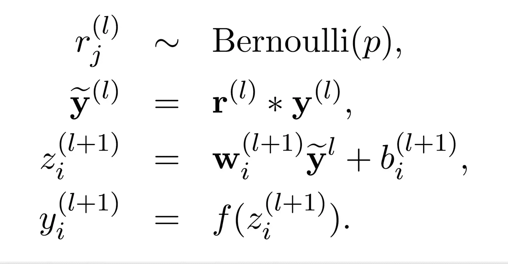

# 手工制作人工神经网络

> 原文：<https://towardsdatascience.com/handcrafting-an-artificial-neural-network-e0b663e88a53?source=collection_archive---------11----------------------->

## 在这篇文章中，我已经实现了一个完全矢量化的人工神经网络代码，具有辍学和 L2 正则化。

Photo by [JJ Ying](https://unsplash.com/@jjying?utm_source=medium&utm_medium=referral) on [Unsplash](https://unsplash.com?utm_source=medium&utm_medium=referral)

在本文中，我实现了一个在多个数据集上测试的人工神经网络的全矢量化 python 代码。此外，辍学和 L2 正则化技术的实施和详细解释。

强烈建议您完成人工神经网络的基本工作、前向传播和反向传播。

本文分为 10 个部分:

1.  介绍
2.  先决条件
3.  导入我们的库
4.  编码我们的激活函数和它们的导数
5.  我们的神经网络课
6.  初始化权重和偏差
7.  正向传播
8.  价值函数
9.  反向传播
10.  预测新数据集的标注

还有，

> 非常感谢任何形式的反馈。

# 1.介绍

人工神经网络是*最美的*和**监督的**深度学习的基本概念之一。它可以用于执行多种任务，如二元或分类。看起来*很容易理解和实现，除非你开始编写代码。在编写这样一个网络的过程中，*小问题*会突然出现，导致*大错误*并帮助你理解你之前错过的概念。因此，在本文中，我试图实现一个人工神经网络，它可能会帮助您节省正确编码和理解该主题的每个概念所需的几天时间。我会在文章中使用标准的符号和记号。*

这篇文章太密集了，所以如果你对神经网络和它们的符号不熟悉，你可能会发现很难理解所有的东西。所以，我建议给它一些时间，慢慢来，参考我在文章中提供的资源。

Github 上有[的完整代码](https://github.com/tirthasheshpatel/Neural-Network)。

 [## tirthasheshpatel/神经网络

### 演示和教学用手工制作的神经网络

github.com](https://github.com/tirthasheshpatel/Neural-Network) 

# 2.先决条件

我假设你知道什么是神经网络，以及它们是如何学习的。如果你熟悉 **Python** 和像 *numpy* 这样的库，这很容易理解。此外，要轻松通过*正向*和*反向传播*部分，还需要具备**线性代数**和**微积分**的良好知识。此外，我强烈建议浏览一下[吴恩达](https://www.deeplearning.ai/)在 [Coursera](http://coursera.org) 上的课程视频。

# 3.导入我们的库

现在，我们可以开始编码一个神经网络。第一件事是导入我们实现网络所需的所有库。

我们将使用 *pandas* 来导入和清理我们的数据集。 ***Numpy*** 是**执行矩阵代数**和复杂计算最重要的库。像*警告*、*时间*、*系统*和*操作系统*这样的库很少使用。

# 4.编码我们的激活函数和它们的导数

我们将在本文后面需要激活函数来执行*正向传播*。同样，我们需要在*反向传播*过程中激活函数的导数。所以，让我们编写一些激活函数。

我们已经编写了四个最流行的激活函数。首先是常规的老式*乙状结肠*激活功能。

[Source](/derivative-of-the-sigmoid-function-536880cf918e)

然后我们有 *ReLU* 或*整流线性单元*。我们将主要使用这个激活功能。注意，我们将保持 *ReLU 0* 在点 *0* 的导数。

[Source](https://medium.com/@karpathy/yes-you-should-understand-backprop-e2f06eab496b)

我们还有一个 *ReLU* 的扩展版本，叫做 *Leaky ReLU* 。它的工作方式就像 *ReLU* 一样，可以在一些数据集(不一定是所有数据集)上提供更好的结果。

然后我们有 *tanh* (双曲正切)激活函数。它也被广泛使用，并且几乎总是优于*s 形*。

[Source](https://isaacchanghau.github.io/post/activation_functions/)

另外， *PHI* 和 *PHI_PRIME* 是分别包含激活函数及其衍生函数的 *python 字典*。

# 5.我们的神经网络课

在本节中，我们将创建并初始化我们的神经网络类。首先，我们将决定在初始化期间使用哪些参数。我们需要:

1.  每层中的神经元数量
2.  我们希望在每一层中使用的激活函数
3.  我们的*特征矩阵(* ***X*** *)，特征沿行，示例沿列)。*
4.  *标签*对应*特征矩阵(y 为行向量)*
5.  初始化我们的权重和偏差的方法
6.  要使用的损失函数

记住这一点，让我们开始编码我们的神经网络的类:

现在我们有了一个正确记录的神经网络类，我们可以开始初始化网络的其他变量。

如图所示，我们将使用' *self.m'* 来存储数据集中的*个示例*。 *self.n* 会存储每层*个神经元*的信息。 *self.ac_funcs* 是各层*激活函数*的 python 列表。 *self.cost* 将在我们训练网络时存储成本函数的*记录值。 *self.acc* 将存储训练后数据集达到的记录的*精度*。已经初始化了我们网络的所有变量，让我们进一步初始化我们网络的权重和偏差。*

# 6.初始化权重和偏差

有趣的部分现在开始。我们知道权重不能初始化为零，因为每个神经元的假设变得相同，并且网络从不学习。所以我们必须有一些方法来打破对称性，让我们的神经网络学习。我们可以使用[高斯正态分布](https://en.wikipedia.org/wiki/Normal_distribution)来得到我们的随机值。由于这些分布的平均值为零，权重*以零*为中心，并且*非常小*。因此，网络开始快速有效地学习。我们可以使用 *np.random.randn()* 函数从正态分布中生成随机值。下面两行代码足以初始化我们的权重和偏差。

我们已经将权重初始化为来自正态分布的随机值。偏差已经被初始化为零。

# 7.正向传播

首先，让我们了解一下没有任何正则化的前向传播。

[Source](http://www.jmlr.org/papers/volume15/srivastava14a/srivastava14a.pdf?utm_content=buffer79b43&utm_medium=social&utm_source=twitter.com&utm_campaign=buffer)

我们有 ***Z*** 作为从一层到另一层的每个神经元连接的*假设*。一旦我们计算出***Z*** ，我们将激活函数***f*** 应用于*Z 值，得到每层中每个神经元的激活 ***y*** 。这就是'*纯香草*'正向传播。但是正如 N.Shrivastava 等人在论文中所说的。艾尔。，2014 ，**辍学**是一项惊人的技术，可以提高神经网络的泛化能力，使其更加健壮。所以，我们先来对退学正规化有一些直觉。*

# *辍学正规化的本质*

*Dropout，顾名思义，指的是“*去激活*我们神经网络中的一些神经元，并训练其余的神经元。*

**

*[Source](http://www.jmlr.org/papers/volume15/srivastava14a/srivastava14a.pdf?utm_content=buffer79b43&utm_medium=social&utm_source=twitter.com&utm_campaign=buffer)*

*为了提高性能，我们可以用不同的超参数值来训练数十或数百个神经网络，获得所有网络的输出，并取它们的平均值来获得我们的最终结果。这个过程是 ***计算上非常昂贵的*** 并且实际上不能实现。因此，我们需要一种更优化、计算成本更低的方法来做类似的事情。辍学调整以一种非常便宜和简单的方式做着完全类似的事情。事实上，辍学是优化性能的一种非常容易和简单的方式，最近它获得了很多关注，并且几乎在许多其他深度学习模型中到处使用。*

*为了实现辍学，我们将使用以下方法:*

**

*[Source](http://www.jmlr.org/papers/volume15/srivastava14a/srivastava14a.pdf?utm_content=buffer79b43&utm_medium=social&utm_source=twitter.com&utm_campaign=buffer)*

*我们将首先从伯努利分布中抽取随机值，如果概率高于特定阈值，则保留神经元，然后执行规则的正向传播。请注意，在预测新数据集的值或测试期间，我们不会应用 dropout。*

# *实现辍学的代码*

*我们将 *keep_prob* 作为每层神经元存活的概率。我们将只保留概率高于存活概率或 *keep_prob* 的神经元。假设，它的值是 0.8。这意味着我们将停用每层中 20%的神经元，并训练其余 80%的神经元。请注意，我们在每次迭代后都会停用随机选择的神经元。这有助于神经元学习在更大的数据集上概括的特征。文[1]给出了一个非常直观的证明。*

*我们首先初始化*列表*，它将存储 *Z* 和 *A* 的值。我们首先在 *Z* 中添加第一层的线性值，然后在 *A* 中添加第一层神经元的激活。这里， *PHI* 是一个 *python 字典*，包含了我们之前编写的激活函数。我们同样使用循环的*计算所有其他层的 *Z* 和 *A* 的值。注意，我们**没有**在输入层应用 dropout。我们最后返回 *Z* 和 *A* 的计算值。**

# *8.价值函数*

*我们将使用标准的*二元/分类交叉熵成本函数*。*

*我们已经用 ***L2 正则化*** 编码了我们的成本函数。参数*λ*被称为*惩罚参数*。这有助于权重值不会快速增加，从而更好地进行概化。这里，' *a'* 包含输出层的激活值。我们还有函数 *_cost_derivative* 来计算关于输出层激活的成本函数的*导数。我们将在*反向传播*中用到它。**

# *9.反向传播*

*这里有一些公式，我们将需要执行反向传播。*

**

*[Source](https://www.deeplearning.ai/)*

*我们将在深度神经网络上实现这一点。右边的公式是完全矢量化的，因此我们将使用它们。一旦你理解了这些公式，我们就可以开始编码了。*

*我们将*历元*、 *alpha* (学习率)、 *_lambda* 、 *keep_prob* 和 *interval* 作为我们函数的参数来实现反向传播。在文档注释中给出了它们的描述。*

*我们从*正向传播开始。然后我们计算我们的成本函数的导数为 *delta* 。现在，对于每一层，我们计算 *delta_w* 和 *delta_b* ，其包含关于我们网络的权重和偏差的成本函数的导数。然后我们根据各自的公式更新 *delta* 、*权重、*和*偏差*。在从最后一层到第二层更新权重和偏差之后，我们更新第一层的权重和偏差。我们这样做几次迭代，直到权重和偏差的值收敛。**

***重要提示**:这里可能的一个大错误是在更新权重和偏差之后更新德尔塔**。这样做会导致**非常糟糕的情况 [*消失/爆炸渐变问题*](https://medium.com/learn-love-ai/the-curious-case-of-the-vanishing-exploding-gradient-bf58ec6822eb) 。*****

*我们的大部分工作都在这里完成了，但我们仍然需要编写能够预测新数据集结果的函数。因此，作为我们的最后一步，我们将编写一个函数来预测新数据集的标签。*

# *10.预测新数据集的标注*

*这一步非常简单。我们只需要执行前向传播，而**没有丢失正则化**。我们在测试期间不应用退出正则化，因为我们需要所有层的所有神经元为我们提供正确的结果，而不仅仅是一些随机值。*

*如图所示，我们将返回输出层的激活结果。*

# *整个代码*

*这是你自己实现一个人工神经网络的全部代码。我添加了一些代码，用于打印我们训练网络时的成本和准确性。除此之外，一切都一样。*

*恭喜你！我们终于完成了神经网络的编码。现在，我们可以在不同的数据集上测试我们的网络。*

# *测试我们的神经网络*

*我们将在著名的 MNIST 数字分类数据集上测试我们的网络。我们将只使用 8000 张图像来训练我们的网络，并在 2000 张其他图像上进行预测。可以在 [Kaggle](https://www.kaggle.com/c/digit-recognizer) 上获取数据集。*

*我训练了两个 32 和 16 个神经元的隐层神经网络。我在两层都使用了 *ReLU* 激活函数。在用*惩罚参数 1.0* 和*学习率 0.1* 训练网络 *2500 个时期*后，我们得到:*

**

*成本与时代的关系图如下所示:*

**

*我们在训练集和测试集上都取得了相当好的准确率。通过使用像*网格搜索*、*随机网格搜索*等技术来调整超参数，我们可以获得更高的精度。*

*此外，可以随意尝试超参数、激活函数和数据集的不同值。如果你认为代码还有改进的地方，请在 GitHub 或评论区分享。非常感谢任何形式的反馈。*

# *对你来说有些挑战*

*如果你已经理解了我上面提供的神经网络的代码，那么这里有一些你可以做的更好的改变。*

1.  *尝试编码 [**softmax 激活功能**](https://link.medium.com/oBUOo6EGsU) 并使其工作。*
2.  *比方说，我想停用第一层 30%的神经元，第二层 50%的神经元。尝试编码一个网络，在其中，我可以为每一层使用不同的 keep_prob 值。*
3.  *尝试执行 [**小批量梯度下降**](https://en.m.wikipedia.org/wiki/Stochastic_gradient_descent) 算法。它对于手写数字分类非常有用。*

## *我希望你喜欢这篇文章和挑战。祝你数据科学之旅愉快！*