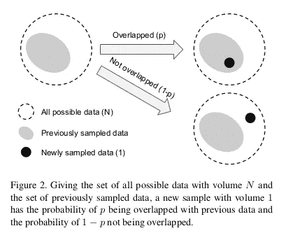

# 使用专门为其制作的损失来处理类不平衡数据

> 原文：<https://towardsdatascience.com/handling-class-imbalanced-data-using-a-loss-specifically-made-for-it-6e58fd65ffab?source=collection_archive---------4----------------------->

## 这篇文章是对 Google 在 CVPR 19 年会上发表的一篇名为[基于有效样本数的等级平衡损失](http://openaccess.thecvf.com/content_CVPR_2019/html/Cui_Class-Balanced_Loss_Based_on_Effective_Number_of_Samples_CVPR_2019_paper.html)的论文的评论。

**TL；DR——它针对最常用的损失(softmax 交叉熵、焦点损失等)提出了一种分类加权方案。)快速提高准确性，尤其是在处理类别高度不平衡的数据时。**

链接到本文的实现(使用 py torch)——[GitHub](https://github.com/vandit15/Class-balanced-loss-pytorch)

# 有效样本数

在处理长尾数据集(大部分样本属于很少的几个类，而许多其他类的支持度很低)时，决定如何对不同类的损失进行加权可能会很棘手。通常，权重被设置为类支持的倒数或类支持的平方根的倒数。

Traditional re-weighting vs proposed re-weighting

然而，如上图所示，这是过冲的，因为*随着样本数量的增加，新数据点的额外好处会减少。*新添加的样本很有可能是现有样本的近似副本，主要是在大量数据扩充(如重新缩放、随机裁剪、翻转等)时。)在训练神经网络时使用。通过样本的有效数量重新加权给出了更好的结果。

样本的有效数量可以想象为*N 个样本将覆盖的实际体积，其中总体积 N 由总样本数表示。*

Effective number of samples

形式上，我们把它写成:

Effective number of samples

这里，我们假设新样本只会以两种方式与先前采样的数据量进行交互:要么完全覆盖，要么完全在外(如上图所示)。有了这个假设，利用归纳法就可以很容易地证明上面的表达式(证明参考论文)。

我们也可以这样写:

Contribution of every sample

这意味着第 j 个样本对样本的有效数量贡献了 Beta^(j-1。

上式的另一个含义是，如果β= 0，则 En = 1。还有，En → n 为β→1。后者可以很容易地用洛必达法则来证明。这意味着当 N 很大时，有效样本数与样本数 N 相同。在这种情况下，唯一原型数 N 很大，每个样本都是唯一的。然而，如果 N=1，这意味着所有数据都可以用一个原型来表示。

# 类别平衡损失

在没有额外信息的情况下，我们无法为每个类别设置单独的β值，因此，使用整个数据，我们将它设置为特定值(通常设置为 0.9、0.99、0.999、0.9999 中的一个)。

因此，类平衡损失可以写成:

CB Loss

这里， **L(p，y)** 可以是任意损失函数。

## 类别平衡焦点损失

Class-Balanced Focal Loss

焦点丢失的原始版本有一个 alpha 平衡变体。相反，我们将使用每个类别的有效样本数对其进行重新加权。

类似地，这样的重新加权项也可以应用于其他著名的损失(sigmoid 交叉熵、softmax 交叉熵等)。)

# 履行

在开始实施之前，在使用基于 sigmoid 的损失进行训练时需要注意一点——使用 b = -log(C-1)初始化最后一层的偏差，其中 C 是类的数量而不是 0。这是因为设置 b=0 会在训练开始时导致巨大的损失，因为每个类的输出概率接近 0.5。因此，我们可以假设类 prior 是 1/C，并相应地设置 b 的值。

## 类别的权重计算

calculating normalised weights

上面几行代码是一个简单的实现，用于获取权重并将其归一化。

getting PyTorch tensor for one-hot labels

这里，我们得到了权重的一个热点值，这样它们可以分别与每个类的损失值相乘。

# 实验

类平衡提供了显著的好处，尤其是当数据集高度不平衡时(不平衡= 200，100)。

# 结论

使用有效样本数的概念，我们可以解决数据重叠的问题。由于我们不对数据集本身做出任何假设，因此重新加权条款通常适用于多个数据集和多个损失函数。因此，类不平衡的问题可以通过更合适的结构来解决，这一点很重要，因为大多数真实世界的数据集都存在大量的数据不平衡。

# 参考

[1]基于有效样本数的类平衡损失:【https://arxiv.org/abs/1901.05555 