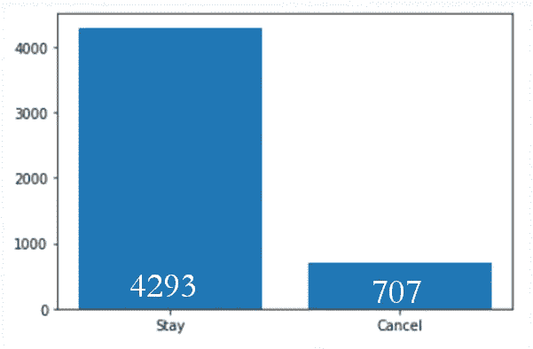
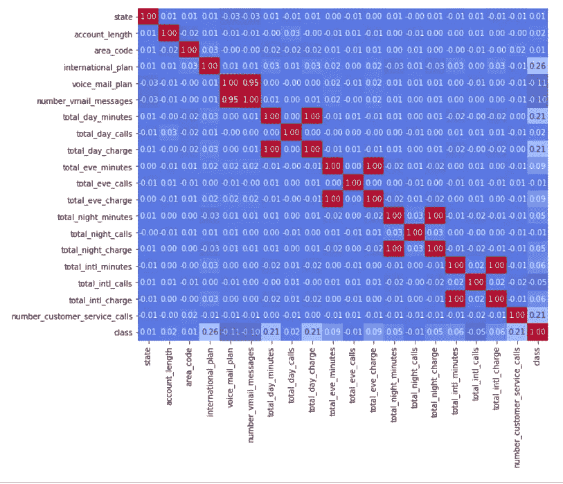
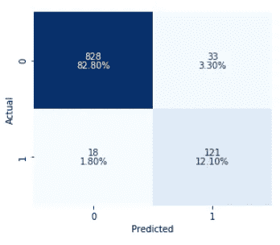
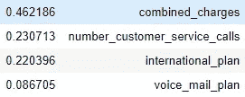
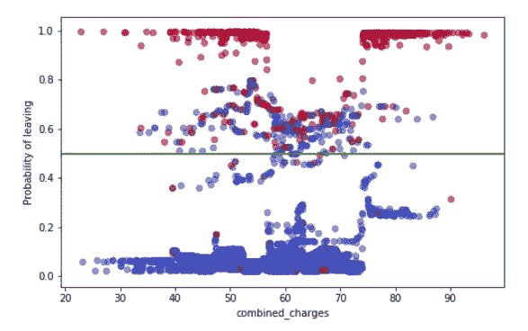

# 处理不平衡的数据:

> 原文：<https://towardsdatascience.com/handling-imbalanced-data-4fb691e23fe9?source=collection_archive---------23----------------------->

## 预测客户取消电话服务

在这个项目中，我试图预测取消电话服务的客户，以便采取措施留住这些客户。
我使用的数据集来自[openml.org](https://www.openml.org)，你可以[点击这里](https://www.openml.org/d/40701)直接链接到这个数据集。

# **不平衡数据集**

这个数据集是不平衡的，这给它带来了一些挑战。首先让我们来看看不平衡:



Amount of customers staying or cancelling

为了解决这个问题，我使用了 SMOTE 方法对数据进行上采样。我也试着用 ADYSN，但是效果不太好。这可能是由于 ADYSN 也产生随机噪声，对于这个问题，只是降低了模型预测结果的能力。

由于数据集的情况，我决定优化召回率，同时在一定程度上仍然考虑准确性。这是因为希望正确预测尽可能多的客户离开，同时尽可能降低误报率。

我用成本收益分析给模型打分。计算方法如下:根据我掌握的资料，平均每月账单是 60 美元。然后我计算了 24 个月合同的长度，结果是 1440 美元。然后，我决定促销金额为 500 美元，这只是为了便于计算。
任何真正的否定，或被正确预测为留下的客户，不加或减任何东西。
任何假阴性，或者将取消但被预测为留下的客户，每个都将损失 1，440 美元。
任何真阳性，或将要取消并被预测为取消的客户，将被提供促销，因此收益将是$1，440 - $500 = $940。
任何误报，或预测离开但没有离开的客户，将被提供促销，因此将损失 500 美元。

# **特征的相关性**

我在开始时注意到的另一件事是关于特性的相关性:



与目标没有太多的相关性，这是“类”的特征，一些在大约 0.2，分钟和费用也几乎%100 相关。这是有道理的，因为在当时，这些数据是账单中最重要的部分。

# 建模

当我在考虑功能的数量和相关性问题时，一方面在费用和分钟之间有很多相关性，但另一方面没有多少主要功能。因此，我认为随机森林最适合这种类型的数据，因为它对每棵树的特征和数据进行随机化，然后对整个森林进行预测。我用基本的默认超级参数测试了几种不同的方法，随机森林确实表现最好。在对测试数据进行了几次优化后，我得到的结果是这样的:



这样做的成本效益是 71，320 美元，或者说，如果我们预测要离开的 121 个客户都留下来，那么留住将要离开的客户的实际收益将是每个先前实际离开的客户 589 美元。
在进行 5 次交叉验证后，测试集的平均成本收益为 51，152 美元。

**交叉验证**

在处理不平衡数据时，只需注意交叉验证。因为你应该只对训练数据进行 smote，然后对真实的测试数据进行预测，这就限制了你如何进行交叉验证。常规的交叉验证方法对此不起作用。
为了解决这个问题，我使用了分层的 K 型折叠，它从每个类别中提取相同的数量，因此每个折叠的结果都是相似的。
然后我得到每一个分裂，对训练数据应用 SMOTE，在此基础上训练模型。保存每次折叠的分数，然后进行平均。

下面是示例代码:

```
skf = StratifiedKFold(n_splits=5) # Set up the splitsX_trains2 = {} # Make dictionaries for each train and test split
X_tests2 = {}
y_trains2 = {}
y_tests2 = {}
for i, (train_index, test_index) in enumerate(skf.split(X, y)):# Get the folds and make the index number the key in each dict
 X_trains2[i] = X.loc[train_index]
 X_tests2[i] = X.loc[test_index]
 y_trains2[i] = y[train_index]
 y_tests2[i] = y[test_index]scores2 = [] # Make a list to put all scores into 
train = 0 # Setup to save all train scores 
test = 0 # Setup to save all test scores
cb = 0 # Cost-Benefit numbersfor i in range(5):
 smoted_x, smoted_y = sm.fit_sample(X_trains3[i], y_trains3[i])     # SMOTE the training splits
 rf5.fit(smoted_x, smoted_y) # Fit the model
 trainpred = rf5.predict(X_trains3[i]) # Predict train (not Smoted)
 testpred = rf5.predict(X_tests3[i]) # Predict test
 train += recall_score(y_trains3[i], trainpred) # Total all train recall scores for each loop
 test += recall_score(y_tests3[i], testpred) # Total all train recall scores for each loop

 cb += cost_benefit(y_tests3[i], testpred) # Total the Cost-benefit scores scores2.append((i, recall_score(y_trains3[i], trainpred), recall_score(y_tests3[i], testpred))) # Append a tuple of index, train recall total and test recall total) print(f’\n{recall_score(y_tests3[i], testpred)}’)
 cm(y_tests2[i], testpred) # Print a confusion matrix
 print(classification_report(y_tests3[i], testpred))
print(train/5, test/5, cb/5) # Print the total scores / # of Folds
```

# 特征重要性

有了一个好的工作模型后，我就可以查看特性的重要性，看看我能从中找出什么来改善模型的解释能力，然后就能在未来的业务决策中使用它。

我做了一些功能工程，将所有的分钟和所有的费用合并成两个功能。因为这两个特性高度相关，所以我删除了分钟列。我还删除了所有的 call number 列，以及 state 和 account_length 列，因为它们的特性重要性接近于 0。
我还放弃了 number_vmail_messages，因为它与语音邮件计划高度相关。
我总结了 4 个特征，它们具有相应的重要性:



Top Features

运行仅具有这些特征的模型，并进行 5 次交叉验证，可带来 56，964 美元的成本效益。
这向我展示了通过基于特征重要性组合和删除特征，模型变得更好。

**基于重要性的特征分析**

在研究了特征关系后，我发现的最重要的事情是，任何账单超过 72 美元的人都更有可能离开。从这个视频中可以看出:



超过 72 美元钞票的数字如下:
离开:315
留下:247

考虑到一般数据中有 85%到 15%的离职率，让更多的人以更高的离职率离开是非常重要的。在检查账单超过 72 美元的顾客如何与其他特征交叉时，这也是一致的。
如果我们向平均账单超过 72 美元的每个人提供 500 美元的促销活动，那么每位入住的顾客将获得 547 美元，这与我们从整个数据集获得的金额相似。
我建议对此进行更多的调查，看看如何最好地处理账单较高的客户，以留住更多的客户。

# 推荐

我最后的建议是向顾客提供某种形式的促销。
弄清楚应该提供多少优惠，什么样的促销最能成功留住顾客。
多研究如何用更高的账单留住顾客。

请留下反馈，如果你对此有想法，如果你想看到它的代码，可以在这里看到。