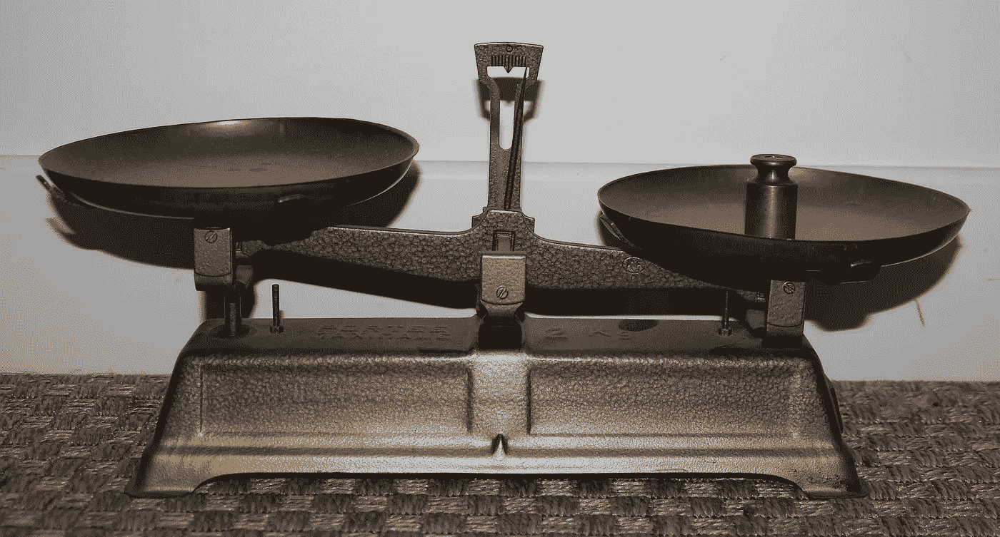
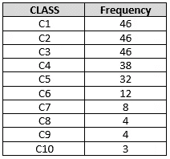
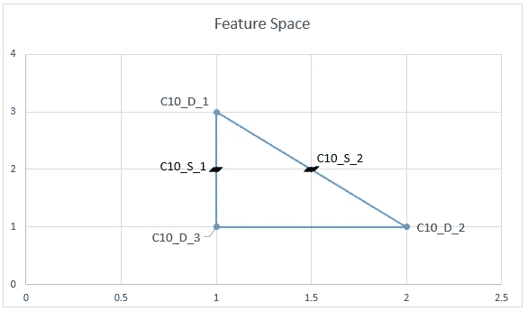
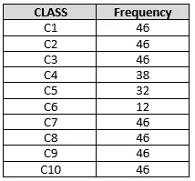

# 使用重采样处理不平衡数据

> 原文：<https://towardsdatascience.com/handling-imbalanced-data-using-re-sampling-872b6db4fe67?source=collection_archive---------48----------------------->

## 不平衡数据是高级分析解决方案中普遍存在的问题。

Photo By [Lauraljstc](https://pixabay.com/users/lauraljstc-4119307/) from [Pixabay](https://pixabay.com/)

# 介绍

不平衡类数据是机器学习中常见的问题。除非以适当的方式处理，否则它可能会导致一个假装为最佳执行模型的模型，同时偏向于特定的类。

例如，考虑以下包含 10 个类的数据集，但是每个类的出现是不均匀分布的。使用此数据集训练的模型偏向于 C1、C2、C4 和 C5，但很少预测 C7、C8、C9 和 C10 类。

Imbalanced classes— Image by Author

# 重新取样

## 合成少数过采样技术(SMOTE) [1]

这是一种流行且成功的方法，它创造了少数民族阶层的新样本，而不仅仅是复制样本。考虑前面的场景，其中我们只有 C10 的 3 个样本(C10_D_1、C10_D_2 和 C10_D_3)(因为我们只有 3 个样本，所以这三个样本都被视为邻居)，SMOTE 在 3 个数据点之间创建线，并从线中选取合成数据点(C10_S_1 和 C10_S_2)。下图说明了我们所讨论内容的图形解释。

Features Space— Image by Author

这可以使用名为“ *scikit-learn-contrib* 的 *scikit-learn* 的扩展版本来执行，下面的代码段显示了使用 *scikit-learn-contrib* 使用 SMOTE。

SMOTE 算法有一些属性值需要优化；不幸的是，由于 SMOTE 的评分和转换方法的不变性，流水线和随机化搜索 CV 不能用于执行自动优化。因此，我们需要手动阻止和播放属性值来进行优化。有关 SMOTE 和属性的更多详细信息，请参考[2]。

## 过采样[3]、[4]

这种方法为少数民族班级复制一个样本以平衡班级。这里我们逐步讨论如何实现过采样。

**步骤 1** :识别数据中优势类的频率(*frequency _ of _ majority _ class*)。

**第二步**:将数据集一分为二(数据集包含优势类(DF_FOR_MAJORITY)和次要类(DF_FOR_MINORITY))。

**第三步**:获取辅修课列表。

**步骤 4** :使用重采样方法复制少数类样本。

这里我们使用*n _ samples*=*frequency _ of _ majority _ class*来指定要生成的样本数。

**步骤 5** :连接 DF_FOR_MAJORITY 和过采样数据(DF_FOR_MINORITY_OVERSAMPLED)。

下表是由于过采样而产生的输出。

Balanced classes — Image by Author

## 欠采样[3]

这种方法移除多数类的样本，并尝试与少数类的样本数量相匹配。

不同之处在于，在步骤 1 中，考虑次要类别的频率，而不是识别主要类别的频率。

***注意:*** *这种方法通常不被推荐，因为它会丢失大多数类的有用行为。*

## 最后的想法

我们讨论了解决不平衡数据问题的三种方法，根据问题的背景，我们应该选择正确的方法。它确保高级分析解决方案是有意义的，而不是有偏见的特定行为。

# 参考

[1] N. V. Chawla，K. W .鲍耶，L. O.Hall，W. P. Kegelmeyer，“SMOTE:合成少数过采样技术”，人工智能研究杂志，321–357，2002 年。

[2]勒迈特 g .，诺盖拉 f .，和阿迪达斯 C. (2016)。“不平衡学习:一个 Python 工具箱来解决机器学习中不平衡数据集的诅咒”。更正 abs/1609.06570。

[3]m .库巴特和 s .马特温(1997 年)。解决不平衡训练集的诅咒:单边选择。收录于:第十四届机器学习国际会议论文集，第 179-186 页，田纳西州纳什维尔。摩根·考夫曼。

[4]凌和李(1998 年)。直接营销中的数据挖掘问题及解决方案。《第四届知识发现和数据挖掘国际会议(KDD-98)会议录》。AAAI 出版社。