# 机器学习中不平衡数据集的处理

> 原文：<https://towardsdatascience.com/handling-imbalanced-datasets-in-machine-learning-7a0e84220f28?source=collection_archive---------0----------------------->

## [入门](https://towardsdatascience.com/tagged/getting-started)

## 面对不平衡的班级问题，应该做什么，不应该做什么？

*本帖与* [*约瑟夫·罗卡*](https://medium.com/u/b17ebd108358?source=post_page-----7a0e84220f28--------------------------------) *共同撰写。*

# 介绍

假设你在一家特定的公司工作，你被要求创建一个模型，根据你所掌握的各种测量结果，预测一个产品是否有缺陷。你决定使用你最喜欢的分类器，对数据进行训练，瞧，你得到了 96.2%的准确率！你的老板很惊讶，决定使用你的模型，不做任何进一步的测试。几周后，他走进你的办公室，强调你的模型毫无用处。事实上，您创建的模型从用于生产时起就没有发现任何缺陷产品。
经过一些调查，您发现贵公司生产的产品中只有大约 3.8%有缺陷，而您的模型总是回答“无缺陷”，因此准确率为 96.2%。你得到的那种“幼稚”的结果是由于你正在处理的不平衡的数据集。本文的目标是回顾不同的方法，这些方法可以用来处理不平衡类的分类问题。

## 概述

首先，我们将概述不同的评估指标，这些指标有助于发现“幼稚行为”。然后，我们将讨论一大堆重新处理数据集的方法，并说明这些方法可能会产生误导。最后，我们将展示返工问题在大多数情况下是继续进行的最佳方式。

一些由(∞)符号表示的小节包含了更多的数学细节，可以跳过而不影响对这篇文章的整体理解。还要注意，在接下来的大部分内容中，我们将考虑两类分类问题，但是推理可以很容易地扩展到多类情况。

# 发现“幼稚行为”

在第一部分中，我们想提醒不同的方法来评估一个训练过的分类器，以确保检测到任何类型的“幼稚行为”。正如我们在简介示例中看到的，准确性虽然是一个重要且不可避免的指标，但可能会产生误导，因此应该谨慎使用，并与其他指标一起使用。让我们看看还可以使用哪些其他工具。

## 混淆矩阵、精确度、回忆和 F1

在处理分类问题时，一个好的简单的度量标准是混淆矩阵。这个指标给出了一个模型表现如何的有趣概述。因此，它是任何分类模型评估的一个很好的起点。我们在下图中总结了可以从混淆矩阵中得出的大多数指标

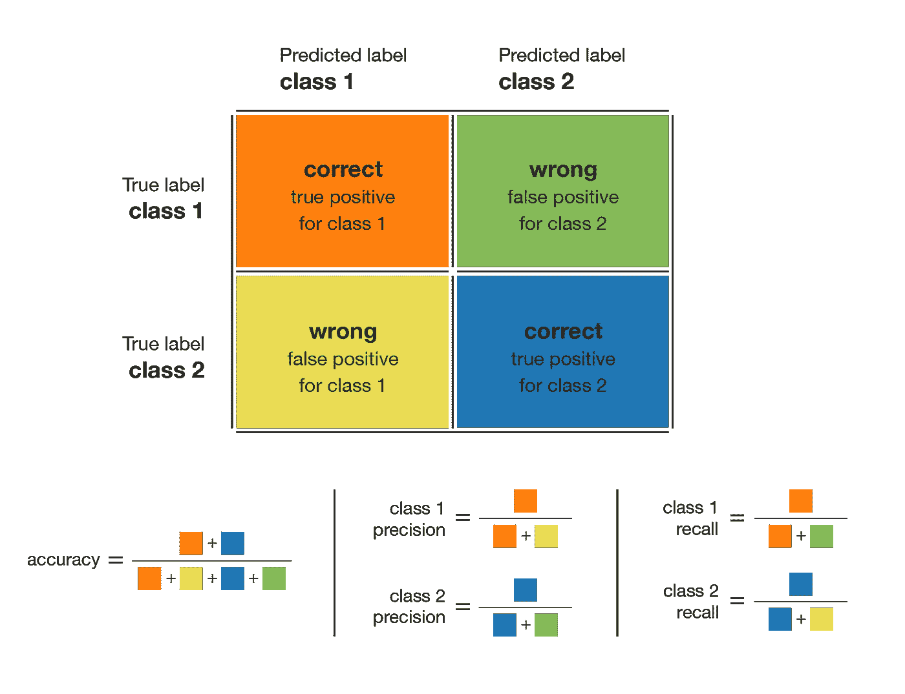

The confusion matrix and the metrics that can be derived from it.

让我们简单描述一下这些指标。模型的准确性基本上是正确预测的总数除以预测的总数。类别的精度定义了当模型回答一个点属于该类别时结果的可信度。类别的召回表示模型能够多好地检测该类别。一个类的 F1 值由精度和召回率的调和平均值(2×精度×召回率/(精度+召回率))给出，它将一个类的精度和召回率结合在一个度量中。

对于给定的类，召回率和精确度的不同组合具有以下含义:

*   高召回率+高精度:该类被模型完美处理
*   低召回率+高精确度:模型不能很好地检测类，但是当它检测到类时是高度可信的
*   高召回率+低精确度:该类被很好地检测到，但是该模型还包括其他类的点
*   低召回率+低精确度:模型对类的处理很差

在我们的介绍性示例中，我们有以下 10000 种产品的混淆矩阵。

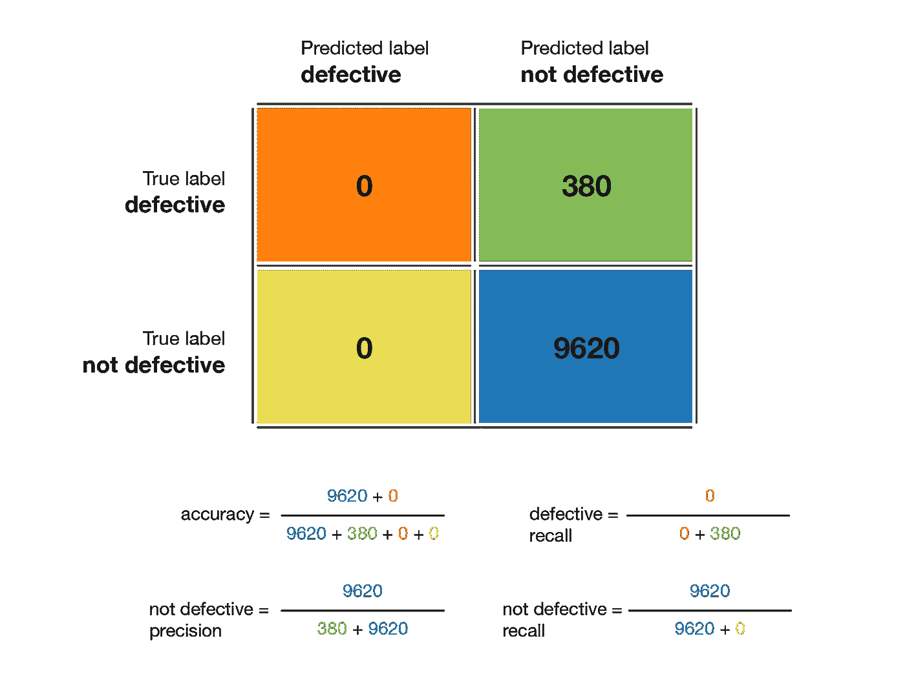

The confusion matrix of our introductory example. Notice that the “defective” precision can’t be computed.

如前所述，准确率为 96.2%。无缺陷类别精度为 96.2%，缺陷类别精度不可计算。无缺陷类别的召回率为 1.0，这是完美的(所有无缺陷产品都被贴上了这样的标签)。但是缺陷类的召回率是 0.0，这是最差的情况(没有检测到缺陷产品)。因此，我们可以得出结论，我们的模型对于这个类做得不好**。有缺陷产品的 F1 分数不可计算，无缺陷产品的 F1 分数为 0.981。在本例中，查看混淆矩阵可能会导致重新思考我们的模型或目标(正如我们将在以下部分看到的)。它可以避免使用无用的模型。**

## ROC 和 AUROC

另一个有趣的度量是 ROC 曲线(代表接收器工作特性)，它是根据给定的类别定义的(在下文中我们将表示为 C)。

假设对于给定的点 x，我们有一个模型，输出这个点属于 C 的概率:P(C | x)。基于这种概率，我们可以定义一个判定规则，即当且仅当 P(C | x)≥T 时，x 属于 C 类，其中 T 是定义我们的判定规则的给定阈值。如果 T=1，只有当模型 100%确信某个点属于 C 时，该点才被标记为属于 C。如果 T=0，每个点都被标记为属于 c。

阈值 T 的每个值产生一个点(假阳性、真阳性)，然后，ROC 曲线是当 T 从 1 变化到 0 时产生的点的集合所描述的曲线。这条曲线从点(0，0)开始，到点(1，1)结束，并且是递增的。一个好的模型会有一条从 0 到 1 快速增加的曲线(意味着只需要牺牲一点点精度就可以获得高召回率)。

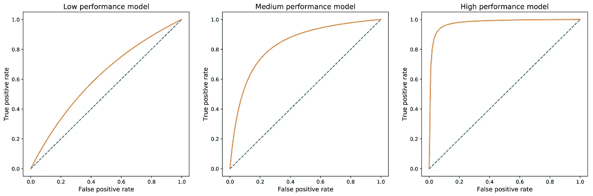

Illustration of possible ROC curves depending on the effectiveness of the model. On the left, the model has to sacrifice a lot of precision to get a high recall. On the right, the model is highly effective: it can reach a high recall while keeping a high precision.

基于 ROC 曲线，我们可以建立另一个更容易使用的指标来评估模型:AUROC，即 ROC 曲线下的面积。AUROC 有点像总结整个 ROC 曲线的标量值。可以看出，AUROC 在最佳情况下趋向于 1.0，在最差情况下趋向于 0.5。
同样，好的 AUROC 分数意味着我们正在评估的模型不会牺牲很多精度来获得对观察类(通常是少数类)的良好召回。

# 真正的问题是什么？

在试图解决这个问题之前，让我们试着更好地理解它。为此，我们将考虑一个非常简单的例子，它将允许我们快速回顾两类分类的一些基本方面，并更好地掌握不平衡数据集的基本问题。这个例子也将在下面的章节中使用。

## 不平衡的例子

让我们假设我们有两个班级:C0 和 C1。来自 C0 类的点遵循均值为 0、方差为 4 的一维高斯分布。来自 C1 类的点遵循均值为 2、方差为 1 的一维高斯分布。假设在我们的问题中，C0 类代表了数据集的 90%(因此，C1 类代表了剩下的 10%)。在下图中，我们描绘了一个包含 50 个点的代表性数据集，以及两个类按正确比例的理论分布

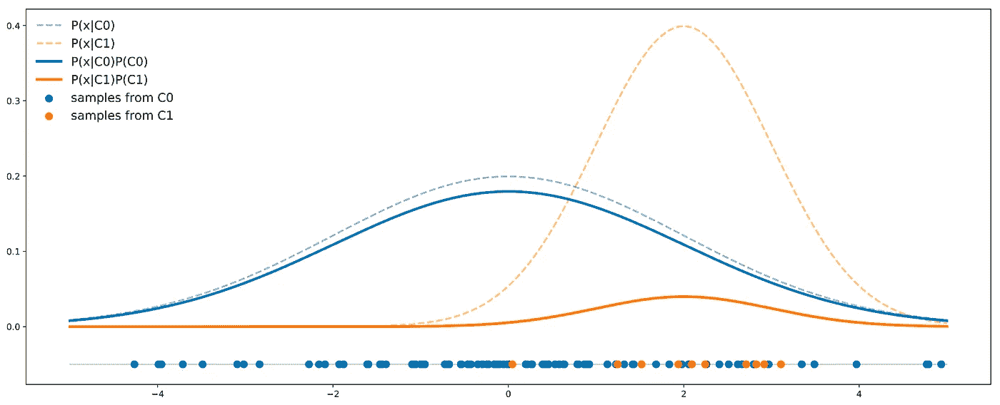

Illustration of our imbalanced example. Dotted lines represent the probability densities of each class independently. Solid lines also take into account the proportions.

在这个例子中，我们可以看到 C0 类的曲线总是在 C1 类的曲线之上，因此，对于任何给定点，该点从 C0 类中提取的概率总是大于从 C1 类中提取的概率。数学上，使用基本的贝叶斯规则，我们可以写

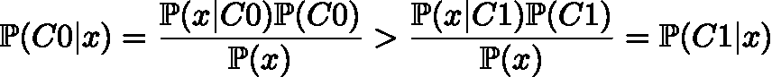

我们可以清楚地看到先验的影响，以及它如何导致一个类总是比另一个类更有可能的情况。

所有这些意味着，即使从完美的理论角度来看，我们知道，如果我们必须在这些数据上训练一个分类器，**当总是回答 C0** 时，分类器的准确性将是最大的。因此，如果目标是训练一个分类器以获得尽可能好的准确性，那么这不应该被视为一个问题，而只是一个事实:有了这些特征，我们能做的最好的事情(就准确性而言)就是总是回答 C0。我们必须接受它。

## 关于可分性

在给定的例子中，我们可以观察到这两个类是不可分的(它们彼此相距不远)。然而，我们可以注意到，面对不平衡的数据集并不一定意味着这两个类不能很好地分离，因此，分类器不能在少数类上做得很好。例如，假设我们仍然有两个类 C0 (90%)和 C1 (10%)。C0 的数据遵循均值为 0、方差为 4 的一维高斯分布，而 C1 的数据遵循均值为 10、方差为 1 的一维高斯分布。如果我们像以前一样绘制数据，那么我们有

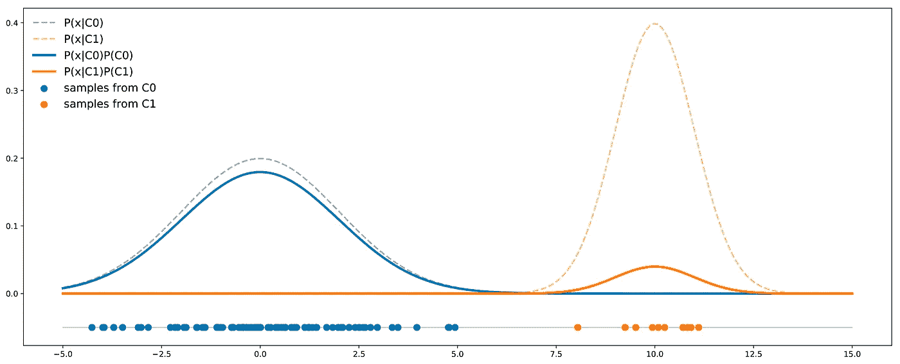

In our Gaussian example, if the means are different enough with respect to the variances, even imbalanced classes can be well separable.

这里我们看到，与前一种情况相反，C0 曲线并不总是高于 C1 曲线，因此，有些点更可能来自 C1 类而不是 C0 类。在这种情况下，这两个类足够分开以补偿不平衡:一个分类器不一定总是回答 C0。

## 理论最小误差概率(∞)

最后，我们应该记住一个分类器有一个理论上最小的错误概率。对于这种分类器(一个特征，两个类别)，我们可以提到，在图形上，理论上的最小误差概率是由两条曲线的最小值下面的面积给出的。

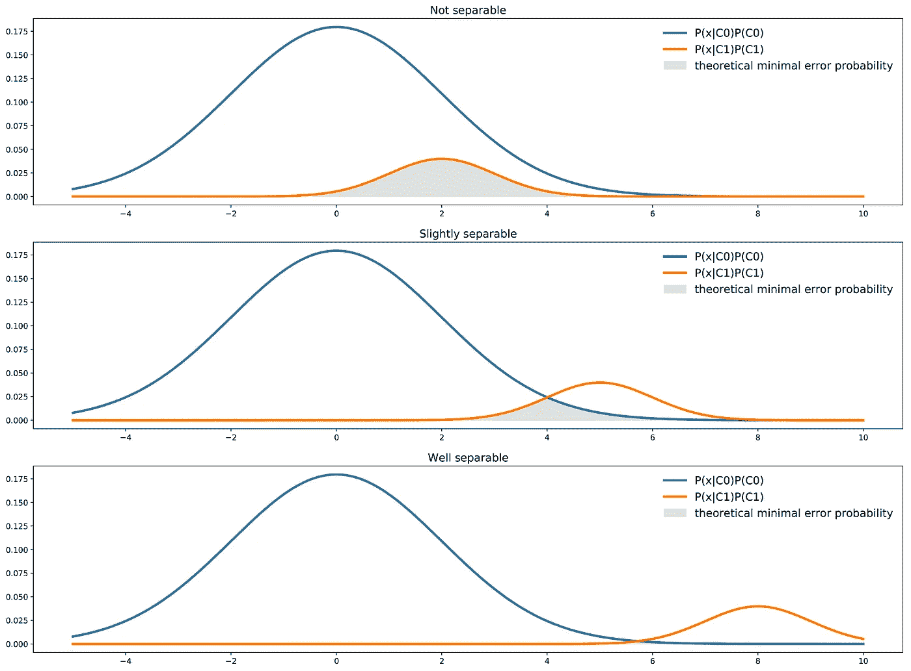

Illustration of the theoretical minimal error for different degree of separability of two classes.

我们可以用数学方法恢复这种直觉。实际上，从理论的角度来看，最好的可能分类器将为每个点 x 选择两个类别中最可能的一个。这自然意味着，对于给定的点 x，最佳理论误差概率由这两类中可能性较小的一类给出

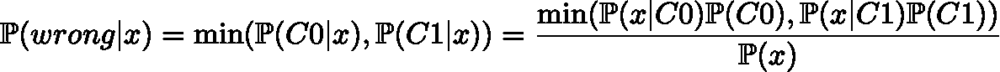

然后我们可以表示总的错误概率

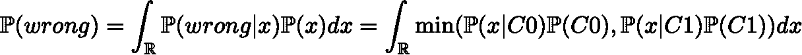

该面积是上述两条曲线中最小值下方的面积。

# 返工数据集并不总是一个解决方案

首先，当面对不平衡的数据集时，第一个可能的反应是认为数据不代表现实:如果是这样，我们假设真实数据几乎是平衡的，但在收集的数据中存在比例偏差(例如，由于收集方法)。在这种情况下，尝试收集更具代表性的数据几乎是强制性的。现在，让我们看看，当数据集不平衡时，我们能做些什么，因为现实就是如此。在接下来的两节中，我们将介绍一些经常被提及的处理不平衡类和处理数据集本身的方法。特别是，我们讨论了与欠采样、过采样和生成合成数据相关的风险，以及获得更多功能的好处。

## 欠采样、过采样和生成合成数据

这些方法通常被认为是在数据集上安装分类器之前平衡数据集的好方法。简言之，这些方法对数据集的作用如下:

*   欠采样包括从多数类中采样，以便只保留这些点的一部分
*   过采样包括从少数类中复制一些点，以增加其基数
*   生成合成数据包括从少数类创建新的合成点(例如参见 SMOTE 方法)以增加其基数

所有这些方法都旨在重新平衡(部分或全部)数据集。但是我们应该重新平衡数据集，使两个类的数据一样多吗？还是多数阶级应该保持最具代表性？如果是这样，我们应该以什么样的比例进行再平衡？

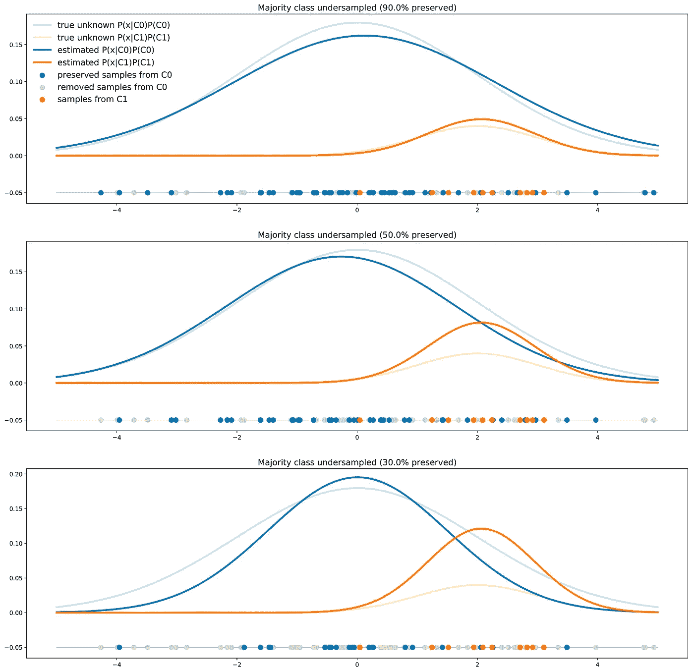

Illustration of the effect that different degrees of majority class undersampling have on the model decisions.

当使用重采样方法时(例如，从 C0 获得的数据与从 C1 获得的数据一样多)，**我们在训练期间向分类器显示了两个类别的错误比例**。以这种方式学习的分类器在未来的真实测试数据上将比在未改变的数据集上训练的分类器具有更低的准确度。事实上，了解类的真实比例对于分类新点非常重要，而在对数据集进行重采样时，这些信息已经丢失。

因此，如果这些方法不能被完全拒绝，它们应该被谨慎地使用:如果有目的地选择新的比例(我们将在下一节看到这一点)，它可以导致一个相关的方法，但是仅仅重新平衡类而不进一步考虑这个问题也可能是一个没有意义的事情。总结这一小节，让我们假设**用类似重采样的方法修改数据集正在改变现实，因此需要小心**并记住这对我们分类器的输出结果意味着什么。

## 获取附加功能

我们在上一小节中讨论了这样一个事实，即对训练数据集进行重采样(修改类的比例)是不是一个好主意取决于分类器的真正目的。我们特别看到，如果两个类别不平衡，不能很好地分离，并且我们的目标是一个尽可能准确的分类器，那么得到一个总是回答同一个类别的分类器不一定是一个问题，而只是一个事实:没有什么比这些变量更好的了。

但是，通过使用附加要素(或更多要素)丰富数据集，仍有可能获得更好的精度结果。让我们回到我们的第一个例子，在这个例子中，类是不可分的:也许我们可以找到一个新的附加特征来帮助区分这两个类，从而提高分类器的准确性。

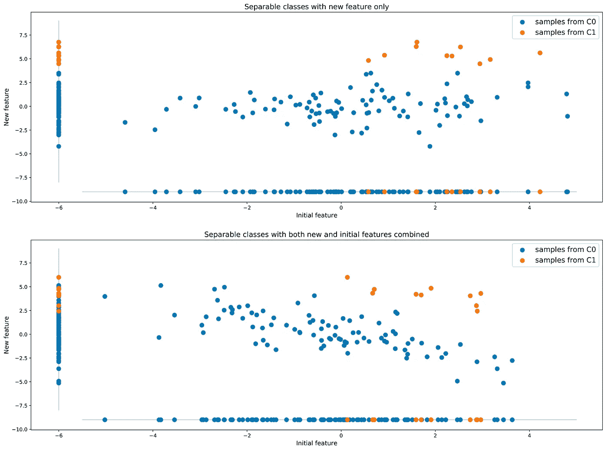

Looking for additional features can help separate two classes that were not initially separable.

与前一小节中提到的建议改变数据的真实性的方法相比，这种用更多来自现实的信息来丰富数据的方法是一个更好的想法。

# 返工问题更好

到目前为止，结论是相当令人失望的:如果数据集是真实数据的代表，如果我们不能获得任何额外的特征，如果我们的目标是具有最佳可能准确性的分类器，那么“幼稚行为”(回答总是相同的类)不一定是问题，应该被接受为事实(当然，如果幼稚行为不是由于所选分类器的有限能力)。

那么如果我们对这些结果仍然不满意呢？在这种情况下，这意味着，以这样或那样的方式，**我们的问题没有被很好地陈述**(否则我们应该照原样接受结果)，并且我们应该重新工作以便获得更令人满意的结果。让我们看一个例子。

## 基于成本的分类

感觉得到的结果不好可能是因为目标函数没有被很好地定义。到目前为止，我们假设我们的目标是一个具有高精度的分类器，同时假设两种错误(“假阳性”和“假阴性”)具有相同的成本。在我们的例子中，这意味着我们假设当真实标签是 C1 时预测 C0 和当真实标签是 C0 时预测 C1 一样糟糕。误差是对称的。

让我们考虑一下有缺陷(C1)和无缺陷(C0)产品的介绍性例子。在这种情况下，我们可以想象，与错误地将一个没有缺陷的产品贴上有缺陷的标签(生产成本损失)相比，没有检测到一个有缺陷的产品会给公司带来更大的成本(客户服务成本，如果有危险的缺陷，可能的司法成本……)。现在，当真正的标签是 C1 时预测 C0 比当真正的标签是 C0 时预测 C1 要糟糕得多。误差不再是对称的。

然后更具体地考虑我们有以下成本:

*   当真实标签为 C1 时预测 C0 的成本为 P01
*   当真实标注为 C0 时，预测 C1 的成本为 P10(0 < P10 < < P01)

然后，我们可以重新定义我们的目标函数:我们不再以最佳精度为目标，而是寻找更低的预测成本。

## 理论最小成本(∞)

从理论的角度来看，我们不想最小化上面定义的误差概率，但是预期的预测成本由下式给出

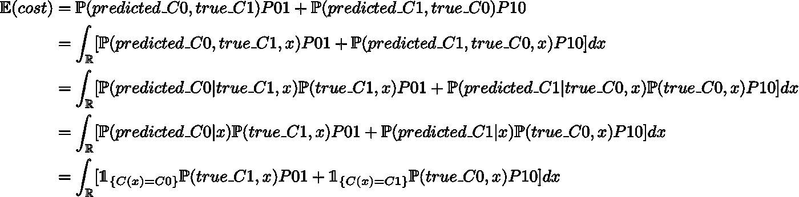

其中 C(。)定义了分类器函数。因此，如果我们想要最小化预期的预测成本，理论上的最佳分类器 C(。)最小化

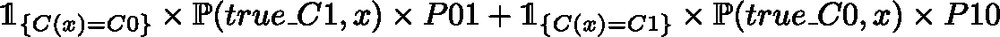

或者等价地，除以 x 的密度，C(。)最小化

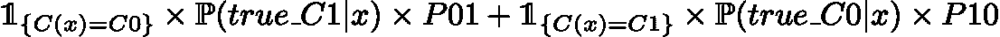

因此，利用这个目标函数，从理论角度来看，最佳分类器将是这样的:

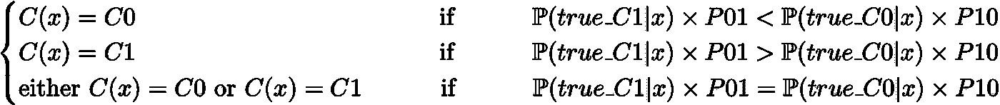

请注意，当成本相等时，我们恢复了“经典”分类器的表达式(侧重于准确性)。

## 概率阈值

在我们的分类器中考虑成本的第一种可能的方法是在训练之后进行。这个想法是，首先，训练一个分类器的基本方法是输出以下概率

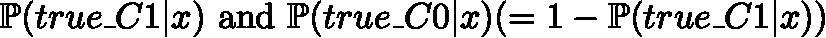

无需承担任何成本。那么，预测的类将是 C0 if

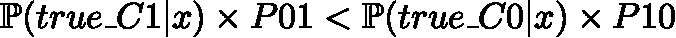

C1 则不然。

在这里，我们使用哪个分类器并不重要，只要它输出给定点的每个类的概率。在我们的主要示例中，我们可以在数据上拟合一个贝叶斯分类器，然后我们可以重新加权获得的概率，以调整带有成本误差的分类器，如上所述。

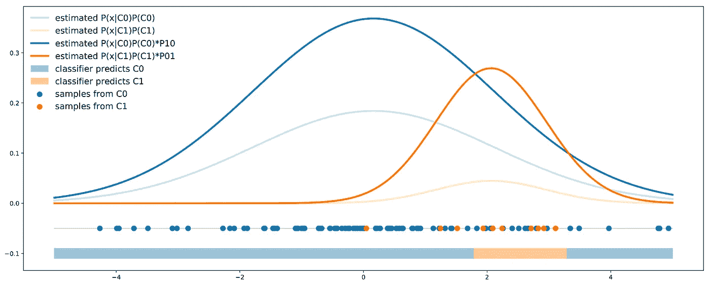

Illustration of the probability threshold approach: the outputted probabilities are reweighted such that costs are taken into account in the final decision rule.

## 等级重新加权

类重新加权的思想是在分类器训练期间直接考虑成本误差的不对称性。这样做，每个类别的输出概率将已经嵌入成本误差信息，然后可以用于定义具有简单的 0.5 阈值的分类规则。

对于一些模型(例如神经网络分类器)，在训练期间考虑成本可以在于调整目标函数。我们仍然希望我们的分类器输出

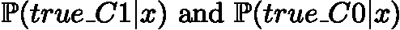

但这一次，它被训练成最小化以下成本函数

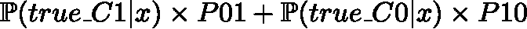

对于其他一些模型(例如贝叶斯分类器)，可以使用重采样方法来偏置类比例，以便在类比例中输入成本误差信息。如果我们考虑成本 P01 和 P10(这样 P01 > P10)，我们可以:

*   以因子 P01/P10 对少数民族类进行过采样(少数民族类的基数应乘以 P01/P10)
*   通过因子 P10/P01 对多数类进行欠采样(多数类的基数应乘以 P10/P01)

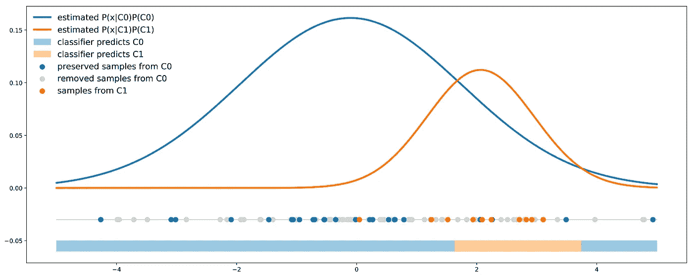

Illustration of the class reweight approach: the majority class is undersampled with a proportion that is chosen carefully to introduce the cost information directly inside the class proportions.

# 外卖食品

这篇文章的主要观点是:

*   无论何时使用机器学习算法，都必须谨慎地选择模型的评估指标:我们必须使用能够最好地概括我们的模型相对于我们的目标表现如何的指标
*   当处理不平衡的数据集时，如果类与给定的变量不能很好地分离，并且如果我们的目标是获得尽可能好的准确性，那么最好的分类器可能是一个总是回答多数类的“幼稚”分类器
*   可以使用重采样方法，但必须仔细考虑:它们不应该作为独立的解决方案使用，而是必须与问题的返工相结合，以达到特定的目标
*   返工问题本身通常是解决不平衡类问题的最佳方式:分类器和决策规则必须根据精心选择的目标来设置，例如，最小化成本

我们应该注意到，我们根本没有讨论像“分层抽样”这样在批量训练分类器时有用的技术。当面临不平衡的类问题时，这种技术确保训练期间更大的稳定性(通过消除批内的比例差异)。

最后，姑且说这篇文章的主要关键词是“目标”。准确地知道您想要获得什么将有助于克服不平衡的数据集问题，并确保获得最佳结果。完美地定义目标应该永远是要做的第一件事，也是为了创建机器学习模型而必须做的任何选择的起点。

感谢阅读！

与约瑟夫·罗卡一起写的最后一篇文章:

 [## 理解生成敌对网络(GANs)

### 一步一步地建立导致 GANs 的推理。

towardsdatascience.com](/understanding-generative-adversarial-networks-gans-cd6e4651a29)