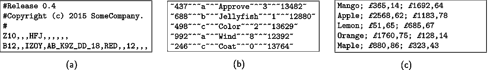

# 处理杂乱的 CSV 文件

> 原文：<https://towardsdatascience.com/handling-messy-csv-files-2ef829aa441d?source=collection_archive---------14----------------------->

## 为什么它们是一个问题以及如何解决


Photo by [Jan Kolar](https://unsplash.com/@jankolar) on [Unsplash](https://gertjanvandenburg.com/blog/csv/unsplash.com).

如果你是一名工作数据科学家，CSV 文件很可能是你的面包和黄油。它们对于人类和计算机来说都很容易阅读，可以在版本控制中被跟踪，并且可以很容易地通过电子邮件发送和压缩！但是，如果您已经工作了一段时间，您可能也熟悉 CSV 文件的黑暗面:不常见的单元格分隔符、不均匀的行长度、双引号、转义字符、注释行等等！😱

这个问题有一个非常简单的原因:“逗号分隔值”文件不是一种标准的文件格式，但实际上更像是一种人们尚未完全同意的约定。因此，您可能在互联网上遇到的 CSV 文件格式的变体数量是巨大的！作为示例，以下是一些真实世界的 CSV 文件示例:



Examples of real-world CSV files: `(a)` includes comment lines at the top, prefixed with the # character, which is not part of the CSV "standard", `(b)` uses the `^` symbol as delimiter and the `~` symbol for quotes, and `(c)` uses the semicolon as delimiter, but yields the exact same number of columns when using the comma.²

为什么这是个问题？为什么我们关心 CSV 文件以不同的格式出现？在保存表格数据时，这难道不是一种表达个性的绝妙方式吗？嗯……不是。CSV 文件是用来存储数据的，所以应该很容易从中加载数据。通过改变所使用的格式，CSV 文件在加载之前需要人工检查。

这是后一点的一个例子。[Kaggle](https://www.kaggle.com/orgesleka/imdbmovies)上的这个数据集包含了从 IMDB 检索到的 14762 部电影的信息。假设我们希望将这些数据加载到 Python 中，并希望使用 Pandas 将其加载到一个漂亮的数据框中:

```
>>> import pandas as pd
>>> df = pd.read_csv('./imdb.csv')
Traceback (most recent call last):
# ... skipping the full traceback ... 
pandas.errors.ParserError: Error tokenizing data. C error: Expected 44 fields in line 66, saw 46
```

哼，那没用。如果我们使用检测格式的标准方法，也称为*方言*，并按照[Python 标准 csv 库文档](https://docs.python.org/3/library/csv.html#csv.Sniffer)的建议加载文件，会怎么样？

```
>>> import csv 
>>> with open('./imdb.csv', newline='') as csvfile: 
... dialect = csv.Sniffer().sniff(csvfile.read())
... csvfile.seek(0)
... reader = csv.reader(csvfile, dialect)
... rows = list(reader)
>>> len(rows)
13928
```

好的，这确实做了一些事情，但是最终读取了 13，928 行，而不是我们预期的 14，762 行！这是怎么回事？？

事实证明，当电影标题包含逗号时，这个特殊的 CSV 文件使用了转义字符(`\`)。Pandas 和标准的`csv`库都没有自动检测到这一点，因此无法正确加载数据。想象一下，如果你开始分析这些数据，而没有意识到这种情况发生了！🙈

当然，您可以手动检查您在 web 上遇到的每个 CSV 文件，并确保它没有任何问题。但是都 2019 年了，为什么还要处理乱七八糟的 CSV 文件？为什么这些包不能正确检测方言？这很困难的一个原因是，CSV 文件有太多的变体。另一个原因是，要想出一个能一直正确完成的算法实际上并不容易，因为任何方言都会给你*一些*表，但应该只有*一个*表正确反映存储的数据。

> CSV 是一个教科书式的例子，说明了如何*而不是*设计文本文件格式。
> —Unix 编程的艺术(Raymond，2003)

谢天谢地，现在有一个解决方案: [CleverCSV](https://github.com/alan-turing-institute/clevercsv) ，一个用于高精度检测 CSV 文件方言的 Python 包。它是以人类确定方言的方式为模型的:通过寻找导致单元格中有“干净数据”的规则表格结构的模式(如数字、日期等)。).CleverCSV 实际上是基于[研究](https://rdcu.be/bLVur)，在那里我们调查了近 10，000 个 CSV 文件，以开发检测 CSV 方言的最佳方法。为了便于将现有代码切换到 CleverCSV，该包被设计为 CSV 模块的直接替代品。所以不用`import csv`，你可以用`import clevercsv`(或者，如果你真的很聪明的话:`import clevercsv as csv`)。

但是等等，还有呢！当然，您不希望一遍又一遍地检测同一个文件的方言，因为它不太可能经常改变。因此，CleverCSV 还提供了一个命令行界面，它只给你你 need:⁴的代码

```
$ clevercsv code ./imdb.csv# Code generated with CleverCSV version 0.4.7import clevercsvwith open(“imdb.csv”, “r”, newline=””, encoding=”utf-8") as fp:
    reader = clevercsv.reader(fp, delimiter=”,”, quotechar=””, escapechar=”\\”)
    rows = list(reader)
```

CleverCSV 还附带了一些常用功能的包装器，比如`read_csv`用于检测方言并将文件加载为列表列表，以及`csv2df`用于将文件加载到 Pandas 数据框中。GitHub 和 PyPI 上的[提供了 CleverCSV。此外，导致 CleverCSV 的研究是完全可重复的，并且是公开的](https://github.com/alan-turing-institute/CleverCSV)(如果你关心这样的事情！:))

数据争论和数据清理是数据科学家最耗时的任务，也不是最有趣的。事实上，[的调查显示](https://visit.figure-eight.com/data-science-report.html)数据科学家将大部分时间花在这些琐碎的任务上，同时也是他们最不喜欢的工作部分！CleverCSV 是一个旨在部分解决这一问题的工具，它为数据科学家提供了一种从杂乱的 CSV 文件中正确加载数据的枯燥任务，从而节省了时间。我希望你试一试！

**脚注**

1.  RFC4180 提出了一个定义，但这不是正式意义上的标准，库和编程语言并不总是遵循它。
2.  图片改编自:G.J.J. van den Burg，A. Nazábal，C. Sutton，[通过检测行和类型模式来处理杂乱的 CSV 文件](https://rdcu.be/bLVur) (2019)，数据挖掘与知识发现 33:(6)。
3.  相比之下，R 的`read.csv()`方法也好不到哪里去，最终读取了 15，190 行！
4.  如果你更喜欢熊猫数据框，只需使用:`clevercsv code -p <filename>`。

*原载于 2019 年 11 月 26 日*[*https://gertjanvandenburg.com*](https://gertjanvandenburg.com/blog/csv)*。*