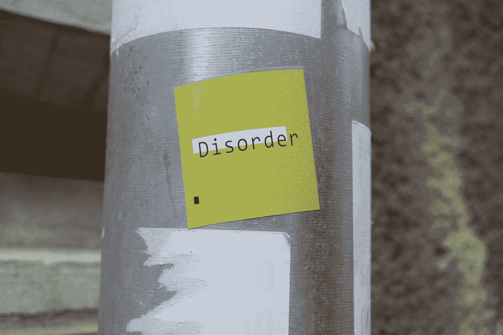
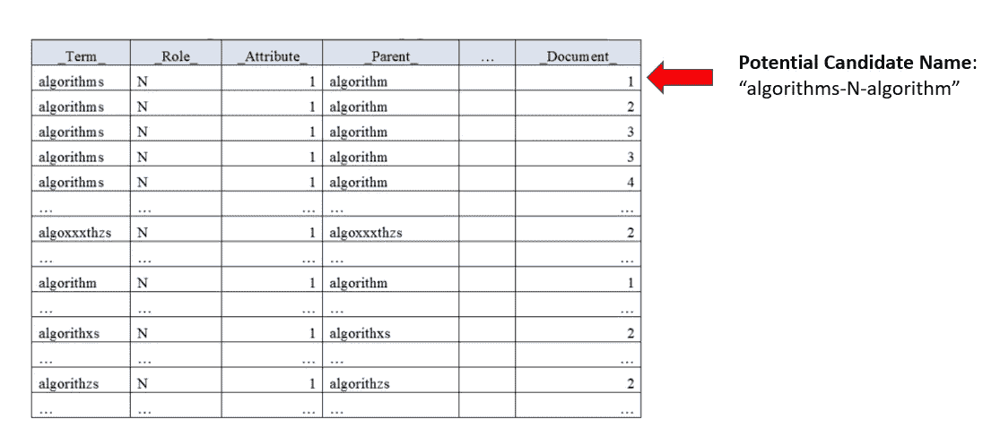
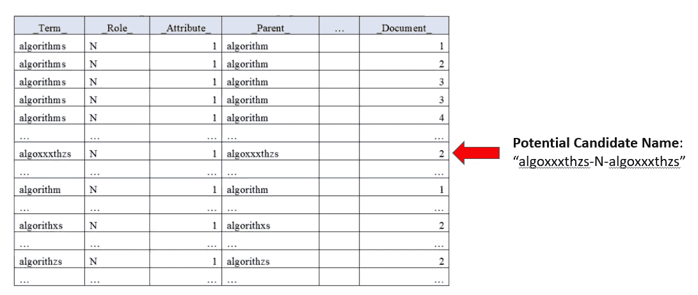
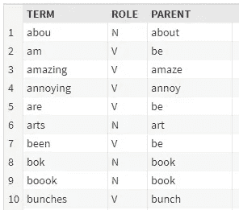
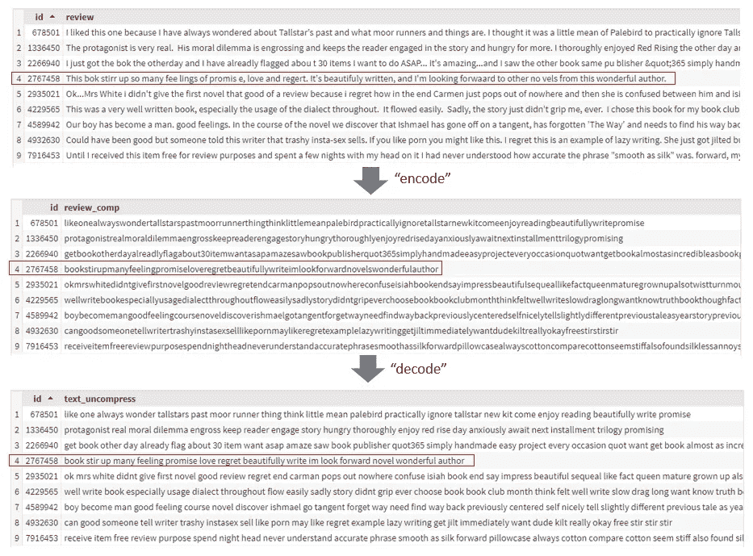

# 处理文本数据质量问题:你能处理吗？

> 原文：<https://towardsdatascience.com/handling-text-data-quality-issues-can-yuo-h-andle-thsi-7f77dac3ddff?source=collection_archive---------34----------------------->



Photo by [Marija Zaric](https://unsplash.com/@simplicity?utm_source=medium&utm_medium=referral) on [Unsplash](https://unsplash.com?utm_source=medium&utm_medium=referral)

# 介绍

退一步说，过去的几周很有趣。我收到了一个非常有趣的问题，任务是解决一些文本数据质量问题。

正如您可能已经从标题中猜到的那样，有两个主要问题需要解决。

1.  拼写错误的检测和处理
2.  单词之间的随机空格

> 你能处理这个吗？

作为人类，我们可以很容易地将上面的陈述理解为“你能处理这个吗？”然而，创建一种方法来解决这样的数据问题被证明是具有挑战性的。

如果你像我一样，你可能会说“哦，这不应该是**那**坏！”

**哦…我错了。**

> 永远不要低估会突然出现并导致大量问题的复杂性。

无论如何，在本文中，我将介绍我用来解决这个问题的方法。这可能不是最好的方法，但似乎对我来说已经足够了。

我们开始吧！:)

# 数据质量问题 1:拼写错误的检测和处理

在我上一篇关于处理拼写错误的文章中，我使用了单词向量并做了大量的翻译来形成一个[广义翻译向量](/using-a-generalised-translation-vector-for-handling-misspellings-and-out-of-vocabulary-oov-words-494cd142cd31)。

这是一种处理单词向量拼写错误的新方法。

然而，对于这种情况，我决定求助于一种更简单的方法来处理拼写错误。

这包括两个部分:

1.  检测拼写错误的单词
2.  处理拼写错误的单词

我使用了 [SAS Viya 的](https://www.sas.com/en_sg/software/viya.html#products)开箱即用的拼错动作 **tpSpell** 来做到这一点。

> SAS 与称为**动作集**的东西一起工作，动作集与 Python 库同义。在每个动作集中，有许多可以执行的**动作**。

## 第 1 部分:检测拼写错误的单词

在这个步骤中，tpSpell 动作执行所谓的**候选提取。**

候选提取将单词分成两类；拼写正确的候选单词和拼写错误的候选单词。

在运行该过程之前，由预设参数确定拼写正确的候选单词。此参数指定一个术语要被视为拼写正确的候选单词，必须出现在多少个文档中。

例如，参考下面的图 1:



Figure 1 — Correctly-spelled candidate example ([source](https://go.documentation.sas.com/?cdcId=pgmsascdc&cdcVersion=9.4_3.4&docsetId=casvtapg&docsetTarget=n1v6fwv203gwamn12k2plw3hsstl.htm&locale=en))

> 潜在的候选名称是“Term”、“Role”和“Parent”列的串联，形成“algorithms-N-algorithm”。

如果潜在候选名称“algorithms-N-algorithm”在 4 个文档中出现 5 次，那么它出现的文档的数量等于 4。

如果名为“最小亲本”的预设参数被设置为 3，因为 4 比 3 大，所以单词“algorithms-N-algorithm”被添加到拼写正确的候选列表中。

跟了这么远？:)

那么，拼写错误的候选单词列表呢？我们如何创建这个表？

就像拼写正确的单词候选列表一样，还有另一个预设参数。这次叫“最大子女”。

例如，请看下面的图 2:



Figure 2 — Misspelled candidate example ([source](https://go.documentation.sas.com/?cdcId=pgmsascdc&cdcVersion=9.4_3.4&docsetId=casvtapg&docsetTarget=n1v6fwv203gwamn12k2plw3hsstl.htm&locale=en))

如果“最大子代”参数被设置为 3 **并且**“algoxxxthzs-N-algoxxxthzs”出现的文档数小于 3，那么“algoxxxthzs-N-algoxxxthzs”被添加到拼写错误的候选单词列表中。

> 注:如果符合上述参数，潜在候选人可以同时出现在两个候选人列表中。

现在我们已经有了一个拼写正确的候选列表和一个拼写错误的候选列表，接下来是如何将拼写正确的单词分配给它们各自的拼写错误。

## 第 2 部分:处理拼写错误

在该步骤中，执行**候选比较**。

tpSpell 动作现在将检查拼写错误列表中的所有单词和拼写正确列表中的所有单词。

它将拼写错误的候选单词与每个拼写正确的候选单词进行比较，并计算它们之间的距离。

另一个预置参数确定拼写错误的单词是否有正确的拼写。例如，如果单词“algoxxxthzs”是给定的拼写错误的单词**并且**单词“算法”是正确拼写的候选单词，那么计算出的“algoxxxthzs”和“算法”之间的距离将是 50。

如果名为“最大法术距离”的预设参数设置为 20。由于 50 大于 20，正确拼写的候选“算法”现在被认为是单词“algoxxxthzs”的正确拼写。

您还可以在这里设置其他高级参数，以考虑多个术语，如“消防车”、“继续”或“加入”等。你可以在这里阅读文档[。](https://go.documentation.sas.com/?cdcId=pgmsascdc&cdcVersion=9.4_3.4&docsetId=casvtapg&docsetTarget=n1v6fwv203gwamn12k2plw3hsstl.htm&locale=en)

虽然我在上面说得听起来很复杂…

**不是。:)**

下面是如何运行以上所有操作的方法。

```
proc cas;
 textParse.tpSpell /
  table={name="pos", caslib="public"}
  minParents=3
  maxChildren=6
  maxSpellDist=15
  casOut={name="tpSpell_Out", replace=true};
   run;
quit;
```

结果将是这样的:



Figure 3 — Misspelling Handling Results

# 数据质量问题 2:随机空白

这个问题确实让我测试了多种方法。所有这些都表现不好，除了我现在要讲的方法。

> 为了恢复你的记忆，你的问题就像这样。

当我收到这样一个数据集时，我的第一个想法是“这个文本怎么会变成这样……”

但是，嘿，这是真实的世界。不是我们都熟悉的 kaggle 数据集或我们的研究数据集。

不过，上面有几个数据质量问题值得指出:

1.  单词之间的空格，如“probl em”
2.  缺少字符，即“锁定”
3.  交换字符，即“thsi”
4.  双重字符，即“你”
5.  问题的组合，即“m emry”

我必须找到一种方法来解决单词之间的空格，同时解决拼写错误(数字 2、3 和 4)。

令人欣慰的是，处理拼写错误可以相对容易地解决，就像我上面展示的那样。

但是由于问题的组合，复杂性在于如何最好地处理(第五点)。在思考这项工作的最佳解决方案时，我从编码器-解码器网络的工作方式中获得了灵感。

> 我需要一种方法来“编码”句子，然后“解码”它们。

显然我在这里用词不当。我说的“编码”实际上是指删除单词之间的所有空白。像这样:

> torefreshyyourmerytheeplokeddlikethsi

通过“解码”，我的意思是在解决拼写错误后，将单词重新分解成它们各自的单词:

> 提醒你一下，这个问题看起来是这样的

解码的单词基于单词的最长匹配。例如，如果我看到单词“helloworld ”,我将首先在潜在候选列表中查找单词“hell”。

直到下一个字符“o”出现，由于“hell+o”=“hello”，“hello”成为更好的潜在候选。我放弃了“地狱”这个词作为主要候选词，保留了“你好”这个词。

当读入下一个字符时，“hello+w”=“hellow”，因为“hellow”在潜在候选列表中不是一个合适的单词，所以最好的候选词是“hello”。

然后，我在“hello”和“world”之间添加一个空格，形成“hello world”。

> 那么这个**潜在候选名单**是什么呢？

这是我**从前面的 tpSpell 动作生成的正确拼写单词列表中挑选出来的列表。**

## 潜在候选人名单的管理

创建这个列表的诀窍在于我如何进行标记化。

是的，有现成的标记化方法，但没有一种方法会进行拼写错误检查，因为它同时执行标记化。

简单地说，我做了一个标记器，在解析标记时执行拼写错误的解析。

比如“hello wrld”会解析为“hello”+“world”。拼写错误的“wrld”将自动解析为“world ”,这是基于我用前面提到的 tpSpell 操作创建的一个拼写错误列表。

除了拼写错误的解决方案，我还删除了停用词，所有形式的标点符号，小写所有单词，只保留父术语来形成列表。

为什么？

因为最重要的总是那些小事情。

此处删除停用词是合理的，因为:

1.  下游自然语言处理(NLP)任务是一个信息检索任务。即文档相似性。在文档相似性任务中，保持语义相关信息比语法相关信息更重要。因此我认为，删除停用词不会对我的下游任务产生太大影响。
2.  如果不删除停止字，它将干扰我的“解码器”的工作。以这句话为例:

> “丛书”->“丛书”

考虑停用词会将第一个词解析为“这些”而不是“该”。此外，因为“ries”不再是一个单词，所以算法将跳过这个输出，并将句子解码为“these of books”，这是不正确的。

> “这些书”->“这些书”

影响“解码器”工作方式的另一个复杂因素如下所示:

> “自行车运动”→“自行车运动”→“自行车港口”(错误)

为了解决这个问题，我只在候选列表中保留了父术语。即自行车 **s** →自行车。通过只查看父术语，我的输出如下所示:

> “自行车运动”→“自行车运动”→“自行车运动”(正确)

还有一些其他的小因素也在起作用，但是你会明白的；最重要的是小事。

所以你有它！

我自己的“编码器-解码器”方法来解决这个文本数据质量问题！:)

很明显，我已经简化了整个方法，以便给你一个解决方案如何工作的要点。

正如我以前说过的，这不是一个完美的解决方案，但它确实足以让我开始我的下游 NLP 任务。

# 亲眼目睹这一切！

为了向您展示运行代码后的样子，我针对一个存在数据质量问题的图书评论语料库运行了代码。

下面是示例和流程的样子:



Figure 4 — Data Cleaning Process in Action

在我看来还不算太寒酸。:)

# 结尾注释

嗯，那就这样吧！

我希望你觉得这篇文章很有见地:)

尽管花了将近 2 周的时间尝试了许多方法，但我从中获得了巨大的乐趣！

如果你有更好的方法，请不吝赐教！很想听听！

下一个帖子可能会是这个的续集。这将是关于文件的相似性，以及我如何应用平滑逆频率和共同组成部分删除，以获得一个体面的结果。

下次见，再见！

领英简介:[谭震霆](https://www.linkedin.com/in/timothy-tan-97587190)