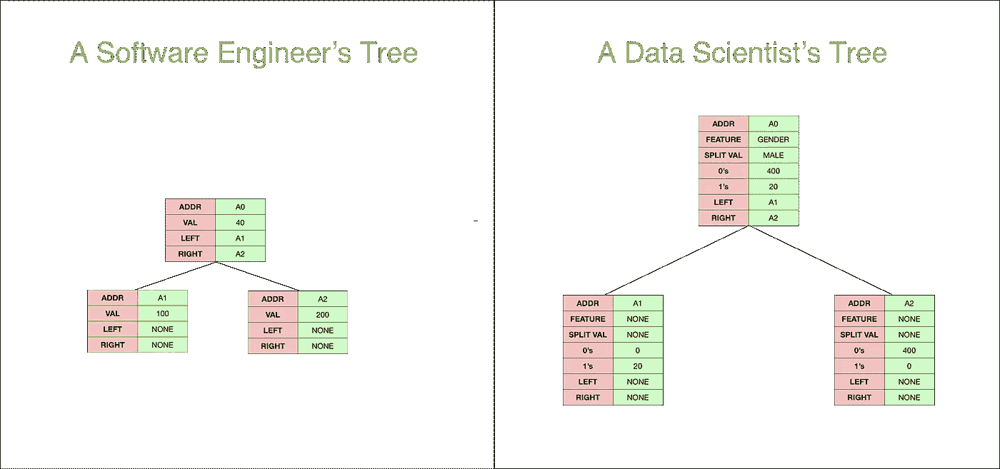
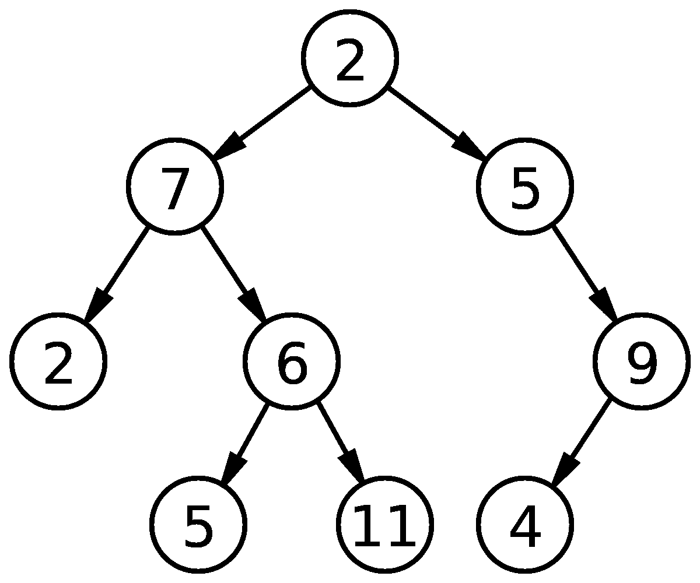
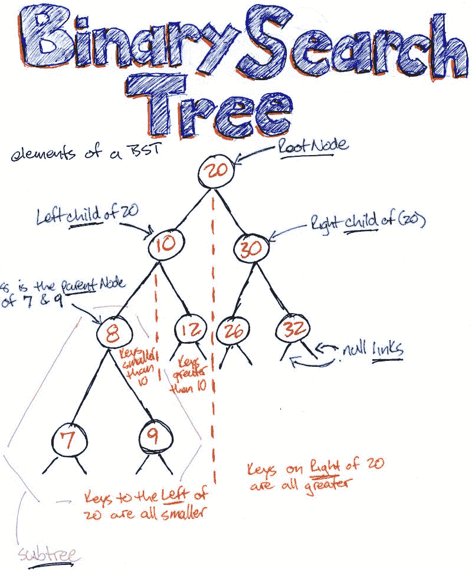

# 在数据科学算法面试中处理树

> 原文：<https://towardsdatascience.com/handling-trees-in-data-science-algorithmic-interview-ea14dd1b6236?source=collection_archive---------28----------------------->


Image by [Johannes Plenio](https://pixabay.com/users/jplenio-7645255/?utm_source=link-attribution&utm_medium=referral&utm_campaign=image&utm_content=3120483) from [Pixabay](https://pixabay.com/?utm_source=link-attribution&utm_medium=referral&utm_campaign=image&utm_content=3120483)

## [算法面试](https://towardsdatascience.com/tagged/algorithms-interview)

## 不是那种树桩

算法和数据结构是数据科学不可或缺的一部分。虽然我们大多数数据科学家在学习时都没有上过适当的算法课程，但它们仍然至关重要。

许多公司在招聘数据科学家的面试过程中会询问数据结构和算法。

现在，许多人在这里问的问题是，问一个数据科学家这样的问题有什么用。 ***我喜欢这样描述，一个数据结构问题可以被认为是一个编码能力测试。***

我们都在人生的不同阶段进行过能力倾向测试，虽然它们不是判断一个人的完美代理，但几乎没有什么是真的。那么，为什么没有一个标准的算法测试来判断人的编码能力。

但我们不要自欺欺人，他们需要像你的数据科学面试一样的热情，因此，你可能需要花一些时间来研究算法和数据结构问题。

***这篇文章是关于快速跟踪这项研究，并为数据科学家解释树的概念，以便你下次在面试中被问到这些问题时轻松通过。***

# 但是首先，为什么树对数据科学很重要？

对于数据科学家来说，树和软件工程师有着不同的含义。

对于软件工程师来说，树只是一种简单的数据结构，他们可以用它来管理层次关系，而对于数据科学家来说，树是一些最有用的分类和回归算法的基础。

那么这两个在哪里见面呢？

它们必然是同一件事。不要惊讶。下面是数据科学家和软件工程师对树的看法。



They are essentially the same

唯一的区别是数据科学树节点保存了更多的信息，帮助我们确定如何遍历树。例如，在用于预测的数据科学树的情况下，我们将查看节点中的要素，并根据分割值确定我们要移动的方向。

如果你想从头开始写你的决策树，你可能也需要从软件工程的角度理解树是如何工作的。

# 树的类型:

在这篇文章中，我将只讨论在数据科学面试问题中经常被问到的两种树。二叉树(BT)和称为二分搜索法树(BST)的二叉树的扩展。

## 1.二叉树:

二叉树是一种简单的树，其中每个节点最多有两个子节点。决策树是我们在日常生活中看到的一个例子。



Binary Tree: Each Node has up to 2 children

## 2.二叉查找树(英国夏令时):

二叉查找树是一棵二叉树，其中:

*   一个节点的所有左后代都小于或等于该节点，并且
*   该节点的所有右后代都大于该节点。

谈到平等，这个定义有各种不同的说法。有时等式在右边或两边。有时树中只允许不同的值。



[Source](https://www.freecodecamp.org/news/data-structures-101-binary-search-tree-398267b6bff0/)

8 大于左侧子树中的所有元素，小于右侧子树中的所有元素。这同样适用于树中的任何节点。

# 创建简单的树:

那么我们如何构造一棵简单的树呢？

根据定义，树是由节点组成的。所以我们从定义用于创建节点的`node`类开始。我们的节点类非常简单，因为它保存了节点的值、左侧子节点的位置和右侧子节点的位置。

```
class node:
    def __init__(self,val):
        self.val = val
        self.left = None
        self.right = None
```

我们现在可以创建一个简单的树，如下所示:

```
root = node(1)
root.left = node(2)
root.right = node(3)
```

现在我注意到，如果我们自己不做一些编码，我们就不能真正掌握基于树的问题。

因此，让我们更深入地了解一下代码部分，我发现一些关于树的最有趣的问题。

# 有序树遍历:

有很多种方法可以遍历一棵树，但是我发现顺序遍历是最直观的。

当我们在二叉查找树的根节点上进行有序遍历时，它以升序访问/打印节点。

```
def inorder(node):
    if node:
        inorder(node.left)
        print(node.val)
        inorder(node.right)
```

上述方法非常重要，因为它允许我们访问所有节点。

因此，如果我们想在任何二叉树中搜索一个节点，我们可以尝试使用 inorder 树遍历。

# 从排序后的数组创建二叉查找树

如果我们需要像上面那样手动创建一棵树，我们会是什么样的编码人员呢？

那么我们能从一个唯一元素的有序数组中创建一个 BST 吗？

```
def create_bst(array,min_index,max_index):
    if max_index<min_index:
        return None
    mid = int((min_index+max_index)/2)
    root = node(array[mid])
    leftbst = create_bst(array,min_index,mid-1)
    rightbst = create_bst(array,mid+1,max_index)
    root.left = leftbst
    root.right = rightbst
    return roota = [2,4,5,6,7]
root = create_bst(a,0,len(a)-1)
```

树本质上是递归的，所以我们在这里使用递归。我们取数组的中间元素，并将其指定为节点。然后，我们将`create_bst`函数应用到数组的左边部分，并将其分配给`node.left`，对数组的右边部分做同样的操作。

我们得到了 BST。

我们做得对吗？我们可以通过创建 BST 然后进行有序遍历来检查它。

```
inorder(root)
------------------------------------------------------------
2
4
5
6
7
```

好像没错！

# 让我们检查一下我们的树是否是有效的 BST


Think Recursion!!!

但是，如果我们需要打印所有的元素并手动检查 BST 属性是否得到满足，那么我们是什么样的编码人员呢？

这里有一个简单的代码来检查我们的 BST 是否有效。我们假设在我们的二叉查找树中存在严格的不平等。

```
def isValidBST(node, minval, maxval):
    if node:
        # Base case
        if node.val<=minval or node.val>=maxval:
            return False
        # Check the subtrees changing the min and max values
        return isValidBST(node.left,minval,node.val) &    isValidBST(node.right,node.val,maxval)
    return TrueisValidBST(root,-float('inf'),float('inf'))
--------------------------------------------------------------
True
```

我们递归地检查子树是否满足二叉查找树性质。在每次递归调用时，我们改变调用的`minval`或`maxval`，为函数提供子树的允许值范围。

# 结论

***在这篇帖子里，我从软件工程的角度谈论了树。如果你想从数据科学的角度看树，你可以看看这篇文章。***

[](/the-simple-math-behind-3-decision-tree-splitting-criterions-85d4de2a75fe) [## 3 个决策树分裂标准背后的简单数学

### 🌀理解分割标准

towardsdatascience.com](/the-simple-math-behind-3-decision-tree-splitting-criterions-85d4de2a75fe) 

树构成了数据科学算法面试中一些最常见问题的基础。我过去常常对这种基于树的问题感到绝望，但现在我已经开始喜欢其中涉及的精神锻炼。我喜欢这类问题中的递归结构。

虽然您可以在不学习它们的情况下在数据科学中走得更远，但您可以为了一点乐趣而学习它们，也许是为了提高您的编程技能。

这是给你的一个小笔记本,我把所有这些小概念都放在这里，让你尝试和运行。

看看我在[算法面试系列](https://towardsdatascience.com/tagged/algorithms-interview)的其他帖子，如果你想了解[递归](/three-programming-concepts-for-data-scientists-c264fc3b1de8)、[动态规划](/dynamic-programming-for-data-scientists-bb7154b4298b)或者[链表](/a-simple-introduction-of-linked-lists-for-data-scientists-a71f0eb31d87)。

# 继续学习

如果你想阅读更多关于算法和数据结构的内容，我强烈推荐 UCSanDiego**在 Coursera 上的 [**算法专门化。**](https://click.linksynergy.com/deeplink?id=lVarvwc5BD0&mid=40328&murl=https%3A%2F%2Fwww.coursera.org%2Fspecializations%2Fdata-structures-algorithms)**

**谢谢你的阅读。将来我也会写更多初学者友好的帖子。在 [**媒体**](https://medium.com/@rahul_agarwal?source=post_page---------------------------) 关注我或者订阅我的 [**博客**](http://eepurl.com/dbQnuX?source=post_page---------------------------) 了解他们。一如既往，我欢迎反馈和建设性的批评，可以通过 Twitter [@mlwhiz](https://twitter.com/MLWhiz?source=post_page---------------------------) 联系。**

**此外，一个小小的免责声明——这篇文章中可能会有一些相关资源的附属链接，因为分享知识从来都不是一个坏主意。**