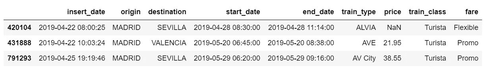

# 使用 Python、PyMC3 和 ArviZ 实践贝叶斯统计

> 原文：<https://towardsdatascience.com/hands-on-bayesian-statistics-with-python-pymc3-arviz-499db9a59501?source=collection_archive---------0----------------------->


## 高斯推断、后验预测检查、分组比较、分级线性回归

如果你认为[贝叶斯定理](https://en.wikipedia.org/wiki/Bayes%27_theorem)是反直觉的，而[贝叶斯统计](https://en.wikipedia.org/wiki/Bayesian_statistics)建立在贝叶斯定理的基础上，可能很难理解。我支持你。

有[无数的理由让我们应该学习贝叶斯统计](https://www.quora.com/What-are-some-good-resources-to-learn-about-Bayesian-probability-for-machine-learning-and-how-should-I-structure-my-learning)，特别是贝叶斯统计正在成为表达和理解下一代[深度神经网络](https://en.wikipedia.org/wiki/Deep_learning)的强大框架。

我相信，对于我们在做之前必须学习的东西，我们通过做来学习。生活中没有什么事情是如此艰难，以至于我们不能通过我们对待它的方式来使它变得更容易。

因此，这是我使它变得更容易的方法:与其在开始时讲太多的理论或术语，不如让我们把重点放在贝叶斯分析的机制上，特别是，如何用[pymc 3](https://docs.pymc.io/)&[ArviZ](https://arviz-devs.github.io/arviz/)进行贝叶斯分析和可视化。在记忆无穷无尽的术语之前，我们将编码解决方案并可视化结果，并使用术语和理论来解释模型。

PyMC3 是一个用于概率编程的 Python 库，具有非常简单和直观的语法。 [ArviZ](https://arviz-devs.github.io/arviz/) ，一个与 PyMC3 携手工作的 Python 库，可以帮助我们解释和可视化后验分布。

我们将把贝叶斯方法应用到一个实际问题中，展示一个端到端的贝叶斯分析，从构建问题到建立模型，再到得出先验概率，最后用 Python 实现后验分布。

在我们开始之前，让我们先了解一些基本的直觉:

贝叶斯模型也被称为**概率模型**，因为它们是使用概率构建的。贝叶斯使用概率作为量化不确定性的工具。因此，我们得到的答案是**分布**而不是点估计。

# 贝叶斯方法步骤

步骤 1:建立关于数据的信念，包括先验和似然函数。

第二步，使用数据和概率，按照我们对数据的信念，来更新我们的模型，检查我们的模型是否与原始数据一致。

步骤 3，根据我们的模型更新我们的数据视图。

# 数据

由于我对使用机器学习进行价格优化感兴趣，我决定将贝叶斯方法应用于一个[西班牙高铁票价数据集](https://raw.githubusercontent.com/susanli2016/Machine-Learning-with-Python/master/data/renfe_small.csv)，可以在这里[找到](https://raw.githubusercontent.com/susanli2016/Machine-Learning-with-Python/master/data/renfe_small.csv)。感谢[大师](https://thegurus.tech/)团队搜集数据集。

```
from scipy import stats
import arviz as az
import numpy as np
import matplotlib.pyplot as plt
import pymc3 as pm
import seaborn as sns
import pandas as pd
from theano import shared
from sklearn import preprocessingprint('Running on PyMC3 v{}'.format(pm.__version__))data = pd.read_csv('renfe.csv')
data.drop('Unnamed: 0', axis = 1, inplace=True)
data = data.sample(frac=0.01, random_state=99)
data.head(3)
```



Table 1

```
data.isnull().sum()/len(data)
```


Figure 1

价格列中有 12%的值缺失，我决定用相应票价类型的平均值来填充它们。还要用最常见的值填充其他两个分类列。

```
data['train_class'] = data['train_class'].fillna(data['train_class'].mode().iloc[0])
data['fare'] = data['fare'].fillna(data['fare'].mode().iloc[0])
data['price'] = data.groupby('fare').transform(lambda x: x.fillna(x.mean()))
```

# 高斯推论

```
az.plot_kde(data['price'].values, rug=True)
plt.yticks([0], alpha=0);
```


Figure 2

铁路票价的 [KDE 图](https://seaborn.pydata.org/generated/seaborn.kdeplot.html)显示了[高斯型分布](https://en.wikipedia.org/wiki/Normal_distribution)，除了大约几十个数据点远离均值。

让我们假设[高斯分布](https://en.wikipedia.org/wiki/Normal_distribution)是对火车票价格的恰当描述。因为我们不知道平均值或标准差，我们必须为它们设定先验。因此，合理的模型如下。

# 模型

我们将对票价数据进行高斯推断。这里有一些模型的选择。

## 我们将像这样实例化 PyMC3 中的模型:

*   PyMC3 中的模型规范包装在 with 语句中。

先验的选择:

*   μ，总体的平均值。正态分布，很广。我不知道μ的可能值，我可以设置先验来反映我的无知。根据经验，我知道火车票价格不能低于 0 或高于 300，所以我将均匀分布的边界设置为 0 和 300。你可能有不同的经历，设定不同的界限。这完全没问题。如果你有比我更可靠的先验信息，请使用它！
*   σ，总体的标准差。只能为正，因此使用半正态分布。同样，非常宽。

票价可能性函数的选择:

*   y 是一个观察变量，代表来自参数为μ和σ的正态分布的数据。
*   使用坚果取样抽取 1000 个后验样本。

使用 PyMC3，我们可以将模型编写如下:

model_g.py

y 表示可能性。这就是我们告诉 PyMC3 我们想要在已知(数据)的基础上处理未知的方式。

我们绘制高斯模型轨迹。这在引擎盖下的 [Theano 图](http://deeplearning.net/software/theano/extending/graphstructures.html)上运行。

```
az.plot_trace(trace_g);
```


Figure 3

*   在左边，我们有一个 KDE 图，对于 x 轴上的每个参数值，我们在 y 轴上得到一个概率，它告诉我们该参数值的可能性有多大。
*   在右边，我们得到了采样过程中每一步的单个采样值。从迹线图中，我们可以直观地从后验得到似是而非的数值。
*   上图中每个参数都有一行。对于这个模型，后验概率是二维的，所以上图显示了每个参数的边际分布。

这里有几件事需要注意:

*   我们的单个参数的采样链(左)似乎很好地收敛和稳定(没有大的漂移或其他奇怪的模式)。
*   每个变量的最大后验估计(左侧分布中的峰值)非常接近真实参数。

我们可以画出参数的联合分布。

```
az.plot_joint(trace_g, kind='kde', fill_last=False);
```


Figure 4

我看不出这两个参数之间有任何关联。这意味着我们可能在模型中没有共线性。这很好。

我们还可以对每个参数的后验分布进行详细总结。

```
az.summary(trace_g)
```


Table 2

我们还可以通过用分布的平均值和[最高后验密度(HPD)](https://en.wikipedia.org/wiki/Credible_interval) 生成一个图来直观地看到上面的总结，并解释和报告贝叶斯推断的结果。

```
az.plot_posterior(trace_g);
```


Figure 5

*   与[频率主义推理](https://en.wikipedia.org/wiki/Frequentist_inference)不同，在[贝叶斯推理](https://en.wikipedia.org/wiki/Bayesian_inference)中，我们得到值的整个分布。
*   每次 ArviZ 计算和报告 HPD 时，默认情况下，它将使用 94%的值。
*   请注意，HPD 区间不同于置信区间。
*   在这里，我们可以这样理解，有 94%的可能性相信平均票价在 63.8 欧元和 64.4 欧元之间。

我们可以使用 Gelman Rubin 测试来正式验证链的收敛性。接近 1.0 的值表示收敛。

```
pm.gelman_rubin(trace_g)
```


```
bfmi = pm.bfmi(trace_g)
max_gr = max(np.max(gr_stats) for gr_stats in pm.gelman_rubin(trace_g).values())
(pm.energyplot(trace_g, legend=False, figsize=(6, 4)).set_title("BFMI = {}\nGelman-Rubin = {}".format(bfmi, max_gr)));
```


Figure 6

我们的模型收敛得很好，盖尔曼-鲁宾统计看起来也不错。

# 后验预测检查

*   后验预测检验(PPC)是一种验证模型的好方法。这个想法是从模型中生成数据，使用从后面提取的参数。
*   既然我们已经计算了后验概率，我们将说明如何使用模拟结果来推导预测。
*   以下函数将从跟踪中随机抽取 1000 个参数样本。然后，对于每个样本，它将从由该样本中的μ和σ值指定的正态分布中抽取 25798 个随机数。

```
ppc = pm.sample_posterior_predictive(trace_g, samples=1000, model=model_g)np.asarray(ppc['y']).shape
```


现在，ppc 包含 1000 个生成的数据集(每个数据集包含 25798 个样本)，每个数据集使用不同于后验的参数设置。

```
_, ax = plt.subplots(figsize=(10, 5))
ax.hist([y.mean() for y in ppc['y']], bins=19, alpha=0.5)
ax.axvline(data.price.mean())
ax.set(title='Posterior predictive of the mean', xlabel='mean(x)', ylabel='Frequency');
```


Figure 7

推断的平均值非常接近实际的铁路票价平均值。

# 分组比较

我们可能对不同票价类型下的价格比较感兴趣。我们将重点评估影响大小，即量化两种票价类别之间的差异。为了比较票价类别，我们将使用每种票价类型的平均值。因为我们是贝叶斯，我们将努力获得票价类别之间均值差异的后验分布。

我们创建三个变量:

*   价格变量，代表票价。
*   idx 变量，用数字对票价类别进行编码的分类虚拟变量。
*   最后是分组变量，包括票价类别的数量(6)

```
price = data['price'].values
idx = pd.Categorical(data['fare'],
                     categories=['Flexible', 'Promo', 'Promo +', 'Adulto ida', 'Mesa', 'Individual-Flexible']).codes
groups = len(np.unique(idx))
```

组比较问题的模型与前面的模型几乎相同。唯一的区别是，μ和σ是向量，而不是标量变量。这意味着，对于先验，我们传递一个形状参数，对于可能性，我们使用 idx 变量正确地索引均值和 sd 变量:

comparing_groups.py

有 6 组(票价类别)，为每组绘制μ和σ的轨迹图有点困难。因此，我们创建一个汇总表:

```
flat_fares = az.from_pymc3(trace=trace_groups)
fares_gaussian = az.summary(flat_fares)
fares_gaussian
```


Table 3

很明显，各组(即票价类别)之间的平均值存在显著差异。

为了更清楚，我们在不重复比较的情况下，绘制了每个票价类别之间的差异。

*   [Cohen 的 d](https://en.wikiversity.org/wiki/Cohen%27s_d) 是比较两个均值的合适效应大小。Cohen 的 d 通过使用它们的标准偏差引入了每组的可变性。
*   优势概率(ps)定义为从一组中随机选取的数据点比从另一组中随机选取的数据点具有更大值的概率。

difference_plot.py


Figure 8

基本上，上面的图告诉我们，在 94% HPD 的上述比较情况中，没有一个包括零参考值。这意味着对于所有的例子，我们可以排除零的差异。6.1 欧元到 63.5 欧元的平均差额范围足够大，足以证明客户根据不同的票价类别购买机票是合理的。

# 贝叶斯分层线性回归

我们希望建立一个模型来估计每种火车类型的火车票价格，同时估计所有火车类型的价格。这种类型的模型被称为**分层模型**或**多级模型。**

*   编码分类变量。
*   idx 变量，用数字对训练类型进行编码的分类哑变量。
*   最后是分组变量，包含列车类型的数量(16)

encode_cat.py


Table 4

我们将建模的数据的相关部分如上所示。我们感兴趣的是不同的火车类型是否会影响票价。

# 层次模型

hierarchical_model.py


Figure 9

左栏中的边际后验概率信息丰富，“α_μ_tmp”告诉我们组平均价格水平，“β_μ”告诉我们购买票价类别“Promo +”比票价类型“Adulto ida”显著提高价格，购买票价类别“Promo”比票价类型“Promo +”显著提高价格，以此类推(没有低于零的质量)。

```
pm.traceplot(hierarchical_trace, var_names=['α_tmp'], coords={'α_tmp_dim_0': range(5)});
```


Figure 10

在 16 种火车类型中，我们可能想看看 5 种火车类型在票价方面的比较。通过查看“α_tmp”的边际，我们可以看到不同列车类型之间的价格存在相当大的差异；不同的宽度与我们对每个参数估计的信心程度有关——每种列车类型的测量值越多，我们的信心就越高。

对我们的一些估计进行不确定性量化是贝叶斯建模的强大之处之一。我们得到了不同列车类型价格的贝叶斯可信区间。

```
az.plot_forest(hierarchical_trace, var_names=['α_tmp', 'β'], combined=True);
```


Figure 11

最后，我们可能想计算 r 的平方:

```
ppc = pm.sample_posterior_predictive(hierarchical_trace, samples=2000, model=hierarchical_model)
az.r2_score(data.price.values, ppc['fare_like'])
```


这篇文章的目的是学习、实践和解释贝叶斯理论，而不是从数据集中得出最好的结果。不然我们就直接用 [XGBoost](https://xgboost.readthedocs.io/en/latest/) 了。

[Jupyter 笔记本](https://github.com/susanli2016/Machine-Learning-with-Python/blob/master/Bayesian%20Statistics%20Python_PyMC3_ArviZ.ipynb)可以在 [Github](https://github.com/susanli2016/Machine-Learning-with-Python/blob/master/Bayesian%20Statistics%20Python_PyMC3_ArviZ.ipynb) 上找到，好好享受这周剩下的时光吧。

参考资料:

[](https://docs.pymc.io/notebooks/GLM-hierarchical.html) [## GLM:分级线性回归- PyMC3 3.6 文档

### Gelman 等人(2007)的 radon 数据集是分层建模的经典。在这个数据集中…

docs.pymc.io](https://docs.pymc.io/notebooks/GLM-hierarchical.html)  [## 橄榄球预测的分层模型- PyMC3 3.6 文档

### 编辑描述

docs.pymc.io](https://docs.pymc.io/notebooks/rugby_analytics.html?highlight=sample_posterior_predictive) 

这本书:用 Python 进行贝叶斯分析