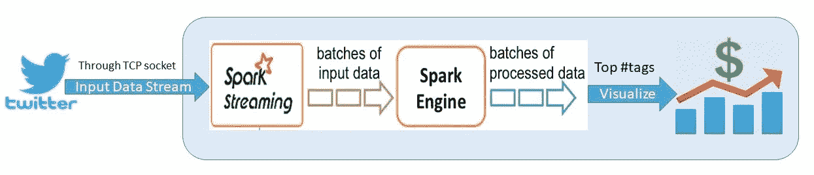
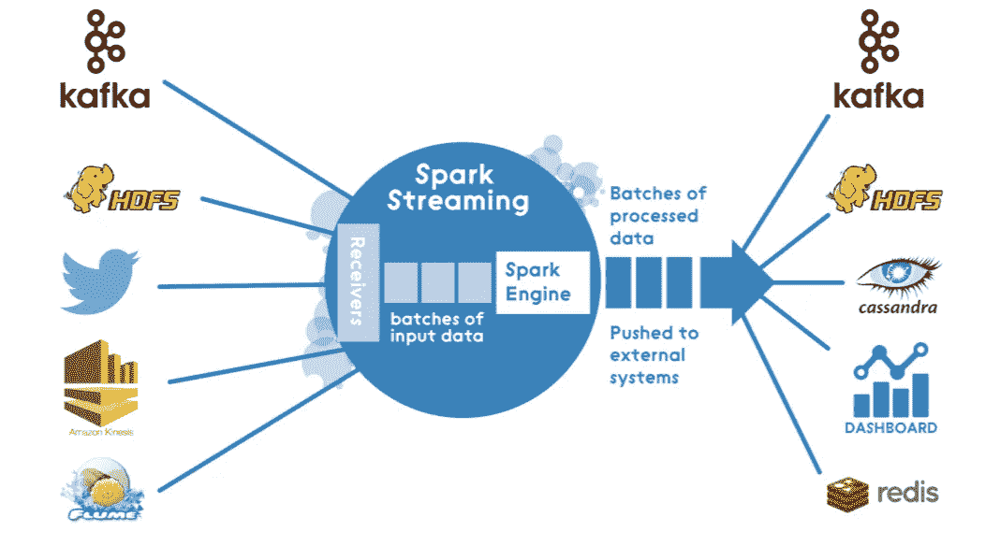
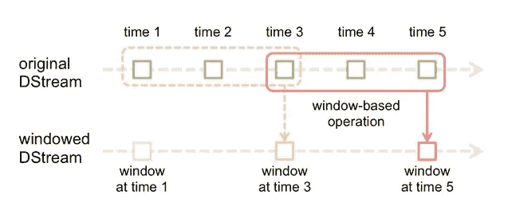
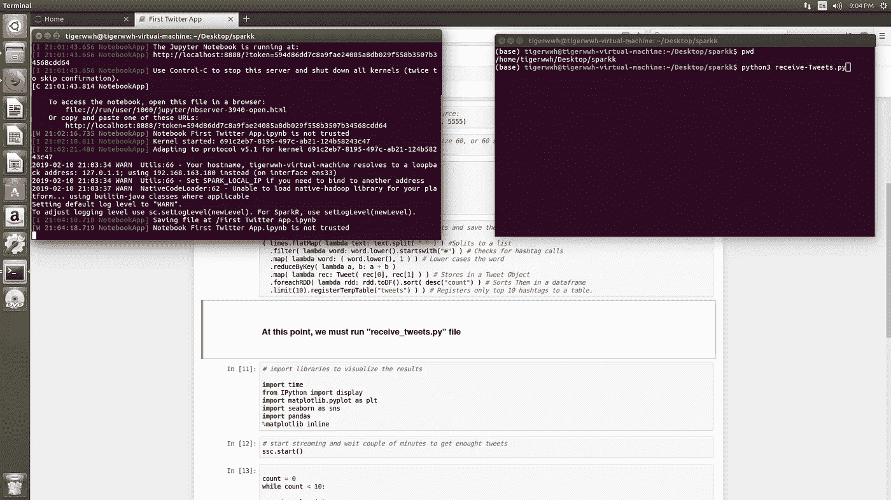
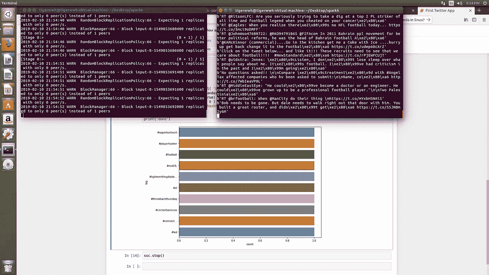
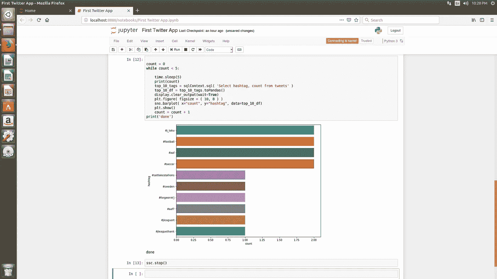

# 实践大数据流，Apache 大规模爆发

> 原文：<https://towardsdatascience.com/hands-on-big-data-streaming-apache-spark-at-scale-fd89c15fa6b0?source=collection_archive---------16----------------------->


photo credit: pexels

# 介绍

在一个数据以极快的速度生成的世界中，正确分析数据并在正确的时间提供有用且有意义的结果，可以为处理数据产品的许多领域提供有用的解决方案。这可以应用于医疗保健和金融，媒体，零售，旅游服务等。一些可靠的例子包括网飞实时提供个性化推荐，亚马逊跟踪您与其平台上不同产品的交互并立即提供相关产品，或者任何需要实时传输大量数据并对其实施不同分析的企业。

能够实时处理大数据并执行不同分析的令人惊叹的框架之一是 **Apache Spark** 。我认为有许多资源提供了关于 Spark 的不同功能以及它在大数据社区中有多受欢迎的信息，但简单提一下 Spark 的核心功能:它采用弹性分布式数据集(RDDs)、流和大规模实时机器学习来进行快速大数据处理。在本文中，我们将通过一个实践环节来使用 **Spark Streaming** 组件和 **pySpark 解决一个业务问题。**

# 动机

没有人能否认社交媒体在当今社会的重要性。许多企业通过 twitter 活动收集受众的**洞察力**、**反馈**和**兴趣**。许多企业已经意识到，对社交媒体活动的突出分析可以帮助他们更好地了解客户的行为模式。通常，来自社交媒体的反馈可能会迅速变化，对反馈的实时分析是企业成功的一个重要过程。因此，有不同的方法可以更好地了解人们对新的**产品**、**品牌**或**事件**的反应。一种方法是评估与特定主题相关的推文的情绪；这个话题可以是任何与产品、品牌或事件相关的话题。我以前在 [**这个项目**](/impact-of-social-media-on-box-office-analysis-of-twitter-activities-on-best-picture-nominees-7961c5c8ba40) 中实现过类似的想法。另一个聪明的方法是在特定时间段内提取与我们想要的主题相关的**热门#标签**，比如每隔几分钟，因为带有#标签的**推文有更高的参与度。**

# **实施**

我们将与 **pySpark** 合作，利用 **Spark Streaming** 组件，并使用 python 中的 TCP 套接字通过 [**Tweepy**](https://tweepy.readthedocs.io/en/v3.5.0/) 库连接到 Twitter 的流媒体 API。在 Spark 中流式传输推文并将其放在 **RDDs** 上之后，我们对推文应用一些操作来提取顶部标签。接下来，我们使用 Spark SQL 将 top hashtags 保存在一个临时 SQL 表上。最后，我们在 python 中应用了一些可视化技术来在图形中描绘结果。下图展示了我们程序的整体架构。



The overall Architecture

了解火花流的其他使用方式也很有好处:



Different Applications of Spark Streaming ([DZone](https://dzone.com/articles/lambda-architecture-with-apache-spark))

我们的计划将包含两个模块:

1- receive-Tweets，这个模块通过 Tweepy 库处理 Twitter 的流 API 的认证和连接。该模块只有在接收到 Spark 流模块的调用并通过 TCP 套接字将 tweets 发送到 Spark 引擎时才会被触发。

2- top#tags-streaming，这个模块在 pySpark 中启动 StreamingContext，通过 socketTextStream 接收数据。接下来，我们应用一些 lambda 函数来清除 tweets 并提取#标签。然后，我们将与我们搜索的主题(新产品、品牌或事件)相关的前 10 个标签可视化。

*   我们将简要介绍第一模块的步骤:

我们进口 Tweepy 及其所需的软件包。为了访问 Twitter 的 API，我们需要四个认证密钥，我们可以通过访问 developer.twitter.com 和注册一个新的应用程序来获得。如你所见，我把它们留为空白，因为与公众共享你的认证密钥是不安全的。接下来，我们创建从 Tweepy 中的 StreamListener 模块继承的 TweetsListener 类，并覆盖 on_data()方法，以便我们可以通过套接字发送 tweets。我们可以搜索单词“足球”作为我们想要的主题，因为它在 twitter 上非常受欢迎，我们可以非常快地获得推文，但我们总是可以根据我们的用例来改变搜索词。我们还不打算运行这个 python 文件(receive-Tweets.py ),因为我们需要首先设置 SparkStreamingContext。

有关 python 中的网络以及 Tweepy 流如何工作的更多信息，请参见以下链接:

[send ex 的 Tweepy 上的 Youtube 系列。](https://www.youtube.com/watch?v=pUUxmvvl2FE&list=PLQVvvaa0QuDdlcEkEtW64jmeFlLZ_XgmT)

 [## 使用 Tweepy - tweepy 3.5.0 文档进行流式处理

### 在 tweepy 中，Tweepy 的实例。Stream 建立流会话并将消息路由到 StreamListener 实例…

docs.tweepy.org](http://docs.tweepy.org/en/v3.5.0/streaming_how_to.html) 

*   对于第二个模块，我们将使用 findspark 库在本地机器上定位 spark，然后从 pyspark 导入必要的包。

```
import findspark
findspark.init('directory that contains Apache Spark')# import necessary packagesfrom pyspark import SparkContext
from pyspark.streaming import StreamingContext
from pyspark.sql import SQLContext
from pyspark.sql.functions import desc
```

接下来，我们初始化 SparkContext()。SparkContext 是任何 spark 功能的入口点。当我们运行任何 Spark 应用程序时，都会启动一个驱动程序，它具有主函数，并且您的 SparkContext 会在这里启动。SparkContext 表示到 Spark 集群的连接，可用于在该集群上创建 rdd、累加器和广播变量。SparkContext 在这里使用 Py4J 启动一个 **JVM** 并创建一个 **JavaSparkContext** ( [源](https://www.tutorialspoint.com/pyspark/pyspark_sparkcontext.htm))。需要注意的是，每个会话中只能运行一个 SparkContext。之后，我们以 10 秒的批处理间隔启动 StreamingContext()，这意味着在流式传输期间，输入流将每 10 秒被分成几批。

```
sc = SparkContext()# we initiate the StreamingContext with 10 second batch interval. #next we initiate our sqlcontext
ssc = StreamingContext(sc, 10)
sqlContext = SQLContext(sc)
```

下一步是分配流的输入源，然后将传入的数据放入行中:

```
# initiate streaming text from a TCP (socket) source:
socket_stream = ssc.socketTextStream("127.0.0.1", 5555)# lines of tweets with socket_stream window of size 60, or 60 #seconds windows of time
lines = socket_stream.window(60)
```

值得注意的是，我们使用了与第一个模块中相同的端口号(5555)来发送推文，并且 IP 地址也是相同的，因为我们是在本地机器上运行的。此外，我们使用 window()函数来确定我们每分钟(60 秒)都在分析推文，以查看在此期间排名前 10 的标签是什么。

下面是一个有用的图片，可以帮助您更好地理解 window()函数在 Spark 中的工作方式:



[source](https://spark.apache.org/docs/2.2.0/streaming-programming-guide.html#discretized-streams-dstreams)

现在我们已经通过了所有的先决条件，让我们看看如何清理以#开头的 tweets，并将前 10 条保存在一个临时 SQL 表中:

```
# just a tuple to assign namesfrom collections import namedtuplefields = ("hashtag", "count" )
Tweet = namedtuple( 'Tweet', fields )# here we apply different operations on the tweets and save them to #a temporary sql table( lines.flatMap( lambda text: text.split( " " ) ) #Splits to a list
  # Checks for    hashtag calls  
  .filter( lambda word: word.lower().startswith("#") ) 
  .map( lambda word: ( word.lower(), 1 ) ) # Lower cases the word
  .reduceByKey( lambda a, b: a + b ) 
 # Stores in a Tweet Object
  .map( lambda rec: Tweet( rec[0], rec[1] ) )
 # Sorts Them in a dataframe
  .foreachRDD( lambda rdd: rdd.toDF().sort( desc("count") )
 # Registers only top 10 hashtags to a table.
  .limit(10).registerTempTable("tweets") ) )
```

我们创建了一个 namedtuple 对象来保存标签及其计数。接下来，我们使用 flatmap()创建一个标记化 tweets 的数组。我们正在使用函数，因为它们需要更少的内存并且运行更快。之后，我们过滤不以#开头的推文。foreachRDD()是 pySpark 中一个重要的输出函数，可以帮助在 RDD 上运行更快的操作。在这里，我们将它应用于每个 RDD，将其转换为数据帧，最后我们将它保存到一个名为“tweets”的临时表中。

## **现在，我们可以运行 receive-Tweets.py，之后我们可以通过运行:**开始流式传输

```
# start streaming and wait couple of minutes to get enought tweets
ssc.start()
```

正如我们所看到的，我在 Linux 中打开了两个终端。其中一个运行我的 Jupiter 笔记本进行 pySpark 流传输，另一个运行 read-tweets.py 文件。



运行 receive-Tweets.py 后，我们必须等待几分钟，这样我们就有足够的 Tweets 来处理:



接下来，我们导入我们的可视化库，并为“足球”主题中的前 10 个标签绘制图表。在这里，我们运行我们的流，每分钟只检查前 10 个#标签几(5)次，这只是为了学习的目的，您可以看到#标签并不经常改变，但如果您想看到更好的结果，您可以让它运行一段时间:

```
# import libraries to visualize the resultsimport time
from IPython import display
import matplotlib.pyplot as plt
import seaborn as sns
import pandas
%matplotlib inlinecount = 0
while count < 5:

    time.sleep(5)
    top_10_tags = sqlContext.sql( 'Select hashtag, count from tweets' )
    top_10_df = top_10_tags.toPandas()
    display.clear_output(wait=True)
    plt.figure( figsize = ( 10, 8 ) )
    sns.barplot( x="count", y="hashtag", data=top_10_df)
    plt.show()
    count = count + 1
    print(conut)
```

结果如下:



you can zoom in on the picture and see all those #tags

# 重要提示:

*   这是理解 Apache spark 的流组件如何工作的一个简单例子。总是有更复杂的方法来应用相同的方法来处理不同类型的输入流，如来自 youtube 或 Amazon(媒体、零售)等流行网站的用户交互数据。股票市场是另一个使用案例，实时传输大量数据并运行不同的分析对于股票经纪公司至关重要，Apache Spark 可能是首选工具。

Apache Spark 的另一个重要组件是 MLlib，它使用户能够大规模地训练和部署有用的机器学习模型。在我的 [**下一篇文章**](/build-an-end-to-end-machine-learning-model-with-mllib-in-pyspark-4917bdf289c5) 中，我经历了一个有趣的项目，详细解释了如何在 Spark MLlib 中训练和构建模型。

像往常一样，代码和 jupyter 笔记本在我的 [**Github**](https://github.com/nxs5899/Apache-Spark-Spark-Streaming-pySpark-) 上可用。

非常感谢您的提问和评论。

参考资料:

1.  [https://spark . Apache . org/docs/2 . 2 . 0/streaming-programming-guide . html # discretized-streams-dstreams](https://spark.apache.org/docs/2.2.0/streaming-programming-guide.html#discretized-streams-dstreams)
2.  [https://github.com/jleetutorial/python-spark-streaming](https://github.com/jleetutorial/python-spark-streaming)