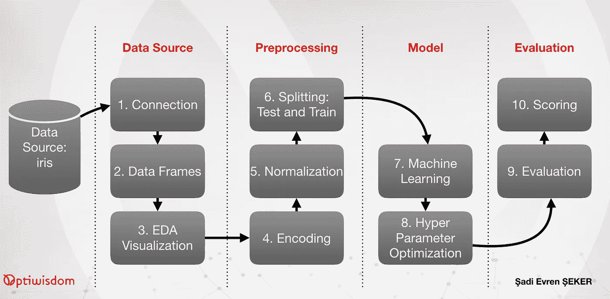
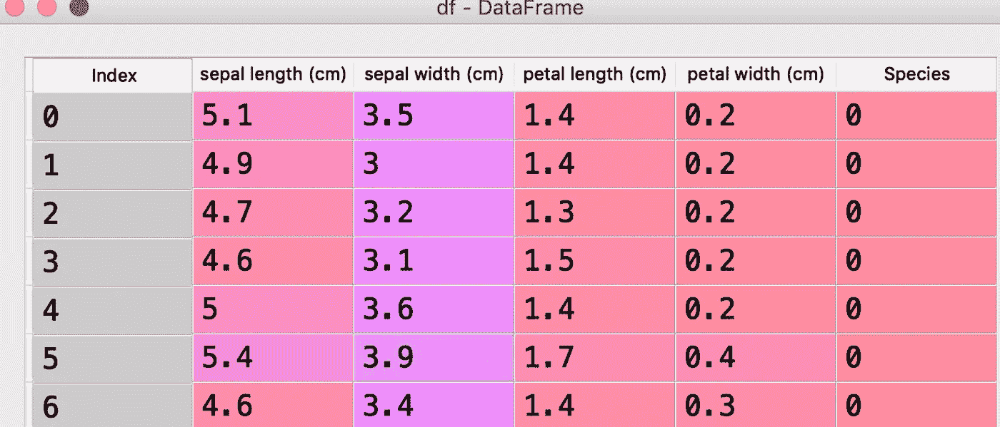
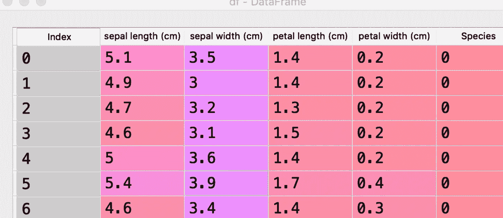
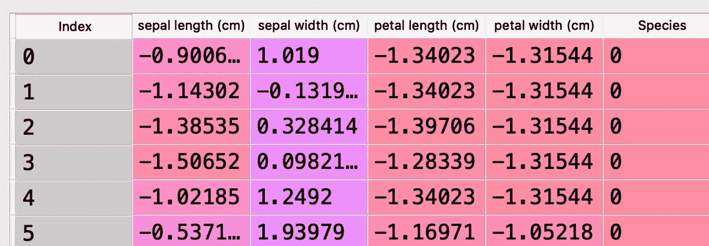
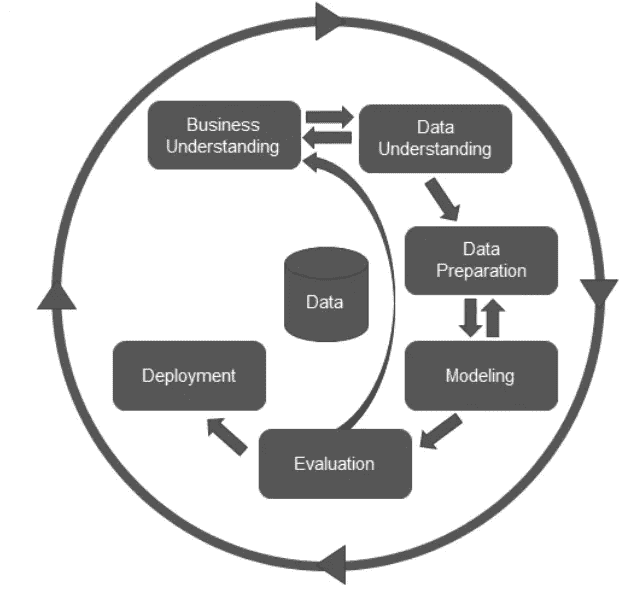

# 动手端到端自动化机器学习

> 原文：<https://towardsdatascience.com/hands-on-end-to-end-automated-machine-learning-a50e6bce6512?source=collection_archive---------18----------------------->

## 使用 AutoML 库在 Python 环境中进行 AutoML 编码的实践经验。

我们从 Python 中的一个基本管道方法开始，它实际上没有 AutoML，然后快速传递到著名的 AutoML 库。我们还将 OptiWisdom 的趋势自动 SaaS 解决方案(如 OptiScorer)与经典方法进行了比较。

这是对端到端自动化机器学习过程的快速介绍，从不同的角度介绍了许多不同的库。此外，您将能够对 AutoML 库进行比较并做出战略决策。

如果你不知道什么是 AutoML 或者它的用途，你也可以开始阅读下面的文章。

[https://towards data science . com/automl-end-to-end-introduction-from-opti wisdom-c 17 Fe 03 a 017 f](/automl-end-to-end-introduction-from-optiwisdom-c17fe03a017f)

# Python 中机器学习的流水线和端到端解决方案介绍。

从这一点开始，我们将实现一个逐步编码的例子，其思想是用 sklearn 库实现 python 中最**原语**编码风格的分类。在这个例子中有两个重要的问题。首先，我们将讨论 sklearn 中的流水线，这是一种非常类似于 AutoML 流程的整体方法，其次，我们将使用网格搜索方法进行非常原始的超参数优化。

本文的步骤如下图所示:



在 Python 中，一种相对较新的称为流水线的方法是实现系统并将所有步骤结合在一起的经典方式。作为一种动手的编码实践，可以用 Python 编写如下的流水线方法:

1.  **加载数据集:**实际上，这一步是数据连接层，对于这个非常简单的原型，我们将保持它的简单性，就像从 sklearn 库加载数据集一样:

```
"""
@author: sadievrenseker
"""
import pandas as pd
import numpy as np

from sklearn import datasets
data = datasets.load_iris()
```

**2。上面的代码是从 sklearn 数据集加载的一个非常简单的数据集。直到数据被加载到数据层对象中，加载数据集的问题才结束。在本例中，我们将使用 pandas 作为数据访问层，并通过以下代码将数据集加载到 pandas 对象中:**

```
df = pd.DataFrame(data = np.column_stack((data.data, data.target)), columns=data.feature_names + ['Species'])
df.head()
```

上述代码将返回以下输出:



DataFrame output for the data loading

上图展示了加载的数据框是 sklearn 数据集的原始版本。在某些数据集中，物种列可能是物种的名称，如“鸢尾”、“鸢尾-杂色”和“鸢尾-海滨”。

**3。探索性数据分析(EDA):** 如果是这种情况，我们将在稍后的数据预处理中处理字符串类型，从这一点开始，如果数据科学家对数据集不熟悉，他/她可能会选择探索性数据分析(EDA)，这在大多数现实生活问题中都会发生。因此，上述代码后面的代码可能是一些可视化或信息，如下所示:

```
import seaborn as sns
sns.pairplot(df, hue='Species', size=3)
```

上述代码将返回以下输出:


EDA Output for Iris Data Set

在 seaborn 矩阵图上，

保存所有可能的 2D 组合中的逐列匹配和数据分布的可视化。

对于流水线操作，整个系统被插入到单个流水线中，在常规的 AutoML 方法中，有数据预处理和机器学习过程，如本章第一节中已经解释的。

对于这种实践经验，我们将使用 K-NN 连同标准的定标器和标签编码器。

因此，标准缩放器和标签编码器是预处理阶段，而 K-NN 将是机器学习阶段。

**4。编码:**如果加载的数据集有带标签的物种列，那么标签编码器解决从字符串到数值的转换。在我们的数据集例子中，这不是问题，因为原始数据集在物种列中保存数值，如下面的代码所示:

```
df['Species'] = LabelEncoder().fit_transform(df['Species'])
```

上述代码将返回以下输出:



Encoded DataFrame

**5。标准化:**在标签编码之后，我们可以继续标准化。归一化将数据集要素转换到相同的范围内。我们将使用标准分布来转换所有功能:

```
df.iloc[:,:4] = StandardScaler().fit_transform(df.iloc[:,:4])
```

上述代码将返回以下输出:



Normalized version of DataFrame

上面显示了数据的缩放版本，现在数据已准备好进行分类。

**6。测试和训练集:**我们将使用 K-NN 算法进行分类，在常规编码中，我们可以将数据分为训练集和测试集，然后进行如下分类:

```
from sklearn.model_selection import train_test_split
X_train, X_test, y_train, y_test = train_test_split(df.iloc[:,:-1].values,
 df['Species'],
 test_size = 0.4,
 random_state = 123)
```

**7。机器学习:**将数据拆分成 0.6 比 0.4 的训练/测试集后，现在可以应用 K-NN 算法了。

```
from sklearn.neighbors import KNeighborsClassifier
knn = KNeighborsClassifier(n_neighbors = 3)
knn.fit(X_train,y_train)
predictions = knn.predict(X_test)
```

您可以在上面的代码中很容易地注意到，在上面的示例中，n_neighbors 参数被设置为 3。

**8。超参数优化:**参数优化的一个解决方案是使用网格搜索，但是在进入网格搜索之前，我们将使用如下混淆矩阵和计分器显示算法的成功:

```
from sklearn.metrics import confusion_matrix
cm = confusion_matrix(y_test,predictions)
print(cm)
```

代码执行后，我们得到的混淆矩阵如下:

```
[[22 0 0]
 [ 0 15 1]
 [ 0 2 20]]
```

**9。评价:**对于已经熟悉混淆矩阵的读者来说，已经很清楚我们在 60 个数据点中只有 3 个错误。也是有经验的数据科学家，以前玩过 iris 数据集可以很容易地识别出第一类的清晰分类和第二类与第三类之间的问题。为了阐明数字上的成功，让我们计算准确性的分数，如下面的代码所示:

```
from sklearn.metrics import accuracy_score
score = accuracy_score(y_test,predictions)
print(score)
```

**10。Score:** 我们案例的分数是 0.95，现在我们可以通过使用网格搜索来优化精确度。

```
from sklearn.model_selection import GridSearchCV
k_range = list(range(1, 31))
print(k_range)
param_grid = dict(n_neighbors=k_range)
print(param_grid)
grid = GridSearchCV(knn, param_grid, scoring='accuracy')
grid.fit(X_train, y_train)

print(grid.best_params_)
```

上面的代码使用了 sklearn 库中的 GridSearchCV 类，它实际上使用了交叉验证来寻找最佳参数，我们给出了 k 从 1 到 31 的搜索空间。所以，这里的网格搜索基本上从 k= 1 开始，每次迭代增加 k 参数值 1。GridSearchCV 类也输出最佳参数，如下所示:

```
{'n_neighbors': 5}
```

因此，针对虹膜数据集的 K-NN 模型的精度的优化参数是 k=5。

**11。流水线:**现在，我们可以把上面所有的代码放到一个流水线中，如下所示:

```
from sklearn.pipeline import Pipeline
pipeline = Pipeline([
 ('normalizer', StandardScaler()), #Step1 - normalize data
 ('clf', KNeighborsClassifier()) #step2 - classifier
])
print(pipeline.steps)
```

流水线步骤的输出如下:

```
[('normalizer', StandardScaler(copy=True, with_mean=True, with_std=True)), ('clf', KNeighborsClassifier(algorithm='auto', leaf_size=30, metric='minkowski',
 metric_params=None, n_jobs=None, n_neighbors=5, p=2,
 weights='uniform'))]
```

12.现在，管道对任何设置都是开放的，并且在添加到管道时，规格化器或分类算法的参数也可以部署到构造函数中。

```
from sklearn.model_selection import cross_validate
scores = cross_validate(pipeline, X_train, y_train)
print(scores)
```

上面这段代码通过使用训练数据和标签来训练整个管道。在执行之后，scores 变量保存交叉验证的每一次得分的详细信息，如下所示。

```
{'fit_time': array([0.00163412, 0.0012331 , 0.00207829]), 'score_time': array([0.00192475, 0.00164199, 0.00256586]), 'test_score': array([0.96875   , 1\.        , 0.93103448]), 'train_score': array([0.96551724, 0.98360656, 1\.        ])}
```

# 摘要

我们实现了从数据源到机器学习算法评估分数的经典 python 机器学习过程，包括超参数优化，从上面的第一步开始，一直到步骤 11。在第 11 步和第 12 步，我们用 sklearn 下的流水线方法重新实现了整个过程，并立即执行。

请再次记住，我们的步骤可以演示如下:


Steps of operations in this article

请注意，我们的方法与 CRISP-DM 步骤非常相似:



CRISP-DM Steps

这篇文章是对 AutoML 过程的一个非常原始的介绍，我们实现流水线只是为了更好的理解。