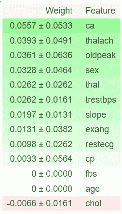
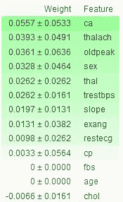
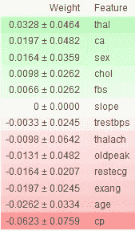
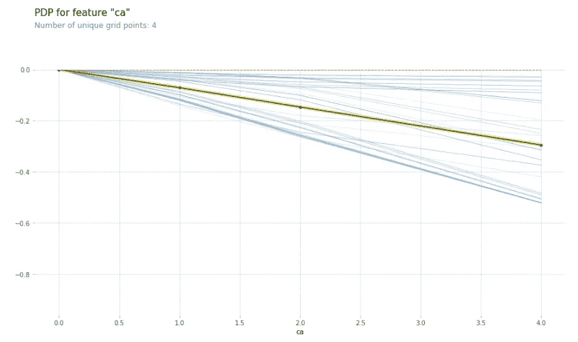
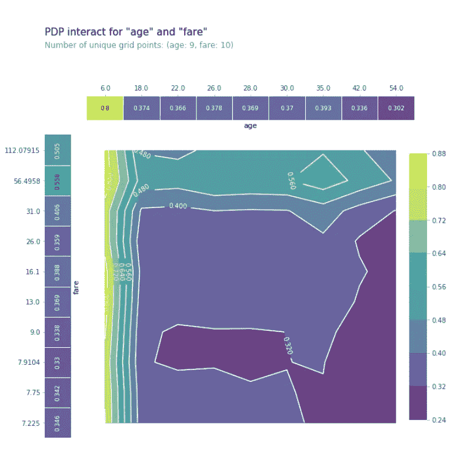
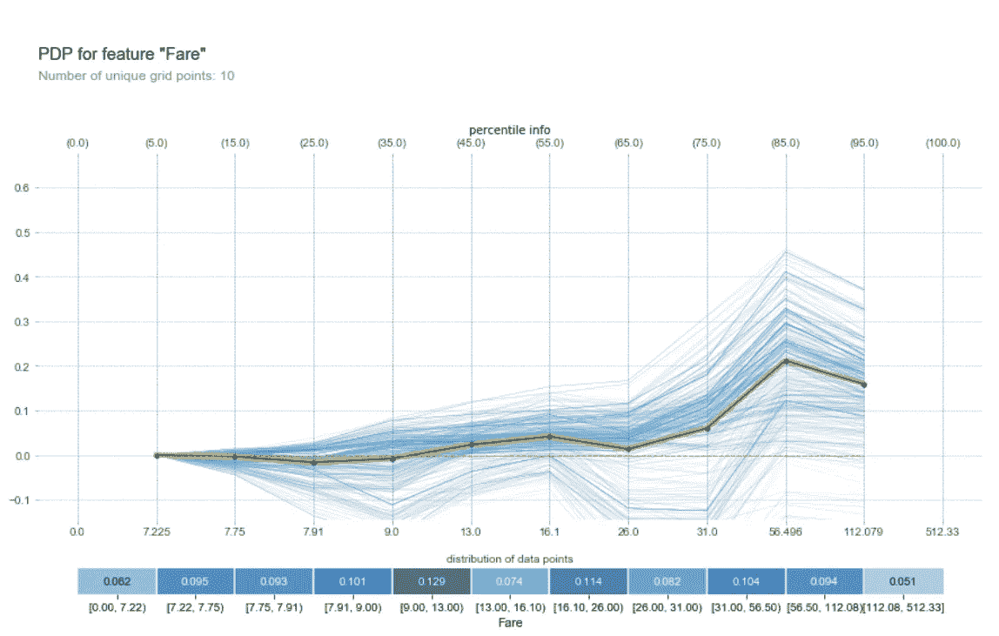
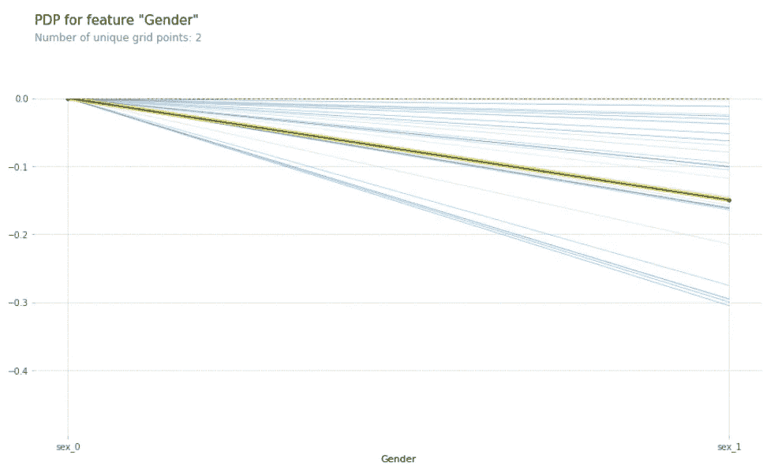
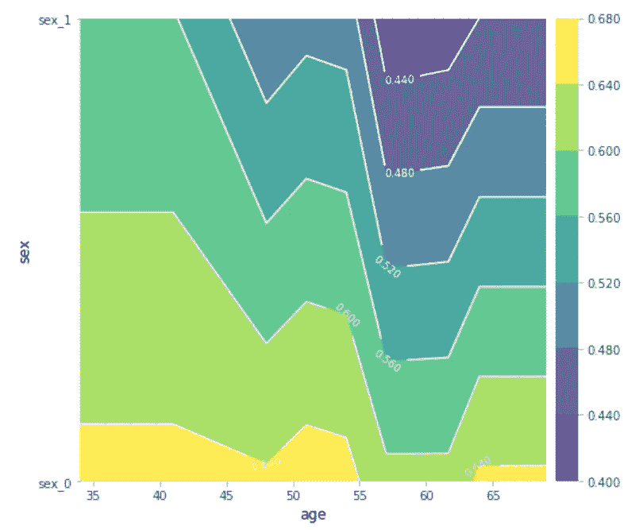

# 动手全球模型解释

> 原文：<https://towardsdatascience.com/hands-on-global-model-interpretation-3bb4264732b5?source=collection_archive---------25----------------------->

## 什么特性是重要的，为什么


Photo by [Bram Naus](https://unsplash.com/@bramnaus?utm_source=medium&utm_medium=referral) on [Unsplash](https://unsplash.com?utm_source=medium&utm_medium=referral)

本文是我关于模型可解释性和可解释人工智能系列文章的延续。如果你还没有，我强烈推荐你阅读本系列的第一篇文章— [“机器学习模型解释简介”](/introduction-to-machine-learning-model-interpretation-55036186eeab)，它涵盖了模型可解释性的基础知识，从什么是模型可解释性，为什么我们需要它到模型解释的潜在区别。

在本文中，我们将通过更深入地探究全局模型解释的来龙去脉来重拾我们离开的地方。首先，我们将快速回顾一下什么是全球模型解释及其重要性。然后我们将深入其中两种最流行的方法的理论——特征重要性和部分依赖图——并应用它们来获得关于[心脏病数据集](https://www.kaggle.com/ronitf/heart-disease-uci)的特征的信息。

# 什么是全局模型解释？

全局模型解释是一套帮助我们回答问题的技术，比如一个模型通常是如何表现的？哪些功能驱动预测，哪些功能对你的事业完全没用。使用这些知识，您可以对数据收集过程做出决策，创建仪表板来解释您的模型，或者使用您的领域知识来修复明显的错误。

大多数全局解释方法都是通过研究完整数据集上因变量和自变量(特征)之间的条件交互作用来工作的。他们还创建和使用大量的可视化工具，这些工具很容易理解，但包含大量用于分析模型的有用信息。

# 特征重要性

> 特征的重要性是在我们置换了特征的值之后模型的预测误差的增加，这打破了特征和真实结果之间的关系。— [可解释的机器学习，一个让黑盒模型变得可解释的指南](https://christophm.github.io/interpretable-ml-book/feature-importance.html)



Figure 2: Feature importance example

## 概念和理论

特性重要性的概念非常简单。使用特征重要性，我们通过计算在置换/混洗给定特征的特征值之后给定模型的误差的增加来测量特征的重要性。

如果置换会增加模型误差，则特征是“重要的”。这是因为在这种情况下，模型严重依赖这一特征来做出正确的预测。另一方面，如果置换不会对误差产生太大影响或者根本不会改变误差，那么特征就是“不重要”的。

Fisher，Rudin 和 Dominici 在他们 2018 年的论文[中建议，“所有的模型都是错误的，但许多是有用的……”](https://arxiv.org/abs/1801.01489)不是随机洗牌，而是应该将功能分成两半，并交换两半。

## 优势

特性重要性是了解特性重要性的最流行的技术之一。这是因为这是一种简单的技术，它为您提供了关于某个特性重要性的高度压缩的全局洞察力。此外，它不需要重新训练模型，这总是一个优势，因为节省了计算时间。

## 不足之处

尽管特征重要性是一种应该一直使用的解释技术，但是它仍然有一些缺点。例如，不清楚您是否应该[使用训练或测试集来计算特性重要性](https://christophm.github.io/interpretable-ml-book/feature-importance.html)。此外，由于置换过程，当重复计算时，结果可能变化很大。

另一个问题是，特征之间的相关性会通过产生不现实的实例或者通过在两个相关特征之间分割重要性来偏离特征的重要性。

要了解更多信息，我强烈推荐你去看看 [Christoph Molnar 的](https://christophm.github.io/)电子书“[可解释的机器学习](https://christophm.github.io/interpretable-ml-book/)”，这是一本学习更多解释模型的好书。

## 示例和解释

> 模型认为什么特征对于确定患者是否患有心脏病很重要？

这个问题可以用特征重要性来回答。

正如我在文章开头提到的，我们将研究心脏病数据集。你可以在我的 Github 上或者作为 [Kaggle 内核](https://www.kaggle.com/tannergi/heart-disease-analysis#Interpreting-models)找到本教程使用的所有代码。

大多数库，如 [Scikit-Learn、](https://scikit-learn.org/stable/auto_examples/ensemble/plot_forest_importances.html) [XGBoost](https://machinelearningmastery.com/feature-importance-and-feature-selection-with-xgboost-in-python/) 以及其他机器学习库，已经有了自己的特征重要性方法，但是如果您想在处理来自多个库的模型时获得准确的结果，使用相同的方法来计算每个模型的特征重要性是有利的。

为了确保这一点，我们将使用 [ELI5 库](https://eli5.readthedocs.io/en/latest/)。ELI5 允许用户可视化和调试各种机器学习模型。它提供的不仅仅是特性的重要性，还包括特定于库的特性以及一个[文本解释器](https://eli5.readthedocs.io/en/latest/tutorials/black-box-text-classifiers.html)。

为了计算特征的重要性，我们可以使用`*permutation_importance*`方法。在计算了给定模型的特征重要性之后，我们可以使用`show_weights`方法来可视化它。

利用上述方法可以得到模型的特征重要度，并对它们进行比较。



Figure 3: Feature Importance of Logistic Regression



Figure 4: Feature Importance of XGBoost

您可以看到这两个模型对于一个特性有着非常不同的重要性分数。这会对你对结果的信任度产生负面影响。

尽管如此，我们可以看到，像 ca、性别和 thal 这样的特征对于获得正确的预测非常有用，而年龄和 cp 对于获得正确的预测并不重要。

# 部分相关图

> 部分相关图(简称 PDP 或 PD 图)显示了一个或两个特征对机器学习模型的预测结果的边际效应



Figure 5: Partial Dependence Plot Example

## 概念和理论

部分相关图为您提供了有关特征如何影响模型预测的信息。这可以帮助我们理解什么样的特征值会给我们更高或更低的输出。

对于分类特征，可以容易地计算部分相关性。我们通过强制所有数据实例具有相同的类别来获得每个类别的估计值。例如，如果我们对性别如何影响患心脏病的几率感兴趣，我们可以首先用值“男性”替换“性别”列中的所有值，并对预测进行平均，然后用值“女性”进行平均。

计算回归的部分相关性要困难得多，但是 Christoph Molnar 在他的电子书中很好地解释了这个问题。因此，如果你有兴趣深入了解模型解释，一定要去看看。

## 示例和解释

为了创建部分相关图，我们将使用 [PDPbox 库](https://github.com/SauceCat/PDPbox)。PDPbox 为我们提供了一些不同的精心设计的图，包括单个功能的部分依赖图以及多个功能的部分依赖图。



Figure 6: PDP’s for one and two features

要安装 PDPbox，我们可以键入:

```
pip install git+https://github.com/SauceCat/PDPbox.git
```

现在我们可以使用`pdp_isolate`和`pdp_plot`方法创建一个部分相关图来分析不同性别对患心脏病概率的影响。



Figure 7: PDP for Gender

当将性别从 *sex_0* 更改为 *sex_1* 时，黄黑线给出了预测的平均效果。只看这条线，我们就能看出性别为 0 的患者比性别为 1 的患者更有可能患心脏病。

为了创建一个部分依赖图，向我们展示目标上两个特征的交互作用，我们可以使用`pdp_interact`和`pdp_interact_plot`方法。



Figure 8: 2d partial dependence plot

这可以帮助我们找到两个特征之间的相互作用，甚至是单个特征值。例如，我们可以看到，无论性别栏的值如何，年龄在 55 岁至 63 岁之间的患者患心脏病的概率最低。

# 结论

全局模型解释是帮助我们回答一些问题的技术，比如一个模型通常是如何表现的？哪些功能驱动预测，哪些功能对你的事业完全没用。

两种最常用的全局模型解释技术是特征重要性和部分相关图。

我们可以使用特征重要性来了解模型认为特征对于进行预测有多重要。

部分相关图有助于我们理解特定特征值如何影响预测。这是非常有用的，因为它允许你对特定的特征值感兴趣，然后可以进一步分析或共享。

# 下一步是什么？

在本系列的第 3 部分中，我们将深入了解什么是局部模型解释，以及两种局部模型解释技术(石灰值和 Shapely 值)是如何工作的，从而更深入地了解个人预测。

这就是这篇文章的全部内容。如果你有任何问题或者只是想和我聊天，请在下面留下评论或者在社交媒体上联系我。如果你想获得我博客的持续更新，请确保在 Medium 上关注我，并加入我的简讯。