# PyTorch 和 PyTorch 几何图形的手动图形神经网络

> 原文：<https://towardsdatascience.com/hands-on-graph-neural-networks-with-pytorch-pytorch-geometric-359487e221a8?source=collection_archive---------0----------------------->

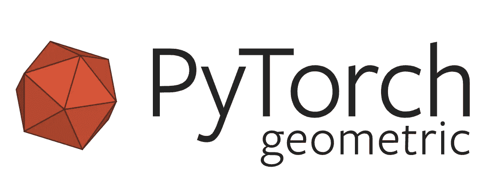

在我上一篇[文章](/a-gentle-introduction-to-graph-neural-network-basics-deepwalk-and-graphsage-db5d540d50b3)中，我介绍了图形神经网络(GNN)的概念以及它的一些最新进展。由于这个话题被大肆炒作，我决定制作这个教程，讲述如何在你的项目中轻松实现你的图形神经网络。您将学习如何使用 PyTorch Geometric 构建自己的 GNN，以及如何使用 GNN 解决现实世界中的问题(Recsys Challenge 2015)。

在这篇博文中，我们将使用 PyTorch 和 PyTorch Geometric (PyG)，这是一个基于 PyTorch 构建的图形神经网络框架，运行速度快得惊人。它比最著名的 GNN 框架 DGL 快好几倍。

除了其非凡的速度，PyG 还提供了一系列实现良好的 GNN 模型，这些模型在各种论文中都有说明。因此，用 PyG 重现实验将会非常方便。

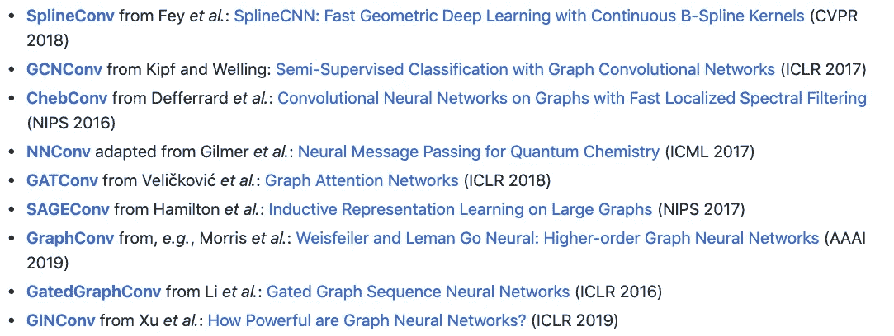

A Subset of The Implemented Models ([https://github.com/rusty1s/pytorch_geometric](https://github.com/rusty1s/pytorch_geometric))

鉴于其在速度和便利性方面的优势，毫无疑问，PyG 是最受欢迎和使用最广泛的 GNN 库之一。让我们进入主题，把我们的手弄脏！

# 要求

*   PyTorch — 1.1.0
*   PyTorch 几何图形— 1.2.0

# PyTorch 几何基础

本节将带您了解 PyG 的基础知识。基本上会涵盖 *torch_geometric.data* 和 *torch_geometric.nn* 。您将学习如何将几何数据传递到您的 GNN，以及如何设计一个自定义的消息传递层，GNN 的核心。

## 数据

*torch_geometric.data* 模块包含一个数据类，允许您非常容易地从数据中创建图表。您只需指定:

1.  与每个节点相关联的属性/特征
2.  每个节点的连通性/邻接性(边索引)

让我们使用下图来演示如何创建数据对象

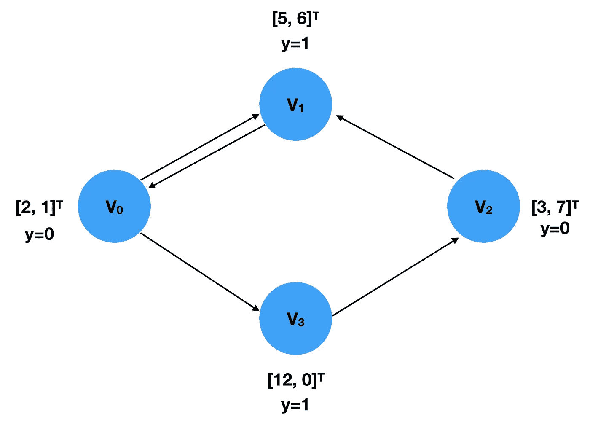

Example Graph

因此，图中有 4 个节点，v1 … v4，每个节点都与一个二维特征向量相关联，并且标签 *y* 指示其类别。这两个可以表示为浮动传感器:

图的连通性(边索引)应该用首席运营官格式限制，即第一个列表包含源节点的索引，而目标节点的索引在第二个列表中指定。

请注意，边索引的顺序与您创建的数据对象无关，因为此类信息仅用于计算邻接矩阵。因此，上面的 edge_index 表示与下面的相同的信息。

将它们放在一起，我们可以创建如下所示的数据对象:

## 资料组

数据集的创建过程不是很简单，但是对于那些使用过 *torchvision* 的人来说，它似乎很熟悉，因为 PyG 遵循它的惯例。PyG 提供了两种不同类型的数据集类，InMemorydataset 和 Dataset。顾名思义，前一个用于适合 RAM 的数据，而第二个用于更大的数据。由于它们的实现非常相似，所以我将只介绍 InMemoryDataset。

要创建 InMemoryDataset 对象，需要实现 4 个函数:

*   *raw_file_names()*

它返回一个列表，显示原始的、未处理的文件名列表。如果你只有一个文件，那么返回的列表应该只包含一个元素。事实上，您可以简单地返回一个空列表，然后在*过程()*中指定您的文件。

*   *已处理文件名()*

与上一个函数类似，它也返回一个包含所有已处理数据的文件名的列表。调用 process()后，通常返回的列表应该只有一个元素，存储唯一处理过的数据文件名。

*   *下载()*

这个函数应该将您正在处理的数据下载到 self.raw_dir 中指定的目录中。如果你不需要下载数据，就直接来

```
pass
```

在函数中。

*   *流程()*

这是数据集最重要的方法。您需要将数据收集到一个数据对象列表中。然后，调用 *self.collate()* 来计算 DataLoader 对象将使用的切片。下面是一个来自 [PyG 官网](https://rusty1s.github.io/pytorch_geometric/build/html/notes/create_dataset.html)的自定义数据集的例子。

在本文后面，我将向您展示如何根据 RecSys 挑战赛中提供的数据创建自定义数据集。

## 数据加载器

DataLoader 类允许您轻松地将数据批量输入到模型中。要创建 DataLoader 对象，只需指定所需的数据集和批处理大小。

```
loader = DataLoader(dataset, batch_size=512, shuffle=True)
```

DataLoader 对象的每次迭代都会生成一个 batch 对象，该对象非常类似于数据对象，但带有一个属性“Batch”。它指示每个节点与哪个图相关联。由于数据加载器将来自不同样本/图形的 *x* 、 *y* 和 *edge_index* 聚集成批，因此 GNN 模型需要这种“批”信息来知道哪些节点属于一批中的同一个图形以执行计算。

```
**for** batch **in** loader:
    batch
    >>> Batch(x=[1024, 21], edge_index=[2, 1568], y=[512], batch=[1024])
```

## 信息传递

消息传递是 GNN 的本质，它描述了如何学习节点嵌入。我在上一篇文章中已经谈到了，所以我将简单地用符合 PyG 文档的术语来介绍一下。

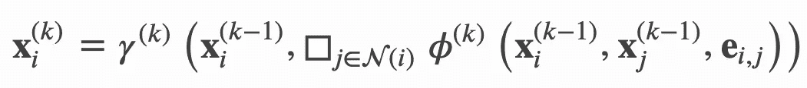

Message Passing

*x* 表示节点嵌入， *e* 表示边特征，𝜙表示**消息**功能，□表示**聚合**功能，**更新**功能。如果图中的边除了连通性之外没有其他特征，则 e 本质上是图的边指数。上标代表层的索引。当 k=1 时， *x* 表示每个节点的输入特征。下面我将说明每个功能的工作原理:

*   *propagate(edge_index，size=None，**kwargs):*

它接受边索引和其他可选信息，如节点特征(嵌入)。调用此函数将会调用*消息*和*更新*。

*   *消息(**kwargs):*

您指定如何为每个节点对(x_i，x_j)构造“消息”。因为它跟随*传播*的调用，所以它可以接受传递给*传播*的任何参数。需要注意的一点是，可以用“_i”和“_j”定义从参数到特定节点的映射。因此，命名该函数的参数时必须非常小心。

*   *更新(aggr_out，**kwargs)*

它接收聚合的消息和传递到 *propagate* 的其他参数，为每个节点分配一个新的嵌入值。

**例子**

让我们从论文 [*“大型图的归纳表示学习”*](https://arxiv.org/abs/1706.02216) 来看看如何实现一个 **SageConv** 层。SageConv 的消息传递公式定义为:

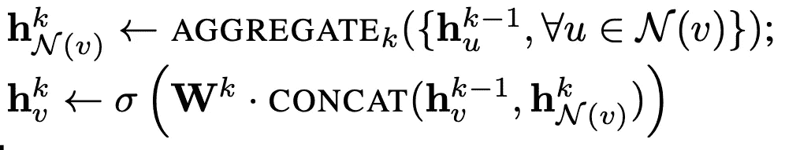

[https://arxiv.org/abs/1706.02216](https://arxiv.org/abs/1706.02216)

这里，我们使用最大池作为聚合方法。因此，第一行的右边可以写成:

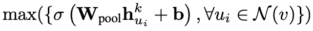

[https://arxiv.org/abs/1706.02216](https://arxiv.org/abs/1706.02216)

这说明了“消息”是如何构造的。每个嵌入的相邻节点乘以一个权重矩阵，加上一个偏差，并通过一个激活函数。这可以用 torch.nn.Linear 轻松做到。

```
class SAGEConv(MessagePassing):
    def __init__(self, in_channels, out_channels):
        super(SAGEConv, self).__init__(aggr='max')
        self.lin = torch.nn.Linear(in_channels, out_channels)
        self.act = torch.nn.ReLU()

    def message(self, x_j):
        # x_j has shape [E, in_channels]

        x_j = self.lin(x_j)
        x_j = self.act(x_j)

        return x_j
```

至于更新部分，聚合消息和当前节点嵌入是聚合的。然后，将其乘以另一个权重矩阵，并应用另一个激活函数。

```
class SAGEConv(MessagePassing):
    def __init__(self, in_channels, out_channels):
        super(SAGEConv, self).__init__(aggr='max')
        self.update_lin = torch.nn.Linear(in_channels + out_channels, in_channels, bias=False)
        self.update_act = torch.nn.ReLU()

    def update(self, aggr_out, x):
        # aggr_out has shape [N, out_channels]

        new_embedding = torch.cat([aggr_out, x], dim=1)
        new_embedding = self.update_lin(new_embedding)
        new_embedding = torch.update_act(new_embedding)

        return new_embedding
```

放在一起，我们有下面的 SageConv 层。

# 一个真实的例子—2015 年 RecSys 挑战赛

RecSys 挑战赛 2015 向数据科学家发起挑战，要求他们构建一个基于会话的推荐系统。这项挑战要求参与者完成两项任务:

1.  预测是否会有一个购买事件，随后是一系列的点击
2.  预测哪件商品将被购买

首先我们从 RecSys Challenge 2015 官网下载[数据，构建数据集。我们将从第一项任务开始，因为那项更容易。](https://2015.recsyschallenge.com/challenge.html)

该挑战提供了两组主要数据， *yoochoose-clicks.dat* 和 *yoochoose-buys.dat* ，分别包含点击事件和购买事件。让我们快速浏览一下数据:

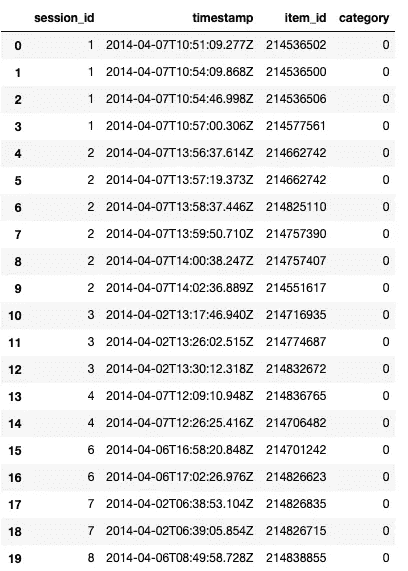

yoochoose-click.dat

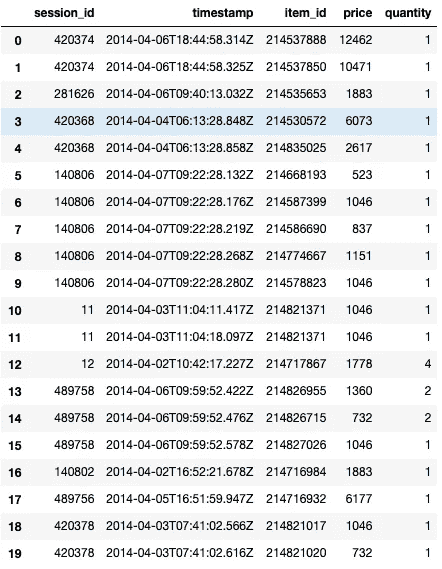

yoochoose-buys.dat

## 预处理

下载完数据后，我们对其进行预处理，以便将其输入到我们的模型中。item _ id 被分类编码以确保编码的 item _ id 从 0 开始，该编码的 item _ id 稍后将被映射到嵌入矩阵。

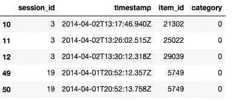

由于数据非常大，为了便于演示，我们对其进行了二次抽样。

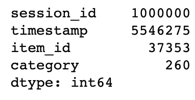

Number of unique elements in the subsampled data

为了确定基本事实，即给定会话是否有任何购买事件，我们只需检查 *yoochoose-clicks.dat* 中的 session_id 是否也出现在 *yoochoose-buys.dat* 中。

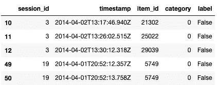

## 数据集构建

在预处理步骤之后，数据就可以转换成 Dataset 对象了。这里，我们将会话中的每个项目视为一个节点，因此同一会话中的所有项目构成一个图。为了构建数据集，我们通过 *session_id* 对预处理后的数据进行分组，并迭代这些组。在每次迭代中，每个组中的 item_id 被再次分类编码，因为对于每个图，节点索引应该从 0 开始计数。因此，我们有以下内容:

在构建数据集之后，我们调用 *shuffle()* 来确保它已经被随机打乱，然后将它分成三组用于训练、验证和测试。

## 构建图形神经网络

下面的自定义 GNN 引用了 PyG 官方 Github 库中的一个例子[。我用我们自己实现的 SAGEConv 层改变了 GraphConv 层，如上图所示。此外，还修改了输出图层以匹配二进制分类设置。](https://github.com/rusty1s/pytorch_geometric/blob/master/examples/enzymes_topk_pool.py)

## 培养

训练我们的自定义 GNN 非常容易，我们只需迭代从训练集构建的数据加载器，并反向传播损失函数。这里，我们使用 Adam 作为优化器，学习率设置为 0.005，二进制交叉熵作为损失函数。

## 确认

这种标签是高度不平衡的，有大量的负面标签，因为大多数会议之后没有任何购买活动。换句话说，一个愚蠢的模型猜测所有的否定会给你 90%以上的准确率。因此，曲线下面积(AUC)是该任务的更好指标，而不是准确性，因为它只关心正面示例的得分是否高于负面示例。我们使用 Sklearn 现成的 AUC 计算功能。

## 结果

我对模型进行了 1 个时期的训练，并测量了训练、验证和测试的 AUC 分数:

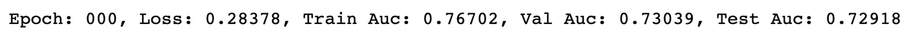

仅用 100 万行训练数据(约占所有数据的 10%)和 1 个时期的训练，我们可以获得验证和测试集的 AUC 分数约为 0.73。如果使用更多的数据以更大的训练步长来训练模型，分数很可能会提高。

## 结论

您已经学习了 PyTorch Geometric 的基本用法，包括数据集构造、自定义图层以及用真实数据训练 gnn。这篇文章中的所有代码也可以在[我的 Github repo](https://github.com/khuangaf/Pytorch-Geometric-YooChoose) 中找到，在那里你可以找到另一个 Jupyter 笔记本文件，我在其中解决了 RecSys Challenge 2015 的第二个任务。我希望你喜欢这篇文章。如果您有任何问题或意见，请在下面留下！确保在 [twitter](https://twitter.com/steeve__huang) 上关注我，我会在那里分享我的博客帖子或有趣的机器学习/深度学习新闻！和 PyG 玩 GNN 玩得开心！