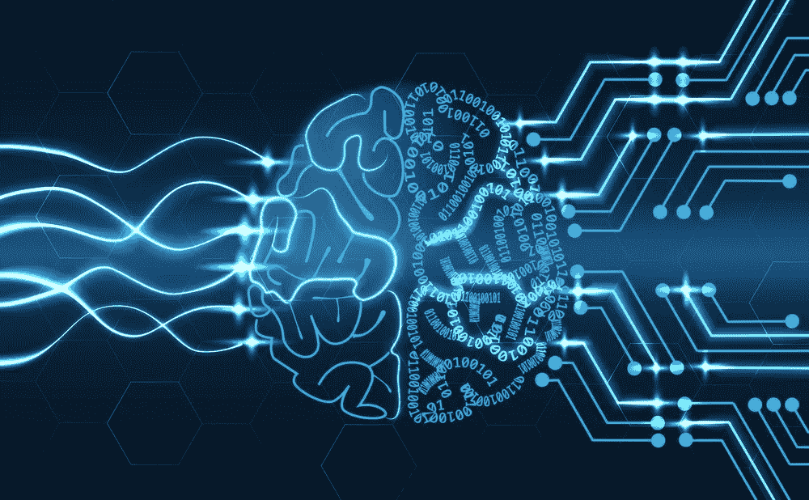
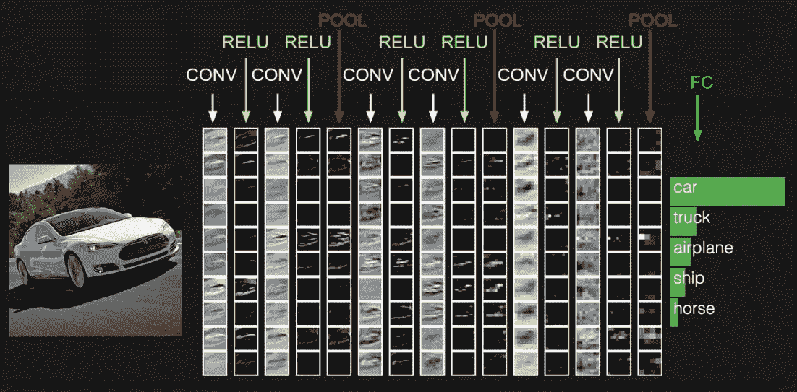
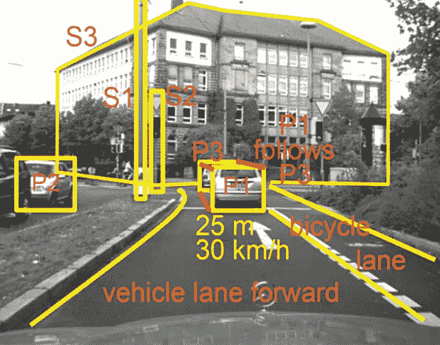
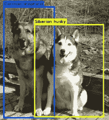
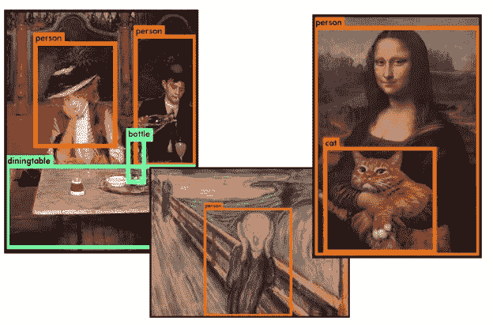

# 机器学习实践演示:

> 原文：<https://towardsdatascience.com/hands-on-machine-learning-example-real-time-object-detection-with-yolo-v2-ebdd8441c12a?source=collection_archive---------3----------------------->



source: [bawilabs](https://labs.bawi.io/deep-learning-convolutional-neural-networks-7992985c9c7b)

## **利用 YOLO·V2 进行实时物体检测**

# **简介**

这篇博客是为了一个具体的机器学习对象检测案例，与初学者分享我的经验而写的。

深度学习是人工智能(AI)和机器学习(ML)的一个高级子领域，长期以来一直是一个学术领域。随着数据的丰富和计算能力的指数级增长，我们已经看到跨学科应用深度学习商业案例的激增。也有很多聪明人选择研究 AI/ML，许多大型高科技公司(*领先* *云平台 ML 包括*[*AWS SageMaker*](https://aws.amazon.com/sagemaker/)*[*微软 Azure AI*](https://azure.microsoft.com/en-us/overview/ai-platform/)*[*谷歌云平台 ML*](https://cloud.google.com/products/ai/)*&*[*tensor flow*](https://www.tensorflow.org/)**

**只要你在世界的任何一个角落都有互联网连接，每个人工智能/人工智能爱好者都可以获得大量的公共在线培训和资源。因此没有借口留下… *(如果你是一个真正的 ML 爱好者，我认为最好的硬核开始是吴恩达的 Coursera specializations*[](https://medium.com/syncedreview/andrew-ng-offers-ai-for-everyone-eac04877773d)**。)****

**看我简单的 DIY 演示视频看看这件作品经过几个小时努力的成果: [**视频 1**](https://www.youtube.com/watch?v=86Kxo7hKwm8&feature=youtu.be) 和 [**视频 2**](https://www.youtube.com/watch?v=yhG-eZW3fLw&feature=youtu.be) 。**

# ****卷积神经网络****

****

**Source: Wikipedia**

**[卷积神经网络](https://en.wikipedia.org/wiki/Convolutional_neural_network) (CNN)是深度人工神经网络，主要用于对图像进行分类(即标记所看到的)，通过相似性对其进行聚类(即照片搜索)，并在场景内执行对象识别。它们是可以识别人脸、个人、街道标志、汽车、动物、异常、肿瘤和视觉数据的许多其他方面的算法。**

****

**卷积层用于从输入训练样本中提取特征。每个卷积图层都有一组有助于要素提取的过滤器。一般来说，随着 CNN 模型的深度增加，通过卷积层学习的特征的复杂性增加。你可以在[这里](https://www.youtube.com/watch?v=FTr3n7uBIuE)、[这里](https://skymind.ai/wiki/convolutional-network)或者[这里](https://ujjwalkarn.me/2016/08/11/intuitive-explanation-convnets/)了解更多关于 CNN 的信息。Andrej Karpathy[在这个](http://cs.stanford.edu/people/karpathy/)[链接](https://www.cs.cmu.edu/~bhiksha/courses/deeplearning/Fall.2016/pdfs/Simard.pdf)为他早期的斯坦福 CNN 课程写了一篇很棒的文章，如果你想在学术上更深入的话。**

****

**CNN 是一个如此迷人和具有颠覆性的领域，它为 [**人脸识别**](https://medium.com/@ageitgey/machine-learning-is-fun-part-4-modern-face-recognition-with-deep-learning-c3cffc121d78)[**自动驾驶汽车**](https://www.altoros.com/blog/what-it-takes-to-build-and-train-neural-networks-for-autonomous-vehicles/)[**光学字符识别**](https://hackernoon.com/latest-deep-learning-ocr-with-keras-and-supervisely-in-15-minutes-34aecd630ed8)**[**疾病自动诊断**](https://www.cnn.com/2017/01/26/health/ai-system-detects-skin-cancer-study/index.html)[**图像到文本的转换**](https://medium.com/syncedreview/stn-ocr-a-single-neural-network-for-text-detection-and-text-recognition-220debe6ded4)[**神经艺术**](https://no2147483647.wordpress.com/2015/12/21/deep-learning-for-hackers-with-mxnet-2/) 等等开辟了可能性****

********

****还有许多进一步的创新机会，从帮助数百万有**视觉障碍的人**到进一步推进**预防性医疗诊断、药物发现、** [**视频游戏**](https://www.youtube.com/watch?v=PyjBd7IDYZs) **、**全渠道零售商的货架/产品识别……天空是无限的:)这些框架也开始在边缘上工作。边缘可以是[iphone](http://machinethink.net/blog/object-detection-with-yolo/)，安卓小工具[，亚马逊 DeepLens](https://aws.amazon.com/deeplens/) 等。你明白我的意思吗？****

# ******用 YOLO 进行实时物体检测******

******你只看一次(YOLO)**—**—**多酷的名字啊？这种目标检测算法是目前最先进的，优于 CNN 及其上述变体。也许创始人受到了人类眼睛/大脑的启发，因为 YOLO 在测试期间正在查看整个**图像，所以它的预测是由图像中的全球背景提供的。它还通过单一网络评估进行预测，不像像 R-CNN 这样的系统需要数千个单一图像。YOLO V2 和 V3 可以实时检测各种对象类别。最新的 YOLO V3 甚至比 R-CNN 快 1000 倍以上，比[快 R-CNN](https://github.com/rbgirshick/fast-rcnn) ( [**参考**](https://pjreddie.com/darknet/yolo/) )快 100 倍。******

****您可以向它提供任何主要的图像/视频类型或来自网络摄像头的实时视频。YOLO 也是一个卷积网络，但它以一种巧妙的方式运行。(掌声送给原文[**YOLO·V2 的文章这里**](https://arxiv.org/pdf/1612.08242.pdf) )****

****YOLO 有一种有效的方法，它首先预测图像的哪些部分包含所需的信息，然后只在这些部分上运行(CNN)分类器。简单地说，YOLO 把图像分成 13×13 的网格，网格又被分成 5 个“边界框”。边界框是包围对象的矩形。对于每个包围盒，它并行运行识别算法来识别它们属于哪个图像类别。YOLO 最终输出一个置信度(概率)分数，告诉我们预测的边界框实际上包围了一个对象(图像类)有多确定。每个输入图像都可以通过这个特殊的 CNN 快速获取，并产生一个(13 x 13 x 125)的矩阵，其中每个张量都携带独特的信息，如 x，y 参数，边界框矩形的宽度/长度，置信度得分和经过训练的图像类别的概率距离。****

****我们提供的参数忽略了得分低的那些，并从我们训练的图像类库中挑选出概率最高的特定对象。因此，我们最终很少看到有狗、人、花、汽车等的包围盒。因此，如果我可以过于简化，YOLO 过程在视觉上看起来像下面每个图像网格的闪烁速度。最右边的图片显示了识别出的具有最高盒子置信度得分的图像和标签组合。****

********

****The input image is divided into an 7 x 7 grid. Then bounding boxes are predicted and a class is predicted among classification over the most confident ones. Source: [J. Redmon and al. (2016)](https://arxiv.org/pdf/1506.02640.pdf)****

********

****YOLO V2 is trained with the COCO (Common objects in Context) library that has 100k images of 80 common classes plus it is complemented with a subset of ImageNet. It has 80 image classes. As a reference ImageNet has 14 million images and 22k classes. You can leverage other data sets or leverage Amazon mechanical Turk like new crowd sourcing services for manual labeling work and come up with your own data set!!****

****所有代码和环境都是 [**开源**](https://en.wikipedia.org/wiki/Open-source_software) 因此任何人都可以克隆和修改作品。我还做了一个小的 Python 代码修改，以便在制作我的测试 YouTube 视频时，能够使用外部网络摄像头进行实时记录(以便不随身携带我的笔记本电脑)。只要懂一点 Python，对理论有一定程度的理解，就可以做任何编辑…****

********

****网上的大多数例子通常基于 Linux 或 Mac，尽管我不得不在装有英特尔酷睿 7 的联想 Windows 10 机器上做这个演示。因此，以下所有个人经验和指导都适合在 Windows 环境下使用。****

****最初的 YOLO 作者使用 C 和 CUDA 在开源库中创建了 DarkNet。我选择使用 Darkflow，它基本上是 DarkNet 到方便的 Tensorflow 版本的翻译。因此，我们将下载并使用暗流版本进行演示。****

# ****好了，让我们开始吧…依赖关系****

****您需要在您的(笔记本电脑)环境中安装 Python 3.5 或 3.6、Tensorflow、numPY、openCV 才能开始。下面是一些在 Windows 上对我有用的指导。****

# ******第一步——安装 Windows 的依赖项******

****对于初学者，你可以安装以下软件，为你将来的 ML 实验准备一个干净的个人计算环境。****

1.  ****下载并安装 [Anaconda 包](https://www.anaconda.com/download/) 64 位版本，选择 **Python 3.6 版本**。( [**链接**](https://www.youtube.com/watch?v=T8wK5loXkXg) 到视频教程)这个自动安装 Python 和很多流行的 data scientist/ML 库( *NumPy、Scikit-Learn、Pandas、R、Matplotlib…* )、工具( *Jupyter Notebook、RStudio* )和其他数百个开源包，供你未来的项目使用。当你开始时，它感觉像是最接近 ML 软件包的圣杯的东西…例如，我仍然使用 Anaconda Jupyter 笔记本进行几乎所有的 ML 实验，主要是出于方便。虽然 openCV 库不包括在内，但我们将单独安装它，因为实时计算机视觉任务需要它。(*给蟒蛇乡亲们的提示！*)****
2.  ****安装[**tensor flow**T3](https://www.tensorflow.org/install/source_windows)[和 **Keras**](https://keras.io/) (可选)。TensorFlow 是最受欢迎的人工智能软件库，由谷歌创建/维护。 **Keras** 是另一个非常流行的&高级神经网络 API，用 Python 编写，能够在 TensorFlow 之上运行。它的开发重点是支持快速实验。当你在经历了 [*吴恩达的*](https://medium.com/syncedreview/andrew-ng-offers-ai-for-everyone-eac04877773d) *这种很低级的素材后，想要“退出”的时候，Keras 感觉就像一块蛋糕！因为它是基于 Python 的高级语言。* [***别人***](https://hackernoon.com/interview-with-the-creator-of-keras-ai-researcher-fran%C3%A7ois-chollet-823cf1099b7c) *为你做了艰苦的工作！*****

****在试图安装所有这些开源软件包时，出现问题是很常见的，尤其是在 Windows 机器上。让一切正常工作并解决所有版本或冲突问题需要一段时间。我的最佳实践是基本上谷歌这类问题，并在网上找到解决方案。像 stackoverflow 这样的网站非常有用，可以节省你的时间。****

****总的来说，我还发现创建一个单独的新的 **conda 虚拟环境**有助于缓解 Windows 安装问题。更多关于 [**这里**](https://medium.com/@margaretmz/anaconda-jupyter-notebook-tensorflow-and-keras-b91f381405f8) 。****

# ****第二步——安装暗网/YOLA、暗流工具****

****[**DarkNet**](https://pjreddie.com/darknet/)**:**最初，YOLO 算法是由 Joseph Redmon 在 DarkNet 框架中实现的。Darknet 是一个开源的自定义神经网络框架，用 C 和 CUDA 编写。它速度快，易于安装，并支持 CPU 和 GPU 计算。你可以在 [GitHub](https://github.com/pjreddie/darknet) 上找到开源。****

****[**Darkflow**](https://github.com/thtrieu/darkflow) :是 YOLO 在 TensorFlow 上的一个实现的昵称。由于 Trinh Hoang Trieu，Darknet 模型被转换为 Tensorflow，并且可以安装在 Linux 和 Windows 环境中。让我们开始吧！****

****#打开 anaconda 提示符并克隆 darkflow github 存储库。(*您可能需要安装*[***Git Bash***](https://gitforwindows.org/)*Windows，Git 命令才能工作)*****

****`git clone [https://github.com/thtrieu/darkflow](https://github.com/thtrieu/darkflow)`****

*****#替代方法基本上是进入*[***dark flow GitHub***](https://github.com/thtrieu/darkflow)*页面，将主库下载到您的本地(即 C:\ users \ user _ name \ dark flow)*****

****#如果您尚未在步骤 1 中创建新的虚拟环境，则创建一个 conda 环境用于 darkflow 安装。****

****`conda create -n your_env_name python=3.6`****

****#使用 anaconda 提示符激活新环境。****

****`activate your_env_name`****

****#你可以用 conda-forge 库安装需要的 OpenCV。 [conda-forge](https://conda-forge.org/#about) 是一个 github 组织，包含 conda 库的存储库。****

****`conda config --add channels conda-forge`****

****`conda install opencv`****

****#在适当的位置构建 Cython 扩展。这是一个广泛使用的 Python to C 编译器和包装器，它帮助我们从 Python 中调用 DarkNet C 代码。****

****`python setup.py build_ext --inplace`****

****或者尝试以下替代方法****

****`pip install -e .`****

*****如果出现错误，首先尝试将工作目录更改为 darkflow (cd darkflow ),然后重新运行上述命令之一。*****

****酷毙了。上述步骤将有望建立一个本地环境来运行 darkflow 并在图像或视频上执行对象检测任务。****

****最后，我们需要下载 **CFG** 和 **WEIGHTS** 文件。预训练的模型名称是 YOLOv2，其在包含 80 个类别(像汽车、狗、人、飞机等的图像类型)的 COCO 图像数据集上被训练。****

****权重文件:请从[这里](https://pjreddie.com/media/files/yolov2.weights)下载`yolov2.weights`文件。请**创建一个暗流/bin** 目录来保存这些重量文件。****

****CFG 文件:在本地 darkflow 文件夹下现有的 **darkflow/cfg** 目录下创建一个对应型号的`yolo.cfg`文本文件。勾选 [**这里的**](https://github.com/pjreddie/darknet/blob/master/cfg/yolov2.cfg) 为源文件。如果你愿意，你可以用记事本复制粘贴原始的 GitHub 内容。另外，不要忘记看看 Darkflow 的命令行帮助选项，以供将来参考。
`python flow --h`****

****PS:我发现这个 [**博客**](https://appliedmachinelearning.blog/2018/05/27/running-yolo-v2-for-real-time-object-detection-on-videos-images-via-darkflow/#comments)**(Abhijeet Kumar)**在我计算出需要的装置时非常有用。********

********我们都准备好了。********

# ********让我们运行暗流 YOLO 命令行来渲染一些视频！********

********我喜欢使用 Anaconda 命令提示符来执行以下命令。你可以通过搜索“Anaconda 提示符”在 Windows 开始菜单中找到它。在提示窗口中，通过“激活您的环境名称”命令激活您的新 Tensorflow 虚拟环境。然后执行“cd darkflow”命令，将当前工作目录更改为本地 darkflow 存储库。然后，您可以尝试以下命令开始运行 DarkFlow 来处理图像和视频。********

1.  ********要处理已有的图像，可以运行以下命令:
    `python flow --model cfg/yolo.cfg --load bin/yolov2.weights --imgdir sample_img`********

********请注意 darkflow/sample_img 是一个包含样本照片的目录。********

********2.要处理视频文件，可以将待渲染的视频文件移动到 master darkflow 文件夹下，然后使用以下命令:********

********`python flow --model cfg/yolo.cfg --load bin/yolov2.weights --demo samplename.mp4`********

********提示:如果在末尾添加“— saveVideo”，也可以将处理后的视频保存在主文件夹下。********

********3.要通过您的笔记本电脑摄像头渲染实时流视频:********

********`python flow --model cfg/yolo.cfg --load bin/yolov2.weights --demo camera`********

********更多的例子可以在[这里](https://github.com/thtrieu/darkflow)或者[这里](https://appliedmachinelearning.blog/2018/05/27/running-yolo-v2-for-real-time-object-detection-on-videos-images-via-darkflow/#comments)找到。********

# ********我的基本例子********

********因为 Medium 不允许直接流式播放，所以我在 YouTube 上上传了两个我用外部网络摄像头录制的示例视频。********

> ********[*视频 1 用谷歌搜索*](https://youtu.be/86Kxo7hKwm8)********
> 
> ********[*视频 2 在我们的客厅:)*](https://youtu.be/yhG-eZW3fLw)********

# ********使用个人设备还是云 ML 服务？********

********都是。如果你是初学者，建议你先设置一台个人私人笔记本电脑，里面有需要的 Anaconda、Python 和 Keras/Tensorflow 以及其他所有相关的流行包。在你的 ML 旅程中，这是学习、尝试 MVP 和快速失败/转向的关键。您还可以轻松地设置一个 AWS SageMaker 帐户/环境，它不需要 TerasFlow/Keras 的任何这些单独的安装。我不会详细介绍，但请查看此 [**链接**](https://docs.aws.amazon.com/sagemaker/latest/dg/gs.html) 了解更多信息。你也可以尝试微软 Azure 或者谷歌云。随着您越来越先进，云将更适合帮助您获得更大的数据空间(即 AWS S3 桶)、计算能力(即更多的 CPU 或 GPU)和快速部署/扩展。因此，它们不是竞争而是互补。********

# ********结论********

******围绕 AI 和 ML 有很多议论。我试图展示，任何人都可以用可用的开源框架和库创建真正的产品，开始时风险自负。******

******例如，您可以进一步创建和培训自己的课程(图像或图像类型),并根据您的独特需求定制培训。YOLO 和暗流都是开源的，你可以克隆和修改它们。YOLO v3 也已经上市，这一视觉识别领域将继续迅猛发展。我很期待和它一起玩。******

******我绝不是人工智能或 CNN 的专家，但我希望这篇博客能对人工智能/人工智能爱好者在你未来的 DIY 项目中有所启发。随时欢迎评论和反馈。不要留下来！******

# ********学分********

******所有学分将授予以下人员。我所做的只是利用了他们的优秀作品。******

1.  ******[关于 YOLO 的原始论文](https://arxiv.org/pdf/1506.02640.pdf)。[继 YOLOv2 和 YOLO9000](https://arxiv.org/pdf/1612.08242.pdf) 之后的论文。如果你不喜欢阅读学术论文，你可以在这个[链接](https://docs.google.com/presentation/d/14qBAiyhMOFl_wZW4dA1CkixgXwf0zKGbpw_0oHK8yEM/edit#slide=id.g23f389e290_1_35)查看开国元勋们的演讲摘要。******
2.  ******然后 DarkNet (Joseph Redmon)创建了 below 库，启发了许多人去实现 YOLO。他做了两次 TED 演讲。[第一个](https://www.ted.com/talks/joseph_redmon_how_a_computer_learns_to_recognize_objects_instantly#t-445892)主要谈论技术，第二个[更多地谈论道德含义。](https://www.youtube.com/watch?v=XS2UWYuh5u0)******

******[](https://pjreddie.com/darknet/yolo/) [## YOLO:实时目标检测

### 你只看一次(YOLO)是一个最先进的，实时对象检测系统。

pjreddie.com](https://pjreddie.com/darknet/yolo/) 

3.然后 Trieu 先生已经将 [Darknet-YOLO v2](https://pjreddie.com/darknet/yolo/) 翻译成 Tensorflow 框架。

[](https://github.com/thtrieu/darkflow) [## thtrieu/darkflow

### 将 darknet 转换为 tensorflow。加载训练过的重量，使用 tensorflow 进行重新训练/微调，将常量图形定义导出到…

github.com](https://github.com/thtrieu/darkflow) 

# 延伸阅读和观看…

更多关于 YOLO 的信息，请点击 [**此处**](https://www.youtube.com/watch?v=4eIBisqx9_g) **，** [**此处**](https://medium.com/@jonathan_hui/real-time-object-detection-with-yolo-yolov2-28b1b93e2088) **或** [**此处**](https://medium.com/comet-app/review-of-deep-learning-algorithms-for-object-detection-c1f3d437b852) 获取更多见解和灵感。 [**马克杰伊**](https://www.youtube.com/watch?v=eFJOGsQ_YTA) 也有一个很棒的 8 部分 Youtube 系列，展示如何定制暗流。你可以在演职员表部分查看创始人的 YOLO 主页。(快捷键: [**暗网 YOLO**](https://pjreddie.com/darknet/yolo/) ， [**暗流**](https://github.com/thtrieu/darkflow) )。

# **更新**

1.  错误处理:如果你收到一个类似“ *… AssertionError: labels.txt 和 cfg/yolov2.cfg 表示不一致的类编号…*“
    然后[检查这个解决方案](https://github.com/thtrieu/darkflow/issues/295)。您只能使用保留的 CFG 字后面的[(只要您的命令提示符指示新的“bin”文件夹下下载的权重文件名，权重名称就可以了)。首先，你可以在这里](https://github.com/thtrieu/darkflow/blob/master/darkflow/net/yolo/misc.py#L13-L18) 从 [**下载 yolov2，但将其重命名为 **yolo.cfg** ，因为它是由代码识别的。您还可以选择修改开放源代码。**](https://pjreddie.com/darknet/yolo/)
2.  如果你想使用**外部网络摄像头**，这里有一些调整开源代码的简单技巧。*上帝保佑开源软件！*

**如何使用外部网络摄像头进行实时流媒体播放:**
你必须对你克隆的开源暗流代码做一个小小的修改&下载。首先，你需要一个网络摄像头连接到 OpenCV 可以连接的计算机上，否则它将无法工作。如果您连接了多个网络摄像头，并且想要选择使用哪一个，您可以传递“file = 1”来选择(OpenCV 默认使用现有的网络摄像头作为 0)。请打开以下文件，并使用 Jupyter 或任何其他 Python 编辑器进行更改:[http://localhost:8888/edit/dark flow/dark flow/net/**help . py**](http://localhost:8888/edit/darkflow/darkflow/net/help.py)

或者你可以在下面的链接复制我的分叉代码。

[](https://github.com/Sailor74/darkflow/blob/Sailor74-patch-1/darkflow/net/help.py) [## Sailor74/darkflow

### 将 darknet 转换为 tensorflow。加载训练过的重量，使用 tensorflow 进行重新训练/微调，将常量图形定义导出到…

github.com](https://github.com/Sailor74/darkflow/blob/Sailor74-patch-1/darkflow/net/help.py) 

然后，您可以轻松地使用 Anaconda 提示符命令窗口通过外部网络摄像头进行流式传输。

```
# run darkflow with external webcam on windows
python flow --model cfg/yolo.cfg --load bin/yolov2.weights --demo webcamera
```

您可以使用 Anaconda prompt 命令通过网络摄像头进行流媒体播放，并将视频**保存在 darkflow 根文件夹下:**

```
# run darkflow with ext webcam and save to local folder
python flow --model cfg/yolo.cfg --load bin/yolov2.weights --demo webcamera --saveVideo
```

剧终



Happy “deep learning” in 2019!!******