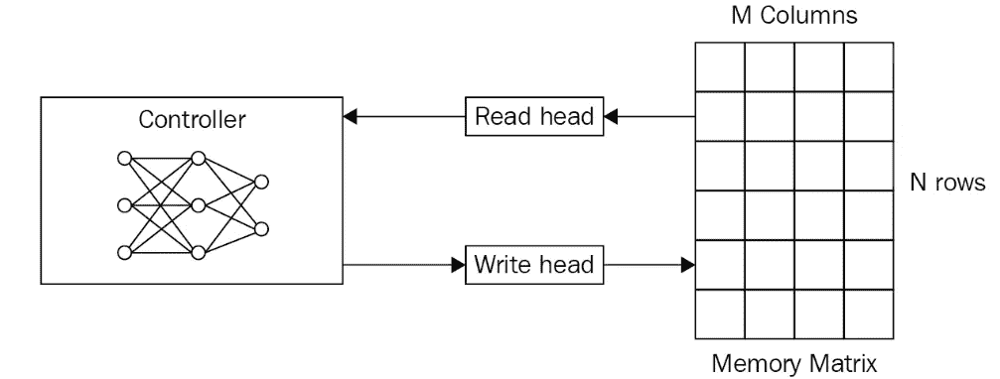
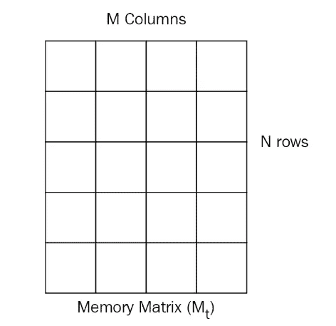
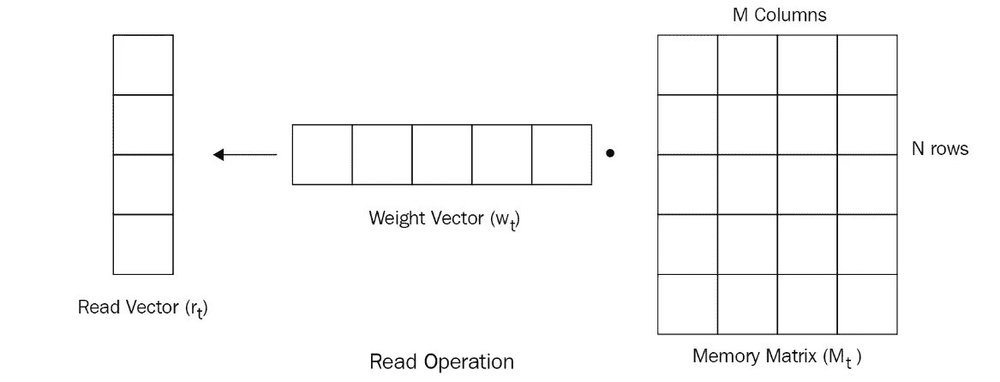
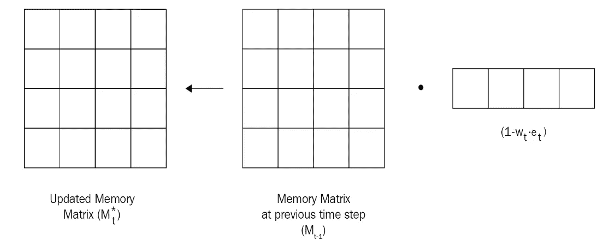
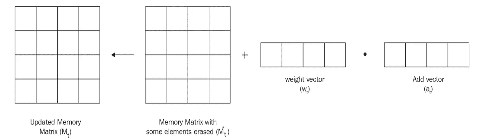
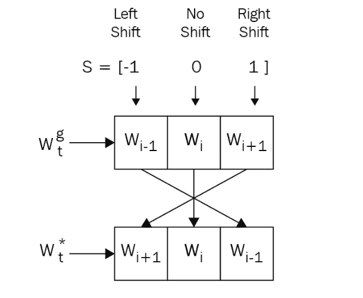
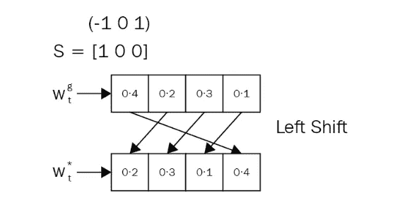
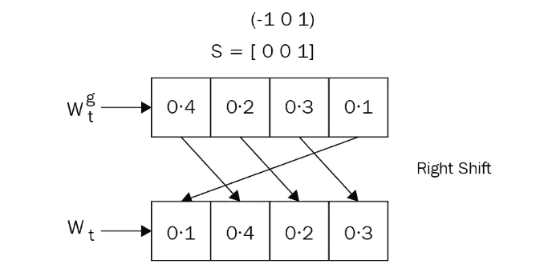

# 记忆增强神经网络构建实践(第一部分)

> 原文：<https://towardsdatascience.com/hands-on-memory-augmented-neural-networks-implementation-part-one-a6a4a88beba3?source=collection_archive---------4----------------------->

记忆增强神经网络(MANN)，可用于一次性学习，在这篇文章中，我将向您展示如何构建记忆增强神经网络。

在我们开始建立我们的曼恩之前，我想说明它的前身，神经图灵机(NTM)。在这一部分，我将向您展示 ntm 如何利用外部存储器来存储和检索信息。所以，让我们跳到 NTM。

## 神经图灵机架构和概念

神经图灵机是一种算法，具有从存储器中存储和检索信息的能力。NTM 的亮点是用外部存储器来增强神经网络，用于存储和检索信息，而通常一些神经网络使用隐藏状态作为存储器。这是 NTM 的建筑:

Fig 01 —The architecture of NTM

如您所见，通常 NTM 有三个核心组件:

*   控制器
*   记忆
*   读写头

控制器，基本上是一个前馈神经网络或递归神经网络，读取和写入存储器。存储器部分，你可以称之为存储体或存储矩阵，这里我们有一个二维矩阵，由 N 行 M 列的存储单元组成。控制器从外部环境接收输入，并通过与存储体或存储矩阵交互来发出响应。通常，读磁头和写磁头是包含存储器地址的指针，它必须从存储器中读取和写入。

在 NTM，我们使用特殊的读写操作来决定关注内存中的哪个位置。

## 神经图灵机读取操作

既然我们的记忆库或记忆矩阵中有很多记忆块，那么我们需要选择哪一个来从内存中读取呢？这是由权重向量决定的。可以由注意机制获取的权重向量指定了在存储器中哪个区域比其他区域更重要。首先，我们需要规范化权重向量，这意味着它的值范围从 0 到 1，其和等于 1。好了，让我们在这里做一些数学，不要担心下面这些长公式，我们会涵盖它。

Fig 02 — — Neural Turing Machine Read and Write operations math formula

假设归一化权重向量为 w_t，其中下标 t 表示时间，w_t(i)表示权重向量中索引为 I 且时间为 t 的元素。如公式 R1 所示，假设我们的记忆库或记忆矩阵包含 N 行和 M 列，我们使用 Mt 表示时间为 t 的记忆矩阵

Fig 03 — — M_t(i), Memory Matrix M_t given time t

然后我们可以以线性方式组合存储器矩阵 Mt、权重向量 Wt、读取向量 Rt。这可以表示为公式 R2(图 02)

Fig 04 — — r_t, read vector given time t

## 神经图灵机写操作

擦除和添加操作包含在 NTM 写入操作中。可以应用擦除操作来移除存储器中不需要的信息。为了擦除存储矩阵中特定单元的值，我们引入一个擦除向量 e_t，它的长度与权向量 w_t 相同，擦除向量包含 0 和 1 的值。

因此，为了擦除值并获得更新的内存矩阵，我们将(1- w_t x e_t)乘以上一步 M_{t-1}^(i 中的内存矩阵，如图 2 中的公式 E1 所示。

Fig 05 — — Erase operation

对于 NTM 写操作中的加法操作，我们使用权重向量 w_t(i)乘以加法向量 a_t，加法向量 a _ t 具有要添加到存储器的值，然后将它们添加到存储器矩阵，即图 02 中的公式 A1。

Fig 06 — — Add operation

## 神经图灵机中的寻址机制

我们可以使用注意机制和不同的寻址方案来计算权重向量。这里我们有两种类型的寻址机制来从存储器中访问信息:

*   基于内容的寻址
*   基于位置的寻址

对于基于内容的寻址，根据相似性从存储器中选择值。假设控制器返回一个关键向量 k_t，相似性是通过将该关键向量与存储矩阵 M_t 中的每一行进行比较而获得的。该相似性可以通过下图中的数学公式 CB1 来测量。

Fig 07 — — Addressing Mechanisms Math in Neural Turing Machine

接下来，我们引入一个参数β，它被称为关键强度，用于确定权重向量应该有多集中。基于β的值，我们可以根据关键强度的值将注意力调整到特定位置。也就是说，当β值较低时，我们平等地关注所有位置，当β值较高时，我们关注特定位置。因此，我们的权重向量变成了图 07 的公式 CB2。

我们可以对权重应用 softmax，而不是直接使用这个数学定义。也就是图 07 中的公式 CB3。

对于基于位置的寻址，我们仍然有三个步骤:

*   插入文字
*   卷积移位
*   磨刀

插值用于决定我们是否应该使用在先前时间步长 w_{t-1}获得的权重或者使用通过基于内容的寻址 w_t^c.获得的权重来解决该问题，我们引入新的参数 g_t 来确定我们应该使用哪些权重。g_t 的值可以是 0，也可以是 1。因此，我们的权重向量可以通过图 07 中的公式 CS1 来计算。

正如你所看到的，当 g_t 的值为 0 时，我们的权重向量是我们从上一个时间步获得的。而如果 g_t 的值是 1，那么我们的权重向量就是我们通过基于内容的寻址获得的权重向量。

然后，我们继续卷积移位，它用于移动头部位置。每个磁头发出一个参数，比如说移位权重 s_t，来给我们一个允许整数移位的分布。

假设我们的权重向量中有三个元素，如图 07 中的公式 CS2，我们的移位权重向量中有三个元素，假设 s_t = [-1，0，1]。移位-1 意味着我们将把 w_t^g 中的元素从左向右移位。移位 0 表示将元素保持在相同的位置，移位+1 表示将元素从右向左移位。那就是下图:

Fig 08 — — Shift Diagram

现在假设我们有移位权重 s_t = [1，0，0]，我们将执行左移，因为在其他位置移位值为 0。

Fig 09 — — left shift

类似地，当 s_t = [0，0，1]时，我们执行如下右移

Fig 10 — — Right shift

当在权重矩阵中执行卷积移位时，假设我们有 0 到 N-1 个存储单元，卷积移位以图 7 的公式 CS3 的方式进行。

对于最后一步锐化，由于偏移，聚焦在单个位置的权重将分散到其他位置，为了减轻这种影响，执行了锐化。这里我们引入一个新的参数 gamma_t，应该大于等于 1 才能进行锐化。因此，权重向量可以表示为图 07 中的公式 S1。

广泛用于一次性学习任务的记忆增强神经网络(MANN)实际上是神经图灵机的变体。为了让 NTM 在一次性学习任务中表现得更好，曼恩不能使用基于位置的寻址。MANN 还使用了一种称为最近最少使用访问的新寻址模式。该场景背后的思想是最近最少使用的存储器位置由读取操作确定，并且读取操作由基于内容的寻址来执行。因此，我们基本上执行基于内容的寻址来读取和写入最近最少使用的位置。

## 记忆增强神经网络上的读操作

MANN 使用两个不同权重向量来执行读取和写入操作。MANN 中的读取操作与 NTM 相同。基于内容的相似性可以通过余弦相似性来测量，余弦相似性仍然可以表示为下面的第一个公式。权重向量可以表示为下面的第二个公式。与 NTM 不同，曼恩不使用密钥强度，所以 softmax 版本的加权向量成为下面的第三个公式。

Fig 11 — — Math in MANN read operations

以线性方式与权重向量和记忆矩阵结合的读取向量可以表示为上述第四个公式。

## 记忆增强神经网络上的写操作

为了找到最近最少使用的内存位置，我们可以计算一个新的向量，称为使用权重向量，比如 w_t^u，它将在每次读写步骤后更新。因此，使用加权向量成为读取加权向量和写入加权向量的总和，如图 12 中的公式 F1 所示。

Fig 12 — — Math in MANN Write Operations

然后，我们可以通过添加衰减的先前使用权重向量来更新我们的使用权重向量，它变成图 12 中的公式 F2，假设衰减参数γ用于确定先前使用权重必须如何衰减。

为了计算最近最少使用的位置，我们引入另一个权重向量，比如最少使用的权重向量 w_t^{lu}.从使用权重向量计算最少使用的权重向量非常简单。只需将使用权重向量中最低值的索引设置为 1，其余值设置为 0，因为使用权重向量中的最低值意味着它最近最少被使用。

然后，我们使用 sigmoid 门计算写入权重向量，该门用于计算之前的读取权重向量和之前最少使用的权重向量的凸组合。写权重向量变成图 12 中的公式 F3。在计算写入权重向量之后，我们最终更新存储器矩阵，即图 12 中的公式 F4。

这篇文章主要是关于记忆增强神经网络的概念和数学，你可以在这里找到代码实现部分:

 [## 记忆增强神经网络构建实践(第二部分)

### 在这篇文章中，我将向你展示一些构建记忆增强神经网络(简称 MANN)的代码。可以参考一下…

medium.com](https://medium.com/@xavier_lr/hands-on-memory-augmented-neural-networks-build-part-two-896b1ef50726)