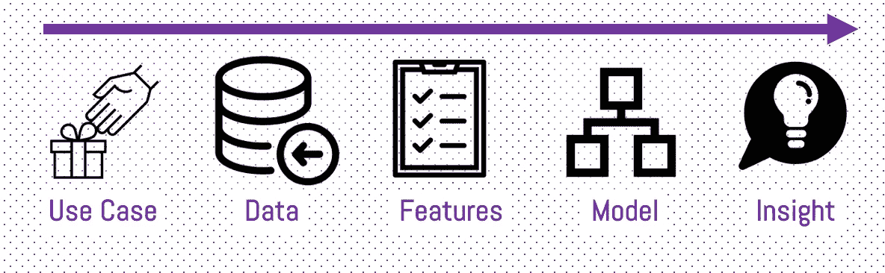
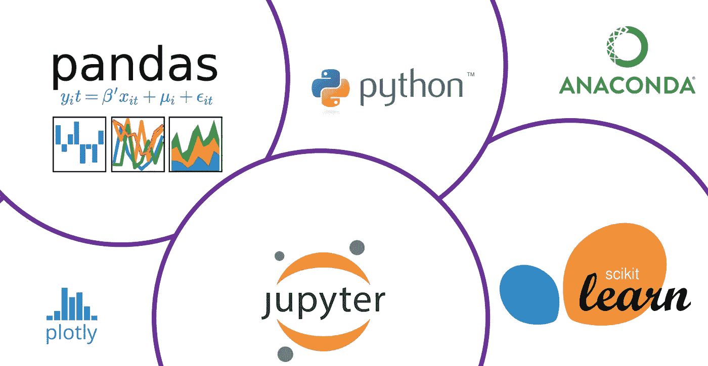
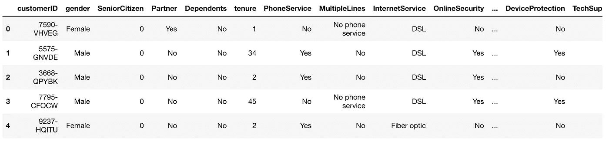
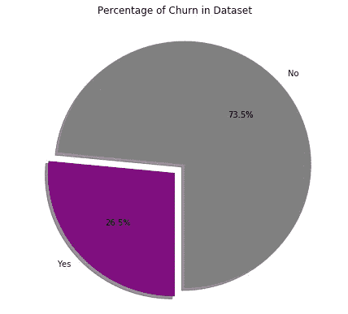
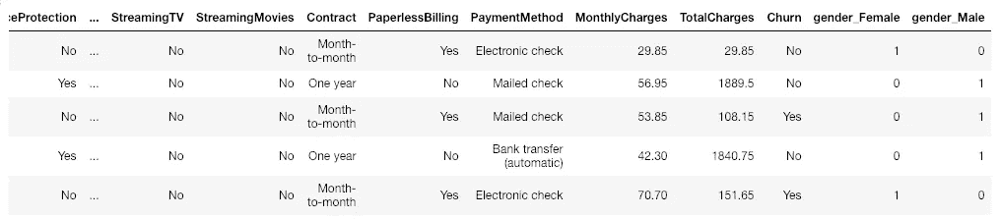
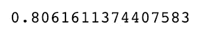
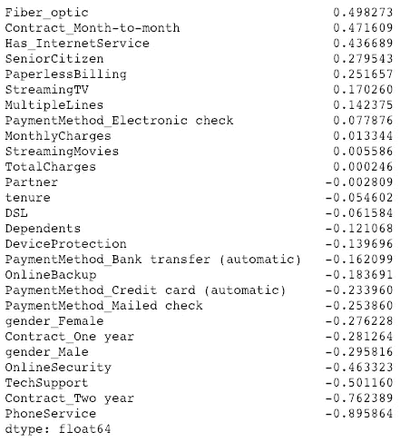

# 实践:预测客户流失

> 原文：<https://towardsdatascience.com/hands-on-predict-customer-churn-5c2a42806266?source=collection_archive---------1----------------------->

长话短说——在这篇文章中，我们想亲自动手:建立一个模型，识别我们亲爱的客户在不久的将来离开我们的意图。我们通过在 python 的帮助下实现一个预测模型来做到这一点。不要期待一个完美的模型，而是期待一些你今天可以在自己的公司/项目中使用的东西！


在我们开始之前，让我们简要回顾一下什么是客户流失:客户流失量化了取消订阅或取消服务合同的客户数量。对于任何企业来说，顾客拒绝接受你的服务或产品都不是一件有趣的事情。一旦失去，赢回他们是非常昂贵的，甚至没有想到如果不满意，他们不会做最好的口碑营销。[在我之前的一篇文章](https://blog.markgrowth.com/eliminating-churn-is-growth-hacking-2-0-47a380194a06)中，了解所有关于客户流失的基础知识。现在让我们开始吧！

## 我们将如何预测客户流失？

预测未来客户流失的基础层是来自过去的数据。我们关注已经流失的客户的数据(反应)以及他们在流失发生前的特征/行为(预测)。通过拟合一个将预测因素与响应联系起来的统计模型，我们将尝试预测现有客户的响应。这种方法属于监督学习的范畴，以防万一你需要一个更嗡嗡作响的表达。在实践中，我们执行以下步骤来进行这些精确的预测:



High Level Process

1.  用例/业务用例
    第一步实际上是理解具有期望结果的业务或用例。只有理解了最终目标，我们才能建立一个实际有用的模型。在我们的案例中，我们的目标是通过预先识别潜在的客户流失候选人来减少客户流失，并采取积极的行动来留住他们。
2.  数据收集和清理
    通过了解上下文，可以识别正确的数据源、清理数据集并为功能选择或工程设计做准备。这听起来很简单，但这可能是最难的部分。预测模型的好坏取决于数据源的好坏。尤其是初创公司或小公司往往很难找到足够的数据来充分训练模型。
3.  特征选择和工程
    第三步，我们决定在我们的模型中包含哪些特征，并准备好净化后的数据，用于机器学习算法来预测客户流失。
4.  建模
    有了准备好的数据，我们就可以开始构建模型了。但是为了做出好的预测，我们首先需要找到正确的模型(选择),其次需要评估算法是否真的有效。虽然这通常需要几次迭代，但我们会保持简单，一旦结果符合我们的需要就停止。
5.  最后但同样重要的是，我们必须评估和解释结果。这意味着什么？我们能从结果中得出什么行动？因为预测客户流失只是其中的一半，许多人忘记了仅仅通过预测，他们仍然可以离开。在我们的案例中，我们实际上想让他们停止离开。

# 我们使用的工具



Tools to predict churn in python

为了预测客户是否会流失，我们正在使用 Python 和它令人惊叹的开源库。首先，我们使用 Jupyter Notebook，这是一个用于实时编码的开源应用程序，它允许我们用代码讲述一个故事。此外，我们导入了 [Pandas](http://pandas.pydata.org/) ，这将我们的数据放在一个易于使用的结构中，用于数据分析和数据转换。为了让数据探索更容易理解，我们巧妙地使用来可视化我们的一些见解。最后，通过 [scikit-learn](https://scikit-learn.org/stable/) 我们将分割数据集并训练我们的预测模型。

## 数据集

公司拥有的最有价值的资产之一是数据。由于数据很少公开共享，我们采用了一个可用的数据集，您可以在 [IBMs](https://www.ibm.com/communities/analytics/watson-analytics-blog/guide-to-sample-datasets/) 网站以及其他页面上找到，如 [Kaggle](http://www.kaggle.com) :电信客户流失数据集。原始数据集包含 7000 多个条目。所有条目都有几个特征，当然还有一列说明客户是否搅拌过。
为了更好地理解数据，我们首先将它加载到 pandas 中，并在一些非常基本的命令的帮助下探索它。

```
import numpy as np
import pandas as pd 
import matplotlib.pyplot as plt 
import seaborn as sns
import warnings
warnings.filterwarnings("ignore")from pylab import rcParams%matplotlib inline# Loading the CSV with pandas
data = pd.read_csv('..Customer Churn/Telco-Customer-Churn.csv')
```

## 探索和特征选择

本节非常简短，因为您可以在更好的教程中了解更多关于一般数据探索的内容。然而，为了获得初步的见解，并了解您可以用数据讲述什么故事，数据探索无疑是有意义的。通过使用 python 函数 data.head(5)和“data.shape ”,我们得到了数据集的总体概述。



Glimpse of the dataset — overall 7043 rows with 21 columns

具体来说，我们来看看目标特性，即实际的“客户流失”。因此，我们相应地绘制它，并看到客户流失总量的 26.5%。了解这一点很重要，因为在我们的培训数据中，流失客户与非流失客户的比例是相同的。



```
# Data to plot
sizes = data['Churn'].value_counts(sort = True)
colors = ["grey","purple"] 
rcParams['figure.figsize'] = 5,5# Plot
plt.pie(sizes, explode=explode, labels=labels, colors=colors,
        autopct='%1.1f%%', shadow=True, startangle=270,)plt.title('Percentage of Churn in Dataset')
plt.show()
```

## 数据准备和特征工程

要知道，我们为机器学习模型准备的数据越好，我们的预测就越好。我们可以有最先进的算法，但如果我们的训练数据很烂，我们的结果也会很烂。由于这个原因，数据科学家花费大量时间准备数据。由于数据预处理需要很多时间，但这不是本文的重点，我们将通过一些示例性的转换来完成。

1.  丢弃不相关的数据
    可能会包含一些不需要的数据来改进我们的结果。最好是通过逻辑思维或创建关联矩阵来识别。例如，在这个数据集中，我们有 customerID。因为它不影响我们的预测结果，所以我们用 pandas 的“drop()”函数删除该列。

```
data.drop(['customerID'], axis=1, inplace=True)
```

2.缺失值
此外，处理缺失数据也很重要。这些值可以用“.”来标识。isnull()"函数在熊猫中的应用。在识别空值之后，如果用平均值、中间值或众数来填充缺失值是有意义的，或者如果有足够的训练数据，则完全丢弃该条目，这取决于每种情况。在我们正在处理的数据集中，有一个非常不寻常的情况——没有空值。今天我们很幸运，但重要的是要知道通常我们必须处理这个问题。

3.从对象
转换数字特征从我们的数据探索(在本例中为“data.dtypes()”)中，我们可以看到 MonthlyCharges 和 TotalCharges 列是数字，但实际上是对象格式。为什么这样不好？我们的机器学习模型只能处理实际的数字数据。因此，通过“to_numeric”函数，我们可以更改格式，并为我们的机器学习模型准备数据。

```
data['TotalCharges'] = pd.to_numeric(data['TotalCharges'])
```

4.分类数据转换成数值数据
因为我们不能用字符串值计算任何东西，我们必须将这些值转换成数值。电信数据集中的一个简单例子是性别。通过使用 Pandas 函数“get_dummies()”，两列将用“gender_Female”和“gender_Male”替换性别列。



除此之外，我们可以对数据集中的所有分类变量使用“get_dummies()”函数。这是一个强大的功能，但是有这么多额外的列可能会令人不安。

5.分割数据集
首先我们的模型需要被训练，其次我们的模型需要被测试。因此，最好有两个不同的数据集。至于现在我们只有一个，相应拆分数据是很常见的。x 是自变量的数据，Y 是因变量的数据。测试大小变量决定了数据的分割比例。在 80 的培训/ 20 的测试比例中，这样做是很常见的。

```
data["Churn"] = data["Churn"].astype(int)Y = data["Churn"].values
X = data.drop(labels = ["Churn"],axis = 1)*# Create Train & Test Data*
from sklearn.model_selection import train_test_split
X_train, X_test, y_train, y_test = train_test_split(X, y, test_size=0.2, random_state=101)
```

## 逻辑回归和模型测试

逻辑回归是最常用的机器学习算法之一，主要用于因变量(此处为流失 1 或流失 0)为分类变量的情况。相反，自变量可以是分类变量，也可以是数值变量。请注意，当然详细理解模型背后的理论是有意义的，但在这种情况下，我们的目标是利用预测，我们不会在本文中讨论这个。

第一步。让我们从 sci-kit learn
步骤 2 导入我们想要使用的模型。我们制作一个模型的实例
步骤 3。在训练数据集上训练模型并存储从数据中学习到的信息

```
from sklearn.linear_model import LogisticRegression
model = LogisticRegression()
result = model.fit(X_train, y_train)
```

有了训练好的模型，我们现在可以预测客户是否对我们的测试数据集产生了兴趣。结果保存在“prediction_test”中，然后测量并打印准确度分数。

```
from sklearn import metrics
prediction_test = model.predict(X_test)# Print the prediction accuracy
print (metrics.accuracy_score(y_test, prediction_test))
```



分数显示，在 80%的情况下，我们的模型预测了二元分类问题的正确结果。这在第一次运行中被认为是非常好的，特别是当我们查看每个变量的影响以及这是否有意义时。因此，为了减少流失并及时采取正确的预防措施，我们想知道哪些独立变量对我们的预测结果影响最大。因此，我们将模型中的系数设置为零，并查看每个变量的权重。

```
# To get the weights of all the variables
weights = pd.Series(model.coef_[0],
 index=X.columns.values)
weights.sort_values(ascending = False)
```



可以观察到，一些变量与我们预测的变量成正相关，而一些变量则成负相关。正值对我们预测的变量有积极的影响。一个很好的例子是“逐月合同”:与客户流失的正相关意味着拥有这种类型的合同也增加了客户流失的可能性。另一方面,“两年合同”与预测变量高度负相关，这意味着这种类型合同的客户不太可能流失。但是我们也可以看到，有些变量在第一点没有意义。就对客户流失的积极影响而言,“光纤”居于首位。虽然我们预计这会让客户留下来，因为它为他提供了快速的互联网，但我们的模型却不这么认为。在这种情况下，深入挖掘并获得数据的一些背景信息是很重要的。

## 是的，我们做到了——下一步是什么？

Hug your customer and make him stay :)

**一——和你的团队谈谈。**
我们不仅发现了哪些客户可能会流失，还发现了哪些特征对客户的流失影响最大。因此，强烈建议与您的客户成功团队分享这些见解，并调整他们的关注点。只有当团队知道重点放在哪里时，他们才能引导客户关注那些能让他/她停留更久的功能。开诚布公地说出来，讨论各种选择，并确保你了解整个背景。在许多情况下，客户成功或支持团队能够提供额外的定性见解，这些见解可能会强调您的发现或完全讲述与您的发现不同的故事。

**二——与可能流失的客户接触**。
是的，有一个故事说你不应该惹是非。但在潜在客户流失的情况下，这是扯淡。保持安静并希望你的客户不会离开，迟早会 100%地陷入客户流失。相反，不要害怕，走出去和你的客户接触。有很多选择，但最好的选择是最明显的:和他们谈谈。

查看他们的个人资料，确定特征，分析过去与你的产品的互动，然后简单地与他们交谈。寻求反馈，交流可能感兴趣的最新进展，或者向他们介绍新产品功能。接近可能会流失的客户，但要确保你提出了可能符合他们个人需求的相关内容。这将创造一种被理解的感觉，并将他们与你和你的企业捆绑在一起。

**************************************************************

与此相关的文章:

[预测性维护:ML vs 基于规则](/predictive-maintenance-machine-learning-vs-rule-based-algorithms-cb48414df448)

[动手:客户细分](/hands-on-customer-segmentation-9aeed83f5763)

[应用机器学习提高创业估值](/applied-machine-learning-models-for-improved-startup-valuation-a7b180fee127)

[动手操作:使用 Docker](/hands-on-setup-your-data-environment-with-docker-dca629607148) 设置您的数据环境

[消除流失是增长黑客 2.0](https://blog.markgrowth.com/eliminating-churn-is-growth-hacking-2-0-47a380194a06)

[数据误导&统计](/misleading-with-data-statistics-c6d506bdb9cf)

***************************************************************

我写的大部分内容都让我忙于自己的创业。
期待听到你的经历:)

**************************************************************