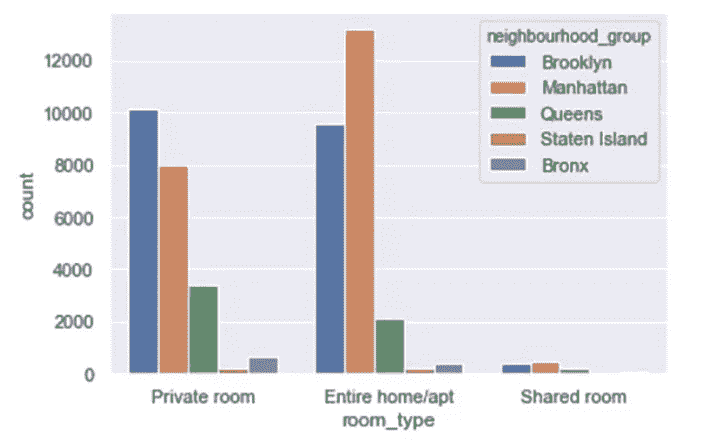
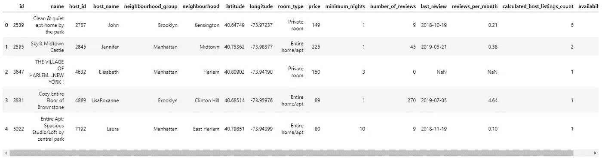
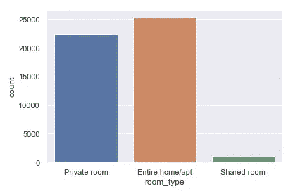
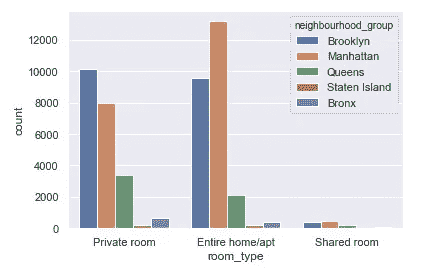
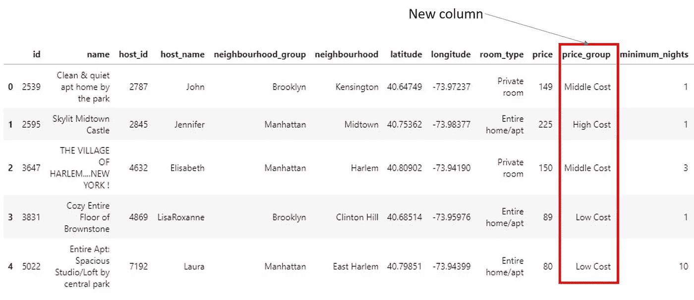
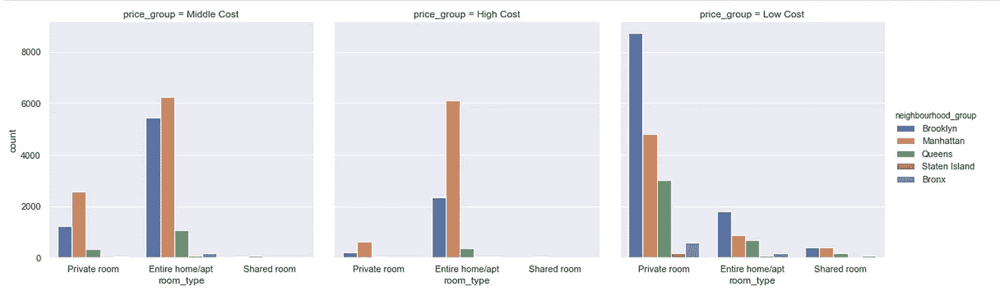

# Python 数据可视化实践 Seaborn 计数图

> 原文：<https://towardsdatascience.com/hands-on-python-data-visualization-seaborn-count-plot-90e823599012?source=collection_archive---------10----------------------->

A Seaborn Count Plot

在本教程中，我们将一步一步地展示如何使用 [**Python Seaborn 库**](https://seaborn.pydata.org/) 来创建计数图。基本上，Seaborn 计数图是一个图形显示，使用条形图显示每个分类数据的出现次数或频率。

# **数据来源**

公共 Airbnb 数据集“ *AB_NYC_2019.csv”，*将用作样本数据来创建 Seaborn 计数图。数据集可以从 Kaggle 获取([https://www . ka ggle . com/dgomonov/new-York-city-Airbnb-open-data](https://www.kaggle.com/dgomonov/new-york-city-airbnb-open-data))。

# **先决条件 Python 库**

*   熊猫([https://pandas.pydata.org/](https://pandas.pydata.org/))
*   马特普利布([https://matplotlib.org/](https://matplotlib.org/))
*   西博恩([https://seaborn.pydata.org/](https://seaborn.pydata.org/))
*   朱庇特笔记本/朱庇特实验室([https://jupyter.org/](https://jupyter.org/))

每个库的安装和设置细节都在它们的官方网站上给出。

# 它是如何工作的

步骤 0:创建一个 Jupyter 笔记本文档。

我们将编写 Python 脚本并在 Jupyter 笔记本环境中运行它。

**第一步:导入库并读取数据。**

一旦库准备就绪，我们就可以继续读取并可视化来自“ *AB_NYC_2019.csv* ”的前五行列表数据。

First five rows of data from “*AB_NYC_2019.csv*”

**步骤 2:为单个分类变量" *room_type* "** 创建一个简单的计数图

当我们观察数据集时，在“ *room_type* ”列中显示的基本上有三种类型的房间(“私人房间”、“整个家/apt”、“共享房间”)。直观显示每种房间类型的观察计数的一种简单方法是创建计数图。我们可以通过添加几行代码(第 13–16 行)轻松创建计数图，如下所示。

Create a count plot for a single categorical variable (room_type)

*   第 14 行——为我们的情节设置一个 Seaborn 主题“黑暗网格”。
*   第 15 行—将分类变量“ *room_type* ”(目标列)分配给参数“ *x* ”。参数“*数据*分配给绘图数据集 *airbnb* 。

快速生成一个简单的计数图。

A count plot for single categorical variables

**步骤 3:为两个分类变量“*房间类型*和“邻居组”**创建计数图

**比方说，如果我们希望了解不同邻居组中每种房间类型的一般可用性，我们可以基于两个分类变量创建计数图，“*房间类型*和“*邻居组*”。**

*   **第 15 行—在 seaborn.countplot()中再添加一个参数“*色调*，并为其分配第二个分类变量“*neighborhood _ group*”。**

****

**A count plot for two categorical variables**

**从上面的计数图中，很明显“整个家庭/公寓”的房间类型在曼哈顿非常常见。该图还揭示了在数据集中的所有邻域组中“共享房间”的可用性非常有限。因此，我们得到合住房间的机会相对较低。**

****步骤 4:为三个分类变量“*房间类型*”、“邻居组”和“价格组”**创建计数图**

****我们也经常会遇到这样的情况:我们的旅行预算有限，希望计划一次住宿费用较低的旅行。一张显示不同地点中低价住宿信息的图表可能对我们的旅行计划有帮助。****

****为此，我们可以在现有的 Airbnb 数据集中添加一个新列“*price _ group”*。****

****Add new column “price_group” into table****

*   ****第 9 行到第 15 行—创建一个函数 *groupPrice()* 将房间价格分为三个不同的组:低成本(低于 100 美元)、中等成本(100 美元到 200 美元)和高成本(高于 200 美元)。****
*   ****第 17 行—将 *groupPrice()* 函数应用于数据集的现有 *price* 列。这将创建一个新列，其中包含三个不同的分类值(“低成本”、“中成本”和“高成本”)。****
*   ****第 18 行—在数据集中的“价格”列旁边插入新列。****
*   ****第 19 行—显示前五行记录。**您将看到新列“*价格 _ 组*”被添加到表格中“*价格*”旁边的列中。******

********

****Added new column in the table****

****接下来，我们使用 *catplot()* 合并三个计数图。****

*   ****第 22 行—组合三组计数图，这些计数图由第三个分类变量“ *price_group* ”分组。这是通过在 Seaborn 函数 *catplot()中将“ *price_group* ”赋值给参数“ *col* ”来实现的。*****

********

****Count plots based on three categorical variables****

****该图显示，布鲁克林可能是一个寻求低成本私人房间的个人旅行者的好选择。曼哈顿或布鲁克林可能是家庭/团体旅行的理想目的地，因为这相对更容易获得一个合理的中等价格范围的整个家庭/公寓单元，可供一群旅行者分享。****

******结论******

****当我们浏览上面的教程时，我们会发现使用 Seaborn 只需几行代码就可以生成一个吸引人的计数图，这并不困难。计数图可以揭示许多从原始数据集中无法直接发现的事实。****

****我希望你喜欢阅读这篇文章。非常欢迎您的评论或任何询问。****