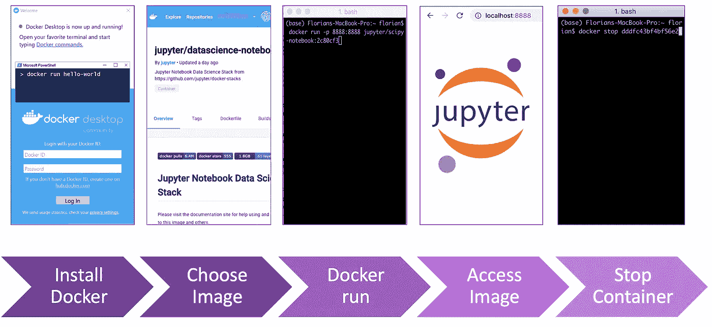

# 实践:使用 Docker 设置您的数据科学环境

> 原文：<https://towardsdatascience.com/hands-on-setup-your-data-environment-with-docker-dca629607148?source=collection_archive---------30----------------------->

每当你开始一个新的数据项目或有一个处理数据的好主意时，最初的概念验证可能是必要的。当然，您不希望，也可能没有时间花几个小时来建立一个全新的数据环境，甚至连数据本身都不看一眼。在下面的文章中，您将了解 Docker 如何帮助您建立一个可复制的数据环境，而不必一次又一次地浪费您的时间。


## Docker 是什么，为什么要试一试？

Docker 是一种最简单、最灵活的方法，可以在特定的环境中创建、部署和运行您想要的应用程序，也就是所谓的容器。你当然会问自己什么是容器？

**非技术性的解释:**就像上图一样，想象一下，在我们的例子中，你的本地机器是一个你已经在生产东西的孤岛。为了改善这一点，你需要额外的工具，这些工具(就像 Docker 标志一样)装在小容器里。一旦您设置并运行它们，它们就可以运行了。

**技术解释:**容器是软件的一个标准单元，它封装了代码及其所有依赖关系，因此应用程序可以快速可靠地从一个计算环境运行到另一个计算环境。Docker 容器映像是一个轻量级的、独立的、可执行的软件包，包括运行应用程序所需的一切:代码、运行时、系统工具、系统库和设置。其他重要术语:

*   图片:只是你的容器的快照。
*   Dockerfile:这是一个 yaml 文件，用来建立你的形象。在本课程结束时，您将拥有一个 yaml 文件模板，并将其用于您自己的容器规范。
*   [Docker hub:](https://docs.docker.com/docker-hub/) 在这里你可以推拉 Docker 图片，并根据自己的需要使用。基本上 GitHub 只是针对 Docker 的。

## 为什么要用 Docker？


让我向你概述一下我喜欢使用 Docker 的主要原因:

*   对于作为数据科学家或数据分析师的您来说，docker 意味着您可以专注于探索、转换和建模数据，而无需首先考虑数据环境所运行的系统。通过使用 Docker 容器中数以千计的应用程序中的一个，您不必担心单独安装和连接它们。Docker 允许您在几秒钟内部署您选择的工作环境——只要您需要。
*   让我们假设您不是项目中唯一的工作人员，但是您的团队成员也需要接触代码。现在唯一的选择是每个队友在他们自己的环境中运行代码，使用不同的架构、不同的库和不同版本的应用程序。docker 选项是每个成员都可以访问同一个容器映像，用 docker 启动映像并准备好。Docker 为团队中的每个人提供了可重复的数据环境，因此您可以立即开始协作。

Docker 肯定还有其他一些好处，尤其是如果您正在使用企业版的话。这绝对值得探索，不仅对作为数据科学家的你有好处。

## 安装和运行 Docker

您可以安装 Docker desktop，这是您需要立即开始的东西:访问 [Docker Hub 这里](https://hub.docker.com/)，为您的 Mac 或 Windows 选择 Docker 版本并安装它。一旦在本地 machina 上启动 Docker，你就可以在顶部导航栏上看到这条可爱的小鲸鱼——干得好。


通过点击 Docker 的标志，你可以看到 Docker 是否正在运行。另一种方法是打开命令行并输入“docker info ”,这样你就可以看到正在运行的程序。以下是一些基本的 Docker 命令:

`**docker login #Log in to Docker registry
docker run <image> #create a new container and start it
docker start <image> #start an existing container**`
`**docker stop <name|id> #stop a running container**`
`**docker ps [-a include stopped containers] #show all containers**`


你可以从一个简单的例子开始，用 Jupyter 笔记本试试看。你所要做的就是在 Docker Hub 中寻找一个图像，打开你的终端，运行 Docker。在下面的例子中，您可以找到在 localhost:8888 上运行的 Jupyter 很容易！

```
docker run -p 8888:8888 jupyter/scipy-notebook:2c80cf3537ca
```



虽然我们现在可以在我们的容器中摆弄我们的应用程序，但它并不是高级数据科学家正在寻找的完整的数据环境。您可能希望使用更高级的工具，比如 Nifi 用于数据接收和处理，Kafka 用于数据流，SQL 或非 SQL 数据库用于存储中间的一些表。我们还能用 Docker 做所有这些吗？答案是:当然可以——Docker compose up 是为您管理这一切的。

## Docker Compose:将所有内容整合在一起


为了设置您想要的数据环境，您可能希望在我们的本地机器上运行几个容器。这就是我们使用 Docker Compose 的原因。Compose 是一个定义和运行多容器 Docker 应用程序的工具。虽然单独连接每个容器可能很耗时，但 docker compose 允许多个容器的集合通过它们自己的网络以非常直接的方式进行交互。使用 compose，首先使用一个 yaml 文件来配置应用程序的服务，然后使用一个命令(docker compose up)就可以创建并启动先前定义的所有服务。 [*](https://github.com/docker/compose)

在下文中，您可以找到开始的主要步骤:

1.  用一个`Dockerfile`来定义你的应用环境，以便于复制
2.  在`docker-compose.yml`中指定组成您的数据环境的所有服务
3.  在你保存 yaml 文件的文件夹中打开你的终端并运行`docker-compose up`

一个`docker-compose.yml`可能看起来像你在下面看到的一样。尽管您肯定可以使用以下内容作为模板，但您肯定应该为自己配置一次:

```
version: '3'
services:
  zookeeper:
    hostname: zookeeper
    container_name: zookeeper_dataenv
    image: 'bitnami/zookeeper:latest'
    environment:
      - ALLOW_ANONYMOUS_LOGIN=yes
  nifi:
    image: mkobit/nifi
    container_name: nifi_dataenv
    ports:
      - 8080:8080
      - 8081:8081
    environment:
      - NIFI_WEB_HTTP_PORT=8080
      - NIFI_ZK_CONNECT_STRING=zookeeper:2181
  minimal-jupyter-notebook:
    image: jupyter/minimal-notebook:latest
    ports:
      - 8888:8888
  mongodb:
    image: mongo:latest
    container_name: mongodb_dataenv
    environment:
      - MONGO_DATA_DIR=/data/db
      - MONGO_LOG_DIR=/dev/null
    ports:
        - 27017:27017
  grafana:
    image: bitnami/grafana:latest
    container_name: grafana_dataenv
    ports:
      - 3000:3000
  db:
    image: 'postgres:9.6.3-alpine'
    container_name: psql_dataenv
    ports:
      - 5432:5432
    environment:
      POSTGRES_DB: psql_data_environment
      POSTGRES_USER: psql_user
      POSTGRES_PASSWORD: psql
      PGDATA: /opt/psql_data
    restart: "no"
```

就是这样！您刚刚学习了如何在几秒钟内随时随地部署您自己的数据环境的基础知识，这意味着在设置方面浪费更少的时间，而有更多的时间来提高工作效率。

**************************************************************

您可能也喜欢阅读的文章:

[动手操作:客户细分](/hands-on-customer-segmentation-9aeed83f5763)

[消除流失是增长黑客 2.0](https://blog.markgrowth.com/eliminating-churn-is-growth-hacking-2-0-47a380194a06)

[数据误导&统计](/misleading-with-data-statistics-c6d506bdb9cf)

[学习创建自己的样本数据集](/generate-your-sample-dataset-a-must-have-skill-for-data-scientists-36ded8600b79)

***************************************************************

请注意，还有很多其他的容器软件选项。我只是喜欢和 Docker 一起工作，并想和你分享我的经验

用于编写 Docker 的资源:

[](https://github.com/docker/compose) [## docker/撰写

### Compose 是一个定义和运行多容器 Docker 应用程序的工具。使用合成，您可以使用合成文件…

github.com](https://github.com/docker/compose)