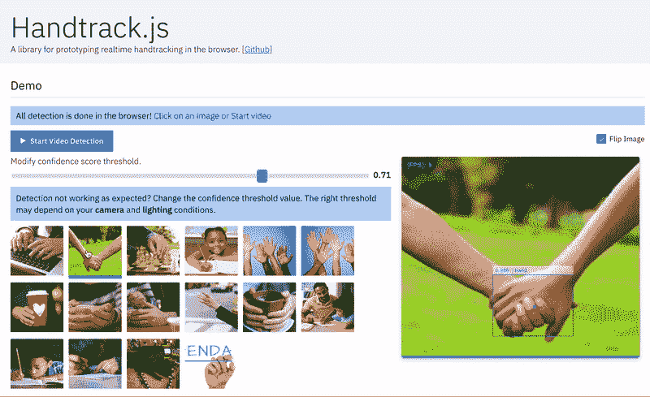

# Handtrack.js:使用 Tensorflow.js 和 3 行代码跟踪浏览器中的手交互。

> 原文：<https://towardsdatascience.com/handtrackjs-677c29c1d585?source=collection_archive---------5----------------------->

js 库允许你用 3 行代码从任意方向的图像中跟踪用户的手(边界框)。


Here’s an example interface built using Handtrack.js to track hands from webcam feed. Try the [demo here.](https://victordibia.github.io/handtrack.js/#/)

不久前，我真的被一个实验的结果震惊了，这个实验使用 [TensorFlow](https://medium.com/u/b1d410cb9700?source=post_page-----677c29c1d585--------------------------------) 对象检测 api 来[追踪图像中的手](https://medium.com/@victor.dibia/how-to-build-a-real-time-hand-detector-using-neural-networks-ssd-on-tensorflow-d6bac0e4b2ce)。我让[训练过的模型和源代码可用](https://github.com/victordibia/handtracking)，从那以后它就被用来原型化一些相当有趣的用例([一个帮助孩子拼写](https://medium.com/@drewgillson/alphabot-a-screen-less-interactive-spelling-primer-powered-by-computer-vision-cc1095bce90a)的工具，对[预测手语的扩展](https://github.com/MrEliptik/HandPose)，[手打乒乓球](https://github.com/alvinwan/hand-tracking-pong)等)。然而，虽然许多人想用训练好的模型进行实验，但许多人仍然有[设置 Tensorflow 的问题](https://github.com/victordibia/handtracking/issues)(安装、TF 版本问题、导出图表等)。幸运的是，Tensorflow.js 解决了其中的几个安装/分发问题，因为它针对在浏览器的标准化环境中运行进行了优化。为此，我创建了 Handtrack.js 作为一个库，以允许开发人员 ***快速*** 通过训练有素的手部检测模型实现原型手部/手势交互。

> 运行时: **22 FPS** 。在 Macbook Pro 2018 上，2.2 Ghz，Chrome 浏览器。Macbook Pro 2014 2.2GHz 上的 13 FPS

该库的目标是抽象出与加载模型文件相关的步骤，提供有用的功能，并允许用户在没有任何 ML 经验的情况下检测图像中的手。你不需要训练一个模特([你可以，如果你想的话](https://github.com/victordibia/handtracking))。您不需要导出任何冻结的图形或保存的模型。您可以通过在 web 应用程序中包含 handtrack.js(细节如下)并调用库方法来开始。

使用 Handtrack.js 搭建的互动[演示在这里](https://victordibia.github.io/handtrack.js/#/)，GitHub 上的源代码[在这里](https://github.com/victordibia/handtrack.js)。喜欢在 Codepen 里修修补补？这里有一个 [handtrack.js 示例笔](https://codepen.io/victordibia/pen/RdWbEY)可以修改。

[](https://github.com/victordibia/handtrack.js/) [## victordibia/handtrack.js

### 一个用于直接在浏览器中原型化实时手部检测(边界框)的库。- victordibia/handtrack.js

github.com](https://github.com/victordibia/handtrack.js/) 

# 我如何在 Web 应用程序中使用它？

您可以简单地通过在脚本标签中包含库 URL 或者通过使用构建工具从`npm`导入它来使用`handtrack.js`。

## 使用脚本标签

Handtrack.js minified js 文件目前使用 [jsdelivr](https://www.jsdelivr.com/package/npm/handtrackjs) 托管，这是一个免费的开源 cdn，允许您在 web 应用程序中包含任何 npm 包。

```
<script src="https://cdn.jsdelivr.net/npm/handtrackjs/dist/handtrack.min.js"> </script>
```

一旦上面的脚本标签被添加到您的 html 页面中，您就可以使用`handTrack`变量引用 handtrack.js，如下所示。

```
const img = document.getElementById('img');  
handTrack.load().then(model => { 
    model.detect(img).then(predictions => {
      console.log('Predictions: ', predictions) // bbox predictions
    });
});
```

上面的代码片段打印出了通过 img 标签传入的图像的边界框预测。通过提交来自视频或摄像机的帧，您可以在每一帧中"*跟踪*"手(您需要随着帧的进展保持每只手的状态)。



Demo interface using handtrack.js to track hands in an image. You can use the `renderPredictions()` method to draw detected bounding boxes and source image in a canvas object.

## 使用 NPM

您可以使用以下代码将`handtrack.js`作为 npm 包安装

```
npm install --save **handtrackjs**
```

下面给出了一个如何在 React 应用程序中导入和使用它的示例。

```
import * as handTrack from 'handtrackjs';

const img = document.getElementById('img');

// Load the model.
handTrack.load().then(model => {
  // detect objects in the image.
  console.log("model loaded")
  model.detect(img).then(predictions => {
    console.log('Predictions: ', predictions); 
  });
});
```


You can vary the confidence threshold (predictions below this value are discarded). Note: The model tends to work best with well lighted image conditions. The reader is encouraged to experiment with confidence threshold to accommodate various lighting conditions. E.g. a low lit scene will work better with a lower confidence threshold.

# 什么时候应该使用 Handtrack.js

如果你对基于手势(身体作为输入)的交互体验感兴趣，Handtrack.js 会很有用。用户不需要附加任何额外的传感器或硬件，而是可以立即利用基于手势/身体作为输入的交互所带来的参与优势。


A simple body-as-input interaction prototyped using Handtrack.js where the user paints on a canvas using the tracked location of their hand. In this interaction the maxNumber of detections modelParameter value is set to 1 to ensure only one hand is tracked.

下面列出了一些(并非全部)相关场景:

*   当鼠标运动可以被映射到手的运动以进行控制时。
*   当手和其他物体的重叠可以表示有意义的交互信号(例如物体的触摸或选择事件)时。
*   人手运动可以代表活动识别的场景(例如，从视频或个人下棋的图像中自动跟踪运动活动，或者跟踪个人的高尔夫挥杆)。或者简单地计算图像或视频帧中有多少人。
*   互动艺术装置。可能是一套有趣的互动艺术装置控件。
*   教别人 ML/AI。handtrack.js 库提供了一个有价值的界面来演示模型参数(置信度阈值、IoU 阈值、图像大小等)的变化如何影响检测结果。
*   您需要一个易于使用的演示，任何人都可以通过最少的设置轻松运行或试用。


Body as input in the browser. Results from Handtrack.js (applied to webcam feed) controls of a pong game. [Try it here](https://victordibia.github.io/handtrack.js/#/game). Modify it [here on Codepen](https://codepen.io/victordibia/full/aGpRZV).


Body as input on a large display. Results from Handtrack.js (applied to webcam feed) can be mapped to the controls of a game.

# Handtrack.js API

提供了几种方法。两个主要方法包括加载手检测模型的`load()`和用于获得预测的`detect()`方法。

`load()`接受可选的模型参数，允许您控制模型的性能。该方法以 web 模型格式加载预训练的手检测模型(也通过 jsdelivr 托管)。

`detect()`接受输入源参数(html img、视频或画布对象),并返回图像中手部位置的边界框预测。

```
const modelParams = {
  flipHorizontal: true,   // flip e.g for video 
  imageScaleFactor: 0.7,  // reduce input image size .
  maxNumBoxes: 20,        // maximum number of boxes to detect
  iouThreshold: 0.5,      // ioU threshold for non-max suppression
  scoreThreshold: 0.79,    // confidence threshold for predictions.
}const img = document.getElementById('img');handTrack.**load**(modelParams).then(model => {
    model.**detect**(img).then(predictions => {
    console.log('Predictions: ', predictions); 
  });
});
```

预测结果的形式如下

```
[{
  bbox: [x, y, width, height],
  class: "hand",
  score: 0.8380282521247864
}, {
  bbox: [x, y, width, height],
  class: "hand",
  score: 0.74644153267145157
}]
```

还提供了其他辅助方法

*   `model.getFPS()`:获取每秒检测次数计算的 FPS。
*   `model.renderPredictions(predictions, canvas, context, mediasource)`:在指定的画布上绘制边界框(以及输入的媒体源图像)。
*   `model.getModelParameters()`:返回模型参数。
*   `model.setModelParameters(modelParams)`:更新模型参数。
*   `dispose()`:删除模型实例
*   `startVideo(video)`:在给定的视频元素上开始摄像机视频流。返回一个承诺，可用于验证用户是否提供了视频权限。
*   `stopVideo(video)`:停止视频流。

## 库大小和模型大小

*   库大小— 810kb。主要是因为它与 tensorflow.js 库捆绑在一起(最近的版本中有一些公开的问题破坏了该库。)
*   Models — 18.5mb。这是导致页面加载时初始等待的原因。TF.js webmodels 通常被分割成多个文件(在本例中是四个 4.2mb 的文件和一个 1.7 mb 的文件。)

# 它是如何工作的

在底层，Handtrack.js 使用了 [Tensorflow.js 库](https://js.tensorflow.org)，这是一个灵活而直观的 API，用于在浏览器中从头开始构建和训练模型。它提供了一个低级的 JavaScript 线性代数库和一个高级的 layers API。


Steps in creating a Tensorflow.js -based JavaScript Library.

## 数据汇编

本项目中使用的数据主要来自 [Egohands 数据集](http://vision.soic.indiana.edu/projects/egohands/)。这是由 4800 张不同环境下(室内、室外)带有边框注释的人手图像组成，这些图像是使用谷歌眼镜设备拍摄的。

## 模特培训

使用 [Tensorflow 对象检测 API](https://github.com/tensorflow/models/blob/master/research/object_detection/g3doc/installation.md) 训练一个模型来检测手。对于这个项目，一个[单次多盒探测器](https://arxiv.org/abs/1512.02325) (SSD)与 [MobileNetV2 架构](https://arxiv.org/abs/1801.04381)一起使用。然后，来自训练模型的结果被导出为`savedmodel`。关于模型如何被训练的更多细节可以在这里和 Tensorflow 对象检测 API github repo 上[找到。](https://medium.com/@victor.dibia/how-to-build-a-real-time-hand-detector-using-neural-networks-ssd-on-tensorflow-d6bac0e4b2ce)

## 模型转换

Tensorflow.js 提供了一个模型转换工具，允许您将 Tensorflow python 中训练的`savedmodel`转换为可以在浏览器中加载的 Tensorflow.js `webmodel`格式。这个过程主要是将 Tensorflow python 中的*操作*映射到 Tensorflow.js 中的[等价实现。有必要](https://github.com/tensorflow/tfjs-converter/blob/master/docs/supported_ops.md)[检查保存的模型图](https://gist.github.com/samuel-davis/a686b874398ce81d07b017e3d07bb62a)以了解正在导出的内容。最后，我按照 Tensorflow coco-ssd 示例的作者的建议 T17 在转换期间删除了对象检测模型图的后处理部分。这种优化有效地将浏览器中检测/预测操作的运行时间增加了一倍。

## 库包装和托管

该库是在 tensorflowjs coco-ssd 示例之后建模的(但不是用 typescript 编写的)。它由一个主类和一组其他[有用的函数](https://github.com/victordibia/handtrack.js/#other-helper-methods)组成，主类包含加载模型、检测图像中的手的方法，例如 startVideo、stopVideo、getFPS()、renderPredictions()、getModelParameters()、setModelParameters()等。Github 上有关于[方法的完整描述。](https://github.com/victordibia/handtrack.js/#other-helper-methods)

然后使用 [rollup.js](https://rollupjs.org) 捆绑源文件，并在 npm 上[发布](https://www.npmjs.com/package/handtrackjs)(带有 webmodel 文件)[。这尤其有价值，因为 jsdelivr 自动为 npm 包提供 cdn。(在其他 cdn 上托管文件可能会更快*，并鼓励读者尝试其他方法)*。目前，handtrackjs 与 tensorflowjs (v0.13.5)捆绑在一起，主要是因为在编写这个库时，存在版本问题，tfjs (v0.15)在将](https://www.npmjs.com/package/handtrackjs)[图像/视频标签作为张量](https://github.com/tensorflow/tfjs/issues/1190)加载时出现数据类型错误。随着新版本修复此问题，它将被更新。

# 限制

*   **浏览器是单线程的**:这意味着必须小心确保预测操作**不会阻塞 UI 线程**。每次预测可能需要 50 到 150 毫秒，这对于用户来说是显而易见的。例如，当将 Handtrack.js 集成到一个每秒多次渲染整个屏幕(例如在游戏中)的应用程序中时，我发现它有助于减少每秒请求的预测数量。在这个场景中， [Webworkers](https://developer.mozilla.org/en-US/docs/Web/API/Web_Workers_API/Using_web_workers) ，一个允许在后台线程中运行脚本的新兴标准，将有助于防止 UI 阻塞。

> [Web Workers](https://developer.mozilla.org/en-US/docs/Web/API/Web_Workers_API/Using_web_workers) 是 Web 内容在后台线程中运行脚本的简单手段。工作线程可以在不干扰用户界面的情况下执行任务。此外，它们可以使用`[XMLHttpRequest](https://developer.mozilla.org/en-US/docs/Web/API/XMLHttpRequest)`执行 I/O(尽管`responseXML`和`channel`属性总是空的)。创建后，工作线程可以向创建它的 JavaScript 代码发送消息，方法是向该代码指定的事件处理程序发送消息(反之亦然)。本文提供了使用 web workers 的详细介绍。

*   **逐帧跟踪手**:如果有兴趣跨帧识别手，您需要编写额外的代码来推断检测到的手进入、移动和离开连续帧的 id。提示:在每帧中保持每个预测位置的状态(和欧几里德距离)[可以帮助](/how-to-build-a-gesture-controlled-web-based-game-using-tensorflow-object-detection-api-587fb7e0f907)。
*   **错误预测**:偶尔会有错误预测(有时人脸被检测为手)。我发现每个相机和照明条件需要不同的模型参数设置(尤其是置信度阈值)来获得良好的检测。更重要的是，这可以通过额外的数据来改善。

我真的很期待使用或扩展这个项目的其他人如何解决其中的一些限制。

# 接下来是什么？

Handtrack.js 代表了真正的 ***早期步骤*** 关于实现人工智能人机交互新形式的整体潜力。在浏览器中。已经有一些很好的想法，比如浏览器中用于人体姿势检测的[posenet](https://github.com/tensorflow/tfjs-models/tree/master/posenet)和用于面部表情检测的[handseys . js](https://handsfree.js.org)。

> 最重要的是，请读者**想象**。想象一下有趣的用例，知道用户手的位置可以产生更吸引人的交互。

与此同时，我将在以下方面花更多时间

*   更好的手模型:创建一个健壮的基准来评估基本的手模型。收集额外的数据，提高准确性和稳健性指标。
*   附加词汇:在我构建[示例](https://github.com/victordibia/handtrack.js/)的过程中，有一点变得很明显，那就是这种交互方法的词汇有限。显然需要支持至少一个州。也许是一只拳头和一只张开的手。这将意味着重新标记数据集(或一些半监督方法)。
*   额外的模型量化:目前，我们正在使用最快的模型 wrt 架构大小和准确性——MobilenetV2，SSD。有没有优化*可以*让事情变得更快？欢迎任何想法或贡献。

如果你想更详细地讨论这个问题，请随时联系 Twitter、T2、Github 或 T4 的 Linkedin。非常感谢 Kesa Oluwafunmilola 帮助校对这篇文章。

# 参考

*   [1]桑德勒，马克等，“移动互联网 2:反向残差和线性瓶颈。”IEEE 计算机视觉和模式识别会议录。2018.[https://arxiv.org/abs/1801.04381](https://arxiv.org/abs/1801.04381)
*   [2] Tensorflow.js Coco-ssd 示例。
    该库使用来自 [Tensorflow.js coco-ssd](https://github.com/tensorflow/tfjs-models/tree/master/coco-ssd) 示例的代码和指导，该示例提供了一个用于在 MSCOCO 数据集上训练的对象检测的库。repo 中建议的优化(去掉一个后处理层)真的很有帮助(2 倍加速)。