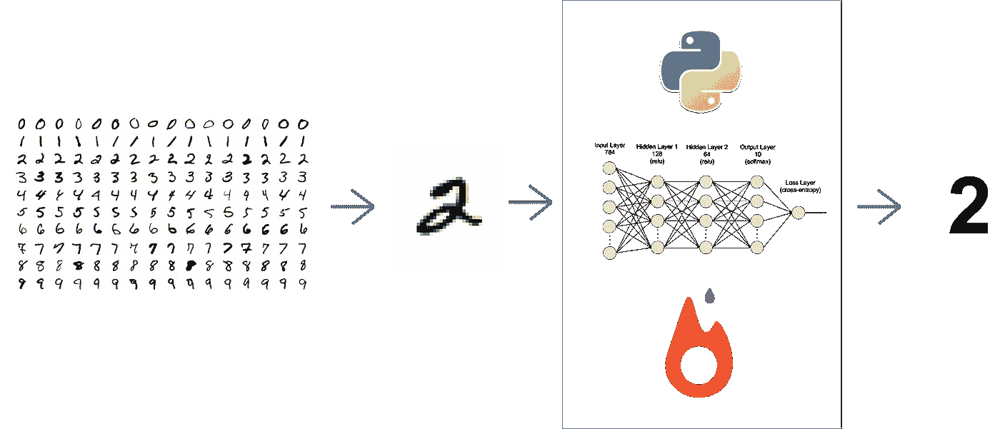
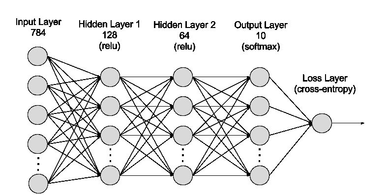
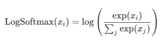
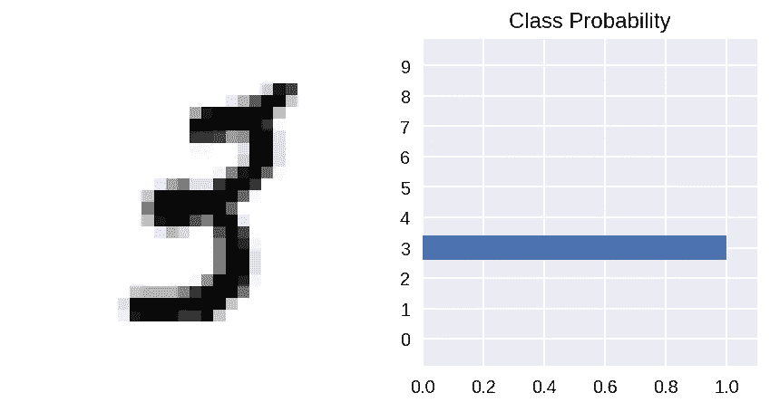

# 使用 PyTorch 的手写数字识别——神经网络介绍

> 原文：<https://towardsdatascience.com/handwritten-digit-mnist-pytorch-977b5338e627?source=collection_archive---------1----------------------->


对吗？——弄清楚上面的图片代表数字**四**，对你来说没什么。你甚至没有为图像的分辨率差而烦恼，多神奇啊。我们都应该花点时间感谢我们的*大脑*！我想知道我们的大脑对图像进行处理、分类和反馈是多么自然。我们是天才！

模仿人脑会有多难？深度学习，*简单来说，*是机器学习研究的领域，它允许计算机学习执行大脑自然的任务，如手写数字识别。从技术上来说，它涉及更多的*层*(我们后面会讲到)和更多的*数据*。

在本文中，我们将讨论神经网络，并从头开始开发一个手写数字分类器。我们将使用 ***PyTorch*** 因为它*很酷*！



本文的唯一先决条件是 Python 语法的基础知识。坐下来，喝杯咖啡，跟着我走。


Only Good Coffee Please!

## 步骤 1 —了解数据集

作为数据科学家，最重要的任务是收集完美的数据集，并彻底理解它。相信我，剩下的就简单多了。对于这个项目，我们将使用流行的 [MNIST 数据库](https://en.wikipedia.org/wiki/MNIST_database)。它是 70000 个手写数字的集合，分为分别由 60000 个和 10000 个图像组成的训练集和测试集。


Source: Wikimedia

该数据集最初可在 Yann Lecun 的网站上获得。清理数据是最大的任务之一。别忘了— ***“垃圾进，垃圾出！”*** 。幸运的是，对我们来说，PyTorch 提供了一个简单的实现，使用几行代码就可以下载干净的和已经准备好的数据。在开始之前，我们需要做所有必要的进口。

```
import numpy as np
import torch
import torchvision
import matplotlib.pyplot as plt
from time import time
from torchvision import datasets, transforms
from torch import nn, optim
```

在下载数据之前，让我们定义在将数据输入管道之前，我们希望对数据执行哪些转换。换句话说，您可以将它视为对图像执行的某种自定义编辑，以便所有图像都具有相同的尺寸和属性。我们使用 **torchvision.transforms** 来实现。

```
transform = transforms.Compose([transforms.ToTensor(),
                              transforms.Normalize((0.5,), (0.5,)),
                              ])
```

1.  ***摇身一变。ToTensor()*** —将图像转换成系统可理解的数字。它将图像分成三个颜色通道(单独的图像):*红色、绿色&蓝色*。然后，它将每个图像的像素转换为其颜色在 0 到 255 之间的亮度。然后将这些值缩小到 0 到 1 之间的范围。图像现在是一个[火炬张量](https://pytorch.org/docs/stable/tensors.html)。
2.  ***变换变换。Normalize()***

现在，我们终于下载了数据集，对它们进行了洗牌和转换。我们下载数据集并将它们加载到 *DataLoader* ，它将数据集和采样器结合在一起，并在数据集上提供单进程或多进程迭代器。

```
trainset = datasets.MNIST('PATH_TO_STORE_TRAINSET', download=**True**, train=**True**, transform=transform)valset = datasets.MNIST('PATH_TO_STORE_TESTSET', download=**True**, train=**False**, transform=transform)trainloader = torch.utils.data.DataLoader(trainset, batch_size=64, shuffle=**True**)valloader = torch.utils.data.DataLoader(valset, batch_size=64, shuffle=**True**)
```

在一行中，*批量大小*是我们想要一次读取的图像数量。

## 步骤 2-更好地了解数据集

在这个阶段，我们将对我们的图像和张量进行一些探索性的数据分析。让我们检查一下图像和标签的形状。

```
dataiter = iter(trainloader)
images, labels = dataiter.next()

print(images.shape)
print(labels.shape)
```

您将发现图像的形状是，`torch.Size([64,1,28,28])`，这表明每批中有 64 个图像，每个图像的尺寸为 28 x 28 像素。类似地，标签的形状为`torch.Size([64])`。猜猜为什么？—是的，你说得对！64 张图片应该分别有 64 个标签。就是这样。轻松点。


让我们显示训练集中的一幅图像，例如第一幅。

```
plt.imshow(images[0].numpy().squeeze(), cmap='gray_r');
```

酷吧！让我们展示更多的图像，这将让我们感受一下数据集的样子。

```
figure = plt.figure()
num_of_images = 60
**for** index **in** range(1, num_of_images + 1):
    plt.subplot(6, 10, index)
    plt.axis('off')
    plt.imshow(images[index].numpy().squeeze(), cmap='gray_r')
```

这将生成一个随机排列的图像网格。现在，是时候开始定义我们将要使用的神经网络了。

## 步骤 3——建立神经网络

我们将构建下面的网络，正如你所看到的，它包含一个输入层(第一层)，一个由十个*神经元*(或单元，圆圈)组成的输出层，以及中间的两个隐藏层。



PyTorch 的`torch.nn`模块允许我们非常简单地构建上述网络。这也非常容易理解。看看下面的代码。

```
input_size = 784
hidden_sizes = [128, 64]
output_size = 10

model = nn.Sequential(nn.Linear(input_size, hidden_sizes[0]),
                      nn.ReLU(),
                      nn.Linear(hidden_sizes[0], hidden_sizes[1]),
                      nn.ReLU(),
                      nn.Linear(hidden_sizes[1], output_size),
                      nn.LogSoftmax(dim=1))
print(model)
```

`nn.Sequential`包裹网络中的层。有三个带 **ReLU 激活**的**线性层**(一个允许正值通过的简单函数，而负值被修改为零)。输出图层是激活了 [**LogSoftmax**](https://pytorch.org/docs/stable/nn.html#logsoftmax) 的线性图层，因为这是一个分类问题。

从技术上来说，一个 LogSoftmax 函数是一个 **Softmax** 函数的对数，顾名思义，它看起来像这样，如下所示。



接下来，我们定义 [**负对数似然损失**](https://pytorch.org/docs/stable/nn.html#nllloss) 。用 C 类训练一个分类问题很有用。 **LogSoftmax()** 和 **NLLLoss()** 一起充当交叉熵损失，如上面的网络架构图所示。

另外，你一定想知道为什么我们在第一层有 784 个单元。很好！这是因为我们在将每幅图像发送到神经网络之前将其展平。 *(28 x 28 = 784)*

```
criterion = nn.NLLLoss()
images, labels = next(iter(trainloader))
images = images.view(images.shape[0], -1)

logps = model(images) #log probabilities
loss = criterion(logps, labels) #calculate the NLL loss
```

我们将在以后的文章中讨论更多的神经网络，激活函数，优化算法等。

**步骤 4 —调整重量**

神经网络*通过对可用数据进行多次迭代来学习*。 ***学习*** 是指调整网络的权值，使损耗最小。让我们想象一下它是如何工作的。

```
print('Before backward pass: **\n**', model[0].weight.grad)
loss.backward()
print('After backward pass: **\n**', model[0].weight.grad)
```

在向后传递之前，模型权重被设置为默认的**无**值。一次，我们调用 **backward()** 函数来更新权重。

```
Before backward pass: 
 None
After backward pass: 
 tensor([[-0.0003, -0.0003, -0.0003,  ..., -0.0003, -0.0003, -0.0003],
        [ 0.0008,  0.0008,  0.0008,  ...,  0.0008,  0.0008,  0.0008],
        [-0.0037, -0.0037, -0.0037,  ..., -0.0037, -0.0037, -0.0037],
        ...,
        [-0.0005, -0.0005, -0.0005,  ..., -0.0005, -0.0005, -0.0005],
        [ 0.0043,  0.0043,  0.0043,  ...,  0.0043,  0.0043,  0.0043],
        [-0.0006, -0.0006, -0.0006,  ..., -0.0006, -0.0006, -0.0006]])
```

## 步骤 5 —核心培训流程

这是真正的奇迹发生的地方。您的神经网络迭代训练集并更新权重。我们使用 PyTorch 提供的模块`torch.optim`来优化模型，执行梯度下降，并通过反向传播来更新权重。因此，在每个**时期**(我们迭代训练集的次数)，我们将看到训练损失逐渐减少。

```
optimizer = optim.SGD(model.parameters(), lr=0.003, momentum=0.9)
time0 = time()
epochs = 15
**for** e **in** range(epochs):
    running_loss = 0
    **for** images, labels **in** trainloader:
        *# Flatten MNIST images into a 784 long vector*
        images = images.view(images.shape[0], -1)

        *# Training pass*
        optimizer.zero_grad()

        output = model(images)
        loss = criterion(output, labels)

        *#This is where the model learns by backpropagating*
        loss.backward()

        *#And optimizes its weights here*
        optimizer.step()

        running_loss += loss.item()
    **else**:
        print("Epoch **{}** - Training loss: **{}**".format(e, running_loss/len(trainloader)))print("**\n**Training Time (in minutes) =",(time()-time0)/60)
```

这可能需要一些时间来执行，并且会因系统而异。我在云笔记本上花了 2.5 分钟。

## 步骤 6 —测试和评估

我们的工作快完成了。模型做好了，但我们要先评估一下。我创建了一个实用函数 **view_classify()** 来显示预测的图像和类别概率。代码可以在 GitHub 上找到。(下面参考资料部分的链接)。

我将我们之前创建的验证集中的一个图像传递给训练好的模型，以查看模型是如何工作的。

```
images, labels = next(iter(valloader))

img = images[0].view(1, 784)**with** torch.no_grad():
    logps = model(img)

ps = torch.exp(logps)
probab = list(ps.numpy()[0])
print("Predicted Digit =", probab.index(max(probab)))
**view_classify**(img.view(1, 28, 28), ps)
```



Prediction Result. Perfect Prediction!

现在，我们使用 for 循环遍历验证集，并计算正确预测的总数。这是我们计算精确度的方法。

```
correct_count, all_count = 0, 0
**for** images,labels **in** valloader:
  **for** i **in** range(len(labels)):
    img = images[i].view(1, 784)
    **with** torch.no_grad():
        logps = model(img)

    ps = torch.exp(logps)
    probab = list(ps.numpy()[0])
    pred_label = probab.index(max(probab))
    true_label = labels.numpy()[i]
    **if**(true_label == pred_label):
      correct_count += 1
    all_count += 1

print("Number Of Images Tested =", all_count)
print("**\n**Model Accuracy =", (correct_count/all_count))
```

现在来看看结果。这是最有趣的部分！

```
Number Of Images Tested = 10000
Model Accuracy = 0.9751
```

哇！我们有超过 97.5%的准确率。这是值得庆祝的事情。我们获得如此高精度的原因是，我们的数据集是干净的，有各种各样经过良好洗牌的图像，而且数量很大。这使得我们的模型能够很好地识别大量看不见的数字。

## 步骤 7 —保存模型

现在我们已经完成了所有的工作，我们不想失去训练好的模型。我们不想每次用的时候都训练它。为此，我们将保存模型。以后需要的时候，可以直接加载使用，不需要进一步的训练。

```
torch**.save**(model, './my_mnist_model.pt') 
```

第一个参数是模型对象，第二个参数是路径。PyTorch 型号一般用`.pt`或`.pth`扩展名保存。[查阅文件](https://pytorch.org/tutorials/beginner/saving_loading_models.html#save-load-entire-model)。

## 结论

我希望你喜欢建立一个神经网络，训练它，测试它，最后保存它的过程。在构建一个很酷的项目的同时，你肯定已经掌握了一些概念，学到了一些新东西。我很想知道它是如何为你工作的。 ***并且，如果你喜欢请鼓掌，这对我是一种鼓励。*** :) *更多炫酷文章一字排开。即将推出！*

如果你有心情请我喝啤酒🤩> >[https://www.buymeacoffee.com/amitrajit](https://www.buymeacoffee.com/amitrajit)

哦！并且， [*整个笔记本在这里*](https://github.com/amitrajitbose/handwritten-digit-recognition) 都有。笔记本电脑的 GPU 版本不同于 CPU 版本。你可以根据你的需要参考。

## 参考文献

[1] [*PyTorch 官方 Doc*](https://pytorch.org/docs/stable/index.html)*s* 【2】[*MNIST 维基百科*](https://en.wikipedia.org/wiki/MNIST_database)【3】*Cool GIFs 来自*[*GIPHY*](https://giphy.com)
【4】[*GitHub 上的全部代码*](https://github.com/amitrajitbose/handwritten-digit-recognition)

## 承认

*感谢*[*Zykrr*](https://zykrr.com/)*工程给予的灵感。在，*[*Zykrr*](https://www.linkedin.com/company/zykrr/)*我们与* [*客户体验和反馈分析*](https://medium.com/zykrrtech) *领域的尖端技术合作。*