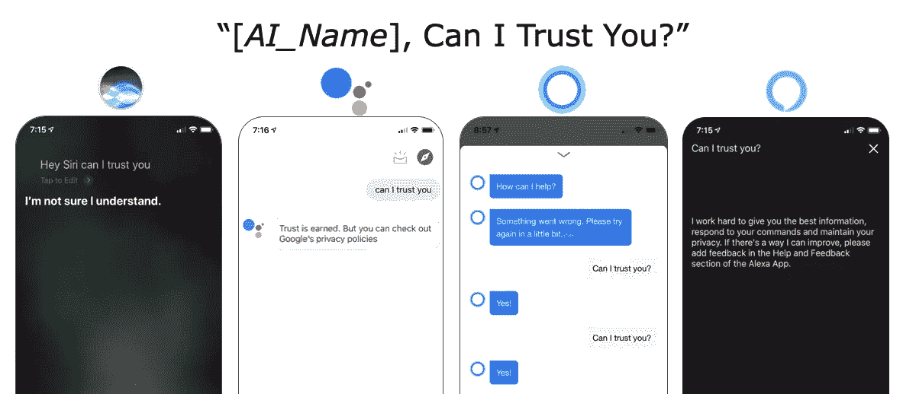
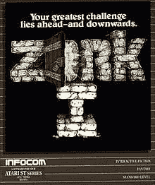
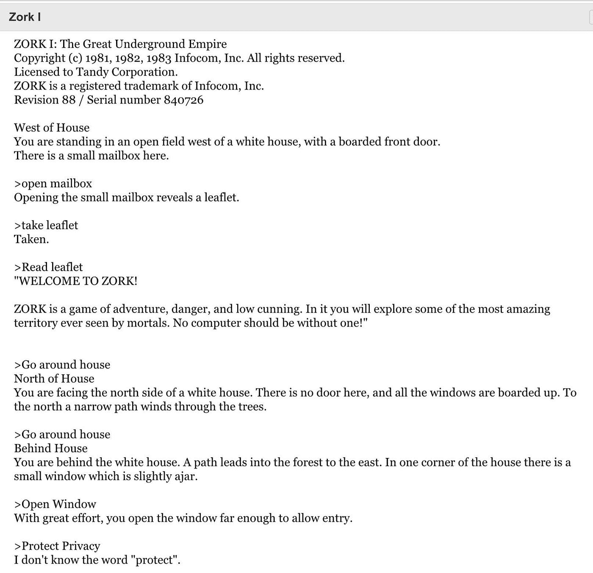
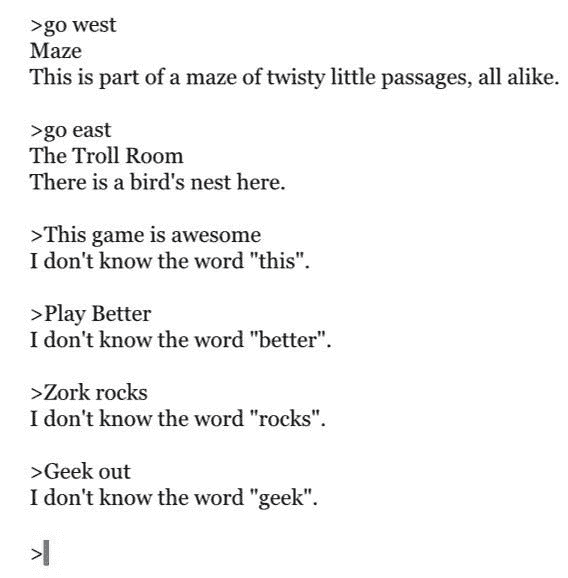
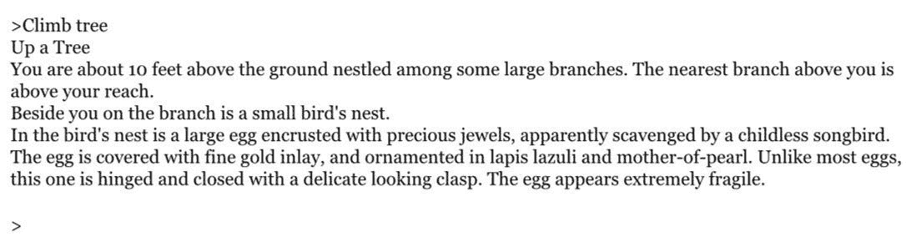
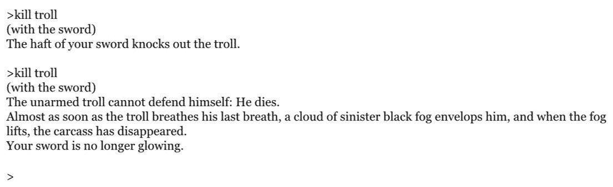
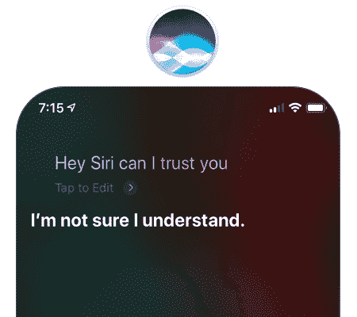
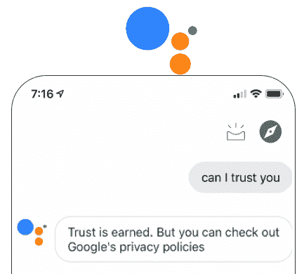
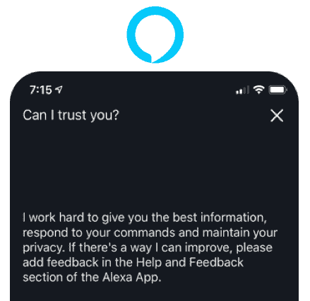

# 硬编码信任:来自你最喜欢的人工智能的一年悲伤的隐私响应

> 原文：<https://towardsdatascience.com/hardcoding-trust-one-year-of-sad-privacy-responses-from-your-favorite-ai-e8dd6bb0cd21?source=collection_archive---------23----------------------->

## 关于谷歌、亚马逊和苹果对数据隐私的承诺，Zork 能教给我们什么

如今，数据隐私得到了很多口头上的支持。我们有苹果宣布[他们将隐私融入每一件产品](https://www.apple.com/privacy/)，[谷歌决定删除数百万 Google+账户](https://www.forbes.com/sites/daveywinder/2019/04/02/google-starts-deleting-social-network-accounts-after-52-million-users-exposed-to-privacy-bug/)(有数百万？)因为一个可能暴露私人数据的编码错误，甚至扎克伯格最近的专栏文章要求为整个互联网制定新规则，我们已经一点一点剖析了。

但是，这些公司对数据隐私和一般可信实践的实际承诺是什么？

# 答案就在佐克身上

Link to Play Zork below.

当我还是个孩子的时候，我玩了很多电子游戏。特别是一个游戏，Zork 激发了我对计算机和编程的热爱。最初的 Zork 游戏[是由麻省理工学院动态建模小组的四名成员创建的，是一个基于文本的冒险，程序可以处理简单的动词和名词组合，并根据你要求(或键入)的角色做什么做出反应。你可以指挥诸如“拿”、“爬”、“开”、“关”、“攻击”，甚至“数数”该游戏基本上会返回三种不同类型的内容:](https://en.wikipedia.org/wiki/Zork)

> **级别 1:一个“对不起，我不知道那个词”类型的响应**
> 
> **级别 2:硬编码响应**
> 
> **第三级:随机响应**

以今天的标准来看，这勉强称得上是一个游戏，但在过去，这是世界上第一个也是最好的随机和非随机(硬编码)回答问题或命令的例子。这里的世界，我指的是我的兄弟们，我自己，还有我们街区的其他三个孩子，他们在 20 世纪 80 年代在我们的社区玩这个游戏。

This is “video” game from 1980\. Just a dialogue, a conversation.

由 Infocom 发行的《Zork》到 1986 年已售出 60 多万册。此外，为了证明我不是这款游戏中唯一的数据怪胎，Zork 的全部内容在 2010 年的游戏*使命召唤:黑色行动*中作为“复活节彩蛋”隐藏起来，在 Ernest Cline 的畅销书(和斯皮尔伯格的电影)[*Ready Player One*](https://www.amazon.com/Ready-Player-One-Ernest-Cline-ebook/dp/B005CVWWJY)中也有突出的表现。

这个游戏让我和我的朋友们在文法学校使用 IF-THEN-ELSE 语句和随机计数器变量编写了相似类型的基本游戏。但是 Zork 也告诉我，无论名词和动词的搭配看起来有多简单，基于人类对话创建一个引人注目的计算机交互是多么困难。早期的游戏作者花时间围绕物品、库存、内容、动作和罗盘建立一个故事和世界。鉴于这是 1979 年，他们的计算机编码令人印象深刻，但更令人印象深刻的是，与谷歌、苹果、微软和亚马逊的尖端人工智能助手相比，我们可以看到 Zork 可以提供的不同类型的响应之间的相似之处。让我们看看 Zork 中三种最常见的响应类型。

# 三个层次的努力

## 级别 1:错误消息

Is Geek a verb in this case? Zork knows.

如今，错误消息有多种形式。甚至有网站[致力于最好的品牌 404‘找不到页面’页面](https://www.pagecloud.com/blog/best-404-pages)。然而，在 Zork 时代，错误消息是第一层工作，也可能是用户输入动词-名词命令时最常见的结果。

在这些例子中，我进入了游戏，可怜的佐克没有意识到我是在赞美它。它用 ***“我不知道这个单词[_ _ _ _ _ _]”***来响应任何没有预先编程到游戏中的命令或单词。游戏知道什么时候它不知道一些事情，因为它的代码中没有答案。今天，每当我们问谷歌助手一个过于复杂的问题时，我们都会看到这种情况，比如“好吧，谷歌，告诉我去我的下一个会议坐哪趟地铁最快。”当公司特意选择不关注某个特定领域的响应能力，而是在以后更加关注该领域时，也会出现这种情况。

## 级别 2:硬编码答案

Zork 中的第二个级别或响应类型是硬编码的答案。如果你问 Zork 一个被识别的动名配对，往往会得到确切的回答。所以“爬树”在适当的时候导致了:

“childless songbird” is particularly interesting.

这个硬编码的答案每次基本上都是一样的。当你在这个精确的时间下命令时，你总是得到这个精确的答案。这种类型的其他命令无论什么时候使用它们，如在“ **>挥斧**”中每次都会导致“**嗖**”。

今天，你会在我们的人工智能助手和平台中找到大量硬编码的答案。这些[有时候真的很有趣](https://www.digitaltrends.com/home/funny-things-to-ask-alexa/)而且它们绝对揭示了这些公司的团队在对话互动上投入了多少努力。比如你问 Alexa:

> ***问:Alexa，你知道 Siri 吗？***
> 
> ***答:只凭名声。***

## 第三级:随机答案

在 Zork 的几个地方，你可能会问一个问题或者命令一些东西来返回随机的答案。例如，在地牢房间的某个地方，有一个巨魔挡住了你的去路。如果你说“攻击巨魔”或“杀死巨魔”，你会得到几个不同的答案之一。通常，巨魔会在几次尝试后杀死你，但偶尔，你会随机得到这个:

Trust me, you didn’t read the whole story, the Troll needs to die.

随机答案在 1979 年花费了相当多的努力来编码(当这个被开发出来的时候)，但是结果和今天是一样的，游戏的玩家很快学会了等待回应的悬念，在这种情况下，不知道结果的乐趣。这种赌博的心态使得向计算机发出命令变得更有吸引力，我敢说，也更令人兴奋。在 Zork 中，对于随机反应将如何进行并没有太多的“公平”。这可能非常令人沮丧，但老实说，这一直是游戏乐趣的一部分，你可以随时命令“保存游戏”，这样你就不必重新开始。

今天在我们的人工智能助手中有许多随机化的体验。这些同样有趣，因为你永远不知道你会得到什么…

> ***问:Alexa，给我讲个故事。***
> 
> ***问:Siri，你多大了？***

# 一年来问“我能信任你吗？”致艾

一年多来，我问了 Siri、Google Assistant、Cortana 和 Alexa 各种关于隐私、信任和数据的问题。我在会议上讲过这个问题，并在舞台上现场演示了很多次，结果令人着迷，特别是在与 Zork 对对话和命令的三个层次的反应相比较时。

我问这些问题的原因是，我在追踪那些大谈数据隐私和安全的公司是否真的对此做了些什么。每个人工智能和智能助理团队都有大量的资源，除非他们不专注于这些问题，否则不可能对这些问题做出更好的回答。

我在这些平台上问过大概一百种不同的主题，但是我总是回到“我能信任你吗？”鉴于所有的数据隐私问题和关于这些“始终监听”设备的[新闻故事](https://www.nytimes.com/2018/05/25/business/amazon-alexa-conversation-shared-echo.html)，这是消费者可能会问的最简单和最基本的问题之一。

在第一级，人工智能本质上不知道你在问它什么。它不能解析请求，或者它没有提供例程或数据答案。Zork 不是人工智能，但“*我不知道单词[ ______]* ”的回答与 Alexa 的“嗯，我不确定我知道那个”非常相似。以及谷歌助手的“我找到了这些结果。”谷歌通常不会告诉你它真的不理解一个请求，相反，它的错误信息会返回一些搜索查询，这在现实生活中真的更令人沮丧。然而，这是一个错误响应，因为它是没有答案的总括。

当我问每个平台“我能信任你吗？，“令人惊讶的是，有一家公司首先回报了一个 1 级的 Zork 答案:

You should understand this.

问:嘿，Siri，我能信任你吗？

答:我不太明白。

我得说实话。鉴于蒂姆·库克对工业数据综合体的讨伐，他的努力肯定没有进入 Siri 团队。一年多来，这个答案从未改变。Siri 可以用一个简单的硬编码答案告诉你她对借钱给你的感觉，但对于你是否可以相信苹果在认真对待你的数据隐私，她根本没有回应。

在第 2 级，我们让其他三个助手返回对问题的硬编码回答。这意味着，每次你问这个问题，你都会得到相同的确切答案，这表明，这些公司至少已经决定，这是一个足够常见的请求或客户体验需要编码一个响应。

No!

然而，每个人投入的思考量实际上是他们努力深度的一个窗口。首先，Cortana…

***问:Cortana，我能信任你吗？***

***答:是的！***

真的吗？一句话的回应？感叹号是怎么回事？Cortana，你是想说服我还是说服你自己？

在过去的六个月里，微软在这个问题上也遇到了麻烦，它也奇怪地返回了类似“我现在无法连接，请稍后再试”的问题。尽管有强大的互联网连接，这种情况还是会发生。因此，在阴谋论方面，我怀疑这个“是”的答案是他们对这个问题的唯一回答。

接下来，我们有一个来自谷歌助手的奇怪回应…

That “But” should be an “And”

问:好吧，谷歌，我能信任你吗？

***答:信任是赚来的。但是你可以查看谷歌的隐私政策***

哇哦。信任是赚来的？这有点像幸运饼干的回应，不过没关系。这当然比“是”要好

不过，在这里，谷歌至少试图指出，作为用户，你可以查看他们的隐私政策。当然，这里没有隐私政策的链接，而每一个其他的回复，谷歌都会提供链接和选项，所以这是一个需要改进的地方。但是，我对这一点的普遍厌恶源于这样一个事实，即谷歌不是用任何定义来回答，而是字面上要求你去读你第一次没有读的东西[，并且现在很可能不会去读](http://theconversation.com/nobody-reads-privacy-policies-heres-how-to-fix-that-81932)。

Perfect.

最后，赢得 2 级 Zork 硬编码响应奖的是亚马逊的 Alexa…

***问:Alexa，我能信任你吗？***

***答:我努力给你最好的信息，响应你的命令，维护你的隐私。如果有我可以改进的方法，请在 Alexa 应用程序的帮助和反馈部分添加反馈。***

亚马逊显然已经想到了他们的答案。他们谈到了对命令的响应，让你获得最好的体验和信息，以及维护你的隐私。这是自威尔·法瑞尔在守旧派与拉金卡津人辩论以来最好的回答。

在每个回答中，我们都看到了第 1 级或第 2 级的努力，这是根据 Zork 敬业度和努力程度衡量的。亚马逊显然在他们的回应上投入了更多的努力，但不是以编程的方式。他们本质上只是存储了一个更长(更好)的使命描述，因为它关系到用户和他们的信任。

# 言而无行

可悲的现实是，在向我们当前的人工智能助手提问的每一个例子中，他们都有所欠缺。在一个简单的，类似 Zork 的场景中，苹果提供了最糟糕的体验，但老实说，大多数其他反应仍然是机器人，第二级，硬编码的反应。

我们必须做得更好。

如果人工智能不能帮助保护数据隐私，更容易地让我们控制我们的数据，[它将产生远远多于它解决的问题](https://wardpllc.com/2019/03/26/super-humans-nudging-us-through-surveillance-capitalism-a-bestseller-venn-diagram/)。为了改善这种情况，我们需要从语言走向行动。实际行为。

> ***问:Alexa，删除我的语音历史。***
> 
> ***问:好的谷歌，删除我的位置历史。***
> 
> 问:嘿，Siri，关掉我的定位服务。
> 
> ***问:Cortana，删除我的浏览历史。***

不足为奇的是，**这些请求的命令或动作都不起作用**。大多数返回 1 级错误响应或总括搜索结果。我们可以订购纸巾，预订理发，学习如何通过简单的请求烹饪任何东西，但当我们要求这些人工智能工具之一帮助保护我们的数据隐私时，却没有任何进展。一点努力都没有。

在 Zork 中，你总是可以输入“重启”这个一个词的命令会显示你的分数，删除之前存储的所有内容，然后重新开始。也许是时候让谷歌、亚马逊、微软和苹果效仿 Zork，给予数据隐私更多的保护，而不仅仅是口头承诺。

另外，你可以在网上免费试用 Zork】这里。(我做到了。)

*原载于 2019 年 4 月 4 日*[*wardpllc.com*](https://wardpllc.com/2019/04/04/hardcoding-trust-one-year-of-sad-privacy-responses-from-your-favorite-ai/)*。保留所有权利。*