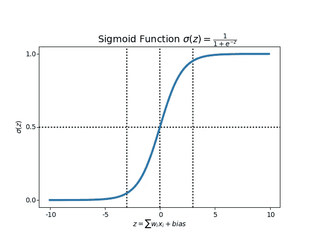

# 驾驭不确定性的力量

> 原文：<https://towardsdatascience.com/harnessing-the-power-of-uncertainty-3ad9431e595c?source=collection_archive---------24----------------------->

## 梯度推进树、逻辑回归和深度学习——你可以在你想要的每个 ML 模型中进行，并从你的机器学习模型中实现更多。

[p](https://unsplash.com/photos/gF6HdRlyJ5o)hoto by [Santiago Lacarta](https://unsplash.com/@lacarta) on [Unsplash](https://unsplash.com)

让我们从想象开始，例如，给定几张狗品种的照片作为训练数据，我们有一个训练好的模型——当用户上传他的狗的照片时——假设的网站应该以相当高的可信度返回一个预测。

但是如果一个用户上传了一张猫的照片，并要求网站决定狗的品种，该怎么办呢？

该模型已经在不同品种的狗的照片上进行了训练，并且(希望)已经学会很好地区分它们。但是该模型以前从未见过猫，并且猫的照片会位于该模型被训练的数据分布之外。这个说明性的例子可以
扩展到更严重的设置，例如诊断系统从未观察过的结构的 MRI 扫描，或者自动汽车转向系统从未训练过的场景。

在这种情况下，模型的一个可能的预期行为是
返回一个预测(试图从我们观察到的数据外推)，但返回一个带有附加信息的答案，即该点位于数据分布之外(见图 1.2 中回归情况的简单描述)。也就是说，我们希望我们的模型拥有一些数量来传达这种输入的高度不确定性(或者，传达低置信度)。

在这篇文章中，我将介绍如何挖掘模型不确定性的方法。
我会在 3 种不同的模型上展示:L [逻辑回归](https://www.wikiwand.com/en/Logistic_regression)、[梯度推进树](https://www.wikiwand.com/en/Gradient_boosting) s、D [深度学习](https://www.wikiwand.com/en/Deep_learning)。这篇文章是写给那些已经熟悉这些算法和架构的人的。

## 准备好了吗？开始吧！

# 驾驭不确定性的力量

为了利用你的模型不确定性的力量，你需要知道你的模型的分布(大多数时候很容易假设它接近正态分布)。

当分布已知时，您可以计算您的模型均值和标准差。
标准差是模型的不确定性，平均值是模型的结果。您现在可以将它用于简单的 UCB:

3 is just a factor for the sigma, it can be any number, the larger the factor the more weights on the exploration

这是一个例子，你也可以在 Tompson 采样中使用，假设你的模型是正态分布的。

# 梯度推进树

梯度推进树是一种强大的算法，可能是当今最常用的算法。
我觉得最常见的算法有:XGBoost，LightGBM，和 CatBoost。在这篇文章中，我将用 CatBoost 展示这个例子，但是同样的想法可以在所有的例子中实现，也可以在像 Random Forest 这样的常规决策树中实现。

为了得到你的决策树模型的不确定性，你需要分别收集每棵树的预测。如果你使用分类，得到每棵树分类的概率。如果使用回归，请使用回归的值。

当每个预测都有一个来自每棵树的概率列表时，可以从每个预测的概率列表中计算平均值和标准偏差。

example with CatBoost how to get each tree prediction, and from those predictions calculate the mean and the std of each prediction in order to get and use the uncertainty

# 深度学习

我开始研究模型中的不确定性以提高准确性的原因是因为深度学习。我认为把深度学习的不确定性中的“联合国”放在一起的人是[亚林·加尔](http://www.cs.ox.ac.uk/people/yarin.gal/website/)，他的论文是“[深度学习的不确定性](http://mlg.eng.cam.ac.uk/yarin/thesis/thesis.pdf)”。他的主要想法是使用辍学，谁更常用于训练，以避免过度拟合，也在预测。在预测时，我们也将使用 dropout，并运行相同的预测 X 次，因为 dropout 是随机选择的，每个预测我们将得到相同预测的一些不同结果。有了这些不同的结果，我们可以很容易地计算平均值和标准差。

当你有均值和标准差时，这是和之前一样的解。

# 逻辑回归

Sigmoid Function Graph

The formula of a sigmoid function | Image: Analytics India Magazine

我首先要说的是，这里我们没有得到模型的不确定性，但是我们理解我们训练数据的不确定性。
这里的想法是在来自训练集的不同切割上训练相同的模型。要获得模型的不确定性，您需要做以下工作:

1.  将你的训练集分成 N 份
2.  每次切割将随机选择 70%–80%的训练集记录。
3.  在每次切割中，您将训练一个逻辑模型(最后您将有 N 个模型)
4.  对所有 N 个定型模型运行每个预测
5.  计算所有预测的平均值和标准差。

# 包扎

在这篇文章中，我们回顾了获得模型不确定性的方法。
最常见的方法是深度学习，但你也看到了在 GDT 和逻辑回归模型中这样做的方法。

正如我说过的，模型不确定性的用途可以是在打开模型时进行更多的探索，但它也可以提高精确度。如果您的数据可以在对这些项目了解较少的情况下获得新项目，那么模型不确定性在这里会非常有用。

如果您有任何问题或需要更好地了解它如何帮助您，以及如何在技术上做到这一点，请通过 Linkedin 联系我。