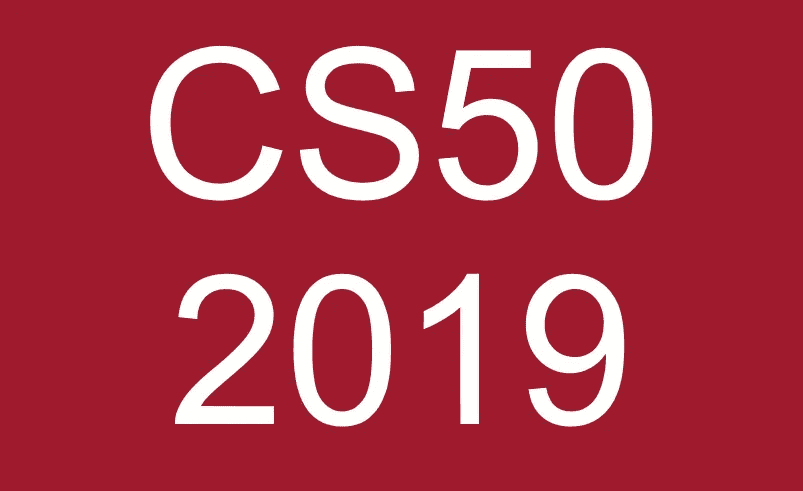
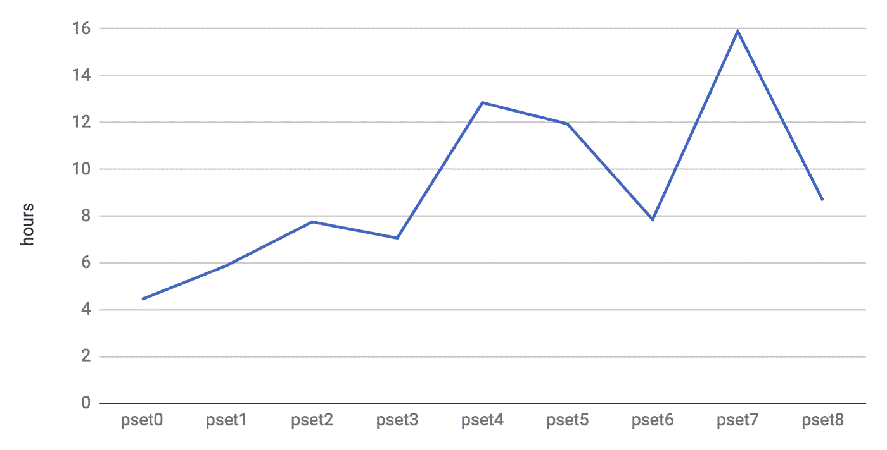
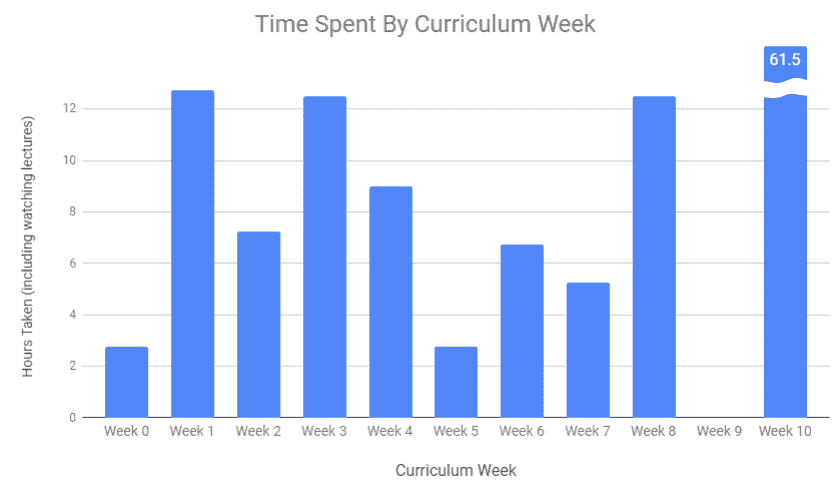
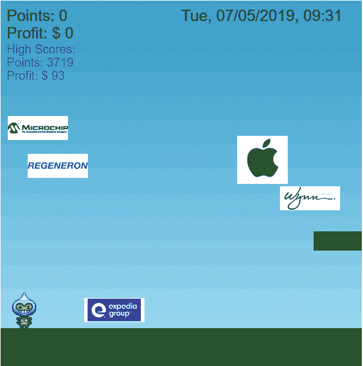

# 哈佛大学 CS50 计算机科学导论 2019 回顾

> 原文：<https://towardsdatascience.com/harvards-cs50-intro-to-computer-science-2019-review-10d89177a8a2?source=collection_archive---------5----------------------->

CS50 是哈佛的计算机科学入门课程。这门课程不仅仅是在线完成的，它是教授给哈佛学生的实际课程。所有的讲座都在哈佛拍摄，并放在网上，还有作业、辅导视频和所有支持笔记(如果你想看的话，笔记和作业链接在下面)。你的作业是有分数的，所以你和真正的哈佛学生有着同样的标准。令人难以置信的是，所有这些都是完全免费的。

该课程从最基础的开始，解释二进制并使用可视化的、基于块的编程语言 Scratch，然后继续学习 c。难度从这里开始迅速增加，深入讨论计算机如何处理代码、信息如何存储在内存中以及什么是数据结构。然后，它转移到 HTML、Javascript 和 Python。最后，您运行一个 web 服务器并从 API 中提取数据。

作为一个通过在线课程学习编程的人，我一直在想，如果不像大学生那样学习更多的理论模块，我是否会错过一些东西。尽管只是一个介绍，这个课程帮助我更好地了解了计算机是如何处理我写的代码的，并解决了我的一些自我怀疑。

# 谁应该上这门课？

这门课程考虑到了一系列的能力。任务通常有两种，“不太舒服”和“比较舒服”，你可以选择接受哪一种。在课程开始前，我已经处于中等水平的编码技能，所以选择了“更舒适”的作业。我仍然觉得 C 语言中的作业很有挑战性。

## 适合初学者吗？

在讲座中，每件事都有很好的解释，还有很棒的笔记和额外的“短片”视频，它们更详细地解释了特定的主题。由于这门课程非常受欢迎，也有许多其他资源可用，如[子编辑](https://www.reddit.com/r/cs50/)和专用的 [stackoverflow 网站](https://cs50.stackexchange.com/)。因此，虽然很有挑战性，但如果你愿意花时间，这个课程还是可以管理的。

然而，如果你只是刚刚开始，我不建议你这么做。这门课的工作量很大，如果你是初学者，可能需要 200 个小时左右(关于工作量的更多细节见下文)。这种努力会让很多人在到达终点之前就失去兴趣。

像[这个](https://www.udemy.com/the-complete-web-developer-course-2/)或[这个](https://www.udemy.com/the-web-developer-bootcamp/)关于网络开发的课程将教你编码*和*让你更快地构建酷的东西，这将有助于建立你的信心。我确信在这门课的某个时刻，每个人都会觉得自己像个白痴，所以保持自信让你坚持下去是很重要的。如果你以前没做过什么，很容易走开，认为编码不适合你，这几乎肯定不是真的。

## 是哈佛的…需要超级聪明吗？

不，一点也不。如前所述，该课程针对一系列的经验水平。唯一高的期望是他们期望学生在课外投入的时间。这些作业“psets”可能需要 20 个小时，因此在进行大学课程的其他模块的同时实时管理将是一个具有挑战性的工作量。然而，由于这是一门在线课程，你可以按照自己的进度来完成。

# 课程内容

在哈佛，这门课程被分成几周教授。当你在网上做的时候，你可以想花多长时间就花多长时间，每周完成。

*   **第 0 周:**二进制，什么是算法，Scratch。[备注](https://cs50.harvard.edu/college/weeks/0/notes/)， [pset0](https://docs.cs50.net/2019/x/psets/0/index.html) 。
*   **第一周:**编译，C intro (if 语句，针对& while 循环，函数，数据类型)，库。[备注](https://cs50.harvard.edu/college/weeks/1/notes/)， [pset1](https://docs.cs50.net/2019/x/psets/1/index.html) 。
*   第二周:搜索和排序算法，大 O 符号(算法运行的时间)。[备注](https://cs50.harvard.edu/college/weeks/2/notes/)， [pset2](https://docs.cs50.net/2019/x/psets/2/index.html) 。
*   **第三周:**指针，内存分配，十六进制[注释](https://cs50.harvard.edu/college/weeks/3/notes/)， [pset3](https://docs.cs50.net/2019/x/psets/3/index.html) 。
*   **第四周:** C 结构，链表，哈希表，树，尝试，递归。[音符](https://cs50.harvard.edu/college/weeks/4/notes/)， [pset4](https://docs.cs50.net/2019/x/psets/4/index.html) 。
*   **第五周:** HTML，CSS，Javascript，TCP/IP。[备注](https://cs50.harvard.edu/college/weeks/5/notes/)， [pset5](https://docs.cs50.net/2019/x/psets/5/index.html) 。
*   **第六周:** Python。[注释](https://cs50.harvard.edu/college/weeks/6/notes/)，[pset 6](https://docs.cs50.net/2019/x/psets/6/index.html)(python 中之前 pset 的重做)。
*   **第 7 周:**运行网站服务器，Flask，Jinja 模板。[备注](https://cs50.harvard.edu/college/weeks/7/notes/)， [pset7](https://docs.cs50.net/2019/x/psets/7/index.html) 。
*   **第 8 周:**cookie 和网站会话、SQL 和数据库。[注意事项](https://cs50.harvard.edu/college/weeks/8/notes/)、 [pset8](https://docs.cs50.net/2019/x/psets/8/index.html) 。
*   第 9 周:没有讲座或 pset。
*   第 10 周:回顾之前的讲座。不同技术的“研讨会”讲座为期末项目提供思路。[最终项目规格](https://docs.cs50.net/2019/x/project/project.html)。

# 工作量

你可以预期花 10 到 20 个小时完成每堂课和 pset。哈佛对自己学生的调查显示，他们平均每份 pset 作业花费大约 10 个小时。最重要的是，讲座每周大约 2 小时，最后还要完成一个项目。因此，预计整个课程需要 100 到 200 个小时是合理的，这取决于你开始时的技能水平。

Harvard’s [survery](https://cs50.harvard.edu/college/2019/fall/faqs/#how-much-work-is-cs50) of students time spent on psets

# 我的个人经历

我真的很喜欢这门课的前几周，第一周到第四周，当你在 c 语言中工作的时候，研究指针、链表和其他数据结构是多么有趣，这也正是我想在这门课中学到的东西。在第 4 周之后，我更熟悉的主题被引入(HTML、Python 和 Javascript 等)，所以我从后面的几周学到的东西较少。也就是说，我仍然喜欢它们。

如果你想比较你的代码和我提交的代码，看看我的方法，这里有一个到 Github 的[链接。它们可能离最佳解决方案还很远，但我发现看到其他人解决同样问题的方法是一种有用的学习方式。](https://github.com/MarkMacArdle/cs50)

## 花费的时间

总的来说，这门课程花了我 133 个小时，历时 19 周才完成。在那段时间里，我花了 7 周 73 个小时听课和做 psets，然后花了 12 周 60 个小时做期末项目。

注意:第 9 周没有讲座或 pset，第 10 周因为有期末专题所以花了很长时间。

## 最终项目— [股市游戏化](https://fathomless-eyrie-94084.herokuapp.com/)

我有一个我想获得经验的技术列表:Docker 容器、使用 AWS、MongoDB、运行服务器和使用 API。所以我想出了构建 pset8 的主意，包括获取股票市场价格和使用 Flask 服务器，并制作一个游戏，我可以在容器中运行并部署在 AWS 上。为了制作一个基于网络的游戏，我使用了 [Phaser 3](https://phaser.io/tutorials/making-your-first-phaser-3-game/part1) Javascript 库(对我来说也是新的)。

对于一个项目来说，这可能是太多的新事物了，我发现一开始真的很难开始。在不到 2 个月的时间里完成了几乎所有的 CS50 之后，仅仅这个项目就花了我将近 3 个月的时间！

我很高兴我坚持了下来，因为[游戏](https://fathomless-eyrie-94084.herokuapp.com/)确实有效！你扮演一个太空人，他必须跳上纳斯达克 100 股票清单上的公司标志。这些标志随着 IEX API 中的实际股市数据而变化。

[Play the game here](https://fathomless-eyrie-94084.herokuapp.com/)

这里是代码的 Github 的[链接。它运行在一个 Flask 服务器上，我把它放在一个运行 Alpine Linux 的容器中。然后，我在 AWS 上使用 ECS(弹性容器服务)来托管该容器，并使其可以在线访问。高分保存在 MongoDB Atlas 集群中。](https://github.com/MarkMacArdle/stock_game)

在 AWS 上使用 ECS 被证明是昂贵的；大约 30 美元/月，即使我的流量很小。所以我后来改用 Heroku 上的免费层。

# 结论

如果你已经做过一些编程，并且想要更深入地了解计算机如何工作，以及你写的代码实际上使计算机做什么，这是一个很好的起点。这门课程值得它所得到的赞扬。我从中学到了很多，真的很喜欢！