# 全球暴力下降了吗？看一看数据

> 原文：<https://towardsdatascience.com/has-global-violence-declined-a-look-at-the-data-5af708f47fba?source=collection_archive---------1----------------------->

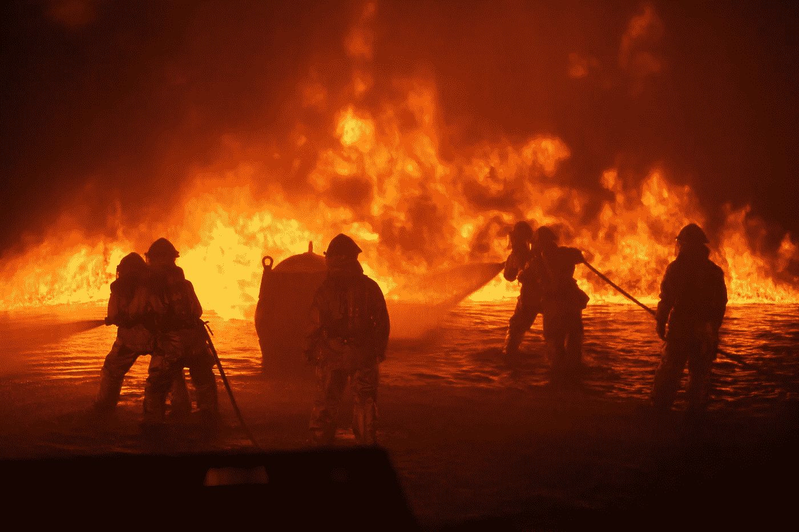

[(Source)](https://www.pexels.com/photo/backlit-breathing-apparatus-danger-dangerous-279979/)

## 我们真的生活在人类历史上最和平的时代吗？这完全取决于你如何衡量:现实项目第 2 集

在他 2011 年的巨著《我们本性中的善良天使:为什么暴力减少了》中，史蒂芬·平克大胆地宣称，“今天，我们可能生活在人类历史上最和平的时代。“对于一个对当地和国际上不断的暴力新闻报道稍加关注的人来说，这种说法听起来很可笑。这个断言的宏伟应该立即引起我们的怀疑；正如科学普及者卡尔·萨根经常说的，“非凡的主张需要非凡的证据。“平克有证据吗？他的解释正确吗？

在长达 800 页的篇幅中，平克用数字、图表以及对许多书籍和文章的引用进行了令人信服的论证。尽管如此，重要的是我们不能依赖单一的论点来形成我们的世界观。我们必须记住，数据从来都不是客观的，因此我们需要查看数据本身以及多个专家的解释。在本文中，我们将考察全球暴力冲突数据以及对相同数字的不同立场。(值得注意的是，平克的作品涉及从个人到世界范围的各种形式的暴力——杀人、虐待，但这里我们将重点关注国际暴力冲突——战争——并将其他内容留给未来的文章)。

这是“现实项目”的第二集，这个项目的目标是减少对数据世界的误解。你可以在这里找到所有[的文章](https://medium.com/the-reality-project)。

(我想强调的是，我并不是试图通过只提供数据来最小化战争的暴行。当看数字时，我们很容易忘记我们正在谈论的是人，每一个人的生命损失都是一场悲剧。)

# 数据

我们更积极方面的衍生数据的主要来源将是 [*《我们本性中更好的天使》*史蒂芬·平克](https://en.wikipedia.org/wiki/The_Better_Angels_of_Our_Nature#cite_note-singer-11)和[《我们的世界》数据](https://ourworldindata.org/war-and-peace)中的“战争与和平”页面。为了对比观点，我们将使用约翰·格雷的[“史蒂芬·平克是错误的”](https://www.theguardian.com/books/2015/mar/13/john-gray-steven-pinker-wrong-violence-war-declining)和[冲突的减少:数据到底说了什么？帕斯卡·西里洛和纳西姆·尼古拉斯·塔勒布。你可以在冲突目录或世界银行找到你自己分析的原始数据。](http://www.fooledbyrandomness.com/pinker.pdf)

评估今天的暴力，我们需要问的第一个问题是过去有多暴力。虽然很难获得极其可靠的数据，但人类学家利用考古证据来确定死亡原因，从而估算出一个社会的暴力发生率。这些结果显示在以下图表中，这些图表显示了史前和非国家社会中暴力冲突造成的死亡百分比(来自《我们的世界》的数据)。

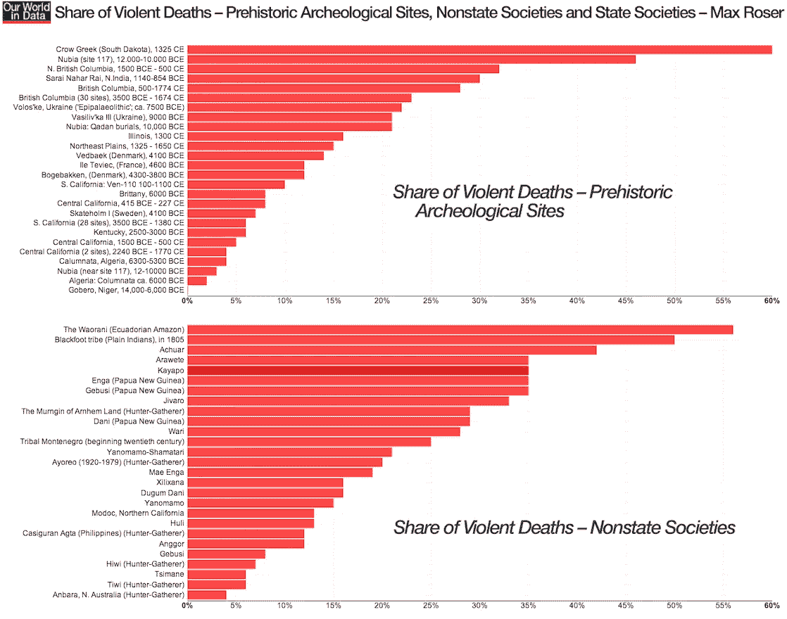

Percentage of deaths attributed to violence in prehistoric and nonstate societies

在史前和非国家社会中，死于暴力的人的百分比从大约 60%到不到 5%不等。这些数字几乎毫无意义，除非我们将它们与现代数字相比较:

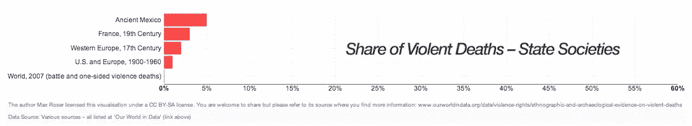

Percentage of deaths attributed to violence in state societies

最相关的条目是最后两个。1900—1960 年间，美国和欧洲即使经历了两次世界大战，也只有不到 1%的人口死于武装冲突。2007 年，世界上只有 0.04%的死亡是由国际暴力造成的。如果这个数据是正确的，2007 年的世界至少比大多数史前社会安全一个数量级。

我们也可以用稍微不同的方式来看同样的数据，比如每年每 10 万公民中的暴力死亡人数。

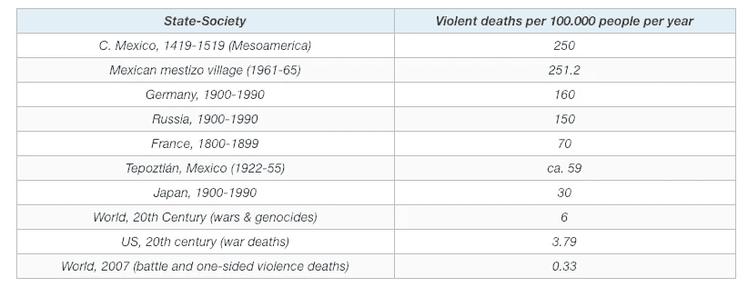

Left: violent deaths per 100,000 citizens per year in non-state societies. Right: same data for state societies.

在这里，我们又一次看到了同样的现代低暴力模式。左边是非国家社会，右边是国家社会。关注右边表格的底部 3 行，我们可以看到现代社会中暴力致死率非常低，即使算上两次世界大战。再次强调，这里的数据并不完整，但现有的数据表明了以下假设:史前和非国家社会经历了比现代国家社会高得多的暴力率。

正如平克和其他人(特别是贾雷德·戴蒙德)已经明确指出的，“高贵的野蛮人”的想法是完全错误的。当人们被组织成部落，然后随着他们被文明化而变得更加暴力时，他们并没有和平地彼此生活，而是相反:他们在部落中极其暴力，随着更大的文明的建立和商业开始连接世界，他们逐渐变得不那么暴力了(这突出了全球战争衰退的两个驱动因素——贸易和强大的国家——我们很快就会看到)。即使算上民族国家在 20 世纪犯下的暴行，暴力死亡率现在似乎也比以往任何时候都低。

值得研究一下我们拥有最佳数据的时期:现代。特别是，我们将放大 1945 年后的时代，一个被平克归类为“长期和平”的时代。从这个有利的角度来看，事情看起来很好。正如平克所指出的，自 1953 年以来，世界大国之间没有任何冲突(二战以来的例外是朝鲜战争)，自 1945 年以来，也没有任何国际公认的国家因被征服而不复存在。

当我们查看基于国家的冲突中每 10 万人的战斗死亡数据时，我们看到自第二次世界大战以来显著下降。

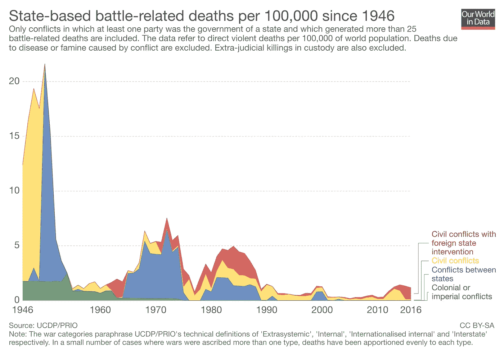

State-based violent conflict deaths from World War Two on

自第二次世界大战结束以来，所有冲突的死亡率都有所下降，国家间冲突的下降最为明显。大多数剩余的战斗死亡发生在内战中，如自 2011 年以来一直持续的叙利亚内战[。此外，这些内战中有许多涉及外国，可以说主要国家已经停止了直接的相互战斗，而是通过其他冲突进行参与。](https://en.wikipedia.org/wiki/Syrian_Civil_War)

与上图形成对比的一个令人沮丧的消息是自第二次世界大战以来国家间冲突的总数:

Number of state-based conflicts since the end of World War Two

虽然与战斗相关的死亡人数(以死亡人数/100 000 人/年计算)有所下降，但冲突总数却在上升。这告诉我们，与我们可能认为的武器技术进步相反，暴力冲突正在导致更少的战斗死亡。虽然全球各地的国内冲突越来越多，但其灾难性往往不如大国之间的战争。

幸运的是，大国之间的战争一直在减少——甚至包括整个 20 世纪——而且没有逆转的迹象。我们可以在最后一张图表中看到这一点，该图表显示了过去 500 年中主要大国处于战争状态的时间百分比(以 25 年为一组)。

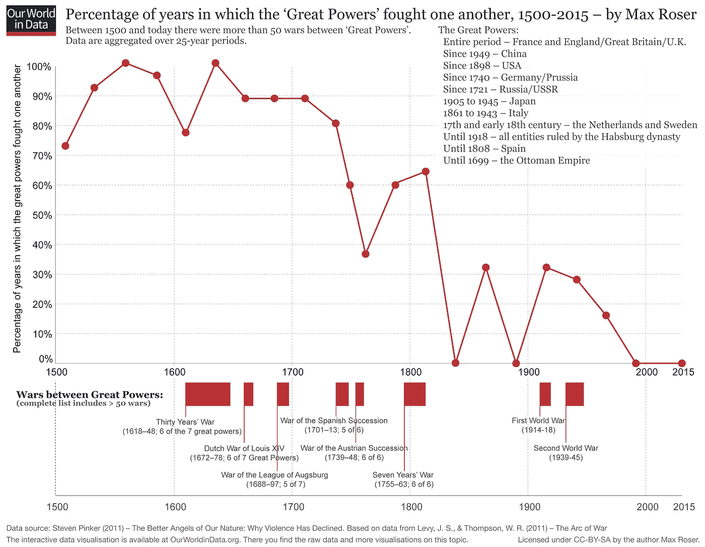

Percent of Years in which Great Powers Fought One Another (bunched into 25-year periods).

至少自 1600 年以来，主要大国相互交战的年数比例明显下降。这一比率一度达到 100%——表明在整个 25 年期间，世界强国之间至少发生过一次冲突。相比之下，2000 年世界强国之间没有冲突。目前，至少自罗马帝国以来，66 年没有大国冲突的时间是最长的。

在对迄今为止的数据进行研究后，平克的论点似乎站得住脚:即使算上世界大战，现代国家社会在战争中的死亡率也远低于史前和非国家社会。此外，主要大国不再相互争斗，尽管国内冲突的数量有所增加，但这些冲突造成的死亡人数少于主要国家之间的冲突。然而，在我们认为这个案子已经结束之前，我们需要谈谈一个基本问题。

# 关键问题:相对还是绝对

考虑以下两种情况:

1.  两个男人独自在酒吧里。在短暂的争执后，其中一人拔出手枪，杀死了另一人。总死亡人数为 1 人，死亡率为 50%。
2.  一场小规模的内战在一个拥有 100 万人口的国家持续了几个月。总死亡人数是 10，000 人，死亡率为 1%。

哪个更糟？问题取决于你的观察点。在地面上，从冲突本身的地点来看，酒吧要糟糕得多。酒吧里的人有 1/2 的几率被杀。从局外人的角度来看，这场内战要糟糕得多，死亡人数是它的 10 倍。这是平克的批评者提出的一个中心论点:用比率来衡量暴力忽略了绝对数字，这意味着它不能解释人类遭受的实际痛苦。

平克最严厉的批评者之一，[纳西姆·塔勒布在他的回应中提出了单位的观点。他用下面一对图来说明这一点:](http://www.fooledbyrandomness.com/pinker.pdf)

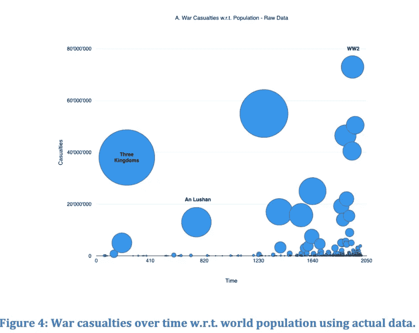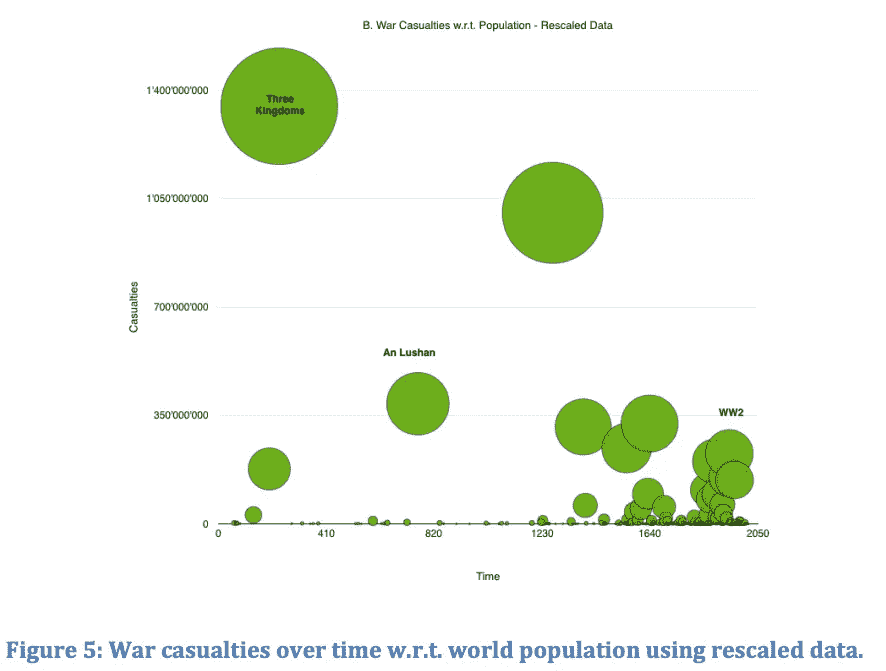

War casualties using raw data left and rescaled data right

左边的图表显示了主要冲突的原始伤亡人数与时间的关系。右边的图表显示了*重新调整后的*版本，在该版本中，人口一直被标准化为具有相同的基础人口。例如，如果一个人口为 100 的社会有 2 人死亡，而一个人口为 1000 的社会有 10 人死亡，我们将乘以 2 * 10 得到 20 人死亡，以说明人口差异。

这些数字概括了比率/绝对数字的论点:暴力冲突中的死亡率明显下降，处于历史低点，但实际死亡人数随着时间的推移而增加。尽管如此，值得指出的是实际数字自 1950 年以来一直在下降。

关于这个相对/绝对的问题，不知道有没有答案给你。作为一个功利主义者，我相信要给最多的人带来最多的整体利益，因此，我认为人类死亡的总数是我们文明失败的标志。另一方面，今天活着的人在暴力冲突中丧生的概率比过去任何时候都要低，这无疑是一种进步。我会让事实真相大白，让你自己决定。

即使我们不想对整体结果作出判断，也值得看一看暴力发生率下降的潜在原因。特别是，我们可能要思考为什么自 1945 年以来死亡总人数(除了相对数据之外)下降了。

# 暴力减少的驱动因素

在这一部分，我们将看看史蒂芬·平克在*中概述的观点，我们本性中更好的天使*。(这项工作是对暴力下降的潜在原因的最佳审视——部分原因是其他人拒绝承认这一点)。平克解释了五种力量，旨在解释所有规模的暴力下降，而不仅仅是基于国家的冲突，但我们将重点关注与国际冲突最相关的前两种。

暴力减少背后的五大历史力量是:

1.  **民族国家:**由中央政府统治的社会的崛起，特别是**民主国家，**拥有“合法使用武力的垄断权”
2.  商业:国家间的贸易让我们能够参与正和互动，这意味着我们的邻居活着比死了更有价值
3.  **女性化:**妇女在社会中的作用和权力地位提高
4.  **理性:**在制定政策和与他人互动时，越来越依赖逻辑思维，而不是传统
5.  大众媒体和交流:让人们不再视外人为危险分子，而是具有共同人性的人

## 民族国家，或称利维坦

一个强大的中央政府可以使用暴力制定和执行法律，这意味着公民不太可能自行决定惩罚，这一概念被称为 [Leviathon 理论。尽管有其浪漫的吸引力，私刑只会导致无休止的复仇暴力循环。当公民可以指望政府给予公平的惩罚时，他们会让司法系统来执行规则。此外，一个国家可以通过使惩罚远远大于任何潜在的回报来防止犯罪。人类既有邪恶的潜力，也有善良的潜力，一个强大的中央政府，一个公平的刑事司法系统，可以引导他们走上正确的道路。](http://www.oxfordscholarship.com/view/10.1093/acprof:oso/9780198246169.001.0001/acprof-9780198246169)

然而，仅仅一个强大的政府不足以维持国家间的和平。在国际范围内，证据表明*民主国家*不会互相争斗，可能是因为它们有共同的理想。从一些数据来看，很明显，民主国家不再直接互相争斗(尽管它们可能会参与代理战争)。

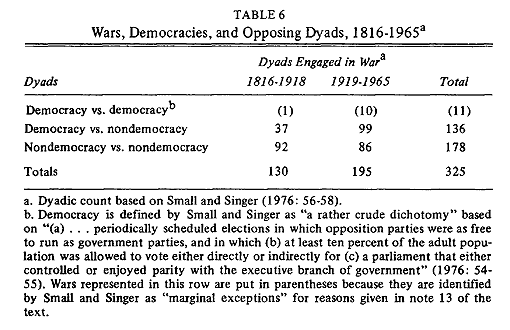

Conflicts between different forms of government ([source](https://www.hawaii.edu/powerkills/DP83.HTM))

(关于这一概念的更多内容，参见[《民主和平论》。)](https://en.wikipedia.org/wiki/Democratic_peace_theory))

一个民主国家不会与另一个民主国家作战的想法是一个好消息，因为从长远来看，民主国家在世界范围内正在崛起，正如平克所显示的那样:

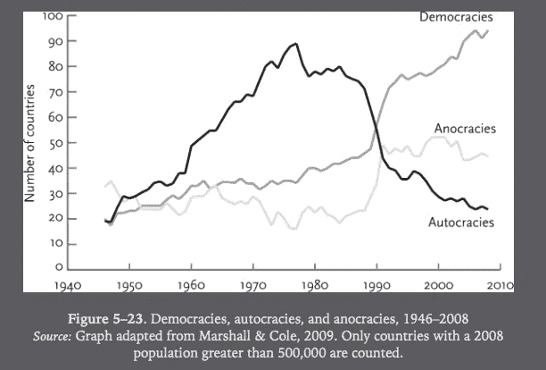

Types of government since the 1940s

(一个相反的例子是最近民主指数的下降，该指数不仅衡量政府，也衡量新闻自由和投票权。虽然长期趋势是积极的，但最近的下降令人担忧。)

## 温和的商业

温和商业的理论可以总结为两种说法:

1.  当买东西比偷东西便宜时，经济学就赢了
2.  **我们的邻国——无论是国内还是国外——活着比死去对我们更有价值，因为交换是正和的**

你为什么不从杂货店偷一条面包？虽然大多数人认为他们不会偷窃，因为这是错误的行为，但真正的原因更为平凡:在我们的社会中，被抓到偷窃的潜在成本——坐牢和社会排斥——高于购买物品的成本。当人们有比暴力更便宜的合法途径来获得他们的商品时，他们会选择合法途径。

我们在[《消失的穷人》](https://medium.com/the-reality-project/the-disappearing-poor-6c68789e5a53)中探讨了第二点，但值得重申一下。在市场经济中，如果没有交换，人类之间的所有互动都是零和游戏:你可以从我这里偷走一些东西，但你的收获被我的损失抵消了，所以人类并没有变得更好；经济规模保持不变。然而，在商品交换中，*双方都有更好的收益。*

交换也允许专业化，因此不同的个人/国家可以制造他们最适合的商品。此外，随着贸易的继续，各国变得相互依赖，因为它们不再生产所需的所有商品。交换的最终结果是为各方提供更多更便宜的商品，并改善国际关系*。*

在过去的几百年里，我们已经慢慢地建立了一个国际市场，在这个市场中，所有的参与者都相互依赖。美国不会与另一个大国开战，不是因为她无法击败他们，而是因为经济损失将远远超过收益。正如平克所讨论的，在贸易上更加依赖彼此的国家不太可能因为其他因素而发生暴力冲突。总之，对大多数国家来说，财政刺激已经从战争转向贸易。

Leviathon 和 gentle commerce 实际上是一起工作的——一个强大的政府能够创造允许安全交易的市场，并执行监管贸易的法律。换句话说，一旦你有了一个强大的国家，贸易就更容易了，国家之间更多的贸易意味着他们不太可能互相攻击。随着世界大国之间的贸易增加，自 1953 年以来，大国之间的冲突也减少到零。

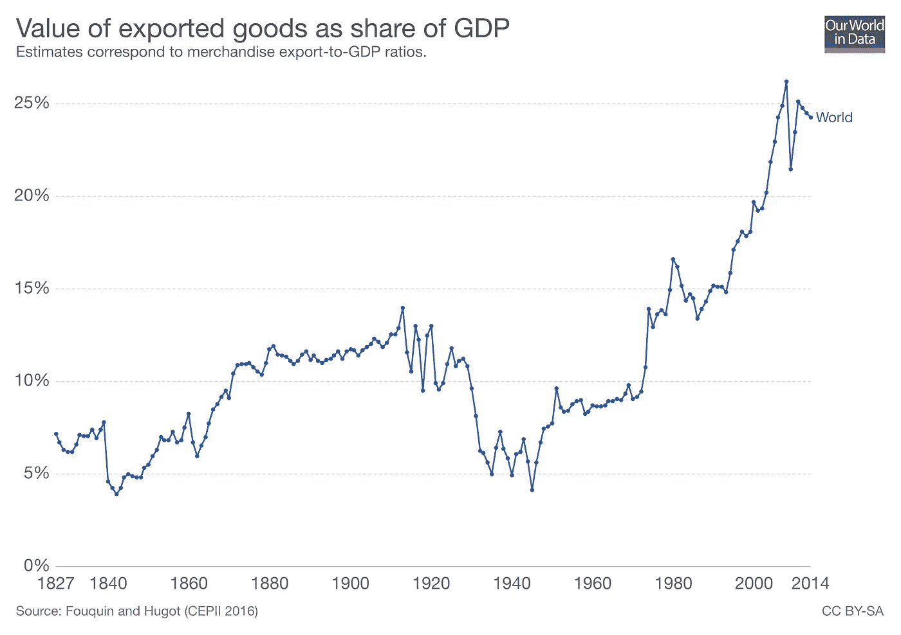

World trade as a percentage of GDP

毫无疑问，还有其他因素在国家间战争的减少中发挥了作用。我们讨论了下降背后的外部历史因素，但平克和其他人([约翰·霍根在*战争的结束*](https://bigthink.com/re-envision-toyota-blog/the-end-of-war) *)* 也概述了内部因素，如[我们本性中更好的天使](https://en.wikipedia.org/wiki/The_Better_Angels_of_Our_Nature#Four_better_angels_(Chapter_9)):移情、自我控制、道德、理性。

通过检查数据和原因，很明显，主要大国不再认为战争是一个可行的选择。这不一定是因为它们是道德的，而是因为战争经济学不再有意义。归根结底，人类和国家都受到激励的驱使，通过国际贸易，我们建立了一个激励有利于和平的世界。

# 警告和结论

从狭隘的角度来看，平克是正确的:*暴力冲突的比率*已经大幅下降，有理由相信它们处于人类历史的最低点(如果仅仅是因为数据有限的话)。此外，至少在现代民主国家中，暴力不再被视为解决问题的默认选项，而几乎在整个人类历史上都是如此。也就是说，有必要思考一下平克的观点是如何误导人的。

第一点是，通过关注比率而不是数字，我们忽视了人类的实际痛苦。死于战争的人越来越多，即使这个比例在下降。根据一个人的论点，这些数字可以用来支持多个结论。

第二个中心问题是，特别是对于史前社会，可靠的数据很难获得。史前社会的大部分冲突率和死亡数字来自于对考古遗址的考察和对暴力死亡证据的人工制品的观察。然而，这些标记可能被误解了，人类学家不可能研究所有的史前社会。简单的推断已经发现的是唯一的选择，但是不得出不成熟的结论也很重要。

我们将在这里讨论的最后一个主要问题是，我们可能生活在一个异常的时代。平克将最近 70 年的和平(现代国家之间没有战争)称为“长期和平”，但这可能真的只是暂时的和平。此外，正如塔勒布所指出的，战争往往是幂律分布的，即它们有向右倾斜的长尾巴。武装冲突中的绝大多数死亡是由少数冲突造成的，如下所示:

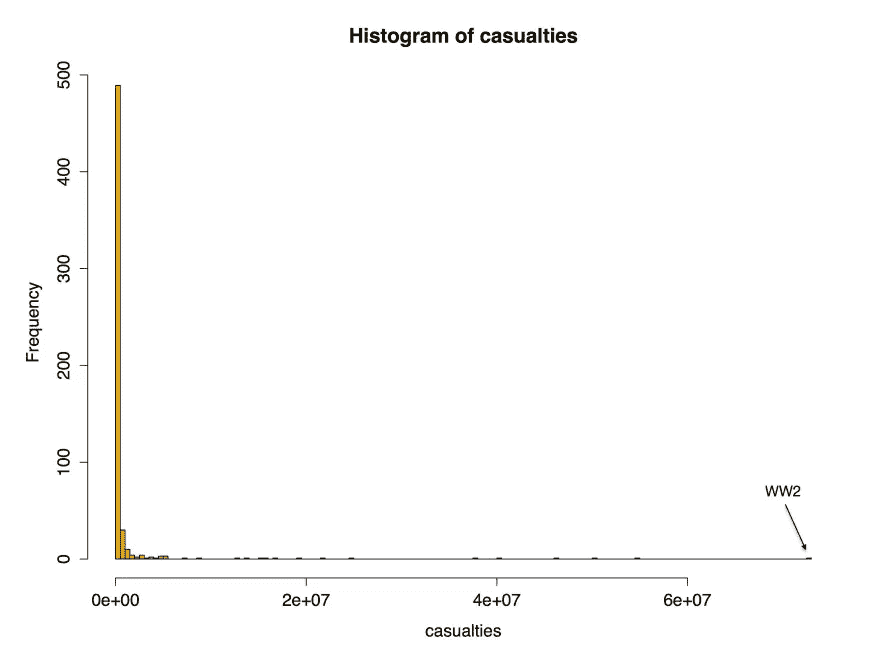

Distribution of war casualty deaths on log scale

就死亡人数而言，一场冲突可能完全超过所有其他冲突。自 1945 年以来，大多数武装冲突都处于较低水平，但只需一场重大战斗就能掩盖自 1945 年以来的和平。由全球变暖、资源短缺或领土争端引起的新冲突可能会完全抵消人类在减少暴力方面取得的千年进展。

最初，看了平克的书，我被他的论文说服了。然而，在我自己花时间挖掘事实之后，一个更加微妙的画面出现了，一个双方都没有理由发生耸人听闻的冲突的画面。我看到了乐观的理由:武装冲突中死亡率的下降意味着今天活着的人在战斗中死亡的可能性低于有记录的历史，自 1953 年以来大国之间没有战争，自 20 世纪 50 年代以来总体战斗死亡人数减少，以及悲观的理由:民主和国际贸易对减少重大冲突如此重要，但近年来似乎在下降。此外，尽管主要大国之间不再直接交战，但它们通过代理人战争参与进来。

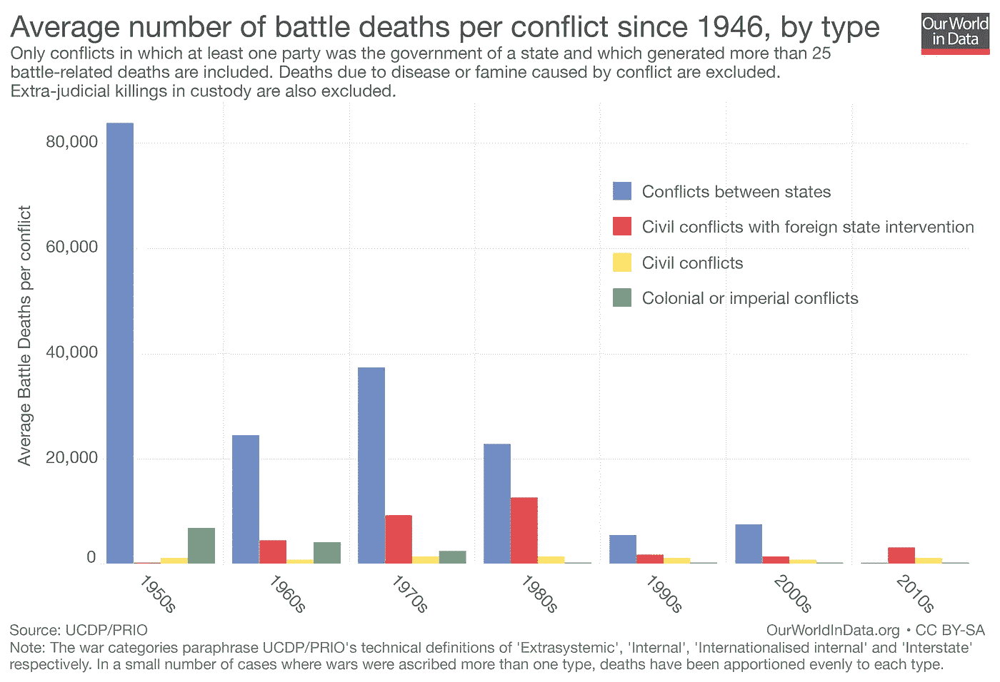

Things could be much worse, but they could also be better.

对暴力冲突的探索凸显了现实项目的目标。它不是为了让我感觉良好而设计的，而是基于事实的努力，因此，每当我遇到吸引我的论点时，这只会告诉我要更加怀疑。除了获取我们世界背后的实际统计数据之外，现实项目并不忠于任何单一的利益。当事实让我们乐观时，这很好，但即使事实并非如此，理解数据也是至关重要的，这样我们才能努力改善事情。

一如既往，我欢迎反馈和建设性的批评。可以通过 Twitter [@koehrsen_will](http://twitter.com/@koehrsen_will) 找到我。