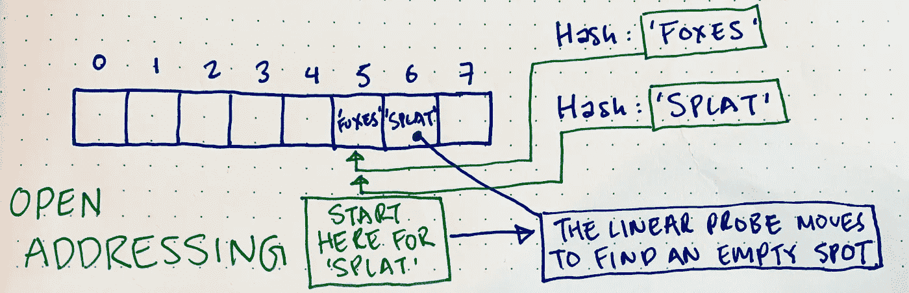

# 哈希表解释

> 原文：<https://towardsdatascience.com/hash-tables-explained-5dc457db50da?source=collection_archive---------10----------------------->

## **哈希表及其冲突的内幕**

## I 简介

当给定由与其他信息片段相关的信息片段定义的大型数据集时，我们有哪些方法可以有效地存储和检索信息？为了管理大量的关系数据，我们需要有能够快速操作它(即插入、删除和搜索)的数据结构。假设我们有与“值”数据相对应的“键”数据，那么，关联两条信息的一种方法是使用由键/值关系组成的字典。实现字典有几种不同的方法，包括使用平衡二分搜索法树和双向链表。在本文中，我们将讨论使用哈希表，这是目前为止三种字典实现中最快的方法，并且可以比其他两种字典实现更有效地执行插入、删除和搜索操作。

## **哈希函数的动机是什么？**

首先，我将解释为什么我们需要一种不同于最简单的关联信息的解决方案，即直接地址表。这个幼稚的解决方案基本上是一个大小为 *m* 的数组，其中键的数量小于 *m* ，每个数组索引的地址都对应于这个键，这个键要么保存值，要么保存指向值的指针。示例:我们可以将与键 *k* 相关联的值存储在第*个*槽中。没有相应关键字的地址简单地称为:nil。参见下面由直接地址表(T)定义的键和值之间的关系。


How a Direct Address Table works

在这种情况下，插入、删除和搜索都是 O(1 ),因为您可以通过地址直接找到键，并访问值。然而，限制这种数据结构用于存储关系信息的两个假设是:

1.  数组的大小， *m* ，不算太大。
2.  没有两个元素具有相同的键。

第一个是一个问题，因为我们不希望数组因为没有元素而占用太多空间。第二个也是一个问题，因为它限制了我们可以使用的键的类型。

因此，我们使用散列函数。

## **什么是哈希函数？**

散列函数 *h(k)* 是将所有键映射到数组的槽的函数。另一种思考方式是:给定一个键和一个数组，哈希函数可以建议键的索引应该存储在数组中的什么位置。

## 散列函数是如何工作的？

可以为哈希表实现几种哈希函数，但最流行的是除法，其中对于 m 的某个值，*h(k)*=*k*mod*m*。其他哈希函数包括:乘法和折叠方法。

## **什么是哈希冲突，如何解决哈希冲突？**

所以这一切都很好。但是当一个键被散列到与另一个键相同的数组槽中时会发生什么呢？啊哈！这就是所谓的哈希冲突。处理哈希冲突有几种不同的方法，最流行的两种方法是开放式寻址和封闭式寻址。

开放式寻址是指您将一个项目放置在某个位置，而不是其计算的位置。我们通过计算的方式来实现这一点，例如线性探测，其中使用线性搜索来查找可用的位置，并且查找项目也涉及线性搜索。



How the Linear Probe works as an example of open addressing

下面是哈希表中线性探测的代码片段:

```
**class** **HashEntry**:
    **def** **__init__**(self, key, value):
        self**.**key **=** key
        self**.**value **=** value
        self**.**next **=** None**class** **HashTable**:
    **def** **__init__**(self, size):
        self**.**size **=** size
        self**.**keys **=** [None] ***** self**.**size
        self**.**values **=** [None] ***** self**.**size

    **def** **hash_function**(self, key):
        **return** hash(key) **%** self**.**size

    **def** **get_slot**(self, key):
        slot **=** self**.**hash_function(key)
        **while** self**.**keys[slot] **and** self**.**keys[slot] **!=** key:
            slot **=** self**.**hash_function(slot **+** 1)
        **return** slot

    **def** **set**(self, key, value):
        slot **=** self**.**get_slot(key)
        self**.**keys[slot] **=** key
        self**.**values[slot] **=** value

    **def** **get**(self, key):
        **return** self**.**values[self**.**get_slot(key)]
```

另一种开放式寻址的方式是使用二次探测，当决定下一步离最初的碰撞点有多远时，我们将挫败的尝试次数平方。每当另一个挫败的尝试被做，距离最初的碰撞点的距离迅速增长。

封闭寻址本质上是使用链表将具有相同哈希值的键链接在一起。该方法的查找与在链表中搜索是一样的。


Chaining uses Linked Lists to resolve hash collisions

下面是哈希表中链接的代码片段:

```
**class** **HashEntry**:
    **def** **__init__**(self, key, value):
        self**.**key **=** key
        self**.**value **=** value
        self**.**next **=** None**class** **HashTable**:
    **def** **__init__**(self, size):
        self**.**size **=** size
        self**.**table **=** [None] ***** self**.**size **def** **hashing_function**(self, key):
        **return** hash(key) **%** self**.**size **def** **rehash**(self, entry, key, value):
        **while** entry **and** entry**.**key **!=** key:
            prev, entry **=** entry, entry**.**next
        **if** entry:
            entry**.**value **=** value
        **else**:
            prev**.**next **=** HashEntry(key, value) **def** **set**(self, key, value):
        slot **=** self**.**hashing_function(key)
        entry **=** self**.**table[slot]
        **if** **not** entry:
            self**.**table[slot] **=** HashEntry(key, value)
        **else**:
            self**.**rehash(entry, key, value)

    **def** **get**(self, key):
        hash **=** self**.**hashing_function(key)
        **if** **not** self**.**table[hash]: **raise** KeyError
        **else**:
            entry **=** self**.**table[hash]
            **while** entry **and** entry**.**key **!=** key: entry **=** entry**.**next
            **return** entry**.**value
```

暂时就这样吧！我希望这个关于散列表和它们的冲突的信息已经启发了你去学习更多关于它们的知识。

## 资源和引用

哈希表和哈希函数:[https://www.youtube.com/watch?v=KyUTuwz_b7Q](https://www.youtube.com/watch?v=KyUTuwz_b7Q)

麻省理工学院开放式课程:[https://www.youtube.com/watch?v=0M_kIqhwbFo](https://www.youtube.com/watch?v=0M_kIqhwbFo)

斯坦福 CS 161 哈希注意事项:[https://web . Stanford . edu/class/archive/CS/CS 161/CS 161.1168/lecture 9 . pdf](https://web.stanford.edu/class/archive/cs/cs161/cs161.1168/lecture9.pdf)

编码备忘单:[https://www . alispit . tel/coding-Cheat-Sheets/data _ structures/hash _ tables . html](https://www.alispit.tel/coding-cheat-sheets/data_structures/hash_tables.html)