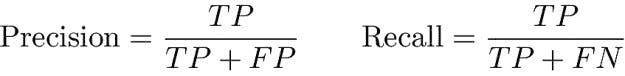
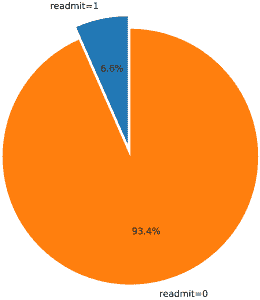
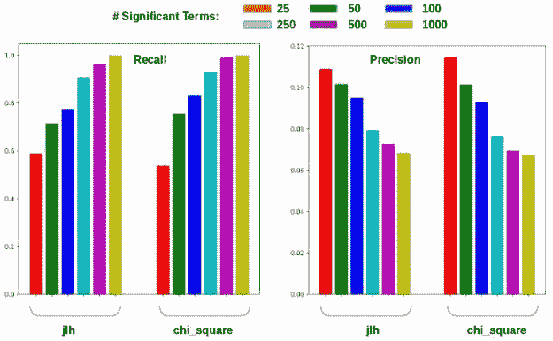
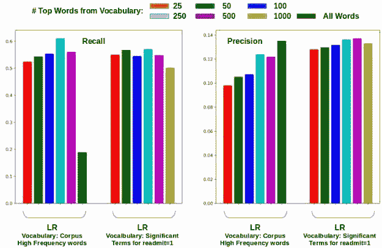
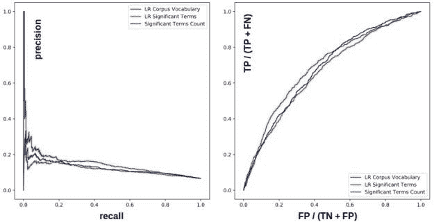
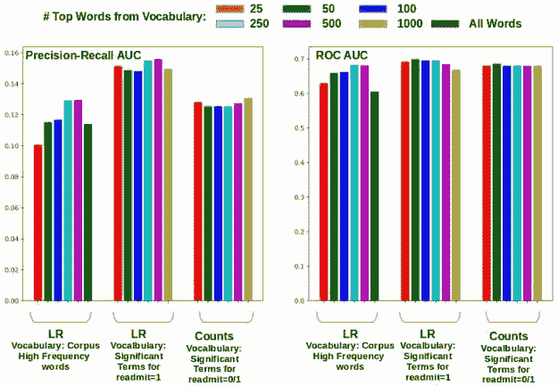

# 有不平衡的阶层？尝试重要术语

> 原文：<https://towardsdatascience.com/have-unbalanced-classes-try-significant-terms-1f449236d3f4?source=collection_archive---------30----------------------->

对一个类别有意义的词可以用来改善分类中的精确-召回折衷。使用最重要的术语作为词汇来驱动分类器，可以使用更小的模型来预测出院记录中的 MIMIC-III CCU 再入院，从而改善结果…


而且更难(抱歉瑜伽熊！)当要预测的目标类具有广泛变化的支持时。

但这种情况在真实世界的数据集上确实经常发生。一个恰当的例子是根据出院记录对一个病人近期 CCU 再入院的预测。只有一小部分患者在出院后 30 天内再次入住 CCU。我们对[之前帖子](http://xplordat.com/2019/11/30/predicting-icu-readmission-from-discharge-notes-significant-terms/)中的 [MIMIC-III](https://www.nature.com/articles/sdata201635) 数据集的分析显示，超过 93%的患者不需要再次入院。这绝对是个好消息。但如果你从事预测行业，你会遇到一个更难的问题。您希望从大量不会经历再入院的病例中尽可能多地识别出那些为数不多的未来实际再入院病例。当然，你要避免错误地将病例标记为将来的再入院。

我们所面临的是一个经典的精确与召回的问题，我们在信息检索行业都很熟悉。



*   忽略精度，实现 100%召回。只需将所有笔记标记为未来重新接收。 *FN = 0*
*   忽略召回，实现 100%的准确率。只需将所有笔记标记为未来不再接收。 *FP = 0*

# 1.重要术语

兼顾精确度和召回率是一个挑战，这也是重要术语能有所帮助的地方。在之前的文章[中，我们回顾了重要术语的背景，它们是什么，以及如何使用 Elasticsearch 从文本语料库中提取它们。那篇文章的要点如下。](http://xplordat.com/2019/11/30/predicting-icu-readmission-from-discharge-notes-significant-terms/)

1.  出院笔记中最常见的术语显示出很少的差异，无论该笔记是否经历了再入院
2.  出院记录中罕见术语的长尾受到错别字的困扰，这两个类别之间几乎没有区分能力
3.  对每一类都有意义的术语明显不同，这潜在地为我们的分类任务提供了一个挂钩

因此，我们从上面的第三项开始，看看我们可以用哪些不同的方式来使用分类任务中的重要术语。首先，让我们从 [MIMIC-III](https://www.nature.com/articles/sdata201635) 数据集定义我们的训练和测试数据。

**MIMIC-III 数据**

在前一篇文章中，我们浏览了 MIMIC-III 数据集，并准备了一个弹性搜索索引。



每份文件都是出院记录，标签为*再入院*，为 0(本次出院后 30 天内未再入院)或 1(患者在本次出院后 30 天内再入院至 CCU)。我们有 40873 个 readmit=0 的文档和 2892 个 read MIT = 1*的文档。这使得对少数类 *readmit = 1* 的正确预测变得更加困难。我们将数据分为训练集和测试集，同时根据*重新提交*标志进行分层。*

```
train_docs, test_docs, train_labels, test_labels, train_ids, test_ids = train_test_split (docs, labels, ids, test_size=0.20, random_state=0, stratify=labels)
```

我们最终得到了以下用于训练和测试的分布。在训练集或测试集中，只有大约 6.6%的文档具有 *readmit=1* 。我们使用训练集建立模型，并预测我们在少数民族*重新接纳*类中的表现。

```
# Of Train / Test : 35012 / 8753
# Of Train Readmit / NoReadmit: 32698 / 2314
# Of Test Readmit / NoReadmit: 8175 / 578
```

> *虽然有偏差，但我们使用整个训练集来构建模型。用 SMOTE 对多数 no recent 类进行二次采样或对少数* readmit *类进行过采样都有其自身的问题，我们希望避开这些问题。然而，我们稍后会尝试在分类的背景下对少数民族类别的预测赋予更高的权重，例如使用逻辑回归……*

下面的代码片段为每个类提供了训练集的 id，并使用 Elasticsearch 获得了重要的术语。

上面使用了*卡方*方法，但也有替代方法。最终结果是每个类的一组单词，其权重表示单词对该类的重要性。

# 2.具有重要术语的直接分类

有了重要的术语，我们就可以简单地根据这些术语的存在来对卸货单进行评分。我们得到了一个类的重要术语的总数，这些术语出现在一个测试放电记录中。这是这个音符和班级的分数，我们把这个音符放在分数最高的班级。我们可以进一步归一化(线性或 softmax)每个音符标签上的分数，并将其视为概率。这将有助于计算精确召回和 ROC 曲线下的面积等指标。下面是一段代码

*   使用重要术语作为词汇表和[计数矢量器](https://scikit-learn.org/stable/modules/generated/sklearn.feature_extraction.text.CountVectorizer.html)将测试放电记录转化为矢量
*   按标签计算每个音符的分数，并出于预测目的对其进行标准化

考虑的重要术语的数量是变化的，以观察其对结果的影响。下面的图 1 显示了预测重新接纳类所获得的精度和召回率( *readmit = 1* )。



Figure 1\. Predictions (threshold = 0.5) for the minority class in MIMIC-III dataset. The discharge notes are scored by a count of the significant terms they contain by class

这里的要点如下。

*   当我们考虑越来越多的重要术语时，召回率会增加，精确度会降低。当然有道理。
*   *使用 500-1000 个重要术语获得了接近 99%的总召回率，精确度约为 7%* 。在总共 578 例真正的再入院病例中，只有一例出院记录被错误地归类为无再入院病例。
*   用于提取重要术语的*卡方*和 *jlh* 方法产生相似的结果，其中*卡方*略微领先。在这篇文章的剩余部分，我们将坚持使用 chi_square。

# 3.用有意义的术语作为词汇表

当然，我们可以在标记的出院记录上使用任何旧的分类器，如逻辑回归，并建立预测模型。 [CountVectorizer](https://scikit-learn.org/stable/modules/generated/sklearn.feature_extraction.text.CountVectorizer.html#sklearn.feature_extraction.text.CountVectorizer) 用于建立词汇和文档向量进行分类。你可以尝试使用 [TfidfVectorizer](https://scikit-learn.org/stable/modules/generated/sklearn.feature_extraction.text.TfidfVectorizer.html?highlight=tfidf#sklearn.feature_extraction.text.TfidfVectorizer) ，但是它会把事情搞得一团糟。

> *基于跨类别的相对计数测量，从语料库中提取重要术语，并且每个术语获得关于其对类别的重要性的分数。Tf-Idf 引入了自己的权重，这些权重是主体范围内的，与职业无关……*

在任何情况下，语料库词汇几乎总是相当大。即使我们进行了清理，我们还是从 MIMIC-III 文本语料库中获得了超过 124000 个术语。我们当然可以限制这个数字。在下面的代码片段中，将只考虑所有单词的前 *n_features* 个，因此文档向量将为 *n_features* 长。

```
vectorizer = CountVectorizer(analyzer=lambda x: x, min_df=1, max_features=n_features).fit(train_docs + test_docs)
```

但是如果我们只使用重要的单词而不是所有的单词呢？仅仅是前 500 名或前 100 名？我们前面已经看到，一个类的重要术语与另一个类的重要术语有很大不同。事实上，对于二进制情况，将会有零重叠。

> *仅从*重新接收*类的重要术语构建的文档向量可能足以提供足够的辨别能力……*

无论如何，这是一个论题。如果可行的话，我们将拥有一个小得多的模型，并且有望拥有与使用所有词汇的完整长向量所给出的精确度和召回率相当的精确度和召回率。向 [CountVectorizer](https://scikit-learn.org/stable/modules/generated/sklearn.feature_extraction.text.CountVectorizer.html#sklearn.feature_extraction.text.CountVectorizer) 提供定制词汇表非常简单。我们已经有了按重要性排序的*重新接纳*类的重要术语列表。列表中数量最多的 *n_features* 个单词被用作下面代码片段中的词汇表。

```
vectorizer = CountVectorizer(analyzer=lambda x: x, min_df=1, vocabulary=significant_terms_for_class_readmit_1[0:n_features]).fit(train_docs + test_docs)
```

使用这两种词汇构建和运行逻辑回归模型都很简单。我们只是为下面的函数提供了一个不同的矢量器。此外，我们确保应用 class_weight ( *balanced* )以便主要的*无重传*类与较小的*重传*类相比具有较低的权重。我们这样做的原因是因为我们处理的整个训练集严重偏向于*不重新提交*类。通过鼓励分类器更加重视少数类预测，这有助于使类之间的竞争更加公平。

图 2 显示了这些词汇表的召回率和准确率结果，作为所用单词数量的函数。



Figure 2\. Predictions (threshold = 0.5) for the minority class in MIMIC-III dataset. Logistic regression (LR) with just 25 significant terms for the readmit class seems to achieve a good compromise between precision and recall.

这当然是一个有趣的图形。

*   当您限制特征的数量时，CountVectorizer 会选择最高频的单词。正如我们所知，它更倾向于回忆而不是精确。增加使用的单词数量可以提高回忆——在一定程度上！当所有的单词都被使用时，召回率会急剧下降，而准确率会小幅上升。有道理。
*   当重要术语定义词汇表时，可以获得更均匀和一致的结果。*更有趣的是，看起来我们可以将 readmit 类的前 25 个重要单词与 Countvectorizer 和逻辑回归结合使用，以获得更高的精度和召回率。*

# 4.精确召回和 ROC 区域

图 1 和图 2 中对精度和召回率的预测是基于 0.5 的阈值概率。也就是说，当*重新提交*类的注释的归一化分数(两个标签的总和为 1.0)大于 0.5 时，则该注释的预测为重新提交。当然，在选择这个门槛时有一定的自由度。

*   如果要确定(精度高！)你做出了正确的决定，那么你希望这个阈值概率很高
*   如果你不能错过(高召回！)潜在的重新接纳可能性，那么您希望这个阈值概率较低。

再次值得重复的是，早期数据中的预测是基于 0.5 的中性阈值。选择一个足够低的阈值概率，任何分类器都可以获得 99%的召回率。

> *但是图 1 中使用最重要术语的 99%召回率是在中性阈值为 0.5 的情况下获得的。*

评估分类器的一种方法是看它对这个阈值概率有多敏感。这可以通过精确回忆和 [ROC](https://scikit-learn.org/stable/modules/model_evaluation.html#roc-metrics) 曲线及其包围的区域方便地得到。图 3 显示了使用前 100 个术语(重要术语或语料库词汇)时的精确召回率和 ROC 曲线。



Figure 3\. Logistic regression (LR) with significant terms as the vocabulary shows a more advantageous trade-off between precision and recall.

图 4 显示了 precision-recall & ROC 曲线的曲线下面积(AUC ),它是我们在这篇文章中尝试的不同方法所使用的词汇量的函数。



Figure 4\. Logistic regression (LR) with significant terms is clearly the leader in dealing with the precision-recall trade off. The ROC AUC is not an effective metric when the classes are unbalanced

使用具有重要词汇的逻辑回归比使用高频词做得更好。它也比简单的基于计数的分类器要好——至少在精确召回方面是这样。

但是我们知道，如果少数类的召回是最重要的，基于计数的方法会更好。这可能是预测类似 CCU 再入院事件的情况。你可以决定是否要召回！

# 5.结论

为少数阶级做出正确的预测是困难的。以下是这一系列文章的一些松散的结论。

*   识别对一个班级来说特别/重要的单词在精确回忆舞蹈中是有用的。
*   这些单词是了解该课程内容本质的窗口。帮助解释为什么一个文档被分类器(可解释的人工智能？)
*   使用有意义的单词作为词汇表来构建文档向量似乎有望优化精确度和召回率。此外，你只需要几个这样的小模型。
*   Tf-Idf 矢量化结合重要术语，因为词汇表需要进一步分析它到底做什么。

*原载于 2019 年 12 月 23 日*[*http://xplordat.com*](http://xplordat.com/2019/12/23/have-unbalanced-classes-try-significant-terms/)*。*