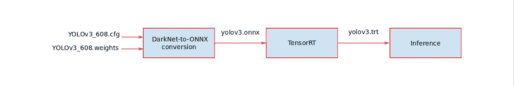

# 你在部署之前优化过你的深度学习模型吗？

> 原文：<https://towardsdatascience.com/have-you-optimized-your-deep-learning-model-before-deployment-cdc3aa7f413d?source=collection_archive---------8----------------------->


Source: [https://developer.nvidia.com/tensorrt#](https://developer.nvidia.com/tensorrt#)

## 使用 NVIDIA TensorRT 在 GPU 上优化和加快推理时间。插图基于人工智能的计算机视觉与 YOLO。

本文组织如下:

*   介绍
*   英伟达 TensorRT 是什么？
*   使用 docker 设置开发环境
*   计算机视觉应用:YOLOv3 模型的目标检测
*   参考
*   结论

# 介绍

本文介绍了如何使用 NVIDIA TensorRT 来优化您想要部署在边缘设备(移动设备、相机、机器人、汽车等)上的深度学习模型。).比如航空电子公司的智能双光谱相机:*潘沙*https://pensarsdk.com/[](https://pensarsdk.com/)


[https://pensarsdk.com/](https://pensarsdk.com/)

它拥有 NVIDIA Jetson TX2 GPU


[https://developer.nvidia.com/embedded/jetson-tx2-developer-kit](https://developer.nvidia.com/embedded/jetson-tx2)

## 为什么我需要一个优化的深度学习模型？

举个例子，想想基于人工智能的计算机视觉应用，它们需要处理摄像机捕捉的每一帧。因此，每一帧向前通过模型的层来计算某一输出(检测、分割、分类……)。

无论你的 GPU 有多强大，我们都希望输出端的每秒帧数(FPS)等于输入端的 1(例如 24，30 FPS…)。这意味着 GPU 正在实时处理每一帧。

对于需要实时决策的计算机视觉应用来说，这种概念更为理想，例如，监控、欺诈检测或活动期间的人群计数等。

## 部署前优化工作流

数据科学家的任务之一是利用数据并开发/训练/测试神经网络架构。在模型验证之后，通常，架构和模型的参数被导出用于部署。有许多方法可以做到这一点，无论是在云上还是在边缘设备上。在本文中，我们重点关注边缘设备(相机、手机、机器人、汽车……)上的部署。

一般来说，部署的工作流程遵循下图所示的框图:


从导出的、预先训练好的深度学习模型 **- >** 框架解析器**->**tensort 优化 **- >** 对新数据进行推理

# 英伟达 TensorRT 是什么？


[https://docs.nvidia.com/deeplearning/sdk/tensorrt-archived/tensorrt_210/tensorrt-user-guide/](https://docs.nvidia.com/deeplearning/sdk/tensorrt-archived/tensorrt_210/tensorrt-user-guide/index.html)

> NVIDIA TensorRT 的核心是一个 C++库，它有助于在 NVIDIA 图形处理单元(GPU)上进行高性能推理。TensorRT 采用一个由网络定义和一组训练参数组成的训练网络，并生成一个高度优化的运行时引擎，为该网络执行推理。
> 
> 您可以使用 C++或 Python API 描述 TensorRT 网络，也可以使用提供的解析器之一导入现有的 Caffe、ONNX 或 TensorFlow 模型。
> 
> TensorRT 通过 C++和 Python 提供 API，帮助通过网络定义 API 表达深度学习模型，或通过解析器加载预定义的模型，允许 TensorRT 在 NVIDIA GPU 上优化和运行它们。TensorRT 应用了图形优化、层融合以及其他优化，同时还利用高度优化的内核的多样化集合找到了该模型的最快实现。TensorRT 还提供了一个运行时，您可以使用它在从开普勒一代开始的所有 NVIDIA GPU 上执行这个网络。
> 
> TensorRT 还包括在 Tegra X1 中引入的可选高速混合精度功能，并通过 Pascal、Volta 和图灵架构进行了扩展。
> 
> 在【开发者指南】([https://docs . NVIDIA . com/deep learning/SDK/TensorRT-developer-guide/index . html](https://docs.nvidia.com/deeplearning/sdk/tensorrt-developer-guide/index.html))中了解如何使用 tensorrt，以及在【TensorRT 论坛】(https://dev talk . NVIDIA . com/default/board/304/tensor rt/)中与 tensor rt 社区互动

# 使用 docker 设置开发环境

## Docker 图像

对于开发，我们使用一个 docker 映像，其中包含一个已安装的 NVIDIA TensorRT 版本。这使得开发环境在不同的操作系统(Windows、Linux、macOS)上更加可靠和可伸缩。

下面是 docker 在应用程序和 GPU 之间的定位图。


**注:**如果你从未听说过“docker”，那么我强烈建议你投资了解它，你从这里开始:[https://docs.docker.com/engine/docker-overview/](https://docs.docker.com/engine/docker-overview/)

## 安装 Docker-CE

前往 docker 的官方网站，按照步骤安装“docker-ce ”( ce 代表社区版)。

我使用的是 Ubuntu 64 bit，因此，安装链接是:[https://docs . docker . com/v 17.09/engine/installation/Linux/docker-ce/Ubuntu/](https://docs.docker.com/v17.09/engine/installation/linux/docker-ce/ubuntu/)

## 安装 CUDA

另外，你应该已经安装了最新版本的 [CUDA](https://developer.nvidia.com/cuda-downloads) 。它是由 NVIDIA 创建的并行计算平台和应用编程接口模型。它允许软件开发人员和软件工程师使用支持 CUDA 的 GPU 进行通用处理(在[https://developer.nvidia.com/cuda-zone](https://developer.nvidia.com/cuda-zone)了解更多信息)。

要检查 CUDA 是否正确安装在您的机器上，只需在终端中输入

```
nvidia-smi
```

输出应该是这样的(我有一个 NVIDIA GPU GeForce GTX 1660 Ti/PCIe/SSE 2)

```
 Thu Aug 1 10:43:37 2019 
+ — — — — — — — — — — — — — — — — — — —— — — — — — — — — — — -+
| NVIDIA-SMI 430.40 **Driver Version:** 430.40 **CUDA Version:** 10.1 |
| — — — — — — — — — — — — -+ — — — — — — — — + — — — —— — — — +
| GPU Name Persistence-M| Bus-Id Disp.A | Volatile Uncorr. ECC |
| Fan Temp Perf Pwr:Usage/Cap| Memory-Usage | GPU-Util Compute M. |
|=====================+===================+===================|
| 0 GeForce GTX 166… Off | 00000000:01:00.0 Off | N/A |
| N/A 47C P8 4W / N/A | 994MiB / 5944MiB | 8% Default |
+ — — — — —— — — — — — — -+ — — — — — — — — + — — — — — — — — +
```

## 运行 docker 映像以使用 NVIDIA TensorRT

我已经创建了一个 docker 映像，其中包括在 Ubuntu 上安装 TensorRT，以及来自 NVIDIA、Python、OpenCV 等的必要先决条件。你可以直接从我在 [docker hub](https://hub.docker.com/u/aminehy) 上的个人账户中调出图片。

 [## 码头枢纽

### 欢迎来到我的码头中心

hub.docker.com](https://hub.docker.com/r/aminehy/tensorrt-opencv-python3) 

*   首先，打开一个终端(ctrl+alt + t ),输入这个命令来提取 docker 图像

```
docker pull aminehy/tensorrt-opencv-python3
```

*   通过输入以下命令，启用从 docker 容器内部启动 GUI 应用程序

```
xhost +
```

*   最后，用以下命令运行 docker 容器:

```
docker run -it — rm -v $(pwd):/workspace — runtime=nvidia -w /workspace -v /tmp/.X11-unix:/tmp/.X11-unix -e DISPLAY=unix$DISPLAY aminehy/tensorrt-opencv-python3:v1.1
```

# 计算机视觉应用:用 YOLOv3 进行物体检测

YOLO 是来自暗网项目的一个实时物体检测。你可以在这里的官方网站上了解这个项目的更多信息:【https://pjreddie.com/darknet/yolo/ 


[https://pjreddie.com/darknet/yolo/](https://pjreddie.com/darknet/yolo/)

在本实验中，我们在 500 张图片上运行 YOLOv3 模型，并使用 NVIDIA TensorRT 比较模型优化前后的平均推理时间。本实验中使用的图像来自 COCO 数据集

[](http://cocodataset.org/#home) [## COCO -上下文中的常见对象

### 编辑描述

cocodataset.org](http://cocodataset.org/#home) 

## 1)从 Python 中的暗网中运行未优化的 YOLOv3

[](https://gitlab.com/aminehy/yolov3-darknet) [## 胺 Hy / YOLOv3-DarkNet

### GitLab.com

gitlab.com](https://gitlab.com/aminehy/yolov3-darknet) 

*   克隆存储库并通过我创建的脚本 docker _ tensort _ OpenCV _ python . sh 运行 docker 映像

```
git clone [https://gitlab.com/aminehy/yolov3-darknet.git](https://gitlab.com/aminehy/yolov3-darknet.git)cd yolov3-darknetchmod +x docker_TensorRT_OpenCV_Python.sh./docker_TensorRT_OpenCV_Python.sh run
```

*   下载并解压测试图像文件夹。/数据/

```
wget [http://images.cocodataset.org/zips/test2017.zip](http://images.cocodataset.org/zips/test2017.zip)unzip test2017.zip ../test2017/
```

*   下载重量文件` yolov3.weights '

```
wget [https://pjreddie.com/media/files/yolov3.weights](https://pjreddie.com/media/files/yolov3.weights)
```

*   然后执行 YOLOv3 python 文件

```
python darknet.py
```

*   **成绩:**

结果应该保存在文件夹`。/数据/结果'


```
Output: The mean recognition time over 500 images is 0.044 seconds
```

## 2)使用 Python 中的 NVIDIA TensorRT 优化并运行 YOLOv3



第一步是导入模型，包括从磁盘上保存的文件中加载模型，并将其从原生框架或格式转换为 TensorRT 网络。我们的示例从 ONNX 模型加载 ONNX 格式的模型。

> ONNX 是一种表示深度学习模型的标准，使它们能够在框架之间转移。(许多框架如 Caffe2、Chainer、CNTK、PaddlePaddle、PyTorch 和 MXNet 都支持 ONNX 格式)。

接下来，基于输入模型、目标 GPU 平台和指定的其他配置参数构建优化的 TensorRT 引擎。最后一步是向 TensorRT 引擎提供输入数据以执行推理。

该示例使用 TensorRT 中的以下组件来执行上述步骤:
- ONNX 解析器:将 ONNX 格式的训练模型作为输入，并在 TensorRT 中填充网络对象
-构建器:在 TensorRT 中获取网络，并生成针对目标平台优化的引擎
-引擎:获取输入数据，执行推理并发出推理输出
-记录器:与构建器和引擎相关联的对象，用于在构建和推理阶段捕获错误、警告和其他信息

[](https://gitlab.com/aminehy/YOLOv3-Darknet-ONNX-TensorRT) [## 胺 Hy/yolov 3-Darknet-ONNX-TensorRT

### GitLab.com

gitlab.com](https://gitlab.com/aminehy/YOLOv3-Darknet-ONNX-TensorRT) 

*   从 GitHub 获取项目并更改工作目录

```
git clone [https://gitlab.com/aminehy/YOLOv3-Darknet-ONNX-TensorRT.git](https://gitlab.com/aminehy/YOLOv3-Darknet-ONNX-TensorRT.git)cd YOLOv3-Darknet-ONNX-TensorRT/
```

*   将模型从 Darknet 转换为 ONNX。这一步将创建一个名为` yolov3.onnx `的引擎

```
python yolov3_to_onnx.py
```

*   将模型从 ONNX 转换为 TensorRT。这一步将创建一个名为 yolov3.trt 的引擎，并用于推理

```
python onnx_to_tensorrt.py
```

*   对于这个实验，我们设置这个参数:builder.fp16_mode = True

```
builder.fp16_mode = True
builder.strict_type_constraints = True
```

*   **成绩:**


```
 Output: The mean recognition time over 500 images is 0.018 seconds using the precision fp16\. 
```

因此，使用 NVIDIA TensorRT 比未优化版本快 2.31 倍！。

## 3)通过在 C++中导入 Caffe 模型，使用 NVIDIA TensorRT 优化并运行 YOLOv3


*   获取项目并更改工作目录

[](https://gitlab.com/aminehy/YOLOv3-Caffe-TensorRT) [## 胺 Hy / YOLOv3-Caffe-TensorRT

### Yolov3 的 TensorRT

gitlab.com](https://gitlab.com/aminehy/YOLOv3-Caffe-TensorRT) 

如果文件夹`/Caffe '不存在(出于任何原因)，请下载 YOLOv3 的模型架构和权重(。prototxt 和。caffemodel)并将其插入到文件夹“Caffe”中。有两种选择，416 型和 608 型。这些参数表示 YOLOv3 网络输入端图像的高度/宽度。

*   从 Google Drive 文件夹下载文件:[https://Drive . Google . com/Drive/folders/18 oxncrrdrcumoamgngjlhegglq 1 hqk _ NJ](http://cd TensorRT-Yolov3/ ./docker_TensorRT_OpenCV_Python.sh run)
*   编译并构建模型

```
git submodule update — init — recursivemkdir buildcd build && cmake .. && make && make install && cd ..
```

*   编辑 YOLO 配置文件，并在以下设置中选择 YOLO 416 或 YOLO 608

```
~/TensorRT-Yolov3/tensorRTWrapper/code/include/YoloConfigs.h
```

*   您还需要查看位于

```
~/TensorRT-Yolov3/include/configs.h
```

*   如上所述创建 TensorRT 引擎，并在测试映像“dog.jpg”上运行 YOLOv3

```
# for yolov3–416 (don’t forget to edit YoloConfigs.h for YoloKernel)
./install/runYolov3 — caffemodel=./caffe/yolov3_416.caffemodel — prototxt=./caffe/yolov3_416.prototxt — input=./dog.jpg — W=416 — H=416 — class=80 — mode=fp16
```

*   一旦创建了引擎，就可以将它作为参数传递

```
./install/runYolov3 — caffemodel=./caffe/yolov3_416.caffemodel
 — prototxt=./caffe/yolov3_416.prototxt — input=./dog.jpg — W=416 — H=416 — class=80 — enginefile=./engine/yolov3_fp32.engine
```

*   **结果**:

```
Output: Time over all layers: 21.245 ms
```

S 。

# 结论

本文介绍了优化预训练深度学习模型的重要性。我们在一个计算机视觉的目标检测应用的例子中说明了这一点，在这个例子中，我们获得了推理时间大于 2 的加速比。

**下一步怎么办？**

*   请在评论区告诉我你的想法，或者在 LinkedIn 上直接给我发消息。
*   阅读我在 medium 上的另一篇文章:[使用 PyTorch 实现的图像分类深度学习](/convolutional-neural-network-for-image-classification-with-implementation-on-python-using-pytorch-7b88342c9ca9)

# 参考

*   边缘摄像机 Pensar【https://pensarsdk.com/ 
*   CUDA:【https://developer.nvidia.com/cuda-zone 
*   https://docs.docker.com/
*   英伟达 TensorRT:[https://ngc.nvidia.com/catalog/containers/nvidia:tensorrt](https://ngc.nvidia.com/catalog/containers/nvidia:tensorrt)
*   NVIDIA 容器最佳实践:[https://docs . NVIDIA . com/deep learning/frameworks/BP-docker/index . html # docker-BP-topic](https://docs.nvidia.com/deeplearning/frameworks/bp-docker/index.html#docker-bp-topic)
*   tensor rt 19.05 版本:[https://docs . NVIDIA . com/deep learning/SDK/tensor rt-container-Release-notes/rel _ 19-05 . html # rel _ 19-05](https://docs.nvidia.com/deeplearning/sdk/tensorrt-container-release-notes/rel_19-05.html#rel_19-05)