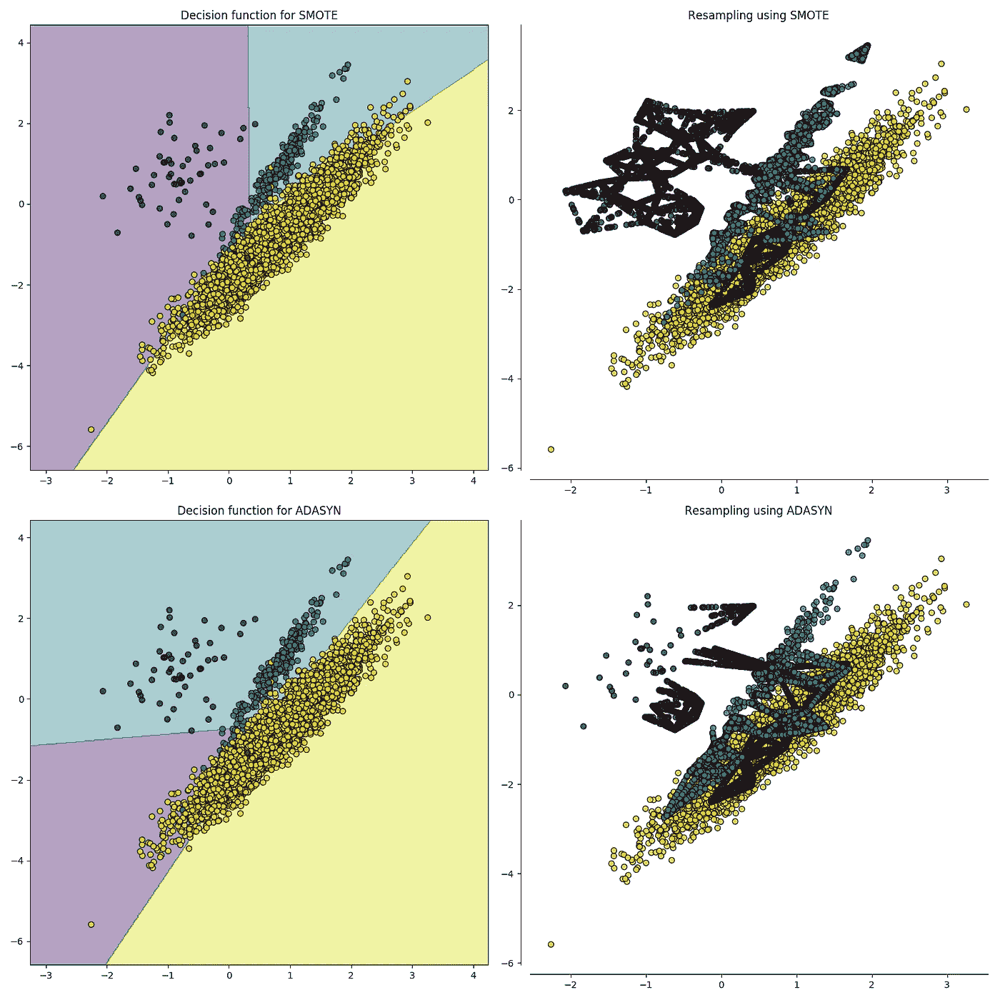

# 拥有不平衡的数据集？以下是你可以修复它的方法。

> 原文：<https://towardsdatascience.com/having-an-imbalanced-dataset-here-is-how-you-can-solve-it-1640568947eb?source=collection_archive---------1----------------------->

## 处理不平衡数据集的不同方法。


分类是最常见的机器学习问题之一。处理任何分类问题的最佳方式是从分析和探索数据集开始，我们称之为**E**exploration**D**ATA**A**analysis**(EDA)**。这个练习的唯一目的是生成尽可能多的关于数据的见解和信息。它还用于查找数据集中可能存在的任何问题。在用于分类的数据集中发现的一个常见问题是**不平衡类**问题。

**什么是数据失衡？**

数据不平衡通常反映了数据集中类的不平等分布。例如，在信用卡欺诈检测数据集中，大多数信用卡交易不是欺诈，只有极少数类别是欺诈交易。这样，欺诈类和非欺诈类的比例大约为 50:1。在本文中，我将使用 Kaggle 的信用卡欺诈交易数据集，可以从这里的[下载。](https://www.kaggle.com/mlg-ulb/creditcardfraud)

首先，让我们画出阶级分布图来看看不平衡。


如您所见，非欺诈交易远远超过欺诈交易。如果我们在没有修复这个问题的情况下训练一个二进制分类模型，那么这个模型将会完全有偏差。它还会影响特性之间的相关性，稍后我将向您展示如何影响以及为什么影响。

现在，让我们介绍一些解决班级不平衡问题的技巧。有完整代码的笔记本可以在[这里](https://github.com/wmlba/Fraud_Detection_Techniques/)找到

# 1-重采样(过采样和欠采样):


这听起来很直观。**欠采样**是指从多数类中随机删除一些观察值，以便将数字与少数类相匹配的过程。下面的代码显示了一种简单的方法:

Undersampling the majority class

对数据集进行欠采样后，我再次绘制它，它显示了相同数量的类:


Balanced Dataset (Undersampling)

第二种重采样技术叫做**过采样**。这个过程比欠采样稍微复杂一点。它是生成合成数据的过程，试图从少数类的观察值中随机生成属性样本。对于典型的分类问题，有多种方法可用于对数据集进行过采样。最常见的技术叫做 **SMOTE (** 合成少数过采样技术)。简而言之，它查看少数类数据点的特征空间，并考虑其最近的邻居 *k* 。



Source:[https://imbalanced-learn.readthedocs.io/en/stable/over_sampling.html](https://imbalanced-learn.readthedocs.io/en/stable/over_sampling.html)

为了用 python 编写代码，我使用了一个名为 [**不平衡学习**](https://imbalanced-learn.readthedocs.io/en/stable/index.html) **或 imblearn 的库。**下面的代码展示了如何实现 SMOTE。

SMOTE Oversampling code

还记得我说过不平衡的数据会如何影响特征相关性吗？我给你看一下治疗不平衡班前后的相关性。

# 重新采样前:

下面的代码绘制了所有特性之间的相关矩阵。

```
*# Sample figsize in inches*
fig, ax = plt.subplots(figsize=(20,10)) *# Imbalanced DataFrame Correlation*
corr = credit_df.corr()
sns.heatmap(corr, cmap='YlGnBu', annot_kws={'size':30}, ax=ax)
ax.set_title("Imbalanced Correlation Matrix", fontsize=14)plt.show()
```


# 重采样后:


请注意，现在特征相关性更加明显了。在修复不平衡问题之前，大多数功能没有显示任何相关性，而这种相关性肯定会影响模型的性能。由于 [**特征相关性对于整体模型的性能来说非常重要**](/why-feature-correlation-matters-a-lot-847e8ba439c4) ，因此修复这种不平衡非常重要，因为它也会影响 ML 模型的性能。

# 2-集合方法(采样器集合):

在机器学习中，集成方法使用多种学习算法和技术来获得比单独从任何组成学习算法获得的性能更好的性能。(没错，就像民主投票制一样)。当使用集成分类器时，bagging 方法变得流行，它通过对不同的随机选择的数据子集建立多个估计器来工作。在 scikit-learn 库中，有一个名为`BaggingClassifier`的集成分类器。然而，这种分类器不允许平衡每个数据子集。因此，当在不平衡数据集上训练时，该分类器将偏向大多数类并创建有偏差的模型。

为了解决这个问题，我们可以使用 **imblearn** 库中的`[**BalancedBaggingClassifier**](https://imbalanced-learn.readthedocs.io/en/stable/generated/imblearn.ensemble.BalancedBaggingClassifier.html#imblearn.ensemble.BalancedBaggingClassifier)`。它允许在训练集合的每个估计器之前对数据集的每个子集进行重采样。因此，`[**BalancedBaggingClassifier**](https://imbalanced-learn.readthedocs.io/en/stable/generated/imblearn.ensemble.BalancedBaggingClassifier.html#imblearn.ensemble.BalancedBaggingClassifier)`采用与 scikit-learn `BaggingClassifier`相同的参数，此外还有另外两个参数，`sampling_strategy`和`replacement`，它们控制随机采样器的行为。下面是一些显示如何做到这一点的代码:

Train Imbalanced Dataset using Ensembling Samplers

这样，您可以训练一个分类器来处理不平衡，而不必在训练前手动欠采样或过采样。

# 重要提示:

*   在平衡数据之前，应该始终将数据集分成定型集和测试集。通过这种方式，您可以确保测试数据集尽可能地不偏不倚，并反映您的模型的真实评估。
*   在分割之前平衡数据可能会在测试集中引入偏差，其中测试集中的一些数据点是合成生成的，并且从训练集中是众所周知的。测试集应该尽可能客观。
*   欠采样技术的问题是，您可能会删除一些有价值的信息，并改变特定领域中具有代表性的整体数据集分布。因此，欠采样不应该是不平衡数据集的首选方法。

总之，每个人都应该知道，建立在不平衡数据集上的最大似然模型的整体性能将受到其预测稀有点和少数点的能力的限制。识别和解决这些点的不平衡对于生成的模型的质量和性能至关重要。