# 享受 NLP 和权力的游戏对话的乐趣。

> 原文：<https://towardsdatascience.com/having-fun-with-nlp-and-game-of-thrones-dialogues-21c647b0837f?source=collection_archive---------17----------------------->

## 谁是这个系列中最重要的人物？

Photo by [mauRÍCIO SANTOS](https://unsplash.com/@souomau?utm_source=medium&utm_medium=referral) on [Unsplash](https://unsplash.com?utm_source=medium&utm_medium=referral)

# 介绍。

最后一季即将来临！冬天终于来了！所以我想用对话来平息我对下一季的宣传。

你有没有想过哪个角色最有影响力？谁说的最多？谁的对白比较多？在整个系列中，哪些词用得最多？谁是真正的主角？或者，计算机有可能为这部剧生成新的对话吗？本文将尝试回答这些问题。

在此之前，我想提一下这两个家伙，他们的工作激发了你将要看到的很多东西，所以请检查他们的帖子和代码:

帕勒斯·乔普拉和[丹尼尔·利赫特](https://lichtphyz.github.io/)。

# 数据免责声明。

该数据集由该系列的 65 个章节组成，并非所有的季节都是完整的，尤其是第 2、3 和 4 季，所有其他季节都是完整的。你可以在这里了解更多关于收集数据的技术方面[。](https://github.com/chrismartinezb/Game-of-thrones-analysis)

# 对话多就意味着话多吗？

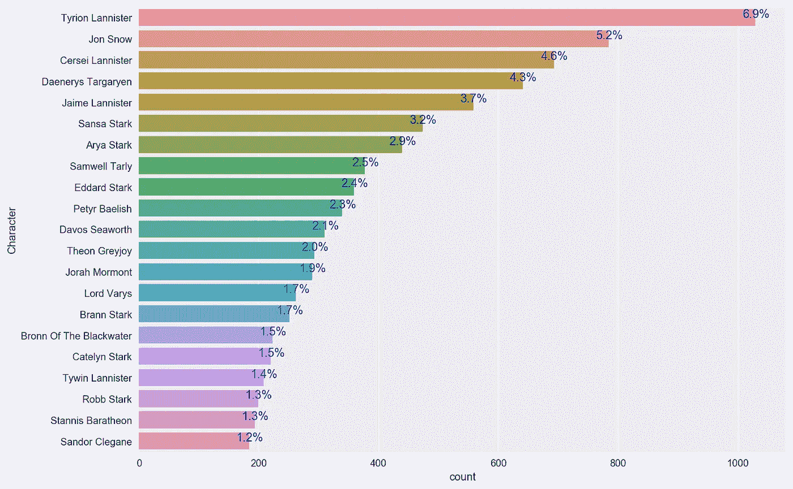

Barplot for dialogues

我用最多的对话和更高的字数绘制了前 20 个角色，我们可以清楚地看到提利昂确实从不闭嘴，有超过一千个对话，平均每个对话 16 个单词，是迄今为止最健谈的角色。

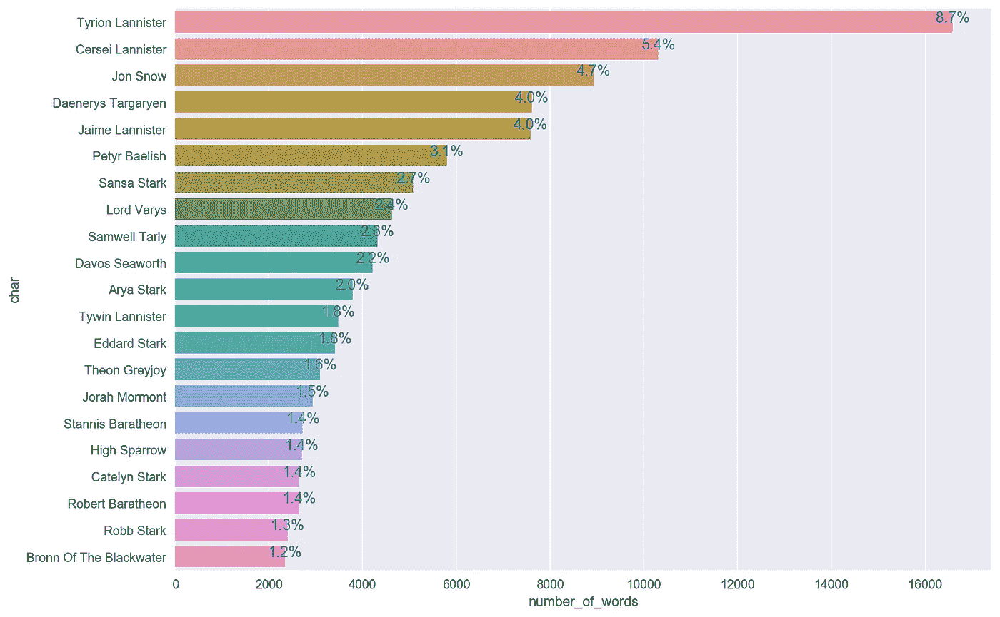

Barplot for words

事实上，对话和文字是相关的，前 20 个角色从一个情节到另一个情节几乎没有变化，一个有趣的变化是兰尼斯特家，他们在每个对话中说更多的话。

# 让我们检查一下每段对话单词分布情况。

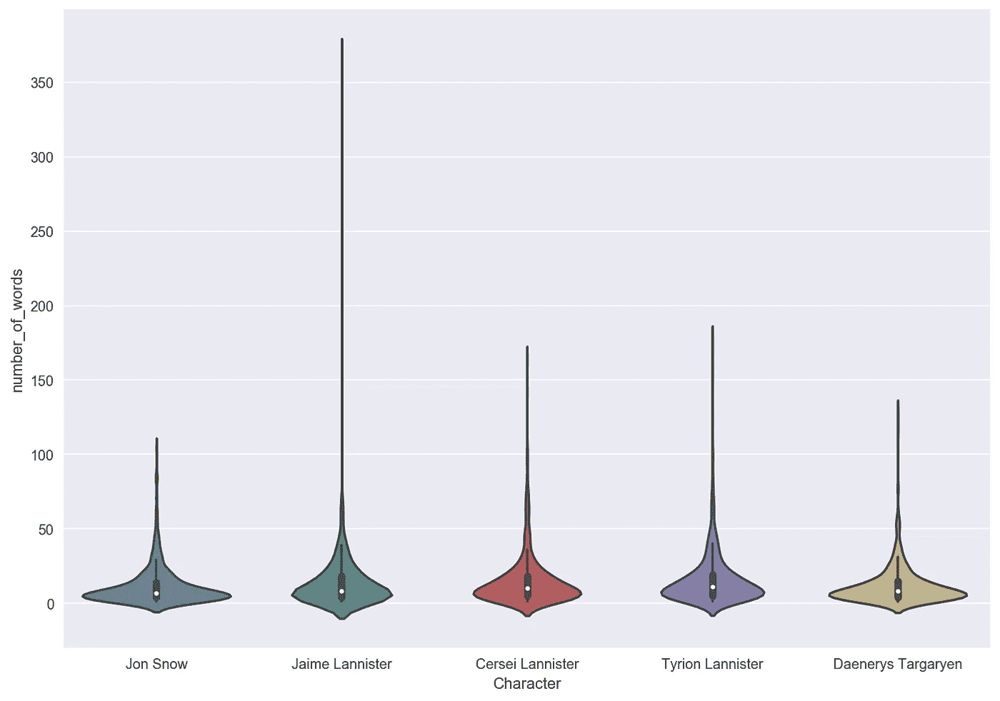

Distribution of words per dialogue of top 5 characters.

琼恩·雪诺是一个沉默寡言的人，他的情节几乎平淡无奇，与丹妮莉丝非常相似，兰尼斯特家的情节更加稳健，每次开口都意味着更多的话。

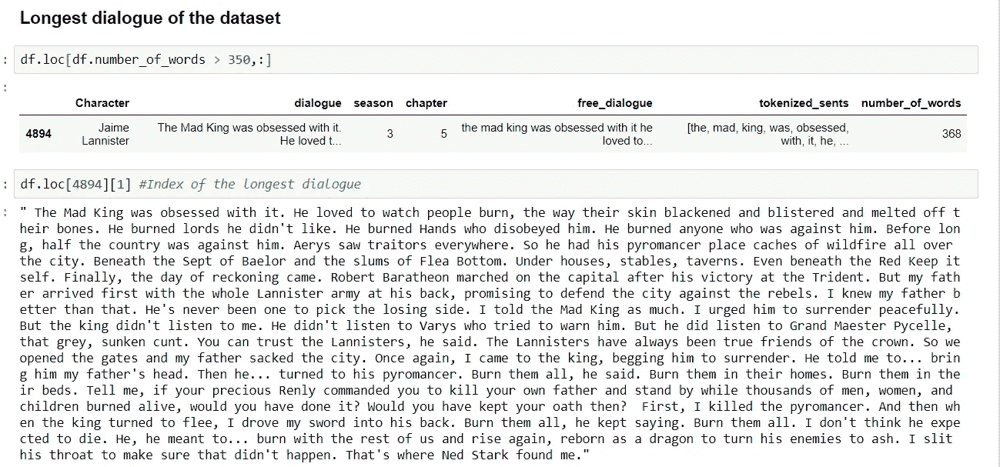

Longest dialogue of the sample.

詹姆的图中有一个很大的异常值，比其他 4 个大得多，当我检查时，我意识到这是其中最大的一个。我们的样本数据中最长的不间断对话是詹姆·兰尼斯特用超过 350 个单词告诉布里安他是如何在第三季杀死疯王的。

# 我们的角色实际上在说什么，有模式吗？

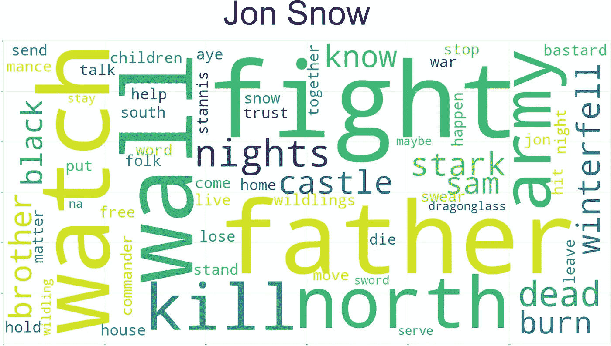

我按照前 5 个字符绘制了 60 个最常用的单词，我使用 NLTK 删除了英语中一些非常常用的单词和一些不会给情节带来任何价值的其他单词，如“国王”、“勋爵”、“先生”等。

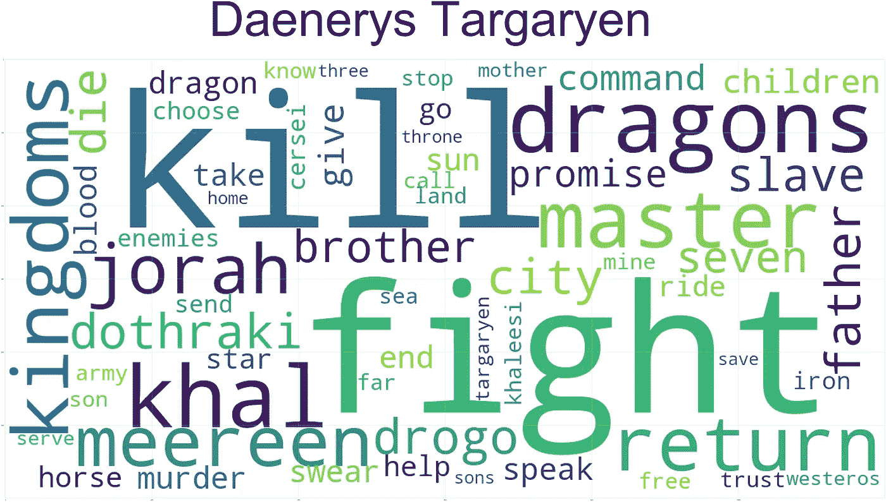

只有兰尼斯特家的人在他们的话语中有爱，我认为这真正定义了他们的角色，他们的动机大多是激情。虽然像琼恩和奈德这样的史塔克家族是因为职责和拯救世界而战，或者丹妮是因为命运而战，从她的用词来看很明显，她是一个无情的统治者；兰尼斯特家为他们所爱的人而战。我也可以说《权力的游戏》是关于一群极度恋父的杀人犯。

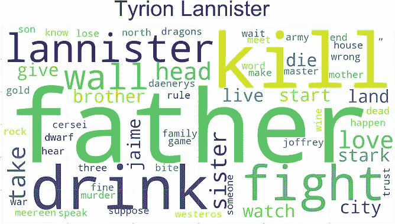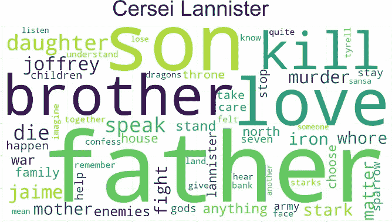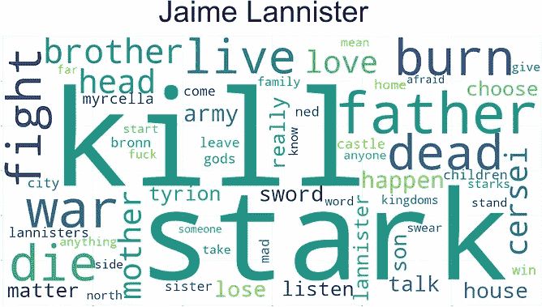

# 这一个是令人震惊的。

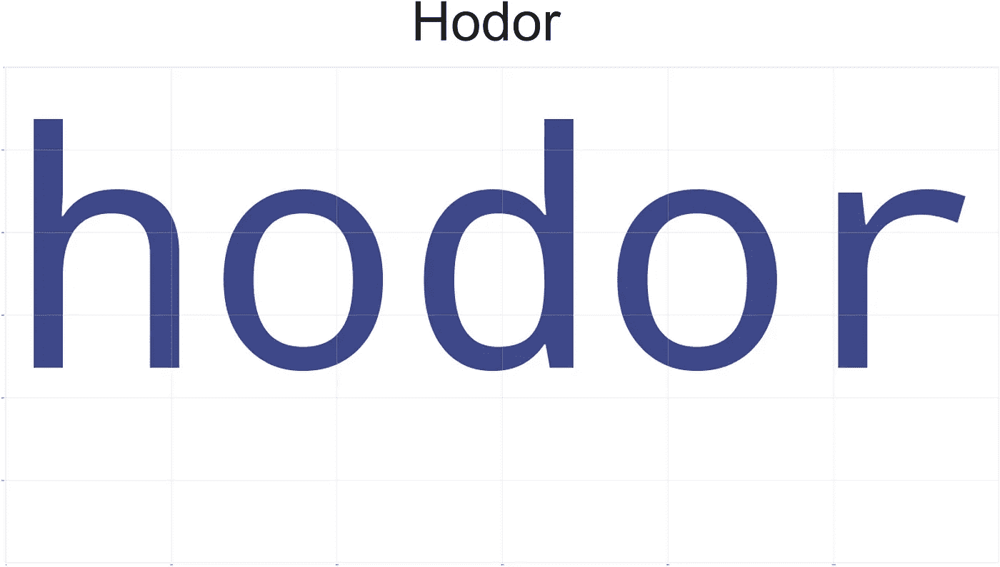

# 主角是谁？

说得最多并不总是意味着成为最有影响力的人物，这取决于你与之交谈的人有多重要，以及你在自己的对话之外被提及的次数。你和你周围的世界有多相关，所以这是我们样本数据的交互网络。

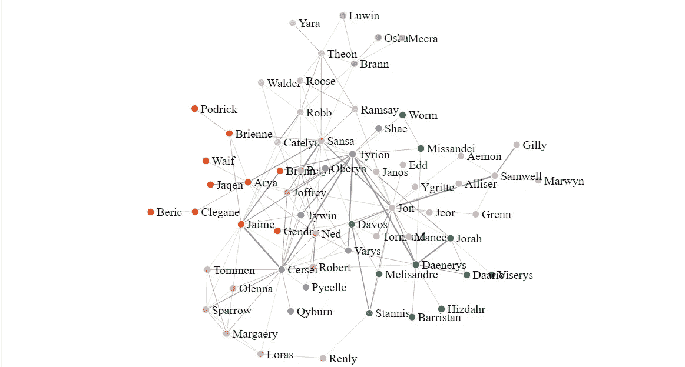

[https://bl.ocks.org/chrismartinezb/e35f6c6b7a4def1dc56eea92d8897d40/ee9d335a443b042fc20c2f2eb0d55e9997d2f2b9](https://bl.ocks.org/chrismartinezb/e35f6c6b7a4def1dc56eea92d8897d40/ee9d335a443b042fc20c2f2eb0d55e9997d2f2b9)

检查图中的[链接](https://bl.ocks.org/chrismartinezb/e35f6c6b7a4def1dc56eea92d8897d40/ee9d335a443b042fc20c2f2eb0d55e9997d2f2b9)以获得更好的视图，并有机会玩节点。

无论如何，这个图表从数字上没有告诉我们一个字符的重要性。

这的确告诉我们瑟曦、提利昂和琼恩有多重要，但任何一个都可能是主角，对吧？

## 中心性的程度。

如果我们测量每个节点的中心度，我们将得到一个非常明确的答案，即我们的角色对该系列有多重要，所以让我们根据样本数据来看看前 10 个最重要的角色:

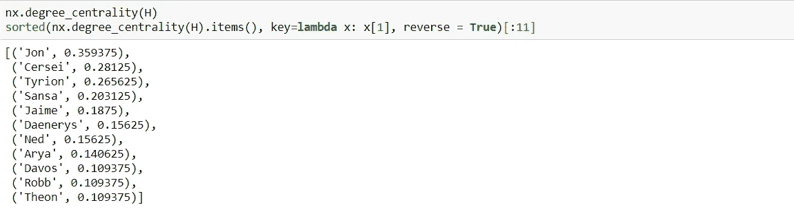

根据我们的样本，乔恩的确是《冰与火之歌》中最重要的角色。

# 使用示例对话生成文本。

> 在预先训练好的模型出现之前，你需要一个巨大的文本语料库来做任何有意义的事情。现在，即使是很小的数据集也足以做有趣的事情。**请在评论中告诉我，你想到了哪些可以使用小型文本语料库**和预训练模型的项目想法。

我参加了 [Paras Chopra](/generating-new-ideas-for-machine-learning-projects-through-machine-learning-ce3fee50ec2) 挑战，并自己生成了一些对话，结果非常有趣。

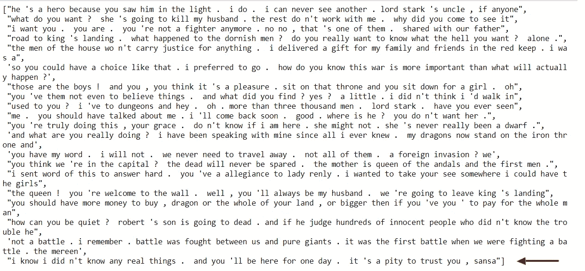

It is indeed a pity to trust Sansa.

# 结论。

*   主角是琼恩·雪诺，因为他与奈德、珊莎、提利昂和丹妮等其他重要角色有联系。
*   在人物中心情节中，提利昂在瑟曦之下，我认为这是因为两个主要原因:第二季和第三季在数据集中有很多缺失的章节，而这几季是提利昂最出彩的地方；第二，因为瑟曦与奈德和劳勃(非常中心的人物)有很强的关系，但提利昂从不谈论他们中的任何一个。
*   更多的对话在某种程度上与性格影响有关，但只是在一定程度上。其他角色必须谈论你，即使你没有和他们说话。
*   奈德·史塔克在第一季中死后仍然是最重要的角色之一。
*   与其说提利昂是丹妮莉丝的盟友，不如说他是兰尼斯特，这可能是他在最后一季背叛丹妮莉丝的原因，就像很多人推测的那样。他和兰尼斯特家的人是一伙的，在查看《乌云图》时，他和他们有很多相似之处，甚至比丹妮莉丝和琼恩还相似。
*   即使只有 60%的数据，我们也能得出很好的结论。
*   用这么小的数据集生成文本的效果比我预期的要好，读起来很有趣，不过还可以改进很多。

生成角色之间的对话将是一个有趣的挑战，你能想到什么方法吗？

*你认为谁才是真正的主角？为什么呢？*

*利用这些数据，你还能得出什么结论？*

用分析的每一步检查这个库[这里](https://github.com/chrismartinezb/Game-of-thrones-analysis)。