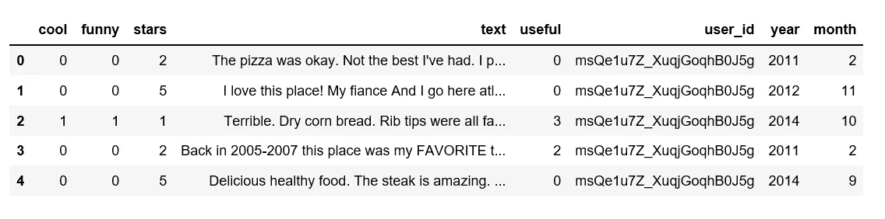
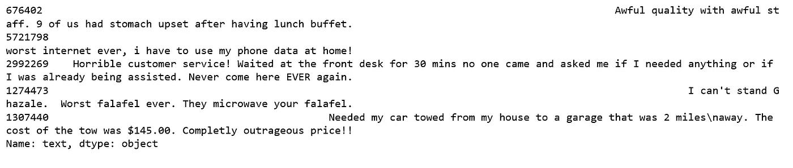

# 介绍 TextBlob

> 原文：<https://towardsdatascience.com/having-fun-with-textblob-7e9eed783d3f?source=collection_archive---------6----------------------->


## 用于处理文本数据的 Python 库，NLP 框架，情感分析

作为 Python 的 NLP 库， [TextBlob](https://textblob.readthedocs.io/en/dev/) 已经有一段时间了，在听说了很多关于它的好东西如[词性标注](https://en.wikipedia.org/wiki/Part-of-speech_tagging)和[情感分析](https://en.wikipedia.org/wiki/Sentiment_analysis)之后，我决定试一试，因此，这是我第一次使用 [TextBlob](https://textblob.readthedocs.io/en/dev/) 执行[自然语言处理](https://en.wikipedia.org/wiki/Natural_language_processing)任务。

[Yelp 数据集](https://www.yelp.ca/dataset)是其业务、评论和用户数据的子集，用于个人、教育和学术目的。作为 JSON 文件，我们将只使用`yelp_academic_dataset_review.json`和`yelp_academic_dataset_user.json`，并且可以从[这里](https://www.kaggle.com/yelp-dataset/yelp-dataset)下载。

# 数据

数据集是 JSON 格式的，为了能够在 pandas 数据框架中读取，我们首先加载 JSON 数据，然后将半结构化的 JSON 数据规范化为一个平面表，然后使用`to_parquet`将该表写入二进制拼花格式。稍后当我们需要它时，我们从文件路径加载一个 parquet 对象，返回一个 pandas 数据帧。

下面的过程为我们提供了两个数据表，user 和 review。

JSON_parquet.py


user table



review table

我们合并用户表和评论表，用后缀来处理相同的列名，去掉零星号。

```
user_review = (review.merge(user, on='user_id', how='left', suffixes=['', '_user']).drop('user_id', axis=1))user_review = user_review[user_review.stars > 0]
```

# 星级分布

```
x=user_review['stars'].value_counts()
x=x.sort_index()
plt.figure(figsize=(10,6))
ax= sns.barplot(x.index, x.values, alpha=0.8)
plt.title("Star Rating Distribution")
plt.ylabel('count')
plt.xlabel('Star Ratings')
rects = ax.patches
labels = x.values
for rect, label in zip(rects, labels):
    height = rect.get_height()
    ax.text(rect.get_x() + rect.get_width()/2, height + 5, label, ha='center', va='bottom')
plt.show();
```


Figure 1

很高兴知道大多数评论星级相当高，并没有很多可怕的评论。显而易见，企业有一种动机去争取尽可能多的好评。

# 每年的评论与每年的星级

```
fig, axes = plt.subplots(ncols=2, figsize=(14, 4))
user_review.year.value_counts().sort_index().plot.bar(title='Reviews per Year', ax=axes[0]);
sns.lineplot(x='year', y='stars', data=user_review, ax=axes[1])
axes[1].set_title('Stars per year');
```


Figure 2

```
user_review.member_yrs.value_counts()
```


Figure 3

Yelp 成立于 2004 年，根据我们的数据，从那时起已经有超过 4000 人成为 Yelp 会员。

让我们来看一个示例评论:

```
review_sample = user_review.text.sample(1).iloc[0]
print(review_sample)
```


让我们检查一下这个样本评论的极性。极性范围从-1(最负)到 1(最正)。

```
TextBlob(review_sample).sentiment
```


上述评论的极性约为-0.06，意味着它略有负面，主观性约为 0.56，意味着它相当主观。

为了更快地进行，我们将从当前数据中抽取 100 万条评论，并添加一个新的极性列。

```
sample_reviews = user_review[['stars', 'text']].sample(1000000)def detect_polarity(text):
    return TextBlob(text).sentiment.polaritysample_reviews['polarity'] = sample_reviews.text.apply(detect_polarity)
sample_reviews.head()
```


Figure 4

前几行看起来不错，星星和极性彼此一致，意味着星星越高，极性越高，就像它应该的那样。

# 极性分布

```
num_bins = 50
plt.figure(figsize=(10,6))
n, bins, patches = plt.hist(sample_reviews.polarity, num_bins, facecolor='blue', alpha=0.5)
plt.xlabel('Polarity')
plt.ylabel('Count')
plt.title('Histogram of polarity')
plt.show();
```


Figure 5

大多数极性得分都在零以上，这意味着数据中的大多数评论都是积极情绪，这符合我们之前发现的星级分布。

# 按星星分组的极性

```
plt.figure(figsize=(10,6))
sns.boxenplot(x='stars', y='polarity', data=sample_reviews)
plt.show();
```


Figure 6

总的来说，这和我们预期的一样好。让我们进行更深入的调查，看看我们是否能找到任何有趣的或异常的东西。

**极性最低的评论**:

```
sample_reviews[sample_reviews.polarity == -1].text.head()
```



**星级最低的评论:**

```
sample_reviews[sample_reviews.stars == 1].text.head()
```


它们看起来都像我们预期的负面评论。

**极性最低(负面情绪最多)但有 5 颗星的评论:**

```
sample_reviews[(sample_reviews.stars == 5) & (sample_reviews.polarity == -1)].head(10)
```


Figure 7

**具有最高极性(最积极情绪)但只有一星的评论:**

```
sample_reviews[(sample_reviews.stars == 1) & (sample_reviews.polarity == 1)].head(10)
```


Figure 8

两张桌子看起来都很奇怪。显然，一些极性与其相关评级不一致。这是为什么呢？

经过进一步挖掘，发现 TextBlob 会继续寻找可以赋予极性和主观性的单词和短语，并对较长的文本进行平均，例如我们的 Yelp 评论。

想了解 TextBlob 是如何计算极性和主观性的，[Aaron Schumacher](https://planspace.org/20150607-textblob_sentiment/)的这篇文章给出了简单而清晰的解释。

我喜欢学习和玩 TextBlob。我意识到 TextBlob 可以用来完成许多其他的 NLP 任务，比如词性标注、名词短语提取、分类、翻译等等，以后我们还会用到它们。

[Jupyter 笔记本](https://github.com/susanli2016/NLP-with-Python/blob/master/TextBlob%20Yelp%20Reviews.ipynb)可以在 [Github](https://github.com/susanli2016/NLP-with-Python/blob/master/TextBlob%20Yelp%20Reviews.ipynb) 上找到。享受这周剩下的时光吧！

参考资料:

[文本 Blob 文档](https://textblob.readthedocs.io/en/dev/)

书:算法交易的实践机器学习