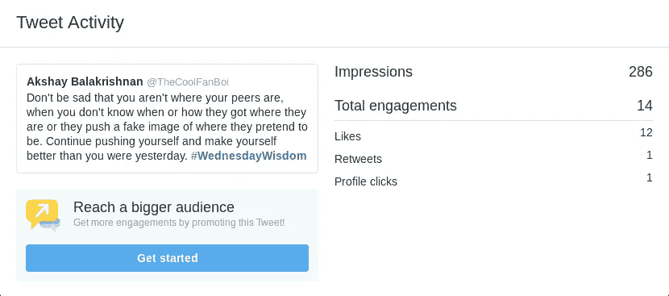
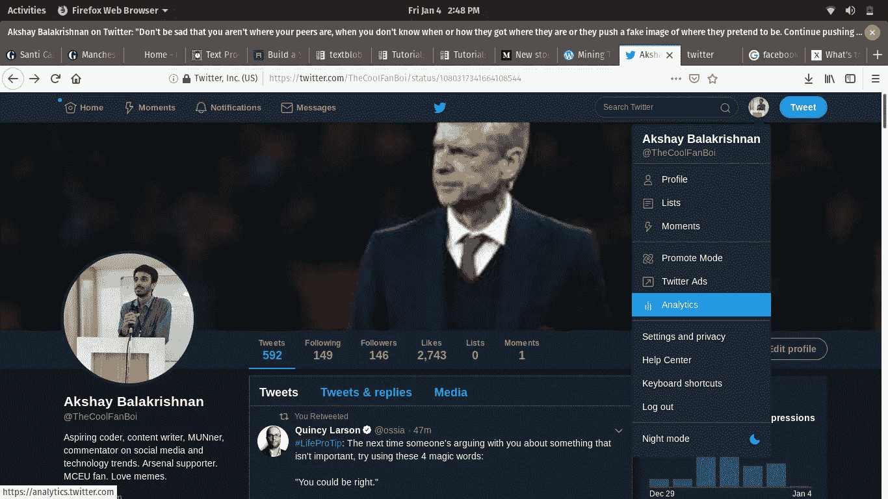
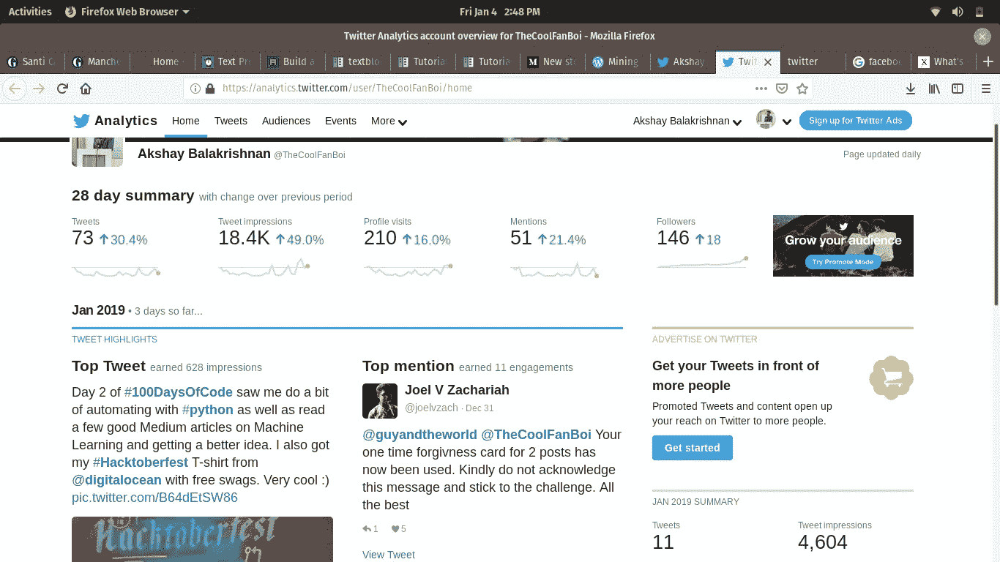
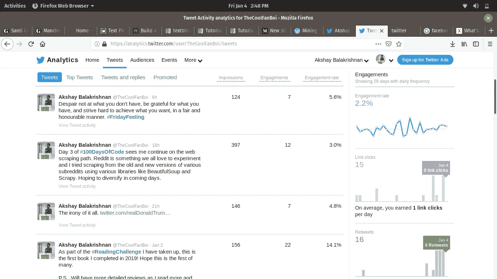
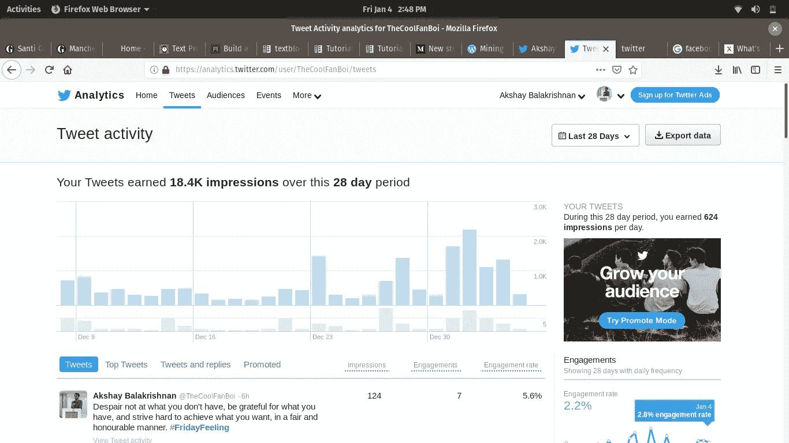
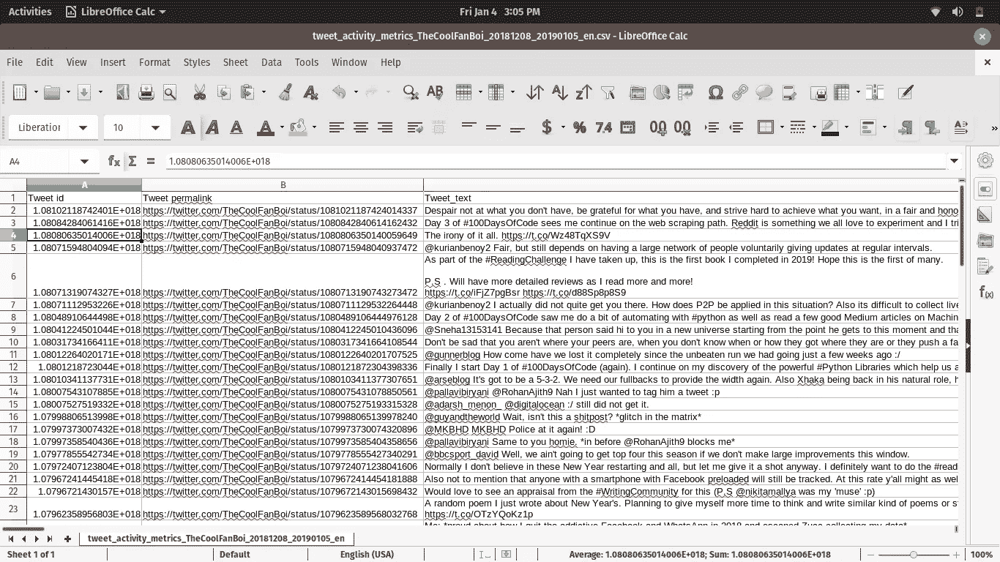
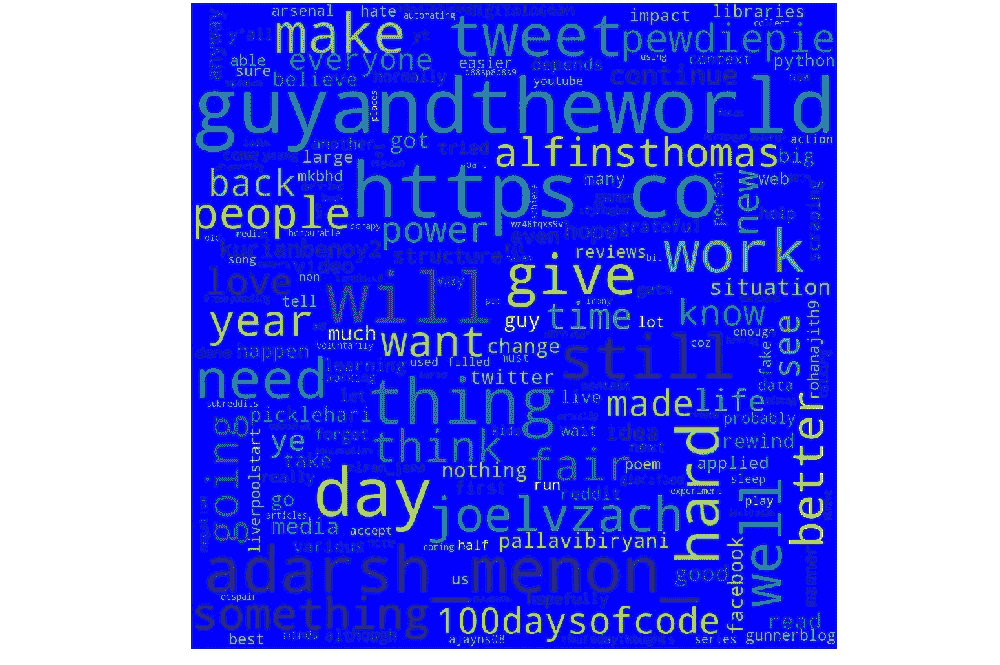
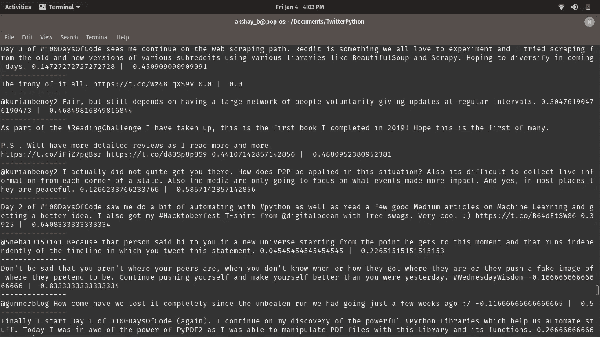

# 使用 Python 在你的 Twitter 上玩得开心！

> 原文：<https://towardsdatascience.com/having-fun-with-your-twitter-using-python-f9e0a7684867?source=collection_archive---------8----------------------->

我用这个标题吸引了你的注意力吗？

不管怎样，我希望如此。

今天，我将在这里展示一些东西。第一，从你的 Twitter 个人资料中获取大量信息的惊人能力，以及你如何利用它来改善或提升你的在线形象。其次，展示一些强大的 Python 库，它们可以用来完成很多事情。

所以[让我们开始吧](https://youtu.be/Mi1aFQxYmYA?t=2)！

**为什么是推特？**

最近我一直在疯狂发微博，因为现在是我的假期，我没有更好的事情可做。所以我注意到 Twitter，除了让我知道每条推文有多少赞和转发，还告诉我一些叫做[的印象和约定](https://www.axiapr.com/blog/whats-the-difference-between-impressions-and-engagements)。



> 参与度:在所选日期范围内，用户与您发送的推文互动的总次数。互动包括转发、回复、关注、喜欢和点击链接、卡片、标签、嵌入式媒体、用户名、个人资料照片或推文扩展。
> 
> 浏览量:在所选日期范围内发送的推文的浏览量。印象是一条推文在用户的时间线或搜索结果中出现的次数。

不像脸书(公平地说，它确实为脸书网页提供了很好的分析和信息)、Instagram 和其他社交媒体，我更容易从自己的个人资料中获得大量数据。这还没有考虑到强大的 Twitter API，你可以利用它来洞察其他人的推文！

你可能会问，你所说的这些数据在哪里？

**强大的 Twitter 分析——我是如何获得数据的！**

正如那些试图将推文用于情感分析等目的的人所知，推文是一种非常有用的数据来源，可以用来进行操作和提取信息。正如我之前提到的，最明显的是[情绪分析](https://www.google.com/url?sa=t&rct=j&q=&esrc=s&source=web&cd=11&cad=rja&uact=8&ved=2ahUKEwit1orW4NPfAhWJvY8KHevkDOQQFjAKegQIBhAB&url=https%3A%2F%2Fmedium.freecodecamp.org%2Flearn-python-by-analyzing-donald-trumps-tweets-ccdf156cb5a3&usg=AOvVaw0BlzOR8QxaDALVkShh1gZk)——试图确定一条推文在本质上是积极的，还是消极的，或者只是中性的。从该网站的巨大流量、每天积极发推文的人数，以及他们将推文放在公共领域并可以被拉取(你实际上可以将你的个人资料保密，但很少有人这样做)这一事实可以清楚地看出，人们可以使用这些推文来了解许多事情。通过利用 Twitter 的 API，你可以进行查询，比如在一段时间内提取某个主题的每条推文，或者提取某个用户的非转发推文。

在这个**数据提取**阶段，有很多方法可以获取推文。你可以利用 [NLTK 库](http://www.nltk.org/howto/twitter.html)中的推文。您也可以使用 Twitter API 来提取推文，但是我想让这个阶段不那么麻烦。所以我决定只分析我自己的推文，我可以很快提取出来，因为 Twitter 对我们很好。

所以首先让我们看看 Twitter 在哪里为你很好地存储了这些信息！

首先进入菜单下的*分析*部分，如下所示:



它会把你重定向到一个特殊的页面，这个页面已经显示了很多信息。在最上方，它提供了您在过去 28 天内所做的事情，以及与当前时间段之前的 28 天相比，您的活动情况如何:



正如你所看到的，他们还提供了每个月的信息，你的热门推文，热门提及以及该月的信息摘要。

您还可以查看您的推文进展如何，以及您的推文进展情况的图表:



现在，我们如何从中提取信息，以便使用您常用的 Python 工具进行处理呢？谢天谢地，Twitter 有一个叫做“导出数据”的东西，它可以方便地将所有数据打包成一个漂亮的 CSV 文件，并打包到你的电脑上，你可以自由地打开盒子，做你想做的事情！点击你在那里看到的导出数据按钮，它将获取你希望分析的时间段内的所有推文，并以 CSV 文件的形式发送给你。



现在它将以这样的方式到达:



请注意，这里有很多参数或列是不可见的，比如赞数、转发数、参与度等等。但关键是，对于许多活动来说，获得一个好的数据集是一个挑战，但 Twitter 给了我们如此整洁有序的数据供我们使用。所以在这方面支持推特！

**让我们将 Python 引入其中吧！**

如果我说我是某种专家，那我是在撒谎:( ***剧透，我不是！*** )。但我将在这里做几件事，这表明任何人实际上都可以利用我们从我的个人资料中获得的推文做一些事情(也尝试利用你自己的个人资料，但要确保你有足够的推文来分析！).一件事是，我将使用一个名为 [*textblob*](https://textblob.readthedocs.io/en/dev/index.html) *的 Python 库来查看我发出的推文类型，无论它们是正面的、负面的还是中性的。*我要做的另一件事是查看哪些词是我经常使用的，并且在我的推文中很突出。为了增加乐趣，我可以用一种叫做*“单词云”的东西以一种很酷的方式直观地呈现结果。你最终会明白为什么我对此感到兴奋。所以让我们开始吧！*

**先决条件:**

我已经使用 Spyder (Anaconda)在这里编写了我的脚本，但是您总是可以使用 Python shell 本身或者编写代码并运行文件(我在这里的所有示例中都使用 Python3，因为为什么不这样做)。

您还需要一些库来开始(不要介意定义，它们主要是基于文档的指针:

> a.textblob: *TextBlob* 是一个用于处理文本数据的 Python (2 和 3)库。它提供了一个简单的 API，用于处理常见的自然语言处理(NLP)任务，如词性标注、名词短语提取、情感分析、分类、翻译等。
> 
> b.matplotlib:Matplotlib 是一个 Python 2D 绘图库，它以各种硬拷贝格式和跨平台的交互环境生成出版物质量数字。Matplotlib 可用于 Python 脚本、Python 和 IPython 外壳、Jupyter 笔记本、web 应用服务器和四个图形用户界面工具包。
> 
> c.pandas: *pandas* 是一个开源的、BSD 许可的库，为 [Python](https://www.python.org/) 编程语言提供高性能、易于使用的数据结构和数据分析工具。
> 
> d.wordcloud:顾名思义，你可以创建一个名字云，越常用的单词越突出显示。

对于 Ubuntu 用户，你可以使用 pip 或 pip3 来安装所有这些 Python 包，这就是我所做的:(用相关包替换包名)

```
pip install package-name
```

**情绪分析时间！**

建立自己的程序来做这件事不再那么困难了！随着 tweets 被整齐地排列，我所要做的就是改变 Tweets 部分下的列，在两个单词(Tweet_text)之间添加下划线，以避免程序中的空格出现错误。

导入所需的库:

```
import pandas as pd 
from wordcloud import WordCloud, STOPWORDS
import matplotlib.pyplot as plt
```

现在，导入您需要的文件，该文件应该与您正在写入的 Python 文件在同一个文件夹中，使用 pandas 提供的 read_csv 函数将它读入一个名为 df 的变量。您可以使用不同的编码方案。

```
df=pd.read_csv(r"tweet_activity_metrics_TheCoolFanBoi_20181208_20190105_en.csv",encoding="latin-1")comment_words = ' ' #We will be appending the words to this varstopwords = set(STOPWORDS) #Finds all stop words in the set of tweets.for val in df.Tweet_text: val = str(val) #convert all tweet content into strings tokens = val.split() #Split all strings into individual components for i in range(len(tokens)): tokens[i] = tokens[i].lower() #Converts all the individual strings to lower case.for words in tokens: comment_words = comment_words + words + ' '
```

最后，这是 WordCloud 发挥作用的地方:

```
wordcloud=WordCloud(width=1000,height=1000, background_color='blue', stopwords=stopwords,min_font_size=10).generate(comment_words)
#All of this is a single line
```

请随意探索 WordCloud 功能的所有参数，并根据您的意愿进行调整。

最后，让我们使用 matplotlib 库将其显示为输出:

```
plt.figure(figsize=(10,10),facecolor=None)
plt.imshow(wordcloud)
plt.axis("off")
plt.tight_layout(pad=0)plt.show()
```

这是我保存这个文件并在 Python 上运行它时得到的结果:



诚然，不是最好的背景色，但你可以看到很多用不同字体突出显示的文字。请随意从我在推文中使用的词语来分析我的个性。虽然我只会说‘joelvzach’，‘pickle Hari’，‘pallavibiriyani’和‘guyandheworld’这些词都是 Twitter 的句柄:)

**玩弄情绪分析**

我不会在这里花太多时间，因为我和你们一样是新手。但是开始并不困难，这也是由于程序员在开发高效库方面所做的大量工作，这使得开始使用它变得更加容易。

你需要做的就是这个:

```
import pandas as pd 
from textblob import TextBlob
df=pd.read_csv(r"tweet_activity_metrics_TheCoolFanBoi_20181208_20190105_en.csv",encoding="latin-1")#comment_words=' '
#stopwords=set(STOPWORDS)
print('Tweet   |     Polarity     |     Subjectivity')
for val in df.Tweet_text:
    sentiments=TextBlob(val)
    print('---------------')
    print(val,end='')
    print(' ',end='')
    print(sentiments.polarity,end='')
    print(' |  ',end='')
    print(sentiments.subjectivity)
```

你会得到这样的输出:



这些是我的推文，以及我的推文在情绪方面的评分，从-1(最负面)到 1(最正面)。这也显示了我的陈述在 0 到 1 的范围内是多么的主观。

你一定在想，坐在这里，自然语言处理？Pfft。我可以做到。

**但是这里有一个问题:**我们只是在一个非常高层次和抽象的方式上玩它。我们考虑过如何计算一条推文的情感或主观性吗？我们用了什么算法来遍历文本？诸如此类。

这是 textblob 库的奇迹。如果你想更深入地了解这一点，我不会把它添加到文章中，但是请查看[这篇文章](https://textblob.readthedocs.io/en/dev/_modules/textblob/en/sentiments.html)作为 textblob 文档的一部分，它告诉我们这个函数是如何工作的，以及它如何利用朴素贝叶斯算法进行情感分析。

这结束了我的短文，让我先睹为快，看看我最近都做了些什么(很明显，没什么好事)。一定要看看我的推特(因为我已经展示了很多)，并在我继续发推特的时候抓住我，因为为什么不呢，对吗？[代码在这里。](https://github.com/AkshayB2017/TwitterPython)

还要感谢所有使用的库的文档以及 GeeksForGeeks 为我完成这篇文章提供了很好的材料。

*谢谢你读完这篇文章！*