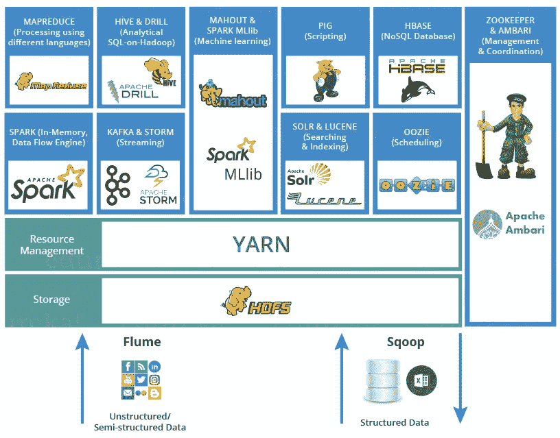
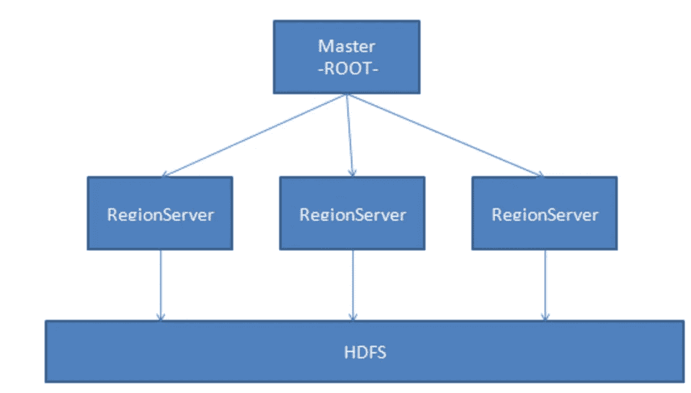
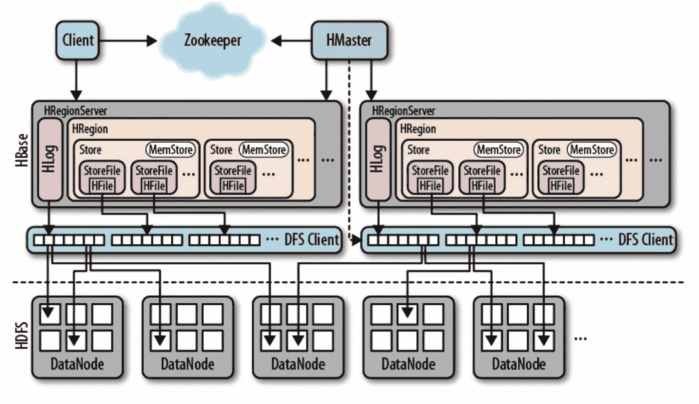
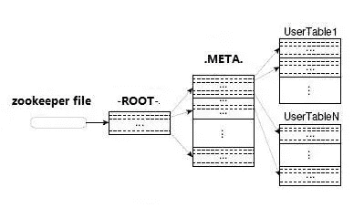
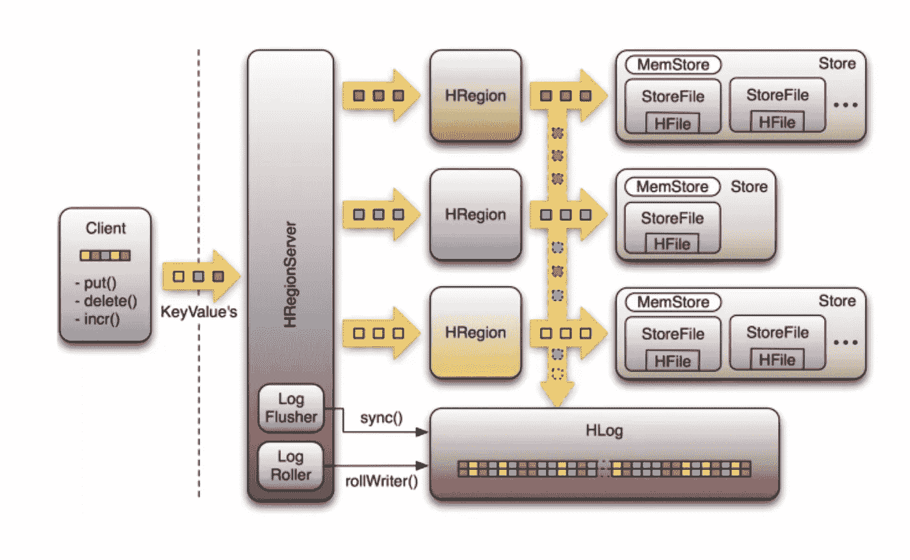
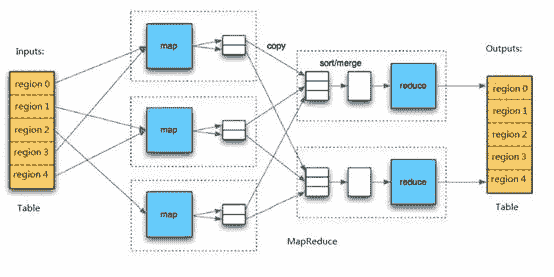

# HBase 工作原理:Hadoop 架构的一部分

> 原文：<https://towardsdatascience.com/hbase-working-principle-a-part-of-hadoop-architecture-fbe0453a031b?source=collection_archive---------4----------------------->

## *Hadoop 中 HBase 工作的简要总结*

# 1.感应

**HBase** 是一个高可靠性、高性能、面向列、可扩展的分布式存储系统，使用 HBase 技术在廉价的 PC 服务器上构建大规模结构化存储集群。HBase 的目标是存储和处理大量数据，特别是仅使用标准硬件配置来处理由成千上万行和列组成的大量数据。

不同于 MapReduce 的离线批量计算框架，HBase 是随机存取存储和检索数据平台，弥补了 HDFS 不能随机存取数据的缺点。

它适用于实时性要求不是很高的业务场景——h base 存储字节数组，不介意数据类型，允许动态、灵活的数据模型。

Hadoop Ecosystem (Credit: Edureka.com)

上图描绘了 Hadoop 2.0 生态系统的各个层，即位于结构化存储层的 Hbase。

HDFS 为 HBase 提供高可靠性的底层存储支持。

MapReduce 为 HBase 提供了高性能的批处理能力。ZooKeeper 为 HBase 提供稳定的服务和故障转移机制。Pig 和 Hive 为数据统计处理提供了 HBase 的高级语言支持，Sqoop 为 HDB 提供了可用的 RDBMS 数据导入功能，使得业务数据从传统数据库迁移到 HBase 非常方便。

# **2。HBase 架构**

**2.1 设计思路**
HBase 是一个分布式数据库，使用 ZooKeeper 管理集群，HDFS 作为底层存储。

在架构层面，由 h master(Zookeeper 选出的领袖)和多个 HRegionServers 组成。

底层架构如下图所示:

在 HBase 的概念中，HRegionServer 对应集群中的一个节点，一个 HRegionServer 负责管理多个 HRegion，一个 HRegion 代表一个表的一部分数据。

在 HBase 中，一个表可能需要很多 HRegion 来存储数据，每个 h region 中的数据并不是杂乱无章的。

HBase 在管理 HRegion 时，会为每个 HRegion 定义一个 Rowkey 的范围。属于定义范围内的数据将被移交给特定的区域，从而将负载分布到多个节点，从而利用了分布式和特性的优势。

此外，HBase 会自动调整区域的位置。如果某个 HRegionServer 过热，即大量请求落在由 HRegionServer 管理的 HRegion 上，HBase 会将 HRegion 移动到其他相对空闲的节点上，确保集群环境得到充分利用。

**2.2 基础架构**

**HBase** 由 HMaster 和 HRegionServer 组成，同样遵循主从服务器架构。HBase 将逻辑表划分为多个数据块 HRegion，并存储在 HRegionServer 中。

**HMaster** 负责管理所有的 HRegionServers。它本身不存储任何数据，只存储数据到 HRegionServer 的映射(元数据)。

集群中的所有节点都由 Zookeeper 协调，并处理 HBase 操作期间可能遇到的各种问题。HBase 的基本架构如下所示:

***客户端:*** 使用 HBase 的 RPC 机制与 HMaster 和 HRegionServer 进行通信，提交请求并获取结果。对于管理操作，客户端使用 HMaster 执行 RPC。对于数据读写操作，客户端使用 HRegionServer 执行 RPC。

**Zookeeper:** 通过向 Zookeeper 注册集群中各个节点的状态信息，HMaster 可以随时感知各个 HRegionServer 的健康状态，也可以避免 HMaster 的单点问题。

**HMaster:** 管理所有的 hregionserver，告诉他们哪些 hregionserver 需要维护，监控所有 hregionserver 的健康状况。当一个新的 HRegionServer 登录到 HMaster 时，HMaster 告诉它等待分配数据。当一个 HRegion 死亡时，HMaster 将其负责的所有 h region 标记为未分配，然后将它们分配给其他 HRegionServers。HMaster 没有单点问题。HBase 可以启动多个 HMasters。通过 Zookeeper 的选举机制，集群中始终有一个 HMaster 在运行，提高了集群的可用性。

**HRegion:** 当表格的大小超过预设值时，HBase 会自动将表格分成不同的区域，每个区域包含表格中所有行的子集。对于用户来说，每个表都是一个数据集合，由一个主键(RowKey)来区分。在物理上，一个表被分成多个块，每个块都是一个 HRegion。我们使用表名+开始/结束主键来区分每个 HRegion。一个 HRegion 会在一个表中保存一段连续的数据。一个完整的表数据存储在多个 HRegions 中。

**HRegionServer:**h base 中的所有数据一般从底层开始存储在 HDFS。用户可以通过一系列 HRegionServers 获取这些数据。一般情况下，集群的一个节点上只运行一个 HRegionServer，每个段的 HRegionServer 只由一个 HRegionServer 维护。HRegionServer 主要负责向 HDFS 文件系统读写数据，以响应用户的 I/O 请求。它是 HBase 中的核心模块。HRegionServer 在内部管理一系列 HRegion 对象，每个 HRegion 对应逻辑表中的一个连续数据段。HRegion 由多个 HStores 组成。每个 HStore 对应于逻辑表中一个列族的存储。可以看出，每个列族都是一个集中的存储单元。因此，为了提高操作效率，最好将具有相同 I/O 特征的列放在一个列族中。

**HStore:** 它是 HBase 存储的核心，由 MemStore 和 StoreFiles 组成。MemStore 是一个内存缓冲区。用户写的数据会先放入 MemStore。当 MemStore 满时，Flush 将是一个 StoreFile(底层实现是 HFile)。当 StoreFile 文件数量增加到一定阈值时，会触发紧凑合并操作，将多个 StoreFile 合并为一个 store file，并在合并过程中执行版本合并和数据删除操作。所以可以看出，HBase 只是添加数据，所有的更新和删除操作都在后续的压缩过程中进行，这样用户的写操作一进入内存就可以返回，保证了 HBaseI/O 的高性能，当 StoreFiles 压缩后，会逐渐形成越来越大的 StoreFile。当单个存储文件的大小超过某个阈值时，将触发拆分操作。同时，当前 hre region 将被拆分为 2 个 hre region，父 hre region 将下线。这两个子区域由 HMaster 分配给相应的 HRegionServer，这样原 HRegion 的负载压力就分流到这两个 HRegion 上了。

**HLog:** 每个 HRegionServer 都有一个 HLog 对象，这是一个预先编写的日志类，实现预写日志。每当用户向 MemStore 写入数据时，它也向 HLog 文件写入数据的副本。HLog 文件被周期性地滚动和删除，旧文件被删除(已经被持久化到 StoreFile 的数据)。当 HMaster 检测到某个 HRegionServer 被 Zookeeper 意外终止时，HMaster 首先处理遗留 HLog 文件，拆分不同 HRegion 的 HLog 数据，放入对应的 HRegion 目录，然后重新分配无效的 HRegion。在加载 HRegion 的过程中，这些 h region 的 HRegionServer 会发现有历史 HLog 需要处理，所以 Replay HLog 中的数据会被转移到 MemStore，然后刷新到 StoreFiles，完成数据恢复。

**2.3 根和元**

HBase 的所有 HRegion 元数据都存储在. META .表中。随着 HRegion 的增加。元表也增加并分裂成多个新的 HRegions。

中每个 HRegion 的位置。中所有 HRegions 的元数据。元表存储在根表中，最后根表的位置信息由 Zookeeper 记录。

在所有客户端访问用户数据之前，它们需要首先访问 Zookeeper 以获得-ROOT-的位置，然后访问-ROOT-table 以获得。元表，最后根据元表中的信息确定用户数据的位置，如下:如图所示。

根表永远不会被分割。它只有一个 HRegion，这保证了任何 HRegion 只需三次跳转就可以定位。为了加快访问速度。元表保存在内存中。

客户端缓存查询到的位置信息，缓存不会主动失效。如果客户端仍然不能访问基于缓存信息的数据，则向区域服务器询问相关的。元表来尝试获取数据的位置。如果仍然失败，询问。与根表相关联的元表是。

最后，如果前面的信息全部无效，那么 HRegion 的数据由 ZooKeeper 重新定位。因此，如果客户机上的缓存完全无效，您需要来回六次才能获得正确的 HRegion。

# 3.HBase 数据模型

HBase 是一个类似于 BigTable 的分布式数据库。它是稀疏的长期存储(在 HDFS 上)，多维的，排序的映射表。这个表的索引是行关键字、列关键字和时间戳。HBase 数据是一个字符串，没有类型。

把一个表想象成一个大的映射。可以通过行键、行键+时间戳或行键+列(列族:列修饰符)来定位特定数据。因为 HBase 稀疏地存储数据，所以一些列可以是空白的。上表给出了 com.cnn.www 网站的逻辑存储逻辑视图。表格中只有一行数据。

该行的唯一标识符是“com.cnn.www”，并且该行数据的每次逻辑修改都有一个时间。该戳记对应于相应的。

表格中有四列:contents: HTML，anchor:cnnsi.com，anchor:my.look.ca，mime: type，每一列给出它所属的列族。

行键(row key)是表中数据行的唯一标识符，用作检索记录的主键。

在 HBase 中，只有三种方法可以访问表中的行:通过行键访问、给定行键的范围访问和全表扫描。

行键可以是任何字符串(最大长度为 64KB ),并按字典顺序存储。对于经常一起读取的行，需要仔细设计基本值，以便它们可以集中存储。

# 4.HBase 读写过程

下图是 HRegionServer 数据存储关系图。如上所述，HBase 使用 MemStore 和 StoreFile 来存储对表的更新。数据在更新时首先被写入 HLog 和 MemStore。MemStore 中的数据被排序。

当 MemStore 累积到某个阈值时，将创建一个新的 MemStore，旧的 MemStore 将被添加到刷新队列中，一个单独的线程将被刷新到磁盘，成为 StoreFile。同时，系统会在 Zookeeper 中记录一个检查点，表示这个时间之前的数据更改已经被持久化。当意外系统发生时，MemStore 中的数据可能会丢失。

在这种情况下，HLog 用于恢复检查点之后的数据。

StoreFile 是只读的，一旦创建就不能修改。因此，HBase 的更新是一个额外的操作。当存储中的 StoreFile 达到某个阈值时，执行合并操作，合并对同一键的修改以形成一个大的 StoreFile。当存储文件的大小达到某个阈值时，存储文件被分割并分成两个存储文件。

**4.1 写操作流程**

*第一步:*客户端通过 Zookeeper 的调度向 HRegionServer 发送写数据请求，将数据写入 HRegionServer。

*第二步:*将数据写入 HRegion 的 MemStore，直到 MemStore 达到预设的阈值。

*第三步:*将 MemStore 中的数据刷新到 StoreFile 中。

*步骤 4:* 随着 StoreFile 文件数量的增加，当 StoreFile 文件数量增加到一定阈值时，触发紧凑合并操作，将多个 StoreFile 合并为一个 store file，同时进行版本合并和数据删除。

*第五步:* StoreFiles 通过不断的压缩操作，逐渐形成一个越来越大的 StoreFile。

*第六步:*当单个 StoreFile 的大小超过一定阈值后，触发拆分操作，将当前的 HRegion 拆分成两个新的 HRegion。父 HRegion 将脱机，新拆分的两个子 HRegion 将由 HMaster 分配给相应的 HRegionServer，以便将原 HRegion 的压力分流到这两个 HRegion。

**4.2 读取操作流程**

*步骤 1:* 客户端访问 Zookeeper，找到-ROOT-table，获取. META. table 信息。

*第二步:*从. META. table 中查找获取目标数据的 HRegion 信息，找到对应的 HRegionServer。

*第三步:*通过 HRegionServer 获取需要查找的数据。

*第四步:*HRegionserver 的内存分为两部分:MemStore 和 BlockCache。MemStore 主要用来写数据，BlockCache 主要用来读数据。先读取请求到 MemStore 检查数据，检查 BlockCache 检查，然后检查 StoreFile，将读取结果放入 BlockCache。

# 5.HBase 使用场景

*半结构化或非结构化数据:*对于没有很好定义或者杂乱的数据结构字段，很难按照一个适合 HBase 的概念提取数据。如果随着业务的增长存储了更多的字段，RDBMS 需要停机来维护变更表结构，HBase 支持动态添加。

*记录非常稀疏:*RDBMS 行有多少列是固定的，空列浪费存储空间。不存储 HBase 为空的列，这样可以节省空间并提高读取性能。

*多版本数据:*根据行键和列标识符定位的值可以有任意多个版本值(时间戳不同)，所以对于需要存储变更历史的数据，使用 HBase 非常方便。

*数据量大:*当数据量越来越大时，RDBMS 数据库撑不住了，就有了读写分离策略。通过一个主设备负责写操作，多个从设备负责读操作，服务器成本翻倍。压力越来越大，师傅撑不住了。这时候库就分了，关联度不大的数据单独部署。有些连接查询无法使用，需要使用中间层。随着数据量的进一步增加，一个表的记录变得越来越大，查询变得非常慢。

因此，有必要将表划分成多个表，例如，通过将 ID 取模来减少单个表的记录数量。经历过这些事情的人都知道怎么折腾过程。

HBase 很简单，只需在集群中增加新的节点，HBase 就会自动水平拆分，与 Hadoop 的无缝集成保证了数据的可靠性(HDFS)和海量数据分析的高性能(MapReduce)。

# 6.h 基线图减少

HBase 中表和区域的关系有点类似于 HDFS 中文件和块的关系。由于 HBase 提供了与 MapReduce 交互的 API，如 TableInputFormat、TableOutputFormat 等，HBase 数据表可以直接作为 Hadoop MapReduce 的输入输出，方便了 MapReduce 应用的开发，并且不需要关注 HBase 系统本身细节的处理。

如果你喜欢这个主题，你可以看看我写下的关于 Hadoop 的其他几个主题。
如果您发现任何错误或有任何建议，请随时通过我的 [LinkedIn](https://www.linkedin.com/in/sahil-dhankhad-303350135/) 联系我。

 [## Apache Hadoop 小结:大数据问题的解决方案和来自 Google 的提示

### 欢迎学习大数据和 Hadoop 简介，我们将在这里讨论 Apache Hadoop 以及如此大的问题…

towardsdatascience.com](/a-brief-summary-of-apache-hadoop-a-solution-of-big-data-problem-and-hint-comes-from-google-95fd63b83623)  [## Hadoop 中的新特性:你应该知道 Hadoop 中的各种文件格式。

### Hadoop 文件格式初学者指南

towardsdatascience.com](/new-in-hadoop-you-should-know-the-various-file-format-in-hadoop-4fcdfa25d42b)