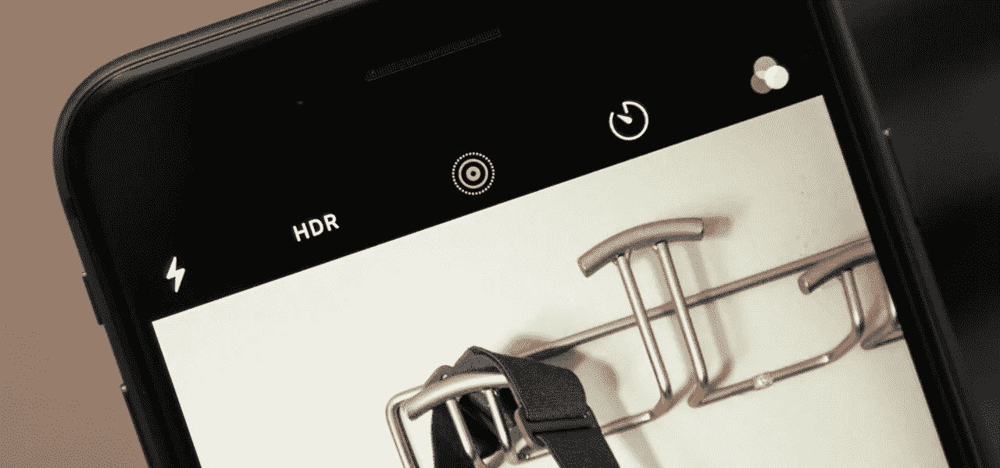
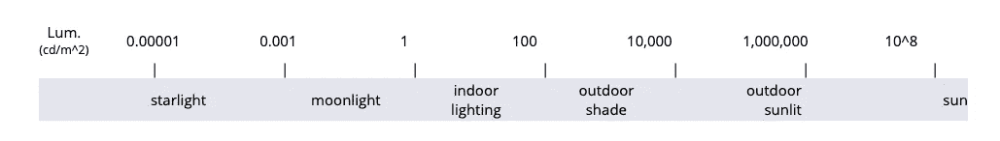
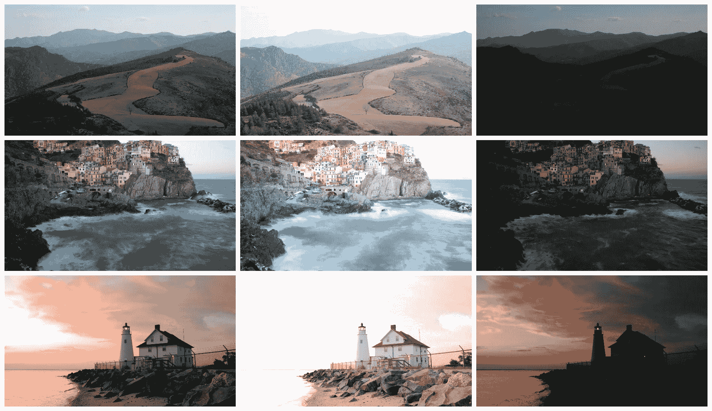
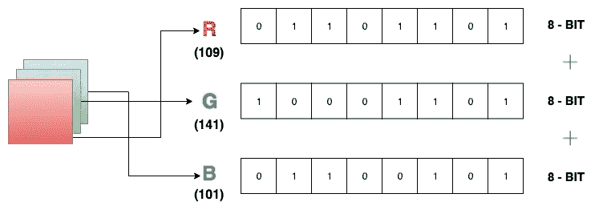
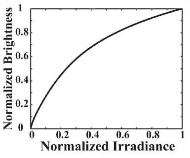
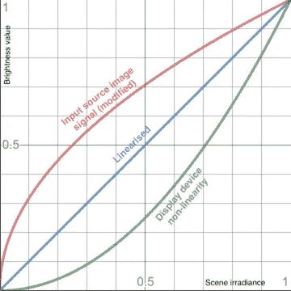
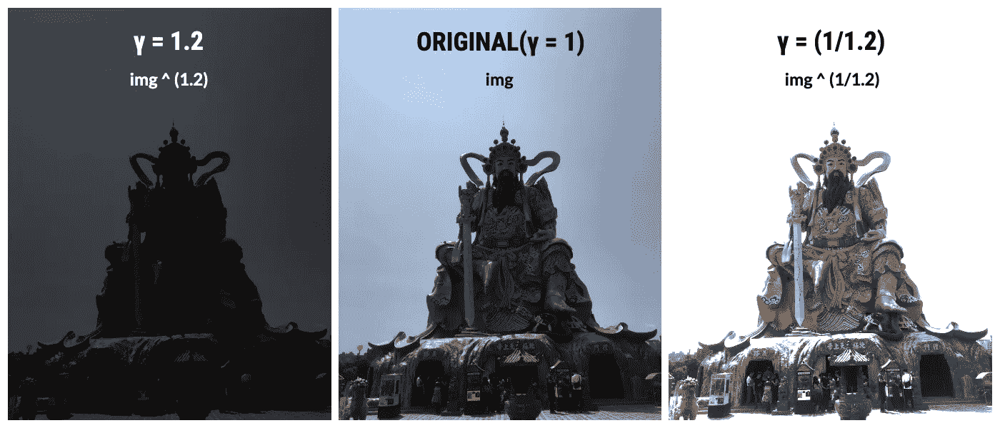
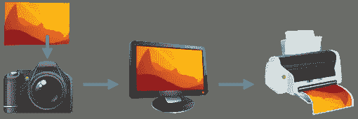
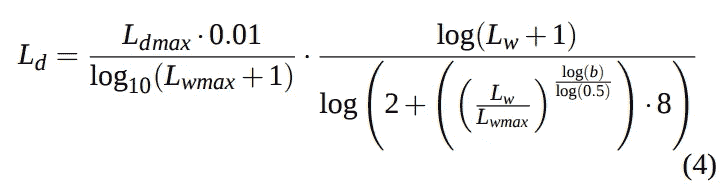
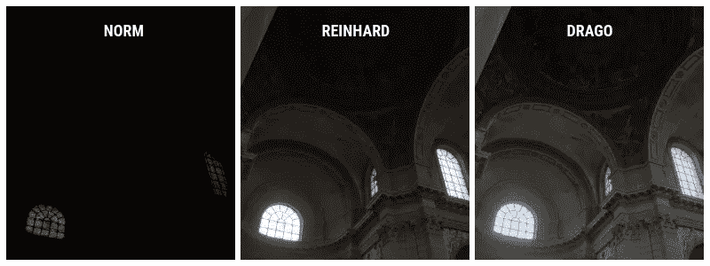

# HDR 影像:到底什么是 HDR 影像？

> 原文：<https://towardsdatascience.com/hdr-imaging-what-is-an-hdr-image-anyway-bdf05985492c?source=collection_archive---------7----------------------->

## 关于 HDR 成像的一切。

你可能已经注意到，以太阳(或任何明亮的物体)为背景拍摄图像通常效果不佳。根据焦点的不同，图像不是太暗就是太亮。让我们试着理解为什么会发生这种情况，以及如何解决这个问题。

在我们开始之前，我建议你看看我播客中的一个片段，我们在这里讨论了计算摄影和 HDR 成像的现状。

围绕 HDR 图像的研究有很多关键概念-

*   **动态范围**
*   **图像曝光**
*   **快门速度、光圈、ISO**
*   **图像包围**
*   **合并 LDR 图像**
*   **图像编码**
*   **相机响应功能**
*   **线性化**
*   **伽马校正**
*   **色调映射**
*   可视化 HDR 图像

# 动态量程

场景的动态范围是指包围场景的光强度的范围。它也可以定义为图像中亮(最大可测量亮度)与暗(最小可测量亮度)的比率。

为了了解亮度如何被量化，光强度的范围是从 0 到无穷大，零是最暗的，无穷大是最亮的光源(☀️)。

Luminance value comparison ([Source](https://www.hdrsoft.com/resources/dri.html))

没有相机能够捕捉场景中这种完全无上限的照明范围。因此，图像要么太亮(曝光过度)，要么太暗(曝光不足)。这些图像被称为*低动态范围* (LDR)图像。对于变得太亮的图像，相机只能捕捉(无限范围的)较亮的子范围，相应地，对于较暗的图像，只能捕捉较低的子范围。

**True image** (Left), **Overexposed image** (Center), **Underexposed image** (Right)

**图像曝光:**进入相机的光量(以及图像)称为曝光。图像的曝光可以通过相机的三个设置来控制——光圈、快门速度和 ISO。

**光圈:**相机镜头上光线可以进来的区域。

**快门速度:**相机快门关闭的速度。随着快门速度的增加，进入相机的光量减少，反之亦然。它还提高了图像的清晰度。

**ISO:** 相机传感器对入射光的灵敏度。

我在这里找到了这个很好的类比[，在相机设置和一个留在雨中的水桶之间。](https://www.cambridgeincolour.com/tutorials/camera-exposure.htm)

> 在摄影中，光圈、快门速度和 ISO 速度的曝光设置类似于上面讨论的宽度、时间和数量。此外，正如上面的降雨率超出了你的控制，自然光对于摄影师来说也是如此。

回到*动态范围*。从照相机捕获的单个图像不能包含宽范围的光强度。

这个问题可以通过合并在多个曝光值下捕获的图像来解决。这样做的好处是，曝光过度的图像对图像中较暗的区域效果很好，曝光不足的图像能够降低超亮区域的亮度。在不同的曝光值下，图像的不同区域被更好地捕捉。因此，想法是合并这些组图像，并恢复具有*高动态范围* (HDR)的图像。

# 图像包围

包围是指用不同的相机设置捕捉同一场景的多个图像。这通常由照相机自动完成。当你在智能手机上使用 HDR 功能时，手机会在三个不同的曝光时间(或曝光值)快速连续拍摄三张(通常)图像。曝光时间越短，进入的光线就越少。相机软件将这三幅图像合并，并保存为一幅图像，以使每幅图像的最佳部分成为最终图像。

A collage of 5 bracketed images that I found on the [internet](https://www.google.com/url?sa=i&source=images&cd=&cad=rja&uact=8&ved=2ahUKEwiR0PPA4JHjAhVQb30KHdH6DaUQjhx6BAgBEAM&url=https%3A%2F%2Fwww.highdynamicranger.com%2Fhow-to-use-auto-exposure-bracketing-for-hdr%2F&psig=AOvVaw0b8jjGtlbQ010BQW1YHPIQ&ust=1562002928887447).

有趣的是，合并后保存在手机上的图像仍然不是(技术上)HDR 图像。这就是图像编码进入画面的地方(还有色调映射，我们将在后面讨论)。

# 图像编码

通常，我们在手机和电脑上看到的图像是 8 位(每通道)编码的 RGB 图像。每个像素的值使用 24 位表示存储，每个通道(R，G，B)8 位。像素的每个通道都有 0-255 个亮度值。

Example of 24-bit (3x8-bit) encoding for an RGB pixel

这种编码的问题是它不能包含自然场景的大动态范围。它只允许 0–255(仅整数)的范围来适应强度范围，这是不够的。

为了解决这个问题，每个通道都使用 32 位浮点数对 HDR 图像进行编码。这使得我们能够捕捉到大范围的 HDR 图像。书写 HDR 图像有多种格式，最常见的是。所有 hdr 图像都是 32 位编码，但并非所有 32 位图像都可以是 HDR 图像。

# 相机响应函数

CRF 是显示实际场景辐照度和图像中数字亮度值之间关系的函数。它也被称为光电传递函数。相机公司不提供他们的 CRF，并认为这是专有信息。

Camera response function example

在理想情况下，CRF 应该有一个线性图形，也就是说，图像中像素的亮度值应该与场景中的实际辐照度成正比。这对于 HDR 图像来说是正确的，但是对于通常的图像来说不是这样，在通常的图像中，亮度值被改变以能够将它们包含在有限的范围内。传统图像去线性化的更重要原因取决于显示设备的工作方式。

回到 CRT(阴极射线管)显示器时代，电子是在磷光体表面发射的。众所周知，荧光屏在被加速的电子撞击时会发射光子。然而，显示器的亮度并不随着电子束的强度而线性变化。这个问题已经通过在与显示器的非线性相反的方向上非线性地修改输入的图像/视频源信号而得到解决。通过这样做，我们可以获得自然场景亮度的合理线性估计。

源的这种非线性化允许补偿非线性显示。显示技术已经进步，但是非线性仍然存在于大多数设备中。这种*去线性化*被称为伽马校正。

> 伽玛校正图像=图像^ γ

如果输入图像是 x，那么伽马=1.2 的显示设备显示的是 x^(1.2).因此，输入图像被编码为 x^(1/1.2 ),以便监视器将其转换为 x^((1/1.2(×1.2 ),它等于摄像机捕获的原始图像 x。

对于目前的大多数显示器来说，图像必须用 0.45 (1/2.2)的伽马值进行编码，因为显示器的伽马解码为 2.2。

伽马编码在[0，1]的范围内执行。因此，图像首先必须通过除以 255 进行归一化，然后在伽马运算后再次乘以 255。大于 1 的放大率产生较暗的图像，而小于 1 的放大率产生较亮的图像。

Comparison between gamma encoded images

HDR 摄影(或任何摄影)非常复杂，我们需要考虑三个重要方面

*   实际场景如何(地面实况/无上限动态范围)
*   相机如何捕捉(包围然后合并)
*   显示方式(色调映射)

[Source](https://www.cambridgeincolour.com/tutorials/dynamic-range.htm)

在 HDR 成像的背景下，我们已经讨论了前两点。现在让我们看看 HDR 图像是如何显示的。

# 色调映射

大多数现成的显示设备不能传送大范围的无上限的 HDR 图像。他们期望输入源为三通道 24 位(3x8) RGB 格式。由于这个原因，宽动态范围需要降低，以便能够适应 RGB 格式的 0–255 范围。这可以通过几种方式实现，其中一些是-

*   常规线性归一化:这是降低 HDR 图像宽范围的最基本方法。

> 色调映射图像=(img—img . min()/img . max()—img . min())x 255

*   赖因哈德色调映射:这是在这篇[论文](http://www.cmap.polytechnique.fr/~peyre/cours/x2005signal/hdr_photographic.pdf)中分享的最常用的色调映射算法之一。

> 色调映射图像= img/(1+img) x 255

*   Drago 色调映射:这是一个基于感知的色调映射器，它使用对数函数压缩动态范围，“使用场景内容的不同基底计算”。这方面的论文可以在[这里](http://resources.mpi-inf.mpg.de/tmo/logmap/logmap.pdf)找到。

你自找的

Results

# 生成 HDR 内容的持续研究

生成 HDR 内容的传统方法是通过合并在不同曝光下捕获的多个图像(包围)。然而，当帧之间存在运动时，这种方法可能会产生重影(模糊)假象。这个问题已经解决了，首先使用所谓的*光流*将相邻帧与参考帧(中间帧)对齐。这可以是另一篇博客文章的主题，但现在我们可以将其视为一种通过将位移向量分配给特定像素位置来估计跨帧发生的对象(或像素)运动的方法。

也有使用深度学习从单一 LDR 对应物生成 HDR 框架的工作。神经网络能够成功地学习输入和输出之间的复杂表示，并且因此在学习 LDR 到 HDR 映射中表现得相当好。这些是从单幅图像生成 HDR 图像的一些最先进的方法—

*   HDRCNN: [使用深度 CNN 从单次曝光中重建 HDR 图像](http://hdrv.org/hdrcnn/material/sga17_paper.pdf)
*   [使用基于 LDR 学习的深度逆色调映射来估计具有绝对亮度的 HDR 图像](https://arxiv.org/pdf/1903.01277.pdf)
*   [ExpandNet:用于从低动态范围内容进行高动态范围扩展的深度卷积神经网络](https://arxiv.org/abs/1803.02266)

这里有一些最先进的基于深度学习的方法，用于使用多个 LDR 图像生成 HDR 图像—

*   [动态场景的深高动态范围成像](https://cseweb.ucsd.edu/~viscomp/projects/SIG17HDR/)
*   AHDRNet: [用于无重影高动态范围成像的注意力引导网络](https://arxiv.org/abs/1904.10293)

 [## 论文综述——用于无重影高动态范围成像的注意力引导网络

### “你只是想要关注，你不想要我的心”——查理·普斯

towardsdatascience.com](/paper-review-attention-guided-network-for-ghost-free-high-dynamic-range-imaging-4df2ec378e8) 

# 如何查看 HDR 图片

HDR 图像存储为亮度图，而不是传统的 RGB 图像，因此不能使用常见的图像查看应用程序进行查看。

MacOS 允许您查看。hdr 和。使用预览和查找应用程序的 exr 文件。你也可以使用 [OpenHDR](https://viewer.openhdr.org/) 网站来可视化这些图像。

感谢阅读。

在以后的博客文章中，我将讨论如何使用 Python、OpenCV 和 Numpy 对 HDR 图像进行操作。我也想分享目前正在进行的 HDR 视频生成的研究。