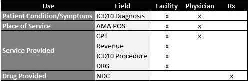

# 使用医疗索赔数据进行预测分析的 3 个工具

> 原文：<https://towardsdatascience.com/healthcare-claims-data-for-predictive-analytics-cbffbc19cc5f?source=collection_archive---------8----------------------->

Photo by [Adhy Savala](https://unsplash.com/@adhy?utm_source=medium&utm_medium=referral) on [Unsplash](https://unsplash.com?utm_source=medium&utm_medium=referral)

一位高中英语老师告诉我，以“字典对 XYZ 的定义是:”开始一篇论文通常证明是一个没有洞察力的介绍，我担心以“医疗保健有重要的未开发的数据机会”开始这篇文章可能会同样失败。然而，就现有的大量数据而言，很难高估这个领域中未回答和未提出的问题。

除了日益完善的健康状态监控和电子健康记录数据集之外，公共和私有数据集中还有数十亿行医疗保健索赔数据，这些数据通常质量非常高。这篇文章快速介绍了医疗保健索赔数据的工作原理(结构、用途、困难)，提出了使用数据的 3 个通用框架。

## **索赔表上的信息**

医疗保健索赔有三种形式:医生、医疗机构和零售药店。每个表单都有许多共同的特征，包括成员身份(姓名、出生日期、保险卡号码等)。)、提供商信息([国家提供商 ID](https://en.wikipedia.org/wiki/National_Provider_Identifier) )、税务 ID 号等。)，以及服务日期。医生和机构索赔还包含多个描述病情/症状的 [ICD-10 诊断代码](https://en.wikipedia.org/wiki/ICD-10)—机构索赔允许 20 个以上的诊断代码，但实际上 3 个诊断代码包含了两种索赔类型的大部分可用信息。医生和机构声明还包含一个 AMA 服务地点代码，用于描述提供服务的机构类型(即急诊室、紧急护理机构、医生办公室等)。).

3 种索赔类型的独特特征反映了每种类型的提供者如何获得报酬(至少一般来说，从历史上看，像所有医疗保健一样，有细微差别、最近的变化和未来的计划；请始终记住这一点，因为尽可能多地重复这一点会非常乏味。

医生按服务付费——每个程序(检查、抽血、外科手术等)。)有一个美元金额，最终付款是所有这些过程的美元金额的总和。医生报销单使用 [CPT 代码](https://en.wikipedia.org/wiki/Healthcare_Common_Procedure_Coding_System)列出每项独特的服务。CPT 代码是 5 位字母数字代码，用于描述医生可以执行的每项独特服务，唯一代码分配给相似类型的程序，这些程序对于常见程序具有不同的严重程度。

设施(医院、独立实验室、门诊手术中心等。)相比之下，使用更高级的视图来支付。你可以想象，将住院期间护士在你房间停留的所有时间制成表格会变得很乏味，因此医院会收取“食宿”费用，即躺在病床上所涉及的一切费用。收入代码— 4 位数字(通常包含前导零)—捕获住院期间包含的每项独特的高级服务，如手术室程序、物理治疗、分娩室/分娩等。).此外，使用 [ICD10 程序代码](https://en.wikipedia.org/wiki/ICD-10_Procedure_Coding_System)捕获特定的重要程序，如移植或动脉旁路，更常见的程序使用医生声明中使用的相同 CPT 代码集。 [DRG 代码](https://en.wikipedia.org/wiki/Diagnosis-related_group)是在单个代码中总结住院天数的第三个字段。

药店的声明很简单(但通常包含大量的预测信息)——它们只是列出处方药物(使用 [NDC 编号](https://en.wikipedia.org/wiki/National_Drug_Code))、数量和供应天数。

总之，下面列出了可用的关键字段。在实践中，至少有 3 倍以上的领域在发挥作用，但出于介绍性讨论的目的，这些是大的。

尽管具体情况有所不同，但在数据库构建索赔数据的方式上有着广泛的相似性。通常使用两个事实表——“标题”表存储每个索赔只有一个值的字段，如会员/提供商、服务日期和所有诊断代码,“详细”表存储每个索赔可能有多个值的字段，如 CPT、收入和 NDC 代码。数据库中的附加表格可以提供代码的描述。

虽然索赔数据通常相对干净，但这种结构以及数据所描述的事件和患者特征的临床复杂性需要大量的预处理工作。已经构建了多种方法来平衡在用最少的工作获得易于分析的数据和保存临床复杂性信息的数据之间的权衡。概括地说，有 3 个主要工具:分级条件类别(HCC)编码、事件分组器和基于临床的特征构建。我们将在下面讨论每种方法的优缺点。

## **工具 1: HCC 车型**

HCC 编码是一种广泛使用的技术，尤其是在风险评分算法中。风险评分模型为个人分配一个数字来描述他们的“风险”，这通常意味着预测的索赔成本，但也可以表示临床管理或其他特征的机会。医疗保险优势系统(Medicare Advantage system)、ACA 个人交换(ACA Individual Exchanges)和许多州管理的医疗补助计划(Medicaid programs)使用基于 HCC 的风险调整模型来产生风险评分——尽管具体情况有很大不同，但总体思路是通过量化参加健康计划的个人的相对发病率，相应的收入转移可以确保所有保险公司的公平竞争。

HCC 模型通常通过列举基于 ICD-10 诊断代码和/或药房处方的存在将个体分配到的条件类别来工作。每个类别可以分配一个权重，个人的总得分是类别级别权重的组合。这些模型通常严重依赖个体诊断代码来量化患者的状况，并将可用信息大量总结为 20-50 个类别。他们可以捕捉大量的信息，这些信息可以很容易地快速分析，但是他们也可能遗漏很多信息。例如，高血压或二型糖尿病等疾病如果得到适当的管理，可能不会显著增加风险，但如果不加以管理，可能会导致风险显著增加——简单地量化这些疾病的存在忽略了这一现实。

一种更普遍的分析方式是将其他类型代码的出现(不仅仅是风险评分模型中常用的诊断/药物代码)视为虚拟变量，可能还包括基于频率或时间的变量。这在特征工程中很有帮助，可以快速生成成千上万的组合，并识别与特定分析相关的较小代码集。需要特别注意的是，当许多字段合并在一起时，数据可能会变得非常分散，更高级别的相关性可能会变得模糊不清。例如，无论服务地点或 CPT 代码如何，HIV/AIDS 诊断可能都很重要，但是将该诊断分成几个不同的类别可能会隐藏这一点。

## **工具 2:事件分组器**

事件分组器试图捕捉 HCC 模型中不存在的细微差别，方法是将许多行和字段的数据汇总到由自定义 s 描述的单个事件行中，这种扁平格式可以使跨字段和单独行的数据中的相关性更容易访问。

我查阅的一份 35x19 的索赔数据表可以总结为下面的故事:“患者去了他的医生办公室，在那里对心脏植入装置进行评估。可能在这次访问中提到，患者在同一天去了急诊室。在 8 天的住院期间，患者出现呼吸急促，并接受了胸部 x 光检查和“呼吸服务”作为回应。诊断代码非常准确地告诉我们患者心脏相关状况的范围，以及营养不良的情况”。

大规模地构造这些算法是棘手的，尽管最初如何解决这个问题的想法并不难形成。大规模变得棘手，因为医疗护理是棘手的——相同的程序可以实现不同的结果，相同的诊断可能是低风险或高风险，取决于管理和合并症，诊断可能在短期和长期内有不同的表现，等等。

由于这些[的复杂性](https://hcttf.org/wp-content/uploads/2019/01/HCTTF_Episode-Groupers_Key-Considerations.pdf)，有一系列被称为“情节分组器”的商业算法来执行这种总结。这些算法的工作方式有很大的差异，因为提供商、保险公司、公共政策研究人员和其他用户可能都对不同风格的故事线感兴趣。

即使有一个精心设计的事件分组器，您的数据也不容易描述整个患者——捕获频率或时间线信息可能依赖于类似于 HCC 建模地层的技术，但仍然有限。基于临床的模型试图解决这个问题。

## **工具 3:基于临床的模型**

为了充分利用索赔数据(像所有数据一样)，大量的领域知识是必要的，但是这里的领域知识通常是通过医学博士教育和多年的临床经验获得的——不是你可以在一个周末自学的那种东西。这一现实在基于临床的模型中尤其明显，这些模型使用临床定义的算法来识别特征。例如，用于识别可能导致住院的心力衰竭患者(因为并非所有心力衰竭都是慢性的)的规则可能具有基于处方的填充组合、具有不同诊断或 DRG 代码的住院、具有特定程序或诊断的多个门诊事件以及上述各项的组合的规则。

这种逻辑在提取难以想到算法方式来全面识别的特征时会非常有帮助。不利的一面是，这种逻辑往往高度专业化，不容易概括患者的一般特征(如 HCC 模型中的“风险”)。

## **结论**

我在这个介绍性讨论中的希望是鼓励在数据科学应用中更广泛地使用医疗索赔数据。CMS 提供了许多[基于医疗保险的样本](https://www.cms.gov/Research-Statistics-Data-and-Systems/Research-Statistics-Data-and-Systems.html)，这些样本可公开用于分析，其中可能隐藏了许多未开发的见解。愿欢乐开始！