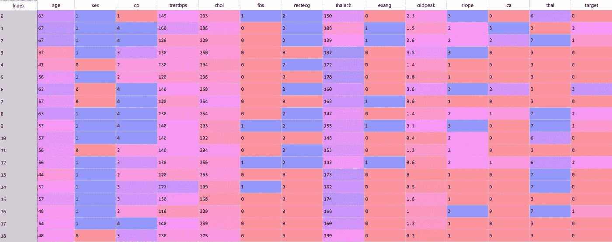
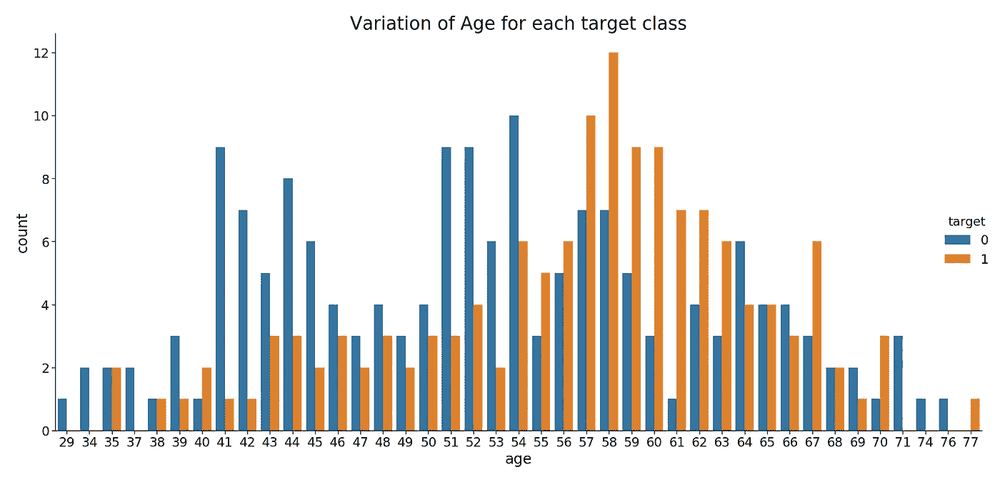
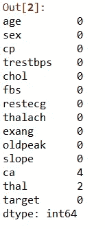
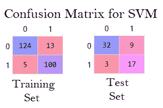
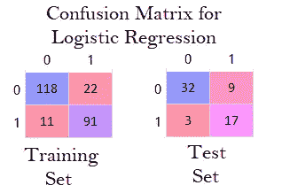
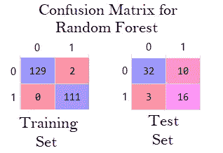
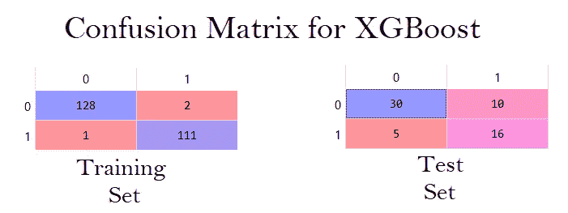
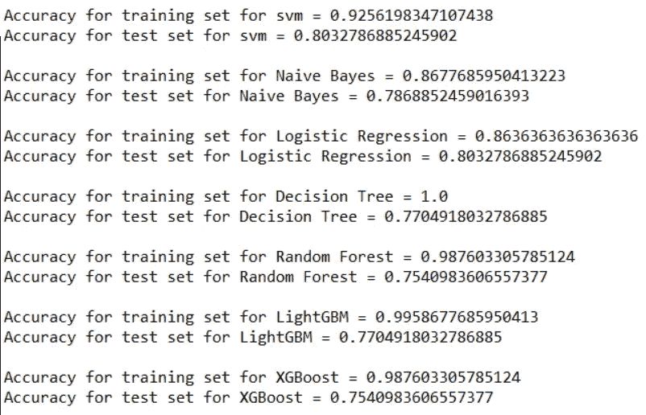

# 心脏病预测

> 原文：<https://towardsdatascience.com/heart-disease-prediction-73468d630cfc?source=collection_archive---------3----------------------->

## 克里夫兰心脏病(UCI 知识库)数据集——用各种模型分类。

[Source](https://unsplash.com/)

# 介绍

**心脏病**描述了一系列影响心脏的疾病。心脏病范围内的疾病包括血管疾病，如冠状动脉疾病、心律问题(心律不齐)和先天性心脏缺陷(先天性心脏缺陷)等。

术语“心脏病”经常与术语“心血管疾病”互换使用。心血管疾病通常是指血管狭窄或阻塞，可能导致心脏病发作、胸痛(心绞痛)或中风。其他心脏疾病，如影响心脏肌肉、瓣膜或节律的疾病，也被视为心脏病的形式。

心脏病是世界人口发病和死亡的最大原因之一。心血管疾病的预测被认为是临床数据分析部分中最重要的课题之一。医疗保健行业的数据量非常庞大。数据挖掘将大量原始医疗保健数据转化为有助于做出明智决策和预测的信息。

根据一篇新闻报道，心脏病被证明是男女死亡的主要原因。该条声明如下:

> 在美国，每年约有 610，000 人死于心脏病，也就是说，每 4 例死亡中就有一例。1
> 
> 心脏病是男性和女性死亡的主要原因。2009 年因心脏病死亡的一半以上是男性。1
> 
> 冠心病(CHD)是最常见的心脏病，每年导致超过 370，000 人死亡。
> 
> 每年大约有 735，000 名美国人患心脏病。其中，525，000 例是首次心脏病发作，210，000 例发生在已经患有心脏病的人群中。

这使得心脏病成为需要解决的主要问题。但是很难识别心脏病，因为有几个促成的风险因素，如糖尿病、高血压、高胆固醇、异常脉搏率和许多其他因素。由于这些限制，科学家们转向了数据挖掘和机器学习等现代方法来预测疾病。

机器学习(ML)被证明可以有效地从医疗保健行业产生的大量数据中帮助做出决策和预测。

在这篇文章中，我将应用机器学习方法(并最终比较它们)来对一个人是否患有心脏病进行分类，使用最常用的数据集之一—[UCI 知识库](https://archive.ics.uci.edu/ml/index.php)中的[克里夫兰心脏病数据集](https://archive.ics.uci.edu/ml/datasets/Heart+Disease)。

和往常一样，您可以在 [Github 资源库](https://github.com/ShubhankarRawat/Heart-Disease-Prediction)中找到本文使用的代码。

# 数据

本文中使用的数据集是来自 UCI 资料库的 Cleveland 心脏病数据集。

Dataset

该数据集由 303 个个体数据组成。数据集中有 14 列，如下所述。

1.  *:显示个人的年龄。*
2.  ****性别*** :使用以下格式显示个人的性别:
    1 =男性
    0 =女性*
3.  ****胸痛类型*** :使用以下格式显示个人经历的胸痛类型:
    1 =典型心绞痛
    2 =非典型心绞痛
    3 =非心绞痛疼痛
    4 =渐进性*
4.  ****静息血压*** :显示个人的静息血压值，单位为毫米汞柱(单位)*
5.  ****血清胆固醇*** :显示血清胆固醇，单位为毫克/分升(mg/dl)*
6.  ****空腹血糖*** :将个体的空腹血糖值与 120mg/dl 进行比较。
    如果空腹血糖> 120mg/dl 则:1(真)
    否则:0(假)*
7.  ****静息心电图*** :显示静息心电图结果
    0 =正常
    1 = ST-T 波异常
    2 =左心室肥厚*
8.  ****:显示个人达到的最大心率*** 。*
9.  ****运动诱发的心绞痛*** :
    1 =是
    0 =否*
10.  ****运动相对于休息诱发的 ST 段压低*** :显示整数或浮点数。*
11.  ****峰值运动 ST 段*** :
    1 =上坡
    2 =平坡
    3 =下坡*
12.  ****荧光显示的主要血管数(0-3)***:显示整数或浮点数。*
13.  ****地中海贫血*** :显示地中海贫血:
    3 =正常
    6 =固定缺陷
    7 =可逆缺陷*
14.  ****心脏病诊断*** :显示个人是否患有心脏病:
    0 =缺席
    1，2，3，4 =出席。*

## *为什么这些参数:*

*在实际数据集中，我们有 76 个特征，但是在我们的研究中，我们只选择了上面的 14 个，因为:*

1.  *年龄:年龄是发展心血管或心脏疾病的最重要的风险因素，生命中的每十年风险大约是三倍。冠状动脉脂肪条纹可以在青春期开始形成。据估计，82%死于冠心病的人年龄在 65 岁及以上。同时，55 岁以后，中风的风险每十年翻一番。*
2.  ***性别**:男性比绝经前的女性患心脏病的风险更大。一旦过了更年期，人们认为女性的风险与男性相似，尽管来自世卫组织和联合国的最新数据对此提出了质疑。如果女性患有糖尿病，她比患有糖尿病的男性更容易患心脏病。*
3.  ***心绞痛(胸痛)**:心绞痛是当你的心肌没有获得足够的富氧血液时引起的胸痛或不适。它可能会让你感到胸部有压力或挤压感。不适也可能发生在你的肩膀、手臂、脖子、下巴或背部。心绞痛甚至会感觉像消化不良。*
4.  *静息血压:随着时间的推移，高血压会损害为心脏供血的动脉。高血压与其他疾病一起出现，如肥胖、高胆固醇或糖尿病，会增加你的风险。*
5.  ***血清胆固醇**:高水平的低密度脂蛋白(LDL)胆固醇(“坏”胆固醇)最有可能使动脉变窄。高水平的甘油三酯(一种与饮食有关的血脂)也会增加心脏病发作的风险。然而，高水平的高密度脂蛋白(HDL)胆固醇(“好”胆固醇)会降低心脏病发作的风险。*
6.  ***空腹血糖**:胰腺分泌的一种激素(胰岛素)分泌不足或对胰岛素反应不佳，会导致身体血糖水平上升，增加心脏病发作的风险。*
7.  ***静息心电图**:对于心血管疾病低风险人群，USPSTF 有一定把握地得出结论，静息或运动心电图筛查的潜在危害等于或超过潜在益处。对于中高风险人群，目前的证据不足以评估筛查的利弊。*
8.  ***达到的最大心率**:与心率加快相关的心血管风险增加与高血压风险增加相当。已经表明，心率每分钟增加 10 次与心脏死亡风险增加至少 20%相关，并且这种风险增加类似于收缩压增加 10 毫米汞柱所观察到的风险增加。*
9.  ***运动诱发的心绞痛**:与心绞痛相关的疼痛或不适通常感觉紧张、紧握或挤压，可从轻微到严重不等。心绞痛通常在胸部中央感觉到，但可能会蔓延到你的一个或两个肩膀，或你的背部，颈部，下巴或手臂。甚至可以用手感觉到。o 型心绞痛 a .稳定型心绞痛/心绞痛 b .不稳定型心绞痛 c .变异型(Prinzmetal)心绞痛 d .微血管型心绞痛。*
10.  ***峰值运动 st 段**:J 点后 60-80 ms 出现水平或向下倾斜的 ST 段压低≥ 1 mm，则认为平板心电图负荷试验异常。运动心电图上斜 ST 段压低通常被认为是“可疑”试验。一般而言，在较低的工作负荷(以 METs 计算)或心率下出现水平或向下倾斜的 ST 段压低表明预后较差，多支血管疾病的可能性较高。ST 段压低的持续时间也很重要，因为峰值负荷后的恢复时间延长与平板心电图负荷试验阳性相一致。另一个高度提示严重冠心病的发现是 ST 段抬高> 1 mm(通常提示透壁缺血)；这些病人经常被紧急转诊进行冠状动脉造影。*

# *方法*

*这篇文章的代码可以在[这里](https://github.com/ShubhankarRawat/Heart-Disease-Prediction)找到。代码用 Python 实现，并应用了不同的分类模型。*

*在本文中，我将使用以下分类模型进行分类:*

*   *SVM*
*   *朴素贝叶斯*
*   *逻辑回归*
*   *决策图表*
*   *随机森林*
*   *LightGBM*
*   *XGboost*

## *数据分析*

*让我们看看患有或不患有这种疾病的人的年龄。
这里，target = 1 表示此人患有心脏病，target = 0 表示此人没有患病。*

**

*我们看到大多数遭受痛苦的人年龄在 58 岁，其次是 57 岁。大多数 50 岁以上的人都患有这种疾病。*

*接下来，让我们看看每个目标阶层的年龄和性别分布。*

**

*我们发现女性患这种疾病的年龄比男性大。*

## *数据预处理*

*数据集包含 14 列和 303 行。让我们检查空值*

**

*null values in each column of the data*

*我们看到只有 6 个单元格具有空值，其中 4 个属于属性 *ca* ，2 个属于属性 *thal。* 由于空值非常少，我们可以删除它们或估算它们。我用平均值代替空值，但是也可以完全删除这些行。*

*现在让我们划分测试和训练集中的数据。在这个项目中，我将数据分成了 80: 20 的比例。也就是说，训练规模占总数据的 80%，测试规模占总数据的 20%。*

## *培养*

*应用上面讨论的所有模型来得到结果。*

*使用的评估标准是混淆矩阵。*

**

*confusion matrix*

*混淆矩阵通过分类器显示正确预测和错误预测的值。来自混淆矩阵的 TP 和 TN 之和是分类器正确分类的条目的数量。*

## *SVM*

**

*训练集的 SVM 准确率=((124+100)/(5+13+124+100))* 100 = 92.51%
测试集的 SVM 准确率= 80.32%*

*同样，让我们看看每个分类器的所有混淆矩阵。*

## *朴素贝叶斯*

**

## *逻辑回归*

**

## *决策图表*

**

## *随机森林*

**

## *LightGBM*

**

## *XGBoost*

**

*总而言之，这里是所有分类器的所有精度。*

**

*我们看到，通过逻辑回归和 SVM 达到了测试集的最高准确度，其等于 80.32%。
决策树对训练集的最高准确率达到 100%。*

*这些算法仅使用默认参数实现。*

## *结论*

*心脏病是当今社会的主要问题之一。*

*很难根据风险因素人工确定患心脏病的几率。然而，机器学习技术对于从现有数据预测输出是有用的。*