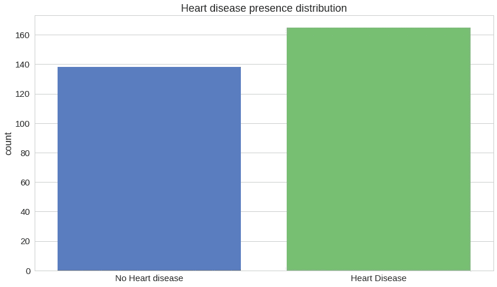
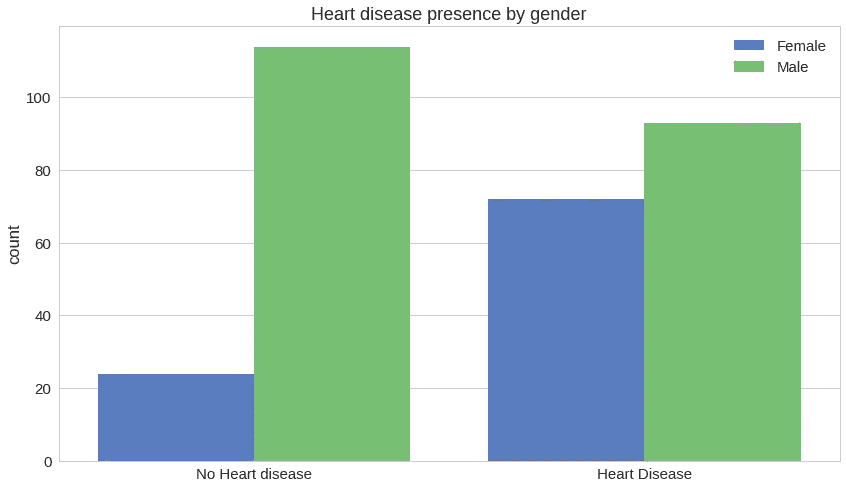
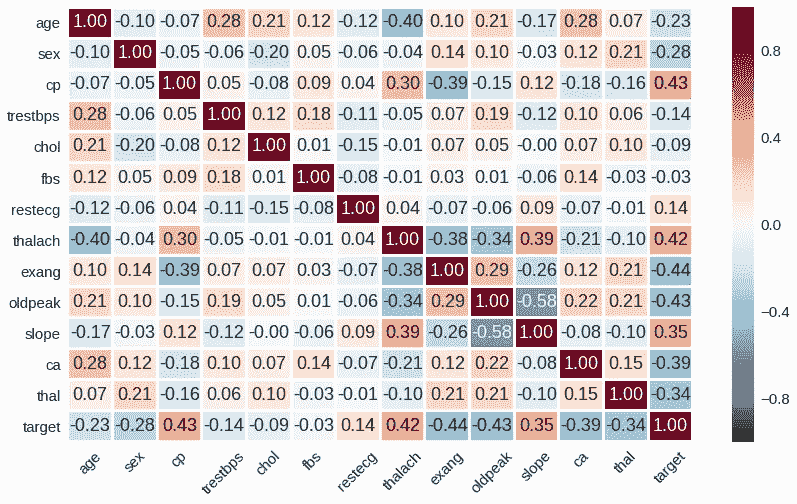
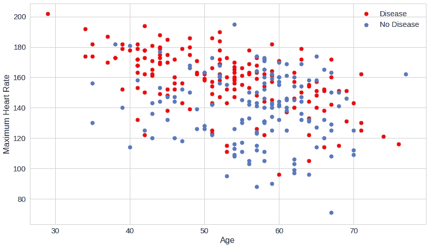
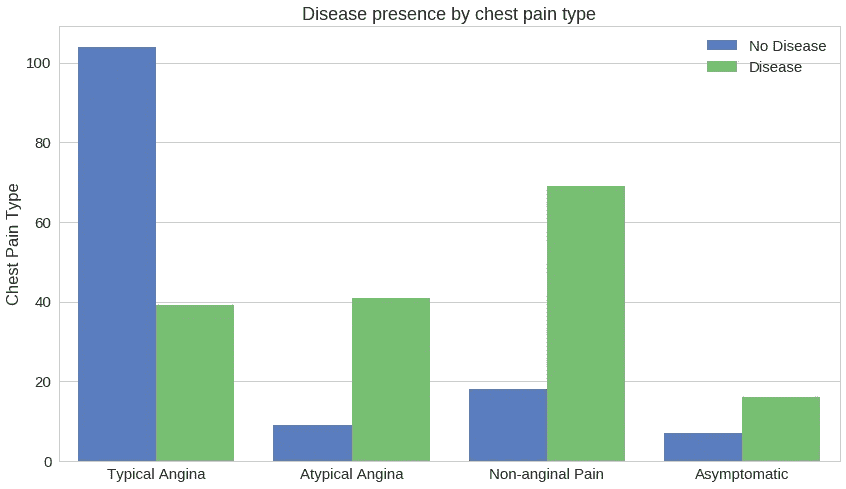
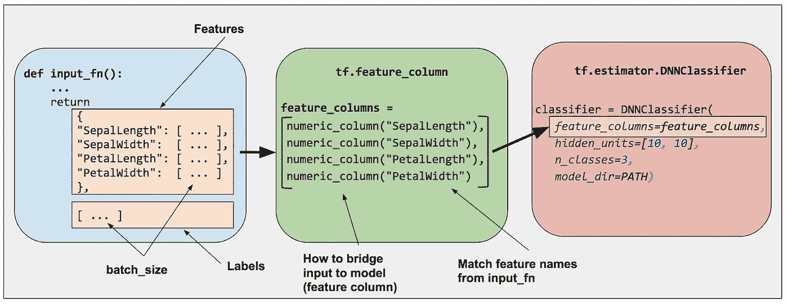
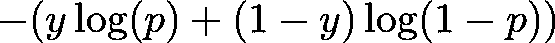
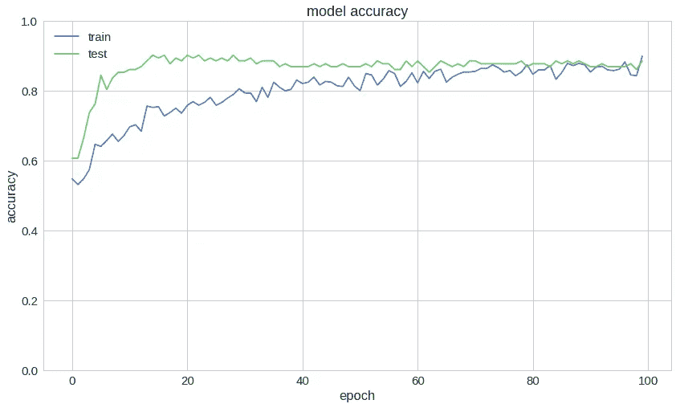
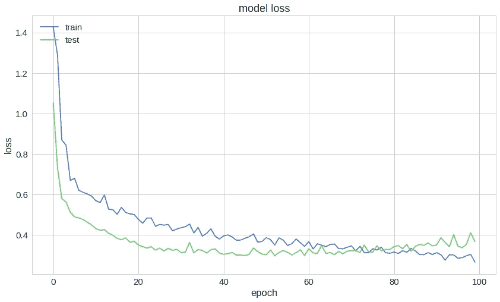
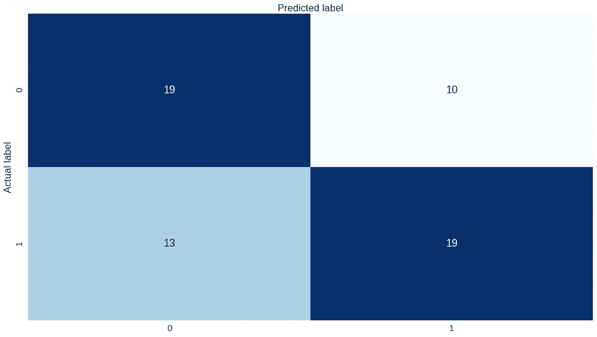

# TensorFlow 2 |面向黑客的 TensorFlow 中的心脏病预测(下)

> 原文：<https://towardsdatascience.com/heart-disease-prediction-in-tensorflow-2-tensorflow-for-hackers-part-ii-378eef0400ee?source=collection_archive---------6----------------------->

## 使用 TensorFlow 2 中的神经网络对患者数据中的心脏病进行分类


> *TL；DR 在 TensorFlow 2 中建立并训练一个深度神经网络用于二进制分类。使用该模型从患者数据中预测心脏病的存在。*

机器学习已经被用于解决许多领域的现实问题。医学也不例外。虽然有争议，但已经提出了多种模型并取得了一些成功。谷歌和其他公司的一些著名项目:

*   [诊断糖尿病眼病](https://ai.googleblog.com/2016/11/deep-learning-for-detection-of-diabetic.html)
*   [协助病理学家检测癌症](https://ai.googleblog.com/2017/03/assisting-pathologists-in-detecting.html)

今天，我们来看看一个特定的领域——心脏病预测。

> *在美国，每年约有 61 万人死于心脏病，也就是说，每 4 例死亡中就有一例。心脏病是男性和女性死亡的主要原因。2009 年因心脏病死亡的一半以上是男性。—* [*心脏病事实&统计| cdc.gov*](https://www.cdc.gov/heartdisease/facts.htm)

*请注意，此处给出的模型非常有限，并且不适用于现实情况。我们的数据集非常小，这里得出的结论绝不是一般化的。心脏病预测是一个比本文描述的复杂得多的问题。*

[谷歌合作笔记本中的完整源代码](https://colab.research.google.com/drive/13EThgYKSRwGBJJn_8iAvg-QWUWjCufB1)

计划是这样的:

1.  浏览患者数据
2.  数据预处理
3.  在 TensorFlow 2 中创建您的神经网络
4.  训练模型
5.  根据患者数据预测心脏病

# 患者数据

我们的数据来自[这个数据集](https://www.kaggle.com/ronitf/heart-disease-uci)。它包含了 303 份病人记录。每个记录包含 *14 个*属性。

有多少病历显示有心脏病？



考虑到行数，这看起来是一个分布相当均匀的数据集。

让我们来看看心脏病是如何影响不同性别的:



以下是这些特征之间的皮尔逊相关热图:



`thalach`(“最大心率”)与`age`如何影响疾病的存在:



看起来最大心率可以很好地预测疾病的存在，与年龄无关。

不同类型的胸痛如何影响心脏病的存在:



胸痛可能不是心脏病的征兆。

# 数据预处理

我们的数据混合了分类数据和数字数据。让我们使用 TensorFlow 的[功能列](https://www.tensorflow.org/guide/feature_columns)。



[https://www.tensorflow.org/](https://www.tensorflow.org/)

要素列允许您桥接/处理数据集中的原始数据，以满足模型输入数据的要求。此外，您可以将模型构建过程与数据预处理分离开来。让我们来看看:

除了数字特征，我们将患者`age`放入离散的范围(桶)。此外，`thal`、`sex`、`cp`和`slope`是绝对的，我们把它们映射成这样。

接下来，让我们将熊猫数据帧转换成张量流数据集:

并将数据分为训练和测试:

# 模型

让我们在 TensorFlow 中使用深度神经网络构建一个二元分类器:

我们的模型使用我们在预处理步骤中创建的特性列。请注意，我们不再需要指定输入层的大小。

我们还在两个密集层之间使用了[下降](https://www.tensorflow.org/versions/r2.0/api_docs/python/tf/keras/layers/Dropout)层。我们的输出层包含 2 个神经元，因为我们正在构建一个二元分类器。

# 培养

我们的损失函数是二元交叉熵，定义如下:



其中，y 是二进制指示符，表示预测类别对于当前观察值是否正确，p 是预测概率。

以下是培训过程的一个示例:

```
Epoch 95/100
0s 42ms/step - loss: 0.3018 - accuracy: 0.8430 - val_loss: 0.4012 - val_accuracy: 0.8689
Epoch 96/100
0s 42ms/step - loss: 0.2882 - accuracy: 0.8547 - val_loss: 0.3436 - val_accuracy: 0.8689
Epoch 97/100
0s 42ms/step - loss: 0.2889 - accuracy: 0.8732 - val_loss: 0.3368 - val_accuracy: 0.8689
Epoch 98/100
0s 42ms/step - loss: 0.2964 - accuracy: 0.8386 - val_loss: 0.3537 - val_accuracy: 0.8770
Epoch 99/100
0s 43ms/step - loss: 0.3062 - accuracy: 0.8282 - val_loss: 0.4110 - val_accuracy: 0.8607
Epoch 100/100
0s 43ms/step - loss: 0.2685 - accuracy: 0.8821 - val_loss: 0.3669 - val_accuracy: 0.8852
```

测试集的精确度:

```
0s 24ms/step - loss: 0.3669 - accuracy: 0.8852
[0.3669000566005707, 0.8852459]
```

所以，我们在测试集上有 *~88%* 的准确率。



# 预测心脏病

现在，我们已经有了一个在测试集上具有一定准确性的模型，让我们尝试基于数据集中的特征来预测心脏病。

因为我们对做出二元决策感兴趣，所以我们采用输出层的最大概率。

```
 precision recall    f1-score    support

           0       0.59      0.66      0.62        29
           1       0.66      0.59      0.62        32

   micro avg       0.62      0.62      0.62        61
   macro avg       0.62      0.62      0.62        61
weighted avg       0.63      0.62      0.62        61
```

不考虑精度，可以看到我们模型的精度、召回率、f1-score 都没有那么高。让我们来看看混淆矩阵:



我们的模型看起来有点混乱。你能改进它吗？

# 结论

[谷歌合作笔记本中的完整源代码](https://colab.research.google.com/drive/13EThgYKSRwGBJJn_8iAvg-QWUWjCufB1)

你做到了！你使用深度神经网络和 TensorFlow 制作了一个二元分类器，并使用它从患者数据中预测心脏病。

接下来，我们将看看 TensorFlow 2 在应用于计算机视觉时为我们准备了什么。

*原载于*[*www.curiousily.com*](https://www.curiousily.com/posts/heart-disease-prediction-in-tensorflow-2/)*。*